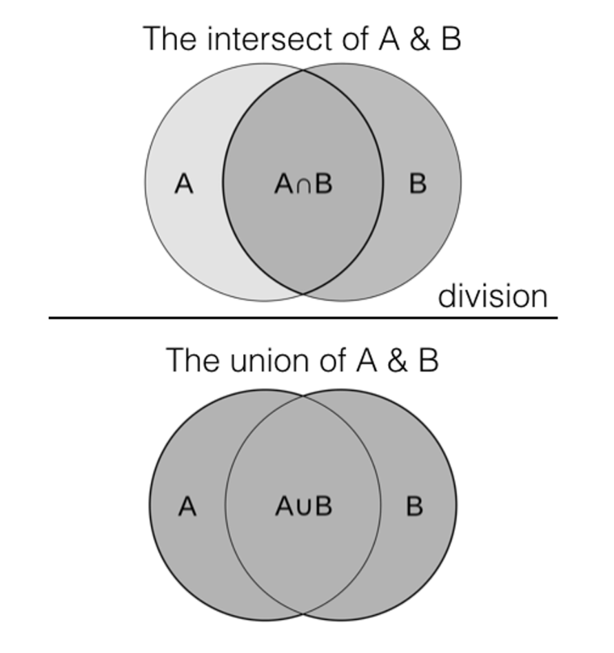

# 上位関数を持つ類似レコードの取得

Data Distillerの高階関数を使用すると、様々な一般的なユースケースを解決できます。 1 つ以上のデータセットから類似したレコードや関連するレコードを識別および取得するには、このガイドで説明しているように、フィルター、変換、削減関数を使用します。 高階関数を使用して複雑なデータタイプを処理する方法については、[&#x200B; 配列とマップのデータタイプの管理方法 &#x200B;](../sql/higher-order-functions.md) に関するドキュメントを参照してください。

このガイドを使用して、特性や属性が非常に類似している様々なデータセットから製品を特定します。 この方法は、データの重複排除、レコードのリンク、推奨システム、情報の取得、テキスト分析などのソリューションを提供します。

このドキュメントでは、類似性結合を実装するプロセスについて説明します。このプロセスでは、Data Distillerの高階関数を使用して、データセット間の類似性を計算し、選択した属性に基づいてそれらをフィルタリングします。 プロセスの各ステップに対して、SQL コード・スニペットと説明が提供されています。 このワークフローでは、Jaccard の類似性測定を使用した類似性結合と、Data Distillerの高階関数を使用したトークン化を実装しています。 その後、これらのメソッドを使用して、類似性指標に基づいて、1 つ以上のデータセットから類似したレコードや関連するレコードを識別および取得します。 プロセスの主要なセクションには、[&#x200B; 高階関数を使用したトークン化 &#x200B;](#data-transformation)、[&#x200B; 一意の要素のクロス結合 &#x200B;](#cross-join-unique-elements)、[Jaccard 類似性計算 &#x200B;](#compute-the-jaccard-similarity-measure)、[&#x200B; しきい値ベースのフィルタリング &#x200B;](#similarity-threshold-filter) が含まれます。

## 前提条件

このドキュメントを進める前に、次の概念を理解しておく必要があります。

- **類似性結合** は、レコード間の類似性の測定に基づいて、1 つ以上のテーブルからレコードのペアを識別して取得する操作です。 類似性結合の主な要件は次のとおりです。
   - **類似性指標**：類似性結合は、事前定義された類似性指標またはメジャーに基づいています。 このような指標には、ジャカードの類似性、コサインの類似性、距離の編集などがあります。 指標は、データの特性とユースケースに応じて異なります。 この指標は、2 つのレコードの類似度や類似度の違いを定量化します。
   - **しきい値**：類似性のしきい値は、2 つのレコードが結合結果に含まれるのに十分な類似と見なされるタイミングを決定するために使用されます。 類似性スコアがしきい値を超えるレコードは一致と見なされます。
- **ジャカード類似性** インデックス、またはジャカード類似性測定は、サンプルセットの類似性と多様性を測定するために使用される統計値です。 積集合のサイズをサンプルセットの和集合のサイズで割ったものとして定義されます。 ジャカード類似度測定の範囲は 0 から 1 です。 ジャカード類似度が 0 の場合は、セット間の類似度がゼロであることを示し、1 の場合は、セットが同一であることを示します。
  
- データDistillerの **高階関数** は、SQL 文内で直接データを処理および変換する動的なインラインツールです。 これらの多機能により、特に [&#x200B; 配列やマップなどの複雑なタイプを処理する &#x200B;](../sql/higher-order-functions.md) 場合に、データ操作で複数の手順を実行する必要がなくなります。 クエリの効率を高め、変換を簡素化することで、高階関数は、様々なビジネスシナリオでのより機敏な分析とより良い意思決定に貢献します。

## はじめに

Data Distiller SKU は、Adobe Experience Platform データに対して高階関数を実行する際に必要になります。 Data Distiller SKU をお持ちでない場合は、Adobeのカスタマーサービス担当者に詳細をお問い合わせください。

## 類似性の確立 {#establish-similarity}

このユースケースでは、後でフィルタリングのしきい値を設定するために使用できる、テキスト文字列間の類似性測定が必要です。 この例では、セット A とセット B の製品が 2 つのドキュメントの単語を表しています。

ジャカード類似性測定は、テキストデータ、カテゴリデータ、バイナリデータなど、様々なデータタイプに適用できます。 また、大規模なデータセットを計算する際に計算効率が高いため、リアルタイム処理やバッチ処理にも適しています。

製品セット A とセット B には、このワークフローのテストデータが含まれています。

- 製品セット A: `{iPhone, iPad, iWatch, iPad Mini}`
- 製品セット B: `{iPhone, iPad, Macbook Pro}`

商品セット A と商品セット B 間のジャカード類似性を計算するには、まず商品セットの **積集合** （共通要素）を見つけます。 この場合は、`{iPhone, iPad}` です。 次に、両方の製品セットの **和集合** （すべての一意の要素）を見つけます。 この例では、`{iPhone, iPad, iWatch, iPad Mini, Macbook Pro}` です。

最後に、ジャカードの類似性の式 `J(A,B) = A∪B / A∩B` を使用して、類似性を計算します。

J = ジャカード距離
A = set 1
B = set 2

商品セット A と商品セット B のジャカード類似度は 0.4 です。これは、2 つの文書で使用される単語間の適度な類似性を示しています。 2 つのセット間のこの類似性により、類似性結合の列が定義されます。 これらの列は、データに関連付けられた情報（特性）を表し、テーブルに格納され、類似性計算の実行に使用されます。

### 文字列類似性を持つペアワイズジャカード計算 {#pairwise-similarity}

文字列間の類似性をより正確に比較するには、一対の類似性を計算する必要があります。 一対の類似性は、比較および分析のために、高度な次元のオブジェクトを小さな次元のオブジェクトに分割する。 これを行うために、テキストの文字列は小さな部分または単位（トークン）に分割されます。 個々の文字、文字のグループ（音節など）、単語全体のいずれかを指定できます。 類似度は、Set A の各要素と Set B の各要素との間のトークンのペアごとに計算されます。このトークン化は、データから引き出す分析および計算による比較、関係およびインサイトの基盤となります。

一対の類似度を計算する場合、この例では、文字バイグラム （2 つの文字トークン）を使用して、Set A と Set B の商品のテキスト文字列間の類似度の一致を比較します。バイグラムとは、特定の順序またはテキストにおける 2 つの項目または要素の連続したシーケンスのことです。 これを n グラムに一般化できます。

この例では、大文字と小文字は関係なく、スペースは考慮すべきではないと想定しています。 これらの基準に従って、セット A とセット B には次のバイグラムがあります。

製品セット A のバイグラム：

- iPhone（5）:「ip」「ph」「ho」「on」「ne」
- iPad（3）:「ip」、「pa」、「ad」
- iWatch （5）:「iw」、「wa」、「at」、「tc」、「ch」
- iPadMini （7）:「ip」「pa」「ad」「dm」「mi」「in」「ni」

製品セット B のバイグラム：

- iPhone（5）:「ip」「ph」「ho」「on」「ne」
- iPad（3）:「ip」、「pa」、「ad」
- Macbook Pro （9）:「マ」「ac」「cb」「ボー」「ウー」「ok」「kp」「pr」「ro」

次に、各ペアのジャカード類似性係数を計算します。

|                   | iPhone（セット B） | iPad（セット B） | Macbook Pro （セット B） |
|-------------------|----------------------------------------------|---------------------------------------------|-------------------------------------------|
| iPhone（セット A） | （積集合：5、和集合：5） = 5 / 5 = 1 | （積集合：1、和集合：7） =1 / 7 ≈ 0.14 | （積集合：0、和集合：14） = 0 / 14 = 0 |
| iPad（セット A） | （積集合：1、和集合：7） = 1 / 7 ≈ 0.14 | （積集合：3、和集合：3） = 3 / 3 = 1 | （積集合：0、和集合：12） = 0 / 12 = 0 |
| iWatch （セット A） | （積集合：0、和集合：8） = 0 / 8 = 0 | （積集合：0、和集合：8） = 0 / 8 = 0 | （積集合：0、和集合：8） = 0 / 8 =0 |
| iPadMini （セット A） | （積集合：1、和集合：11） = 1 / 11 ≈ 0.09 | （積集合：3、和集合：7） = 3 / 7 ≈ 0.43 | （積集合：0、和集合：16） = 0 / 16 = 0 |

{style="table-layout:auto"}

## SQL を使用したテストデータの作成 {#create-test-data}

製品セットのテスト表を手動で作成するには、SQL CREATE TABLE 文を使用します。

```SQL {line-numbers="true"}
CREATE TABLE featurevector1 AS SELECT *
FROM (
    SELECT 'iPad' AS ProductName
    UNION ALL
    SELECT 'iPhone'
    UNION ALL
    SELECT 'iWatch'
     UNION ALL
    SELECT 'iPad Mini'
);
SELECT * FROM featurevector1;
```

次の説明は、上記の SQL コードブロックの分類を示しています。

- 行 1:`CREATE TEMP TABLE featurevector1 AS`：この文は、`featurevector1` という名前の一時テーブルを作成します。 一時テーブルは通常、現在のセッション内でのみアクセスでき、セッションの最後に自動的にドロップされます。
- 行 1 と行 2:`SELECT * FROM (...)`：コードのこの部分は、`featurevector1` テーブルに挿入されるデータの生成に使用されるサブクエリです。
サブクエリ内で、`UNION ALL` コマンドを使用して複数の `SELECT` ステートメントを組み合わせます。 各 `SELECT` ステートメントは、`ProductName` の列に指定された値を持つ 1 行のデータを生成します。
- 行 3:`SELECT 'iPad' AS ProductName`：これにより、`ProductName` 列に値 `iPad` を持つ行が生成されます。
- 行 5:`SELECT 'iPhone'`：これにより、`ProductName` 列に値 `iPhone` を持つ行が生成されます。

SQL 文を実行すると、次のようなテーブルが作成されます。

|   | `ProductName` |
|---|---------------|
| 1 | iPad |
| 2 | iPhone |
| 3 | iWatch |
| 4 | iPadミニ |

{style="table-layout:auto"}

2 番目のフィーチャ ベクトルを作成するには、次の SQL 文を使用します。

```SQL
CREATE TABLE featurevector2 AS SELECT *
FROM (
    SELECT 'iPad' AS ProductName
    UNION ALL
    SELECT 'iPhone'
    UNION ALL
    SELECT 'Macbook Pro'
);
SELECT * FROM featurevector2;
```

## データ変換 {#data-transformation}

この例では、セットを正確に比較するために、いくつかのアクションを実行する必要があります。 まず、空白は類似性測定に寄与しないと仮定されるので、特徴ベクトルから除去される。 次に、特徴ベクトル内に存在する重複は、計算処理の無駄になるので削除されます。 次に、特徴ベクトルから 2 文字（バイグラム）のトークンを抽出する。 この例では、これらは重複していると想定されています。

>[!NOTE]
>
>説明のために、処理済みの列が各ステップのフィーチャ ベクトルの横に追加されます。

次の節では、トークン化のプロセスを開始する前に行う、重複排除、空白の削除、小文字の変換などの、前提条件となるデータ変換について説明します。

### 重複の除外 {#deduplication}

次に、`DISTINCT` 句を使用して重複を削除します。 この例では重複はありませんが、比較の精度を上げるために重要な手順です。 必要な SQL を以下に示します。

```SQL
SELECT DISTINCT(ProductName) AS featurevector1_distinct FROM featurevector1
SELECT DISTINCT(ProductName) AS featurevector2_distinct FROM featurevector2
```

### 空白の削除 {#whitespace-removal}

次の SQL ステートメントでは、フィーチャ ベクトルから空白が削除されています。 クエリの `replace(ProductName, ' ', '') AS featurevector1_nospaces` の部分では、`featurevector1` テーブルから `ProductName` の列を取得し、`replace()` 関数を使用します。 `REPLACE` 関数は、スペース（「」）のすべての出来事を空の文字列（&quot;）に置き換えます。 これにより、`ProductName` 値からすべてのスペースが効果的に削除されます。 結果は `featurevector1_nospaces` としてエイリアスされます。

```SQL
SELECT DISTINCT(ProductName) AS featurevector1_distinct, replace(ProductName, ' ', '') AS featurevector1_nospaces FROM featurevector1
```

結果を次の表に示します。

|   | featurevector1_distinct | featurevector1_nospaces |
|---|---|---|
| 1 | iPadミニ | iPadMini |
| 2 | iPad | iPad |
| 3 | iWatch | iWatch |
| 4 | iPhone | iPhone |

{style="table-layout:auto"}

2 番目の機能ベクトルの SQL 文とその結果を次に示します。

+++選択して展開

```SQL
SELECT DISTINCT(ProductName) AS featurevector2_distinct, replace(ProductName, ' ', '') AS featurevector2_nospaces FROM featurevector2
```

結果は次のようになります。

|   | featurevector2_distinct | featurevector2_nospaces |
|---|---|---|
| 1 | iPad | iPad |
| 2 | Macbook Pro | MacbookPro |
| 3 | iPhone | iPhone |

{style="table-layout:auto"}

+++

### 小文字に変換 {#lowercase-conversion}

次に、SQL を改善して、製品名を小文字に変換し、空白を削除します。 lower 関数（`lower(...)`）は、`replace()` 関数の結果に適用されます。 lower 関数は、変更された `ProductName` 値のすべての文字を小文字に変換します。 これにより、元の大文字と小文字に関係なく、値が確実に小文字になります。

```SQL
SELECT DISTINCT(ProductName) AS featurevector1_distinct, lower(replace(ProductName, ' ', '')) AS featurevector1_transform FROM featurevector1;
```

このステートメントの結果は次のようになります。

|   | featurevector1_distinct | featurevector1_transform |
|---|---|---|
| 1 | iPadミニ | ipadmini |
| 2 | iPad | iPad |
| 3 | iWatch | iWatch |
| 4 | iPhone | iPhone |

{style="table-layout:auto"}

2 番目の機能ベクトルの SQL 文とその結果を次に示します。

+++選択して展開

```SQL
SELECT DISTINCT(ProductName) AS featurevector2_distinct, lower(replace(ProductName, ' ', '')) AS featurevector2_transform FROM featurevector2
```

結果は次のようになります。

|   | featurevector2_distinct | featurevector2_transform |
|---|---|---|
| 1 | iPad | ipad |
| 2 | Macbook Pro | macbookpro |
| 3 | iPhone | iphone |

{style="table-layout:auto"}

+++

### SQL を使用したトークンの抽出 {#tokenization}

次の手順はトークン化（テキスト分割）です。 トークン化とは、テキストを取得し、それを個別の用語に分割するプロセスです。 通常、これは文を単語に分割することを含みます。 この例では、`regexp_extract_all` などの SQL 関数を使用してトークンを抽出することで、文字列をバイグラム（および上位の n グラム）に分類しています。 効果的にトークン化するには、重なり合うバイグラムを生成する必要があります。

SQL がさらに改善され、`regexp_extract_all` を使用できるようになりました。 `regexp_extract_all(lower(replace(ProductName, ' ', '')), '.{2}', 0) AS tokens:` クエリのこの部分では、前の手順で作成した変更された `ProductName` 値をさらに処理します。 `regexp_extract_all()` 関数を使用して、変更された値と小文字の `ProductName` 値から、重複しない 1 ～ 2 文字の部分文字列をすべて抽出します。 `.{2}` の正規表現パターンは、2 文字の長さの部分文字列に一致します。 次に、関数の `regexp_extract_all(..., '.{2}', 0)` の部分で、入力テキストから一致するすべての部分文字列を抽出します。

```SQL
SELECT DISTINCT(ProductName) AS featurevector1_distinct, lower(replace(ProductName, ' ', '')) AS featurevector1_transform, 
regexp_extract_all(lower(replace(ProductName, ' ', '')) , '.{2}', 0) AS tokens
FROM featurevector1;
```

結果を次の表に示します。

+++選択して展開

|   | featurevector1_distinct | featurevector1_transform | トークン |
|---|--------------------------|--------------|------------------------|
| 1 | iPadミニ | ipadmini | {&quot;ip&quot;,&quot;ad&quot;,&quot;mi&quot;,&quot;ni&quot;} |
| 2 | iPad | iPad | {&quot;ip&quot;,&quot;ad&quot;} |
| 3 | iWatch | iWatch | {&quot;iw&quot;,&quot;at&quot;, &quot;ch&quot;} |
| 4 | iPhone | iPhone | {&quot;ip&quot;,&quot;ho&quot;,&quot;ne&quot;} |

{style="table-layout:auto"}

+++

精度をさらに向上させるには、重複トークンを作成するために SQL を使用する必要があります。 例えば、上記の「iPad」文字列に「pa」トークンがない。 この問題を修正するには、（`substring` を使用して） lookahead 演算子を 1 ステップずつシフトし、バイグラムを生成します。

前のステップと同様に、`regexp_extract_all(lower(replace(substring(ProductName, 2), ' ', '')), '.{2}', 0):` は変更された製品名から 2 文字のシーケンスを抽出しますが、2 番目の文字から開始し、`substring` メソッドを使用して重複するトークンを作成します。 次に、3～7 行目（`array_union(...) AS tokens`）で、`array_union()` 関数は、2 つの正規表現抽出によって得られた 2 文字のシーケンスの配列を結合します。 これにより、結果には、重複しないシーケンスと重複するシーケンスの両方からの一意のトークンが含まれます。

```SQL {line-numbers="true"}
SELECT DISTINCT(ProductName) AS featurevector1_distinct, 
       lower(replace(ProductName, ' ', '')) AS featurevector1_transform, 
       array_union(
           regexp_extract_all(lower(replace(ProductName, ' ', '')), '.{2}', 0),
           regexp_extract_all(lower(replace(substring(ProductName, 2), ' ', '')), '.{2}', 0)
       ) AS tokens
FROM featurevector1;
```

結果を次の表に示します。

+++選択して展開

|   | featurevector1_distinct | featurevector1_transform | トークン |
|---|--------------------------|--------------|------------------------|
| 1 | iPadミニ | ipadmini | {&quot;ip&quot;,&quot;ad&quot;,&quot;mi&quot;,&quot;ni&quot;,&quot;pa&quot;,&quot;dm&quot;,&quot;in&quot;} |
| 2 | iPad | iPad | {&quot;ip&quot;,&quot;ad&quot;,&quot;pa&quot;} |
| 3 | iWatch | iWatch | {&quot;iw&quot;,&quot;at&quot;,&quot;ch&quot;,&quot;wa&quot;,&quot;tc&quot;} |
| 4 | iPhone | iPhone | {&quot;ip&quot;,&quot;ho&quot;,&quot;ne&quot;,&quot;ph&quot;,&quot;on&quot;} |

{style="table-layout:auto"}

+++

ただし、問題の解決策として `substring` を使用する場合には制限があります。 3 グラム（3 文字）に基づいてテキストからトークンを作成する場合、必要なシフトを取得するために 2 回ルックアヘッドするために、2 つの `substrings` を使用する必要があります。 10 グラムを作るには、9 つの `substring` 式が必要になります。 これにより、コードが膨張し、使用できなくなります。 単純な正規表現の使用は不適切です。 新しいアプローチが必要です。

### 製品名の長さを調整 {#length-adjustment}

SQl は、シーケンス関数と長さ関数で改善できます。 次の例では、`sequence(1, length(lower(replace(ProductName, ' ', ''))) - 3)` は、1 から変更された製品名から 3 を引いた長さまでの一連の数値を生成します。 たとえば、変更後の製品名が「ipadmini」で、文字長が 8 の場合、1～5 の数字（8-3）が生成されます。

以下のステートメントは、一意の製品名を抽出し、各名前を 4 文字長の文字（トークン）のシーケンスに分類します。スペースは除き、2 列として表示されます。 1 つの列には一意の製品名が表示され、もう 1 つの列には生成されたトークンが表示されます。

```SQL
SELECT
   DISTINCT(ProductName) AS featurevector1_distinct,
  transform(
    sequence(1, length(lower(replace(ProductName, ' ', ''))) - 3),
    i -> substring(lower(replace(ProductName, ' ', '')), i, 4)
  ) AS tokens
FROM
  featurevector1;
```

結果を次の表に示します。

+++選択して展開

|   | featurevector1_distinct | トークン |
|---|--------------------------|------------------------|
| 1 | iPadミニ | {&quot;ipad&quot;,&quot;padm&quot;,&quot;admi&quot;,&quot;dmin&quot;,&quot;mini&quot;} |
| 2 | iPad | {&quot;ipad&quot;} |
| 3 | iWatch | {&quot;ihat&quot;,&quot;watc&quot;,&quot;atch&quot;} |
| 4 | iPhone | {&quot;ipho&quot;,&quot;phon&quot;,&quot;hone&quot;} |

{style="table-layout:auto"}

+++

### トークンの長さの設定の確認 {#ensure-set-token-length}

ステートメントに条件を追加して、生成されたシーケンスが特定の長さであることを確認できます。 次の SQL 文は、`transform` 関数をより複雑にすることによって、トークン生成ロジックを拡張しています。 このステートメントでは、`transform` 内で `filter` 関数を使用して、生成されたシーケンスの長さが 6 文字であることを確認します。 NULL 値をそれらの位置に割り当てることで、それが不可能な場合に対処します。

```SQL
SELECT
  DISTINCT(ProductName) AS featurevector1_distinct,
  transform(
    filter(
      sequence(1, length(lower(replace(ProductName, ' ', ''))) - 5),
      i -> i + 5 <= length(lower(replace(ProductName, ' ', '')))
    ),
    i -> CASE WHEN length(substring(lower(replace(ProductName, ' ', '')), i, 6)) = 6
               THEN substring(lower(replace(ProductName, ' ', '')), i, 6)
               ELSE NULL
          END
  ) AS tokens
FROM
  featurevector1;
```

結果を次の表に示します。

+++選択して展開

|   | featurevector1_distinct | トークン |
|---|--------------------------|------------------------|
| 1 | iPadミニ | {&quot;ipadmi&quot;,&quot;padmin&quot;,&quot;admini&quot;} |
| 2 | iPad | {null} |
| 3 | iWatch | {&quot;iwatch&quot;} |
| 4 | iPhone | {&quot;iphone&quot;} |

{style="table-layout:auto"}

+++

## Data Distillerの高次関数を使用したソリューションの探索 {#higher-order-function-solutions}

高階関数は、Data Distillerの構文のような「プログラミング」を実装できる強力な構造です。 これを使用して、配列内の複数の値に対して関数を反復できます。

データDistillerのコンテキストでは、高階関数は n グラムを作り、文字のシーケンスを繰り返すのに理想的です。

`reduce` 関数は、特に `transform` によって生成されるシーケンス内で使用される場合、様々な分析およびプランニング・プロセスでピボット可能な累積値または集約を導出する方法を提供します。

例えば、以下の SQl ステートメントでは、`reduce()` 関数はカスタムアグリゲータを使用して配列内の要素を集計します。 for ループをシミュレートして、1 ～ 5 の **すべての整数の累積合計を作成** します。`1, 1+2, 1+2+3, 1+2+3+4, 1+2+3+4`。

```SQL {line-numbers="true"}
SELECT transform(
    sequence(1, 5), 
    x -> reduce(
        sequence(1, x),  
        0,  -- Initial accumulator value
        (acc, y) -> acc + y  -- Higher-order function to add numbers
    )
) AS sum_result;
```

次に、SQL 文の分析を示します。

- 行 1:`transform` は、シーケンス内で生成された各要素に対して `x -> reduce` 関数を適用します。
- 行 2:`sequence(1, 5)` は、1 ～ 5 の数字のシーケンスを生成します。
- 3 行目：`x -> reduce(sequence(1, x), 0, (acc, y) -> acc + y)` は、シーケンス（1～5）内の各要素 x に対して縮小操作を実行します。
   - `reduce` 関数は、最初のアキュムレータ値 0、1 から現在の値 `x` までのシーケンス、および数値を加算する高階関数 `(acc, y) -> acc + y` を取ります。
   - 高次関数 `acc + y` は、アキュムレータ `acc` に電流値 `y` を加算して和を積算する。
- 行 8：結果の列の名前 `AS sum_result`sum_result に変更します。

要約すると、この高次関数は 2 つのパラメータ（`acc` と `y`）を取り、実行する操作を定義します。この場合、アキュムレータ `acc` に `y` を追加します。 この高次関数は、縮約処理中にシーケンス内の各要素に対して実行されます。

このステートメントの出力は、1 ～ 5 の数値の累積合計を含む単一の列（`sum_result`）です。

### 高階関数の値 {#value-of-higher-order-functions}

ここでは、Data Distillerの高次関数の値をより深く理解して、n グラムをより効率的に作成するために、3 グラムの SQL 文の縮小版を分析します。

以下のステートメントは、`featurevector1` テーブル内の `ProductName` 列で動作します。 生成されたシーケンスから取得された位置を使用して、テーブル内の変更された製品名から派生した 3 文字のサブ文字列のセットが生成されます。

```SQL {line-numbers="true"}
SELECT
  transform(
    sequence(1, length(lower(replace(ProductName, ' ', ''))) - 2),
    i -> substring(lower(replace(ProductName, ' ', '')), i, 3)
  ) 
FROM
  featurevector1
```

次に、SQL 文の分析を示します。

- 行 2:`transform` は、シーケンス内の各整数に高階関数を適用します。
- 3 行目：`sequence(1, length(lower(replace(ProductName, ' ', ''))) - 2)` は、変更された製品名から 2 を引いた長さまで、`1` から整数のシーケンスを生成します。
   - `length(lower(replace(ProductName, ' ', '')))` は、小文字に変換してスペースを削除した後の `ProductName` の長さを計算します。
   - `- 2` は長さから 2 を減算し、シーケンスが 3 文字の部分文字列の有効な開始位置を生成するようにします。 2 を減算すると、各開始位置の後に 3 文字の部分文字列を抽出するのに十分な文字が含まれるようになります。 ここでの部分文字列関数は、lookahead 演算子のように動作します。
- 4 行目：`i -> substring(lower(replace(ProductName, ' ', '')), i, 3)` は、生成されたシーケンス内の各整数 `i` に対して動作する高階関数です。
   - `substring(...)` 関数は、`ProductName` 列から 3 文字の部分文字列を抽出します。
   - 部分文字列を抽出する前に、`lower(replace(ProductName, ' ', ''))` は `ProductName` を小文字に変換し、スペースを削除して一貫性を確保します。

出力されるのは、シーケンスで指定された位置に基づいて、変更された製品名から抽出された 3 文字の長さの部分文字列のリストです。

## 結果のフィルタリング {#filter-results}

その後の [&#x200B; データ変換 &#x200B;](#data-transformation) を使用した `filter` 関数を使用すると、テキストデータから関連情報をより詳細かつ正確に抽出できます。 これにより、インサイトを導き出し、データ品質を向上し、より良い意思決定プロセスを促進できます。

次の SQL 文の `filter` 関数は、後続の変換関数を使用して部分文字列を抽出する文字列内の位置のシーケンスを調整し、制限するために役立ちます。

```SQL
SELECT
  transform(
    filter(
      sequence(1, length(lower(replace(ProductName, ' ', ''))) - 6),
      i -> i + 6 <= length(lower(replace(ProductName, ' ', '')))
    ),
    i -> CASE WHEN length(substring(lower(replace(ProductName, ' ', '')), i, 7)) = 7
               THEN substring(lower(replace(ProductName, ' ', '')), i, 7)
               ELSE NULL
          END
  )
FROM
  featurevector1;
```

`filter` 関数は、変更された `ProductName` 内で有効な開始位置のシーケンスを生成し、特定の長さの部分文字列を抽出します。 7 文字の部分文字列を抽出できる開始位置のみが許可されます。

条件 `i -> i + 6 <= length(lower(replace(ProductName, ' ', '')))` は、開始位置 `i` プラス `6` （目的の 7 文字の部分文字列の長さから 1 を引いた長さ）が、変更された `ProductName` の長さを超えないことを保証します。

`CASE` ステートメントは、長さに基づいて、条件付きで部分文字列を含めたり除外したりするために使用します。 7 文字の部分文字列のみが含まれ、それ以外は NULL に置き換えられます。 これらの部分文字列は、`transform` 関数で `featurevector1` テーブルの `ProductName` 列から一連の部分文字列を作成するために使用されます。

>[!TIP]
>
>[&#x200B; パラメーター化テンプレート &#x200B;](../ui/parameterized-queries.md) 機能を使用して、クエリ内でロジックを再利用および抽象できます。 例えば、汎用のユーティリティ関数（文字列をトークン化するために上記で表示されたものなど）を構築する場合、文字数がパラメーターになるデータDistillerのパラメーター化テンプレートを使用できます。

## 2 つのフィーチャ ベクトルにわたる一意の要素のクロス結合を計算します {#cross-join-unique-elements}

データの特定の変換に基づいて 2 つのデータセット間の違いや不一致を特定することは、データの精度を維持し、データ品質を向上し、データセット間の一貫性を確保するための一般的なプロセスです。

以下の SQL ステートメントは、変換を適用した後、`featurevector2` には存在するが `featurevector1` には存在しない一意の製品名を抽出します。

```SQL
SELECT lower(replace(ProductName, ' ', '')) FROM featurevector2
EXCEPT
SELECT lower(replace(ProductName, ' ', '')) FROM featurevector1;
```

>[!TIP]
>
>`EXCEPT` に加えて、使用例に応じて `UNION` と `INTERSECT` を使用することもできます。 また、`ALL` 句または `DISTINCT` 句を試して、すべての値を含することと、指定した列の一意の値のみを返すこととの違いを確認することもできます。

結果を次の表に示します。

+++選択して展開

|   | lower （replace （ProductName, &#39; &#39;, &quot;）） |
|---|---------------------------------------|
| 1 | macbookpro |

{style="table-layout:auto"}

+++

次に、クロス結合を実行して、2 つのフィーチャ ベクトルの要素を結合し、比較する要素のペアを作成します。 このプロセスの最初の手順は、トークン化されたベクトルを作成することです。

トークン化されたベクトルは、各単語、フレーズ、または意味の単位（トークン）が数値形式に変換されたテキストデータの構造化表現です。 この変換により、自然言語処理アルゴリズムは、テキスト情報を理解し、分析することが可能となる。

以下の SQL はトークン化されたベクトルを生成します。

```SQL
CREATE TABLE featurevector1tokenized AS SELECT
  DISTINCT(ProductName) AS featurevector1_distinct,
  transform(
    filter(
      sequence(1, length(lower(replace(ProductName, ' ', ''))) - 1),
      i -> i + 1 <= length(lower(replace(ProductName, ' ', '')))
    ),
    i -> CASE WHEN length(substring(lower(replace(ProductName, ' ', '')), i, 2)) = 2
               THEN substring(lower(replace(ProductName, ' ', '')), i, 2)
               ELSE NULL
          END
  ) AS tokens
FROM
  (SELECT lower(replace(ProductName, ' ', '')) AS ProductName FROM featurevector1);
SELECT * FROM featurevector1tokenized;
```

>[!NOTE]
>
>[!DNL DbVisualizer] を使用している場合は、テーブルを作成または削除した後で、データベース接続を更新して、テーブルのメタデータ・キャッシュが更新されるようにします。 データDistillerがメタデータの更新をプッシュしない。

結果を次の表に示します。

+++選択して展開

|   | featurevector1_distinct | トークン |
|---|--------------------------|------------------------|
| 1 | ipadmini | {&quot;ip&quot;,&quot;pa&quot;,&quot;ad&quot;,&quot;dm&quot;,&quot;mi&quot;,&quot;in&quot;,&quot;ni&quot;} |
| 2 | ipad | {&quot;ip&quot;,&quot;pa&quot;,&quot;ad&quot;} |
| 3 | iwatch | {&quot;iw&quot;,&quot;wa&quot;,&quot;at&quot;,&quot;tc&quot;,&quot;ch&quot;} |
| 4 | iphone | {&quot;ip&quot;,&quot;ph&quot;,&quot;ho&quot;,&quot;on&quot;,&quot;ne&quot;} |

{style="table-layout:auto"}

+++

次に、`featurevector2` の手順を繰り返します。

```SQL
CREATE TABLE featurevector2tokenized AS 
SELECT
  DISTINCT(ProductName) AS featurevector2_distinct,
  transform(
    filter(
      sequence(1, length(lower(replace(ProductName, ' ', ''))) - 1),
      i -> i + 1 <= length(lower(replace(ProductName, ' ', '')))
    ),
    i -> CASE WHEN length(substring(lower(replace(ProductName, ' ', '')), i, 2)) = 2
               THEN substring(lower(replace(ProductName, ' ', '')), i, 2)
               ELSE NULL
          END
  ) AS tokens
FROM
(SELECT lower(replace(ProductName, ' ', '')) AS ProductName FROM featurevector2
);
SELECT * FROM featurevector2tokenized;
```

結果を次の表に示します。

+++選択して展開

|   | featurevector2_distinct | トークン |
|---|--------------------------|------------------------|
| 1 | ipadmini | {&quot;ip&quot;,&quot;pa&quot;,&quot;ad&quot;} |
| 2 | macbookpro | {&quot;ma&quot;,&quot;ac&quot;,&quot;cb&quot;,&quot;bo&quot;,&quot;oo&quot;,&quot;ok&quot;,&quot;kp&quot;,&quot;pr&quot;,&quot;ro&quot;} |
| 3 | iphone | {&quot;ip&quot;,&quot;ph&quot;,&quot;ho&quot;,&quot;on&quot;,&quot;ne&quot;} |

{style="table-layout:auto"}

+++

両方のトークン化されたベクトルが完成したので、クロス結合を作成できるようになりました。 これは、以下の SQL で確認できます。

```SQL {line-numbers="true"}
SELECT
    A.featurevector1_distinct AS SetA_ProductNames,
    B.featurevector2_distinct AS SetB_ProductNames,
    A.tokens AS SetA_tokens1,
    B.tokens AS SetB_tokens2
FROM
    featurevector1tokenized A
CROSS JOIN
    featurevector2tokenized B;
```

クロス結合の作成に使用する SQL の概要を次に示します。

- 行 2:`A.featurevector1_distinct AS SetA_ProductNames` はテーブル `A` から `featurevector1_distinct` 列を選択し、それに別名 `SetA_ProductNames` を割り当てます。 SQL のこのセクションの結果、最初のデータセットとは異なる製品名のリストが表示されます。
- 4 行目：`A.tokens AS SetA_tokens1` は、テーブルまたはサブクエリ `A` から `tokens` 列を選択し、それに別名 `SetA_tokens1` を割り当てます。 この SQL セクションの結果、最初のデータセットの製品名に関連付けられたトークン化された値のリストが得られます。
- 行 8:`CROSS JOIN` 操作は、2 つのデータセットから可能なすべての行の組み合わせを組み合わせます。 つまり、最初のテーブル（`A`）の各製品名とその関連トークンと、2 番目のテーブル（`B`）の各製品名とその関連トークンがペアになります。 この結果、2 つのデータセットのデカルト積となり、出力の各行は、製品名と両方のデータセットからの関連するトークンの組み合わせを表します。

結果を次の表に示します。

+++選択して展開

| * | SetA_ProductNames | SetB_ProductNames | SetA_tokens 1 | SetB_tokens 2 |
|---|---------------------|-------------------|---|---|
| 1 | ipadmini | ipad | {&quot;ip&quot;,&quot;pa&quot;,&quot;ad&quot;,&quot;dm&quot;,&quot;mi&quot;,&quot;in&quot;,&quot;ni&quot;} | {&quot;ip&quot;,&quot;pa&quot;,&quot;ad&quot;} |
| 2 | ipadmini | macbookpro | {&quot;ip&quot;,&quot;pa&quot;,&quot;ad&quot;,&quot;dm&quot;,&quot;mi&quot;,&quot;in&quot;,&quot;ni&quot;} | {&quot;ma&quot;,&quot;ac&quot;,&quot;cb&quot;,&quot;bo&quot;,&quot;oo&quot;,&quot;ok&quot;,&quot;kp&quot;,&quot;pr&quot;,&quot;ro&quot;} |
| 3 | ipadmini | iphone | {&quot;ip&quot;,&quot;pa&quot;,&quot;ad&quot;,&quot;dm&quot;,&quot;mi&quot;,&quot;in&quot;,&quot;ni&quot;} | {&quot;ip&quot;,&quot;ph&quot;,&quot;ho&quot;,&quot;on&quot;,&quot;ne&quot;} |
| 4 | ipad | ipad | {&quot;ip&quot;,&quot;pa&quot;,&quot;ad&quot;} | {&quot;ip&quot;,&quot;pa&quot;,&quot;ad&quot;} |
| 5 | ipad | macbookpro | {&quot;ip&quot;,&quot;pa&quot;,&quot;ad&quot;} | {&quot;ma&quot;,&quot;ac&quot;,&quot;cb&quot;,&quot;bo&quot;,&quot;oo&quot;,&quot;ok&quot;,&quot;kp&quot;,&quot;pr&quot;,&quot;ro&quot;} |
| 6 | ipad | iphone | {&quot;ip&quot;,&quot;pa&quot;,&quot;ad&quot;} | {&quot;ip&quot;,&quot;ph&quot;,&quot;ho&quot;,&quot;on&quot;,&quot;ne&quot;} |
| 7 | iwatch | ipad | {&quot;iw&quot;,&quot;wa&quot;,&quot;at&quot;,&quot;tc&quot;,&quot;ch&quot;} | {&quot;ip&quot;,&quot;pa&quot;,&quot;ad&quot;} |
| 8 | iwatch | macbookpro | {&quot;iw&quot;,&quot;wa&quot;,&quot;at&quot;,&quot;tc&quot;,&quot;ch&quot;} | {&quot;ma&quot;,&quot;ac&quot;,&quot;cb&quot;,&quot;bo&quot;,&quot;oo&quot;,&quot;ok&quot;,&quot;kp&quot;,&quot;pr&quot;,&quot;ro&quot;} |
| 9 | iwatch | iphone | {&quot;iw&quot;,&quot;wa&quot;,&quot;at&quot;,&quot;tc&quot;,&quot;ch&quot;} | {&quot;ip&quot;,&quot;ph&quot;,&quot;ho&quot;,&quot;on&quot;,&quot;ne&quot;} |
| 10 | iphone | ipad | {&quot;ip&quot;,&quot;ph&quot;,&quot;ho&quot;,&quot;on&quot;,&quot;ne&quot;} | {&quot;ip&quot;,&quot;pa&quot;,&quot;ad&quot;} |
| 11 | iphone | macbookpro | {&quot;ip&quot;,&quot;ph&quot;,&quot;ho&quot;,&quot;on&quot;,&quot;ne&quot;} | {&quot;ma&quot;,&quot;ac&quot;,&quot;cb&quot;,&quot;bo&quot;,&quot;oo&quot;,&quot;ok&quot;,&quot;kp&quot;,&quot;pr&quot;,&quot;ro&quot;} |
| 12 | iphone | iphone | {&quot;ip&quot;,&quot;ph&quot;,&quot;ho&quot;,&quot;on&quot;,&quot;ne&quot;} | {&quot;ip&quot;,&quot;ph&quot;,&quot;ho&quot;,&quot;on&quot;,&quot;ne&quot;} |

{style="table-layout:auto"}

+++

## ジャカードの類似性の測定を計算 {#compute-the-jaccard-similarity-measure}

次に、Jaccard 類似性係数を使用して、トークン化された表現を比較することにより、2 つの製品名のセット間で類似性分析を実行します。 以下の SQL スクリプトの出力には、両方のセットの製品名、トークン化された表現、共通および合計の一意トークンの数、データセットのペアごとに計算された Jaccard 類似性係数が含まれます。


```SQL {line-numbers="true"}
SELECT 
    SetA_ProductNames, 
    SetB_ProductNames, 
    SetA_tokens1,
    SetB_tokens2,
    size(array_intersect(SetA_tokens1, SetB_tokens2)) AS token_intersect_count,
    size(array_union(SetA_tokens1, SetB_tokens2)) AS token_union_count,
    ROUND(
        CAST(size(array_intersect(SetA_tokens1, SetB_tokens2)) AS DOUBLE) /    size(array_union(SetA_tokens1, SetB_tokens2)), 2) AS jaccard_similarity
FROM
    (SELECT
        A.featurevector1_distinct AS SetA_ProductNames,
        B.featurevector2_distinct AS SetB_ProductNames,
        A.tokens AS SetA_tokens1,
        B.tokens AS SetB_tokens2
    FROM
        featurevector1tokenized A
    CROSS JOIN
        featurevector2tokenized B
    );
```

次に、ジャカード類似性係数の計算に使用される SQL の概要を示します。

- 行 6:`size(array_intersect(SetA_tokens1, SetB_tokens2)) AS token_intersect_count` は、`SetA_tokens1` と `SetB_tokens2` の両方に共通するトークンの数を計算します。 この計算は、2 つのトークン配列の積集合のサイズを計算することで実現されます。
- 7 行目：`size(array_union(SetA_tokens1, SetB_tokens2)) AS token_union_count` は、`SetA_tokens1` と `SetB_tokens2` の両方で一意のトークンの合計数を計算します。 この行は、2 つのトークン配列の和集合のサイズを計算します。
- 行 8～10:`ROUND(CAST(size(array_intersect(SetA_tokens1, SetB_tokens2)) AS DOUBLE) / size(array_union(SetA_tokens1, SetB_tokens2)), 2) AS jaccard_similarity` は、トークンセット間のジャカード類似性を計算します。 これらの行は、トークン積集合のサイズをトークン和集合のサイズで割り、結果を小数第 2 位に丸めます。 結果は 0 から 1 の間の値で、1 は完全な類似性を示します。

結果を次の表に示します。

+++選択して展開

| * | SetA_ProductNames | SetB_ProductNames | SetA_tokens 1 | SetB_tokens 2 | token_intersect_count | token_intersect_count | ジャカード類似性 |
|---|---------------------|-------------------|---------------------------------------|-------------------------------------------------|----|----|----|
| 1 | ipadmini | ipad | {&quot;ip&quot;,&quot;pa&quot;,&quot;ad&quot;,&quot;dm&quot;,&quot;mi&quot;,&quot;in&quot;,&quot;ni&quot;} | {&quot;ip&quot;,&quot;pa&quot;,&quot;ad&quot;} | 3 | 7 | 0.43 |
| 2 | ipadmini | macbookpro | {&quot;ip&quot;,&quot;pa&quot;,&quot;ad&quot;,&quot;dm&quot;,&quot;mi&quot;,&quot;in&quot;,&quot;ni&quot;} | {&quot;ma&quot;,&quot;ac&quot;,&quot;cb&quot;,&quot;bo&quot;,&quot;oo&quot;,&quot;ok&quot;,&quot;kp&quot;,&quot;pr&quot;,&quot;ro&quot;} | 0 | 16 | 0.0 |
| 3 | ipadmini | iphone | {&quot;ip&quot;,&quot;pa&quot;,&quot;ad&quot;,&quot;dm&quot;,&quot;mi&quot;,&quot;in&quot;,&quot;ni&quot;} | {&quot;ip&quot;,&quot;ph&quot;,&quot;ho&quot;,&quot;on&quot;,&quot;ne&quot;} | 1 | 11 | 0.09 |
| 4 | ipad | ipad | {&quot;ip&quot;,&quot;pa&quot;,&quot;ad&quot;} | {&quot;ip&quot;,&quot;pa&quot;,&quot;ad&quot;} | 3 | 3 | 1.0 |
| 5 | ipad | macbookpro | {&quot;ip&quot;,&quot;pa&quot;,&quot;ad&quot;} | {&quot;ma&quot;,&quot;ac&quot;,&quot;cb&quot;,&quot;bo&quot;,&quot;oo&quot;,&quot;ok&quot;,&quot;kp&quot;,&quot;pr&quot;,&quot;ro&quot;} | 0 | 12 | 0.0 |
| 6 | ipad | iphone | {&quot;ip&quot;,&quot;pa&quot;,&quot;ad&quot;} | {&quot;ip&quot;,&quot;ph&quot;,&quot;ho&quot;,&quot;on&quot;,&quot;ne&quot;} | 1 | 7 | 0.14 |
| 7 | iwatch | ipad | {&quot;iw&quot;,&quot;wa&quot;,&quot;at&quot;,&quot;tc&quot;,&quot;ch&quot;} | {&quot;ip&quot;,&quot;pa&quot;,&quot;ad&quot;} | 0 | 8 | 0.0 |
| 8 | iwatch | macbookpro | {&quot;iw&quot;,&quot;wa&quot;,&quot;at&quot;,&quot;tc&quot;,&quot;ch&quot;} | {&quot;ma&quot;,&quot;ac&quot;,&quot;cb&quot;,&quot;bo&quot;,&quot;oo&quot;,&quot;ok&quot;,&quot;kp&quot;,&quot;pr&quot;,&quot;ro&quot;} | 0 | 14 | 0.0 |
| 9 | iwatch | iphone | {&quot;iw&quot;,&quot;wa&quot;,&quot;at&quot;,&quot;tc&quot;,&quot;ch&quot;} | {&quot;ip&quot;,&quot;ph&quot;,&quot;ho&quot;,&quot;on&quot;,&quot;ne&quot;} | 0 | 10 | 0.0 |
| 10 | iphone | ipad | {&quot;ip&quot;,&quot;ph&quot;,&quot;ho&quot;,&quot;on&quot;,&quot;ne&quot;} | {&quot;ip&quot;,&quot;pa&quot;,&quot;ad&quot;} | 1 | 7 | 0.14 |
| 11 | iphone | macbookpro | {&quot;ip&quot;,&quot;ph&quot;,&quot;ho&quot;,&quot;on&quot;,&quot;ne&quot;} | {&quot;ma&quot;,&quot;ac&quot;,&quot;cb&quot;,&quot;bo&quot;,&quot;oo&quot;,&quot;ok&quot;,&quot;kp&quot;,&quot;pr&quot;,&quot;ro&quot;} | 0 | 14 | 0.0 |
| 12 | iphone | iphone | {&quot;ip&quot;,&quot;ph&quot;,&quot;ho&quot;,&quot;on&quot;,&quot;ne&quot;} | {&quot;ip&quot;,&quot;ph&quot;,&quot;ho&quot;,&quot;on&quot;,&quot;ne&quot;} | 5 | 5 | 1.0 |

{style="table-layout:auto"}

+++

## ジャカード類似性のしきい値に基づいた結果のフィルタリング {#similarity-threshold-filter}

最後に、事前定義されたしきい値に基づいて結果をフィルタリングし、類似性条件を満たすペアのみを選択します。 次の SQL 文は、Jaccard 類似性係数が 0.4 以上の製品をフィルタリングします。これにより、結果が絞り込まれ、かなりの程度の類似性を示すペアが得られます。

```SQL
SELECT 
    SetA_ProductNames, 
    SetB_ProductNames
FROM 
(SELECT 
    SetA_ProductNames, 
    SetB_ProductNames, 
    SetA_tokens1,
    SetB_tokens2,
    size(array_intersect(SetA_tokens1, SetB_tokens2)) AS token_intersect_count,
    size(array_union(SetA_tokens1, SetB_tokens2)) AS token_union_count,
    ROUND(
        CAST(size(array_intersect(SetA_tokens1, SetB_tokens2)) AS DOUBLE) / size(array_union(SetA_tokens1, SetB_tokens2)),
        2
    ) AS jaccard_similarity
FROM
    (SELECT
        A.featurevector1_distinct AS SetA_ProductNames,
        B.featurevector2_distinct AS SetB_ProductNames,
        A.tokens AS SetA_tokens1,
        B.tokens AS SetB_tokens2
    FROM
        featurevector1tokenized A
    CROSS JOIN
        featurevector2tokenized B
    )
)
WHERE jaccard_similarity>=0.4
```

次に示すように、このクエリの結果では類似性結合の列が得られます。

+++選択して展開

|   | SetA_ProductNames | SetA_ProductNames |
|---|--------------------------|------------------------|
| 1 | ipadmini | ipad |
| 2 | ipad | ipad |
| 3 | iphone | iphone |

{style="table-layout:auto"}

+++:

### 次の手順 {#next-steps}

このドキュメントを読むことで、このロジックを使用して、意味のある関係や、異なるデータセット間の重複を強調表示できるようになりました。 特性や属性に大きな類似性がある様々なデータセットから製品を識別する機能には、多数の実世界のアプリケーションがあります。 このロジックは、次のようなシナリオに使用できます。

- 製品のマッチング：類似の製品をグループ化したり、顧客に推奨したりします。
- データクレンジング：データ品質を向上させます。
- マーケットバスケット分析：顧客の行動、好み、潜在的なクロスセルの機会に関するインサイトを提供します。

[AI/ML 機能パイプラインの概要 &#x200B;](../data-distiller/ml-feature-pipelines/overview.md) を読むことをお勧めします。 この概要では、Data Distillerとお好みの機械学習で、Experience Platformデータを含むマーケティングのユースケースをサポートするカスタムデータモデルを作成する方法を説明します。
