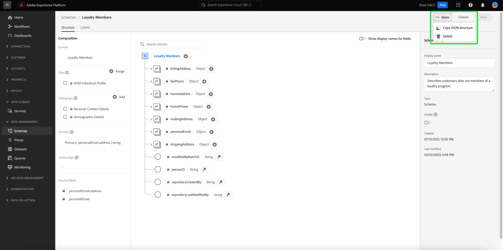
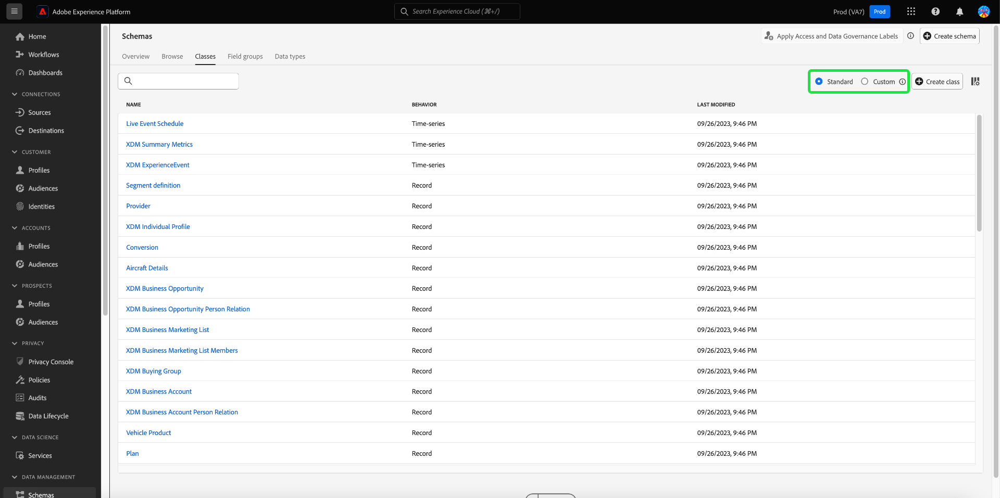
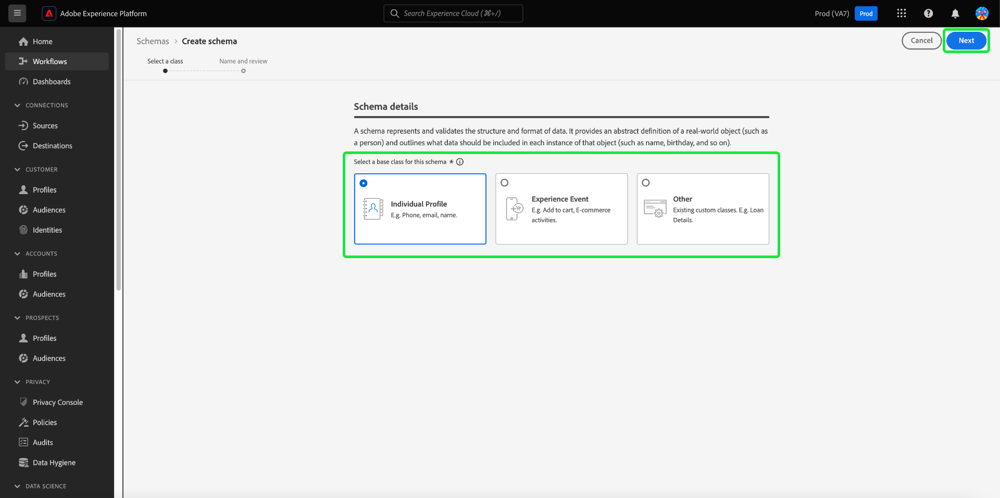
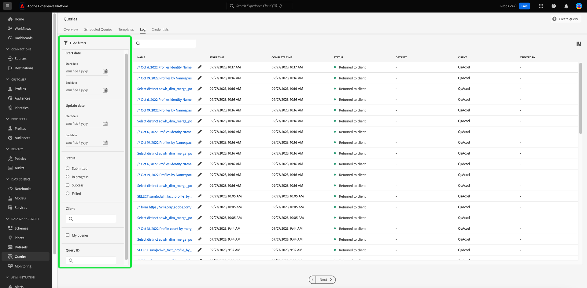

# Adobe Experience Platform リリースノート

**リリース日：2023年9月28日（PT）**

Adobe Experience Platform の新機能：

- [計算属性](#computed-attributes)

Experience Platformの既存の機能に対するアップデート：

- [アラート](#alerts)
- [ダッシュボード](#dashboards)
- [データ収集](#data-collection)
- [データガバナンス](#data-governance)
- [データハイジーン](#hygiene)
- [宛先](#destinations)
- [エクスペリエンスデータモデル（XDM）](#xdm)
- [ID サービス](#identity-service)
- [クエリサービス](#query-service)
- [セグメント化サービス](#segmentation)
- [ソース](#sources)

## 計算属性 {#computed-attributes}

計算属性を利用すると、直感的なUIを使用してイベントデータをプロファイル属性に簡単に要約し、行動ベースのセグメンテーション、パーソナライゼーション、アクティベーションを強化できます。 この機能を使用すると、計算属性をセルフサービス方式で作成して管理し、セグメンテーション、Real-Time CDPの宛先、またはAdobe Journey Optimizerで使用できます。 さらに、計算属性によりセグメンテーションやジャーニーのワークフローが簡素化され、適切なエクスペリエンスをシームレスに提供できるようになります。 計算属性について詳しくは、[計算属性の概要](../../profile/computed-attributes/overview.md)を参照してください。

## アラート {#alerts}

Experience Platformでは、様々なExperience Platform アクティビティのイベントベースのアラートを購読できます。 Experience Platform ユーザーインターフェイスの「[!UICONTROL Alerts]」タブを使用して、様々なアラートルールを購読できます。また、UI自体またはメール通知を使用してアラートメッセージを受信することもできます。

**新機能または更新された機能**

| 機能 | 説明 |
| --- | --- |
| 「アラート履歴」タブ | 「アラート [!UICONTROL History]」タブには、遅延、開始、成功、失敗など、すべてのイベントが含まれるようになりました。 履歴タブについて詳しくは、[&#x200B; アラート UI ドキュメント &#x200B;](../../observability/alerts/ui.md)を参照してください。 |

{style="table-layout:auto"}

アラートについて詳しくは、[[!DNL Observability Insights] 概要](../../observability/home.md)を参照してください。

## ダッシュボード {#dashboards}

Adobe Experience Platform では、複数の [!DNL dashboards] を提供しており、毎日のスナップショットでキャプチャされた、組織のデータに関する重要な情報を表示できます。

| 機能 | 説明 |
| --- | --- |
| [&#x200B; ライセンス使用状況ダッシュボードの改善](../../dashboards/guides/license-usage.md) | 向上したレポートと、組織のライセンス使用状況に関する主要な指標の可視化により、ライセンス契約を常に管理できます。 これらの改善により、購入したすべてのExperience Platform製品のライセンス使用率に関する指標を詳細に把握できます。 |

{style="table-layout:auto"}

ライセンス使用状況ダッシュボードについて詳しくは、[&#x200B; ライセンス使用状況ダッシュボードの概要](../../dashboards/guides/destinations.md)を参照してください。

## データ収集 {#data-collection}

Adobe Experience Platform では、クライアントサイドのカスタマーエクスペリエンスデータを収集し、Adobe Experience Platform Edge Network に送信できます。そこでデータを補強して変換し、アドビまたはアドビ以外の宛先に配信できます。

**新機能または更新された機能**

| タイプ | 機能 | 説明 |
| --- | --- | --- |
| データストリーム | デバイス検索のサポート | データストリームを設定する際に、収集するデバイス検索情報のレベルを選択できるようになりました。 デバイス検索情報には、ページの操作に使用したデバイス、ハードウェア、オペレーティングシステム、ブラウザーに関するデータが含まれます。   デバイスのルックアップ情報を、ユーザーエージェントとクライアントのヒントと共に収集できません。 デバイス情報の収集を選択すると、ユーザーエージェントとクライアントヒントの収集が無効になり、その逆も無効になります。 すべてのデバイス検索情報は`xdm:device` フィールドグループに保存されます。 詳しくは、[&#x200B; データストリームの設定](../../datastreams/configure.md#geolocation-device-lookup)に関するドキュメントを参照してください。 |
| 拡張機能 | [!DNL TikTok] web イベント API拡張機能 | [[!DNL TikTok] Web Events API](https://exchange.adobe.com/apps/ec/109834/tiktok-web-events-api)拡張機能を使用すると、Adobe Experience Platform Edge Networkでキャプチャしたデータを活用し、[!DNL TikTok] Web Events APIを使用してサーバーサイドのイベントの形式で[!DNL TikTok]に送信できます。 |

{style="table-layout:auto"}

データ収集について詳しくは、[&#x200B; データ収集の概要](../../tags/home.md)を参照してください。

## データガバナンス {#data-governance}

Adobe Experience Platform データガバナンスは、顧客データを管理し、データの使用に適用される規制、制限、ポリシーへの準拠を確保するために使用される一連の戦略とテクノロジーです。これは Experience Platform 内の様々なレベルで重要な役割を果たします。例えば、カタログ化、データ系列、データ使用のラベル付け、データアクセスポリシー、マーケティングアクションのデータに関するアクセス制御などです。

**新機能**

| 機能 | 説明 |
| --- | --- |
| サードパーティデータ用の新しいパートナーエコシステムラベル | サードパーティのエンリッチメントと見込み顧客の獲得に関する、新しいデータ使用ラベルが利用可能になりました。 詳しくは、[&#x200B; パートナーエコシステムラベル &#x200B;](../../data-governance/labels/reference.md#partner)に関するドキュメントを参照してください。 |

{style="table-layout:auto"}

データガバナンスについて詳しくは、[データガバナンスの概要](../../data-governance/home.md)を参照してください。

## データハイジーン {#hygiene}

Experience Platform は、消費者レコードとデータセットをプログラムで削除することで、保存されたデータを管理できる、一連のデータ衛生機能を提供します。UIの[!UICONTROL Data Lifecycle] ワークスペースまたはData Hygiene APIの呼び出しを使用して、データストアを効果的に管理できます。 これらの機能を使用して、情報が期待どおりに使用され、不正確なデータの修正が必要な場合に更新され、組織のポリシーで必要と判断された場合に削除されるようにします。

**新機能**

| 機能 | 説明 |
| --- | --- |
| [!BADGE Beta]{type=Informative} レコードの削除（制限付きリリース） | Adobe Adobe Experience Platformの高度なデータライフサイクル管理機能：データセットの自動有効期限とレコードの削除により、あらゆるデータストアをまたいでデータライフサイクルを管理し、顧客の要件やライセンス契約を満たすことができます。  データセットの自動有効期限を使用すると、データセット全体を削除し、データセットを削除する日時を設定できます。  レコード削除を使用すると、プライマリ IDをターゲットにして個々の消費者プロファイルを削除できます。 プライマリ IDは、UIまたはCSV/JSON ファイルのアップロードを通じて個別に指定できます。 詳しくは、[&#x200B; レコード削除ドキュメント &#x200B;](../../hygiene/ui/record-delete.md)を参照してください |
| データセット有効期限 | データセットの自動有効期限により、データを最小限に抑え、ライセンス契約を管理できます。 データセット全体を削除し、データセットを削除する日時を設定することで、データ量を削減できます。 詳しくは、[&#x200B; データセットの有効期限に関するドキュメント &#x200B;](../../hygiene/ui/dataset-expiration.md)を参照してください。 |

{style="table-layout:auto"}

Experience Platformのデータハイジーン機能について詳しくは、[&#x200B; データハイジーンの概要](../../hygiene/home.md)を参照してください。

## 宛先 {#destinations}

[!DNL Destinations] は、Adobe Experience Platform からのデータの円滑なアクティベーションを可能にする、事前定義済みの出力先プラットフォームとの統合です。宛先を使用して、クロスチャネルマーケティングキャンペーン、メールキャンペーン、ターゲット広告、その他多くの使用事例に関する既知および不明なデータをアクティブ化できます。

**新規宛先または更新された宛先** {#new-updated-destinations}

| 宛先 | 新規／アップデート | 説明 |
| ----------- |----------------|----------- |
| [[!DNL LiveRamp - Distribution]](../../destinations/catalog/advertising/liveramp-distribution.md) | 新規 | モバイル、web、ディスプレイ、コネクテッド TVのメディアをまたいで、[!DNL LiveRamp]に以前オンボーディングしたオーディエンスをプレミアムパブリッシャーにアクティベートします。   [!DNL LiveRamp]LiveRamp - オンボーディング [接続を介して](../../destinations/catalog/advertising/liveramp-onboarding.md) アカウントにオーディエンスをオンボーディングした後、新しい[[!DNL LiveRamp - Distribution]](../../destinations/catalog/advertising/liveramp-distribution.md)接続を使用して、オーディエンスをダウンストリームの宛先にアクティベートします。 |
| [[!DNL HubSpot]](../../destinations/catalog/crm/hubspot.md) | 新規 | [[!DNL HubSpot]](https://www.hubspot.com)は、マーケティング、セールス、コンテンツ管理、カスタマーサービスの連携に必要なあらゆるソフトウェア、統合、リソースを備えたCRM プラットフォームです。 これにより、データ、チーム、顧客を1つのCRM プラットフォームに接続できます。 |
| [[!DNL Microsoft Dynamics 365]](../../destinations/catalog/crm/microsoft-dynamics-365.md) | 更新済み | [!DNL Dynamics 365]のデフォルトソリューション内で作成されなかったカスタムフィールドの[!DNL Dynamics 365] カスタムフィールド接頭辞のサポートを追加しました。 新しい入力フィールド **[!UICONTROL Customization Prefix]**&#x200B;が、[宛先の詳細を入力](#destination-details)手順で追加されました。 |
| [[!DNL Experience Cloud Audiences]](../../destinations/catalog/adobe/experience-cloud-audiences.md) | 更新済み | Experience Cloud Audiencesの宛先が一般公開されました。 この宛先を使用して、Real-Time CDPからAudience ManagerおよびAdobe Analyticsにオーディエンスをアクティブ化します。 Adobe Analyticsにオーディエンスを送信するには、Audience Manager ライセンスが必要です。 |

{style="table-layout:auto"}

<!-- 

Add these to release notes as they go out

| [[!DNL Qualtrics]] | New | Use the aggregation of multiple sources of operational data in Adobe Experience Platform as an input in Qualtrics Experience ID to better understand your customers and enable targeted outreach to close the gap when it comes to understanding intent, emotion and experience drivers. |

-->

**新しい機能または更新された機能** {#destinations-new-updated-functionality}

| 機能 | 説明 |
| ----------- | ----------- |
| Real-Time CDPでのデータ書き出し | [&#x200B; データセット書き出し](../../destinations/ui/export-datasets.md)機能が一般公開されました。 購入したExperience Platform アプリ [に基づいて書き出すことができるデータセット &#x200B;](../../destinations/ui/export-datasets.md#datasets-to-export)を参照し、データセットの書き出しに関する[&#x200B; ガードレール &#x200B;](/help/destinations/guardrails.md#dataset-exports)を確認してください。 |
| （Beta）配列型オブジェクトの書き出しのサポート | プリミティブ値（文字列、int値、ブール値）の配列をフラットスキーマファイルとしてクラウドストレージの宛先に書き出します。 この機能について詳しくは、[&#x200B; ドキュメント &#x200B;](../../destinations/ui/export-arrays-maps-objects.md)を参照してください。 |
| Destination SDKの動的ドロップダウンセレクター | Destination SDKを使用して宛先を作成する際に、[動的ドロップダウンセレクター](../../destinations/destination-sdk/functionality/destination-configuration/customer-data-fields.md#dynamic-dropdown-selectors)を使用して、ドロップダウンセレクターのフィールドにAPIから取得した値を入力できるようになりました。 |

**修正と機能強化** {#destinations-fixes-and-enhancements}

- データフロー実行レベルでエンタープライズ宛先（[HTTP API](../../dataflows/ui/monitor-destinations.md#dataflow-runs-for-streaming-destinations)、[Amazon Kinesis](../../destinations/catalog/streaming/http-destination.md)、[Azure Event Hubs](../../destinations/catalog/cloud-storage/amazon-kinesis.md)）に対して利用可能になった[監視の透明性](../../destinations/catalog/cloud-storage/azure-event-hubs.md)を使用して、エラーコードとトラブルシューティング用のメッセージを介した追加情報とともに、[&#x200B; データフローの詳細ビュー](../../dataflows/ui/monitor-destinations.md#dataflow-run-details-page)のアクティベーション指標とステータスを監視します。
- [Google Ad Manager](../../destinations/catalog/advertising/google-ad-manager.md)、[Google Display &amp; Video 360](../../destinations/catalog/advertising/google-dv360.md)、および[&#x200B; オーディエンス更新テンプレート &#x200B;](../../destinations/destination-sdk/metadata-api/update-audience-template.md)を使用するその他の宛先にマッピングされたオーディエンスの名前を更新すると、これらの名前の変更が宛先のダウンストリームに反映されるようになりました。

宛先の一般的な情報については、[宛先の概要](../../destinations/home.md)を参照してください。

## エクスペリエンスデータモデル（XDM） {#xdm}

XDM は、Adobe Experience Platform に取り込むデータの共通構造および定義（スキーマ）を提供するオープンソース仕様です。XDM 標準規格に準拠しているので、すべての顧客体験データを共通の表現に反映させて、迅速かつ統合的な方法でインサイトを提供できます。顧客アクションから有益なインサイトを得たり、セグメントを通じて顧客オーディエンスを定義したり、パーソナライズ機能のために顧客属性を使用したりできます。

**新機能**

| 機能 | 説明 |
| --- | --- |
| スキーマエディターに追加されたクイックアクション | スキーマエディターのキャンバスに新しいクイックアクションが追加されました。 JSON構造をコピーしたり、スキーマをエディターから直接削除したりできるようになりました。 {width="100" zoomable="yes"} |
| カスタムまたは標準の作成者によるXDM リソースのフィルタリング | 使用可能なスキーマ、フィールドグループ、データタイプ、クラスのリストが、作成方法に基づいて事前にフィルタリングされるようになりました。 これにより、Adobeで作成されたかどうかに基づいて、リソースをフィルタリングできます。 {width="100" zoomable="yes"}  詳しくは、[&#x200B; リソースの作成と編集に関するドキュメント &#x200B;](../../xdm/ui/resources/classes.md#filter.md)を参照してください。 |

**更新された機能**

| 機能 | 説明 |
| --- | --- |
| 更新されたスキーマ作成ワークフロー | プロセスを合理化するために、新しいスキーマ作成ワークフローを実装しました。  {width="100" zoomable="yes"}  詳しくは、[&#x200B; スキーマ作成ドキュメント &#x200B;](../../xdm/ui/resources/schemas.md#create)を参照してください。 |

**新しい XDM コンポーネント**

| コンポーネントのタイプ | 名前 | 説明 |
| --- | --- | --- |
| データタイプ | [[!UICONTROL Return]](https://github.com/adobe/xdm/pull/1773/files) | RMA （Return Merchandise Authorization）とは。 |
| データタイプ | [[!UICONTROL Return Item]](https://github.com/adobe/xdm/pull/1773/files) | RMA （Return Merchandise Authorization）内の返品商品の情報。 |

{style="table-layout:auto"}

**更新された XDM コンポーネント**

| コンポーネントのタイプ | 名前 | 説明のアップデート |
| --- | --- | --- |
| 拡張機能 | [!UICONTROL AJO Entity Fields] | バリアントがマルチバリアントであるかどうかを識別するために、[[!UICONTROL flag for multi-variant]](https://github.com/adobe/xdm/pull/1774/files)が[!UICONTROL AJO Entity Fields]に追加されました。 |
| データタイプ | [!UICONTROL Product list item] | [[!UICONTROL Return Item]](https://github.com/adobe/xdm/pull/1773/files)が追加され、返品承認情報が含まれるようになりました。 |
| データタイプ | 注文 | [[!UICONTROL Return Info]](https://github.com/adobe/xdm/pull/1773/files)が追加され、発行されたRMA （返品承認）が含まれるようになりました。 |

{style="table-layout:auto"}

Experience PlatformのXDMについて詳しくは、[XDM System overview](../../xdm/home.md)を参照してください

## ID サービス {#identity-service}

Adobe Experience Platform ID サービスを利用すると、デバイスやシステム間で ID を橋渡しすることで、顧客とその行動を包括的に把握し、インパクトのある個人的なデジタルエクスペリエンスをリアルタイムで提供できます。

**新機能または更新された機能**

| 機能 | 説明 |
| --- | --- |
| Identity Service UIの機能強化 | Experience Platform UIの改善されたカスタム名前空間作成ツールを使用して、カスタム名前空間とそれに対応するID タイプをより適切に管理します。 強化されたID サービス UIでは、次の機能が提供されます。 <ul><li>コンテキストに沿ったエクスペリエンス：ID名前空間とID タイプを視覚的に確認し、わかりやすく説明します。</li><li>正確性：ID名が重複することなく、エラー処理が改善されます。</li><li>見つけやすさ：製品内ダイアログ内からドキュメントにアクセスできます。</li></ul> 詳しくは、[&#x200B; カスタム名前空間の作成](../../identity-service/features/namespaces.md#create-namespaces)に関するガイドを参照してください。 |
| ID グラフの制限の変更 | ID グラフの制限が150 IDから50 IDに変更されました。 新しいIDがグラフ全体に取り込まれると、取り込みタイムスタンプとID タイプに基づく最も古いIDが削除されます。 Cookie ID タイプは削除のために優先されます。 実稼動サンドボックスに次の項目が含まれる場合は、Adobe アカウントチームに連絡してID タイプの変更をリクエストしてください。 <ul><li>個人ID （CRM IDなど）がCookie/デバイス ID タイプとして設定されるカスタム名前空間。</li><li>cookie/デバイス識別子がクロスデバイス ID タイプとして設定されるカスタム名前空間。</li></ul> Adobe エンジニアリングは、これらのリクエストを手動で処理します。 詳しくは、[ID サービス データのガードレール &#x200B;](../../identity-service/guardrails.md)および[&#x200B; データ管理ライセンス使用権限のベストプラクティス &#x200B;](../../landing/license-usage-and-guardrails/data-management-best-practices.md)に関するガイドを参照してください。 |

{style="table-layout:auto"}

ID サービスについて詳しくは、[ID サービスの概要](../../identity-service/home.md)を参照してください。

## クエリサービス {#query-service}

クエリサービスを使用すると、標準 SQL を使用して Adobe Experience Platform [!DNL Data Lake] でデータに対してクエリを実行できます。[!DNL Data Lake] の任意のデータセットを結合したり、クエリ結果を新しいデータセットとして取得したりすることで、それらのデータセットをレポートやデータサイエンスワークスペースで使用したり、リアルタイム顧客プロファイルへの取り込みが可能になります。

**更新された機能**

| 機能 | 説明 |
| --- | --- |
| ログフィルタリング UIの更新 | クエリログフィルタリングの改善により、監視、管理、トラブルシューティング用のユーザー生成ログの可視性が向上しました。 さまざまな設定に基づいて、クエリログのリストをフィルタリングできます。  {width="100" zoomable="yes"}  詳しくは、[&#x200B; クエリログのドキュメント &#x200B;](../../query-service/ui/query-logs.md#filter-logs)を参照してください。 |
| 複数のクエリエディターUIの更新 | クエリエディターで複数のシーケンシャルクエリを実行したり、複数のクエリを記述して、すべてのクエリをシーケンシャルに実行したりできるようになりました。 クエリの実行に柔軟性を持たせるには、選択したクエリを強調表示し、その特定のクエリを選択して、他のクエリとは独立して実行します。 詳しくは、[&#x200B; クエリエディターUI ガイド &#x200B;](../../query-service/ui/user-guide.md#execute-multiple-sequential-queries)を参照してください。 |

{style="table-layout:auto"}

クエリサービスについて詳しくは、[クエリサービスの概要](../../query-service/home.md)を参照してください。

## セグメント化サービス {#segmentation}

[!DNL Segmentation Service] を使用すると、[!DNL Experience Platform] に保存されている、個人（顧客、見込み客、ユーザー、組織など）に関連するデータをオーディエンスにセグメント化できます。オーディエンスは、セグメント定義または [!DNL Real-Time Customer Profile] データの他のソースを通じて作成できます。これらのオーディエンスは [!DNL Experience Platform] で一元的に設定および管理されており、Adobe ソリューションから簡単にアクセスできます。

**新機能または更新された機能**

| 機能 | 説明 |
| ------- | ----------- |
| カスタマイズ可能な列 | サイズ変更可能な列を使用して、オーディエンスポータルのレイアウトをカスタマイズできるようになりました。 この機能について詳しくは、[&#x200B; オーディエンスポータルの概要](../../segmentation/ui/audience-portal.md#customize)を参照してください。 |
| 頻度の内訳の更新 | 組織内のオーディエンスの更新頻度の内訳を表示できるようになりました。 この機能について詳しくは、[&#x200B; セグメント化UI ガイド &#x200B;](../../segmentation/ui/overview.md#browse)を参照してください。 |

セグメント化サービスの詳細については、「[セグメント化サービスの概要](../../segmentation/home.md)」を参照してください。

## ソース {#sources}

Experience Platform は、様々なデータプロバイダーのソース接続を簡単に設定できる RESTful API とインタラクティブ UI を備えています。これらのソース接続を使用すると、外部ストレージシステムおよび CRM サービスの認証と接続、取得実行時間の設定、データ取得スループットの管理を行うことができます。

**新機能または更新された機能**

| 機能 | 説明 |
| --- | --- |
| セルフサービスソースの`offset` ページネーションの新しいパラメーター（バッチSDK） | `endConditionName` ページネーションを使用する際に、ソースに`endConditionValue`と`offset`を指定できるようになりました。 これらのパラメーターを使用すると、次のHTTP リクエストでページネーション ループを終了する条件を指定できます。 詳しくは、「[&#x200B; セルフサービスソースのページネーションガイド （バッチSDK） &#x200B;](../../sources/sources-sdk/config/sourcespec.md#pagination)」を参照してください。 |

{style="table-layout:auto"}

ソースについて詳しくは、[&#x200B; ソースの概要](../../sources/home.md)を参照してください。
