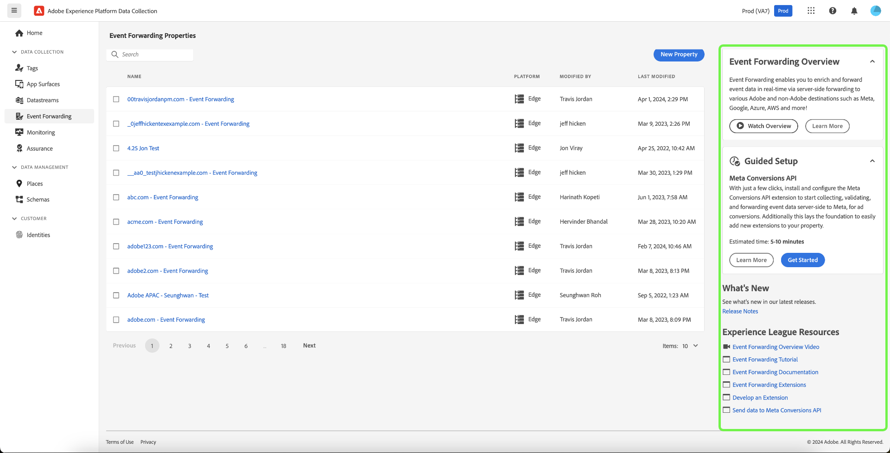

# Adobe Experience Platform リリースノート

**リリース日：2024年4月30日**

>[!TIP]
>
>[Adobe Experience Platform用語集](/help/landing/glossary.md)を使用して、Real-Time Customer Data PlatformとAdobe Experience Platformで使用される用語に慣れましょう。 探している特定の用語が見つからない場合は、ページのフィードバックオプションを使用して、用語集に新しい用語を追加するようリクエストします。

Experience Platformの既存の機能に対するアップデート：

- [ダッシュボード](#dashboards)
- [データ収集](#data-collection)
- [宛先](#destinations)
- [ID サービス](#identity-service)
- [モニタリング](#monitoring)
- [クエリサービス](#query-service)
- [サンドボックス](#sandboxes)
- [セグメント化サービス](#segmentation)
- [ソース](#sources)

## ダッシュボード {#dashboards}

Adobe Experience Platform では、毎日のスナップショットで得られた、組織のデータに関する重要なインサイトを確認できる複数のダッシュボードを提供しています。

**新機能または更新された機能**

| 機能 | 説明 |
| --- | --- |
| Real-Time Customer Data Platform B2B インサイト | アカウントと商談に関する事前設定済みの[Real-Time CDP B2B データインサイト &#x200B;](../../dashboards/insights/account-profiles.md)を確認して、データを理解し、ビジネス上の意思決定に役立てることができます。 また、[Real-Time CDP B2B データモデル &#x200B;](../../dashboards/data-models/cdp-insights-data-model-b2c.md)を使用して独自のインサイトを構築し、データを視覚化および探索して、カスタムビジュアライゼーションをダッシュボードに保存することもできます。 |

{style="table-layout:auto"}

アクセス権限の付与方法やカスタムウィジェットの作成方法など、ダッシュボードの詳細については、まず[ダッシュボードの概要](../../dashboards/home.md)を参照してください。

## データ収集 {#data-collection}

Adobe Experience Platformには、クライアントサイドのカスタマーエクスペリエンスデータを収集してExperience Platform Edge Networkに送信し、AdobeまたはAdobe以外の宛先にエンリッチメント、変換、配布できる一連のテクノロジが用意されています。

**新機能または更新された機能**

| タイプ | 機能 | 説明 |
| --- | --- | --- |
| 拡張機能 | [!DNL Acxiom Anonymous Visitor Insights] タグ拡張機能 | サイト訪問者の出所を[!DNL Acxiom's Visitor Insights]で確認します。 Acxiomは、Geo IP ルックアップテクノロジーを利用することで、匿名のブラウザーの場所を特定することができます。 識別されると、整理されたデータベースで検索すると、追加のインサイトが得られ、ブラウザーに送り返されます。 これにより、コンテンツ制作者は、これらのデータポイントに合わせてコンテンツを調整し、初めて訪れた訪問者であっても、よりパーソナライズされた魅力的な体験を提供できるようになります。 |
| データストリーム | [Edge Network ボット検出](../../datastreams/bot-detection.md) | 自動プログラム、web スクレイパー、クモ、スクリプトスキャナーなど、人間以外のエンティティから発生するトラフィックは、人間の訪問者から発生するイベントを識別するのが難しくなります。 この種類のトラフィックは、重要なビジネス指標に悪影響を与え、誤ったトラフィックレポートにつながる可能性があります。   ボット検出を使用すると、[Adobe Experience Platform Data Collection](/help/collection/home.md)によって生成されたイベントを、既知のクモやボットによって生成されたものとして識別できます。 データストリームのボット検出を設定することで、特定のIP アドレス、IP範囲、およびボットイベントとして分類するリクエストヘッダーを特定できます。   ボットトラフィックの識別により、サイトまたはモバイルアプリケーションでのユーザーアクティビティをより正確に測定できます。 |
| Mobile SDK | メジャーバージョンリリース | モバイルSDKの新しいメジャーバージョンは、次のプラットフォーム向けにリリースされました。iOS Mobile Core 5.xおよび互換性のあるiOS拡張機能、Android Mobile Core 3.xおよび互換性のあるAndroid拡張機能、React Native Core 6.xおよび互換性のあるReact Native拡張機能、Flutter Core 4.xおよび互換性のあるFlutter拡張機能。 これらのリリースでは、Jetpack Compose用のAndroid SDKのサポート、Adobe Journey Optimizer コードベースのエクスペリエンスのサポート、Flutter用のAdobe Journey Optimizer Messaging拡張機能の一般提供など、いくつかの新機能と機能強化が提供されています。 詳細なリリースノートについては、[&#x200B; モバイル SDK リリースノート &#x200B;](https://developer.adobe.com/client-sdks/home/release-notes/)を参照してください。 |
| Mobile SDK | プライバシー | Appleのポリシー更新により、2024年5月1日（PT）以降、開発者はApp Storeに送信するために新しいプライバシー機能を実装する必要があります。 Mobile SDKを使用しているすべてのAdobeのお客様が5月1日以降にApp Storeの承認を受けたい場合は、SDKのバージョン 5.xにアップグレードする必要があります。 |
| SDK六 | SDK六 | Roku SDKの最初のメジャーバージョンは、Experience Platform Edge NetworkのStreaming Mediaに対応してリリースされました。 |
| タグとイベント転送 | 製品内ガイダンス | Experience Platform [&#x200B; タグ &#x200B;](../../tags/home.md)と[&#x200B; イベント転送](../../tags/ui/event-forwarding/overview.md)では、新しいエクスペリエンスの範囲が提供され、すばやく開始し、すばやく価値を生み出すことができます。 これらのエクスペリエンスには、新しいオンボーディング画面、製品内チュートリアル、ツールのヒントなどが含まれます。 製品内ガイダンスがハイライト表示された {width="100" zoomable="yes"}  |
| Web SDK | Audience Managerを利用している企業は、webSDKの導入を合理化できます | Audience Manager、Analytics、TargetなどのExperience Cloud ソリューションにExperience Data Model （XDM）を使用することなく、Web SDKの複数のアップデートを使用して、Web SDKの導入を簡素化できるようになりました。 Audience Manager Web SDKの導入について詳しくは、次のガイドを参照してください。 <ul><li><a href="https://experienceleague.adobe.com/ja/docs/audience-manager/user-guide/migrate-to-web-sdk/dil-extension-to-web-sdk">Audience Managerのデータ収集ライブラリをAudience Manager タグ拡張機能からWeb SDK タグ拡張機能に更新します</li><li><a href="https://experienceleague.adobe.com/ja/docs/audience-manager/user-guide/migrate-to-web-sdk/appmeasurement-to-web-sdk">Audience Managerのデータ収集ライブラリをAppMeasurement JavaScript ライブラリからWeb SDK JavaScript ライブラリに更新します</li></ul> |

{style="table-layout:auto"}

<!--| Web SDK | [Streaming Media Collection support in Web SDK](/help/collection/js/commands/configure/streamingmedia.md) | You can now use Experience Platform Web SDK to collect data related to media sessions on your website. The collected data can include information about media playbacks, pauses, completions, and other related events. Once collected, you can send this data to Adobe Experience Platform and/or Adobe Analytics, to generate reports. This feature provides a comprehensive solution for tracking and understanding media consumption behavior on your website.  See the [Web SDK](/help/collection/js/commands/configure/streamingmedia.md) documentation to learn how to configure the `streamingMedia` component.  See the guide on [migrating your Analytics for Streaming Media implementation from Media JS to Web SDK](https://experienceleague.adobe.com/ja/docs/media-analytics/using/implementation/edge-recommended/media-edge-sdk/edge-web-sdk) for more details.|-->

データ収集について詳しくは、[&#x200B; データ収集の概要](../../collection/home.md)を参照してください。

## 宛先 {#destinations}

[!DNL Destinations] は、Adobe Experience Platform からのデータの円滑なアクティベーションを可能にする、事前定義済みの出力先プラットフォームとの統合です。宛先を使用して、クロスチャネルマーケティングキャンペーン、メールキャンペーン、ターゲット広告、その他多くの使用事例に関する既知および不明なデータをアクティブ化できます。

**新しい機能または更新された機能** {#destinations-new-updated-functionality}

| 機能 | 説明 |
| ----------- | ----------- |
| Destination SDKのネストされた顧客データフィールドで`isRequired` パラメーターが使用可能になりました | Destination SDKで宛先を設定する際に、必要に応じて[&#x200B; ネストされた顧客データフィールドを設定できるようになりました](/help/destinations/destination-sdk/functionality/destination-configuration/customer-data-fields.md#nested-fields)。 この方法では、宛先を設定しているユーザーは、そのフィールドの値を選択するまでアクティベーションフローを続行できません。 |
| Web SDKでEdgeの宛先を設定する場合、Adobe Targetのセグメント化はもはや必須ではありません | 以前は、Web SDKで[Adobe Targetの宛先](/help/destinations/catalog/personalization/adobe-target-connection.md)を設定する際、パーソナライゼーションとエッジセグメント化のためにデータストリームを有効にする必要がありました。 エッジ セグメント化[に対してデータストリームを有効にする要件が削除されました](/help/destinations/ui/activate-edge-personalization-destinations.md#configure-datastream)。 この統合パターンでは、Adobe TargetとReal-Time CDPを併用する場合にのみ、パーソナライゼーションのユースケースのサブセットからメリットを得ることができます。 統合タイプ [によって有効になる](/help/destinations/catalog/personalization/adobe-target-connection.md#supported-use-cases) ユースケースについて詳しくは、こちらを参照してください。 |
| [!BADGE Beta]{type=Informative} アクティベーションフローから複数のオーディエンスとデータセットを削除 | 宛先アクティベーションフローから複数のオーディエンスとデータセットを選択して削除できるようになりました。 詳しくは、[宛先の詳細](../../destinations/ui/destination-details-page.md#bulk-remove)および[&#x200B; データセットの書き出し](../../destinations/ui/export-datasets.md)のドキュメントを参照してください。 |

{style="table-layout:auto"}

宛先の一般的な情報については、[宛先の概要](../../destinations/home.md)を参照してください。

## ID サービス {#identity-service}

Adobe Experience Platform ID サービスを使用すると、デバイスやシステム間で ID を紐付けることで、顧客とその行動の全体像を把握し、インパクトのある、個人的なデジタルエクスペリエンスをリアルタイムで提供できます。

**更新された機能**

| 機能 | 説明 |
| --- | --- |
| APIの`/orgs/{ORG}/` エンドポイントの廃止 | [[!DNL Identity Service] API](https://developer.adobe.com/experience-platform-apis/references/identity-service/)の次のエンドポイントは非推奨（廃止予定）になりました。<ul><li>`https://platform.adobe.io/data/core/idnamespace/orgs/{ORG}/identities`</li><li>`https://platform.adobe.io/data/core/idnamespace/orgs/{ORG}/identities/{ID}`</li></ul> `/idnamespace/identities`と`/idnamespace/identities/{ID}` エンドポイントを使用して、同じタスクを実行し、組織内のすべての名前空間または組織内の特定の名前空間のいずれかを取得できます。 |

{style="table-layout:auto"}

ID サービスについて詳しくは、[ID サービスの概要](../../identity-service/home.md)を参照してください。

## モニタリング {#monitoring}

Experience Platform UIのモニタリングダッシュボードを使用して、ソース、ID サービス、リアルタイム顧客プロファイル、オーディエンス、宛先からのデータのジャーニーをモニタリングします。

**更新された機能**

| 機能 | 説明 |
| --- | --- |
| ダッシュボードの拡張の監視 | ビジネスのユースケースに基づいて、様々なデータタイプに対してモニタリングダッシュボードを使用できるようになりました。 モニタリングダッシュボードを使用して、ソース、オーディエンス、宛先の個人、アカウント、見込み客のデータタイプ活動をモニタリングします。 |

{style="table-layout:auto"}

詳しくは、[監視ダッシュボードの使用](../../dataflows/ui/monitor.md)に関するガイドを参照してください。

## クエリサービス {#query-service}

クエリサービスを使用すると、標準 SQL を使用して Adobe Experience Platform [!DNL Data Lake] でデータに対してクエリを実行できます。[!DNL Data Lake] の任意のデータセットを結合したり、クエリ結果を新しいデータセットとして取得したりすることで、それらのデータセットをレポートやデータサイエンスワークスペースで使用したり、リアルタイム顧客プロファイルへの取り込みが可能になります。

**更新された機能**

| 機能 | 説明 |
| --- | --- |
| クエリの隔離 | 失敗したクエリ実行を自動的に分離することで、中断を防ぎ、一貫したパフォーマンスを維持します。 詳しくは、[&#x200B; クエリ強制隔離](../../query-service/ui/query-schedules.md#quarantine)のドキュメントを参照してください。 |
| クエリをキャンセル | クエリの実行を制御し、実行中のクエリをキャンセルして生産性を向上させます。詳しくは、[&#x200B; クエリをキャンセル &#x200B;](../../query-service/ui/user-guide.md#cancel-query)のドキュメントを参照してください。 |
| スケジュールされたクエリアラート | クエリのスケジュールを設定しながら、先見的な通知により情報を提供することで、効率的でタイムリーなタスク管理を実現します。 クエリ [を作成する場合、または既存のスケジュール済みクエリに対してインラインアクションを使用する場合、アラートを](../../query-service/ui/query-schedules.md#alerts-for-query-status)購読できます。 詳しくは、「[&#x200B; インラインアクションを使用したアラートの購読](../../query-service/ui/monitor-queries.md#alert-subscription)」のドキュメントを参照してください。 |
| スケジュールされたクエリナビゲーションの改善 | クエリテンプレートとスケジュールされた実行を簡単に移動して、生産性を向上させることができます。 詳しくは、[&#x200B; スケジュールされたクエリの実行の表示](../../query-service/ui/query-schedules.md#scheduled-query-runs)に関するドキュメントを参照してください。 |
| 拡張クエリ出力 | データをより詳細に分析するために、コンソール内で最大500行のクエリ結果にアクセスできます。詳しくは、[結果数](../../query-service/ui/user-guide.md#result-count)のドキュメントを参照してください。 |
| レガシークエリエディターのサンセット | 2024年4月30日（PT）より、拡張クエリエディターがすべてのユーザーのデフォルトのエディターになりました。 レガシーエディターは2024年5月24日（PT）に廃止され、使用できなくなります。 詳しくは、[&#x200B; クエリエディターのユーザーガイド &#x200B;](../../query-service/ui/user-guide.md)を参照してください。 |

{style="table-layout:auto"}

クエリサービスについて詳しくは、[クエリサービスの概要](../../query-service/home.md)を参照してください。

## サンドボックス {#sandboxes}

Adobe Experience Platform は、デジタルエクスペリエンスアプリケーションをグローバルな規模で強化するように設計されています。企業ではしばしば複数のデジタルエクスペリエンスアプリケーションを並行して運用し、運用コンプライアンスを確保しながら、アプリケーションの開発、テスト、導入に注力する必要があります。このニーズに対応するために、Experience Platformでは、単一のExperience Platformインスタンスを個別の仮想環境に分割し、デジタルエクスペリエンスアプリケーションの開発と開発に役立つサンドボックスを提供しています。

**新機能または更新された機能**

| 機能 | 説明 |
| --- | --- |
| [サンドボックスツール](../../sandboxes/ui/sandbox-tooling.md) | サンドボックスツールを使用して、[&#x200B; サポートされているすべてのオブジェクトタイプを](../../sandboxes/ui/sandbox-tooling.md#export-entire-sandbox)完全なサンドボックスパッケージに書き出し、[様々なサンドボックスにまたがってパッケージを](../../sandboxes/ui/sandbox-tooling.md#import-entire-sandbox)読み込んでオブジェクト設定を複製します。 |

{style="table-layout:auto"}

サンドボックスについて詳しくは、[&#x200B; サンドボックスの概要](../../sandboxes/home.md)を参照してください。

## セグメント化サービス {#segmentation}

[!DNL Segmentation Service] を使用すると、[!DNL Experience Platform] に保存されている、個人（顧客、見込み客、ユーザー、組織など）に関連するデータをオーディエンスにセグメント化できます。オーディエンスは、セグメント定義または [!DNL Real-Time Customer Profile] データの他のソースを通じて作成できます。これらのオーディエンスは [!DNL Experience Platform] で一元的に設定および管理されており、Adobe ソリューションから簡単にアクセスできます。

**更新された機能**

| 機能 | 説明 |
| ------- | ----------- |
| オーディエンスのライフサイクルの状態 | オーディエンスのライフサイクルの状態が合理化され、ライフサイクル管理が簡素化されました。 これらのライフサイクル状態について詳しくは、[&#x200B; セグメント化サービス FAQ](../../segmentation/faq.md#lifecycle-states)を参照してください。 |

{style="table-layout:auto"}

[!DNL Segmentation Service] について詳しくは、[セグメント化の概要](../../segmentation/home.md)を参照してください。

## ソース {#sources}

Experience Platform は、様々なデータプロバイダーのソース接続を簡単に設定できる RESTful API とインタラクティブ UI を備えています。これらのソース接続を使用すると、外部ストレージシステムおよび CRM サービスの認証と接続、取得実行時間の設定、データ取得スループットの管理を行うことができます。

Experience Platform のソースを使用して、Adobe アプリケーションまたはサードパーティのデータソースからデータを取り込みます。

**新しいソース**

| 新しいソース | 説明 |
| --- | --- |
| [!BADGE Beta]{type=Informative} [!DNL PathFactory] | [[!DNL PathFactory] source](../../sources/tutorials/ui/create/marketing-automation/pathfactory.md)を使用して、訪問者、セッション、ページビューのデータを[!DNL PathFactory]からExperience Platformに統合します。 開始する方法については、[[!DNL PathFactory] 概要](../../sources/connectors/marketing-automation/pathfactory.md)を参照してください。 |
| [!DNL Teradata Vantage] | [[!DNL Teradata Vantage] source](../../sources/tutorials/ui/create/databases/teradata-vantage.md)を使用して、ハイブリッド マルチクラウド環境からExperience Platformにデータを取り込みます。 開始する方法については、[[!DNL Teradata Vantage] 概要](../../sources/connectors/databases/teradata-vantage.md)を参照してください。 |

{style="table-layout:auto"}

**新機能と更新された機能**

| 機能 | 説明 |
| --- | --- |
| VA7で許可リストに登録するためのIP アドレスの更新 | VA7 （北米）の許可リストに追加するIP アドレスのリストに、次のIP アドレスが追加されました。 <ul><li>`20.98.198.224/29`</li><li>`20.119.28.57/32`</li><li>`20.232.89.104/29`</li><li>`20.98.195.172/32`</li><li>`172.210.218.144/28`</li></ul> 許可リストに追加するIP アドレスの包括的なリストについては、[IP アドレス許可リストドキュメント &#x200B;](../../sources/ip-address-allow-list.md)を参照してください。 |
| [!DNL Azure Event Hubs] ソースでの新しい認証タイプのサポート | [!DNL Event Hubs]または[!DNL Azure Active Directory Authentication]を使用して、[!DNL Scoped Azure Active Directory Authentication] ソースをExperience Platformに接続できるようになりました。 詳しくは、[Experience Platformへの [!DNL Event Hubs] 接続](../../sources/tutorials/ui/create/cloud-storage/eventhub.md)に関するガイドを参照してください。 |
| [!DNL Data Landing Zone]件の資格情報取得の更新 | ソース ワークスペースの右側のパネルを使用して、[!DNL Data Landing Zone]資格情報を取得できるようになりました。 右側のパネルを使用して、資格情報を更新することもできます。 詳しくは、[[!DNL Data Landing Zone] UI ガイド &#x200B;](../../sources/tutorials/ui/create/cloud-storage/data-landing-zone.md)を参照してください。 |

{style="table-layout:auto"}

<!--| Enhanced filtering and navigation in the sources UI workspace | Use the enhanced filtering, search, and inline action tools in the sources UI workspace to streamline your workflow. <ul><li>Use filtering and search capabilities to navigate your way through sources accounts and dataflows in your organization.</li><li>Use inline actions to modify configuration settings applied to your dataflows and improve organizational workflows. You can use inline actions to apply tags, set up alerts, or create ingestion jobs on demand.</li></ul> For more information, read the guide on [filtering sources objects in the UI](../../sources/tutorials/ui/filter.md).|-->

ソースについて詳しくは、[&#x200B; ソースの概要](../../sources/home.md)を参照してください。
