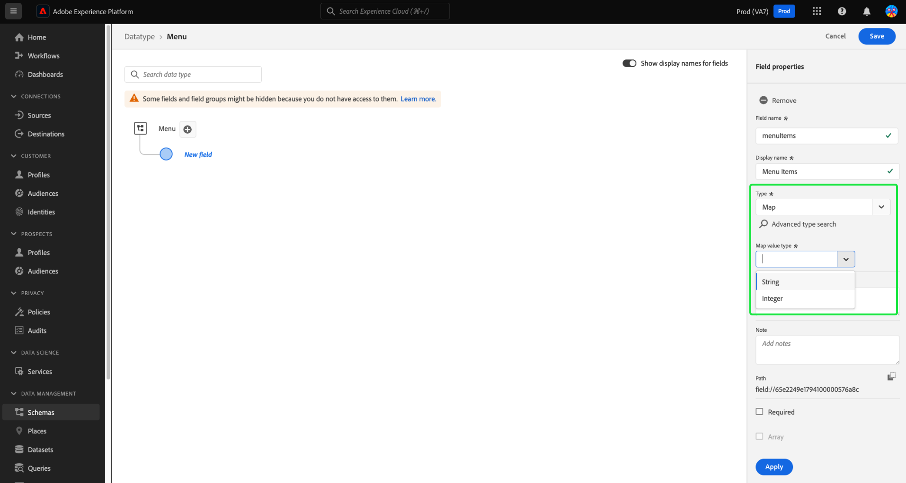

# Adobe Experience Platform リリースノート

**リリース日：2024年3月19日**

>[!TIP]
>
>以下を使用します。 [Adobe Experience Platformの用語集](/help/landing/glossary.md) Real-time Customer Data PlatformおよびAdobe Experience Platformで使用される用語を理解するために使用されます。 探している特定の用語が見つからない場合は、ページのフィードバックオプションを使用して、用語集に新しい用語を追加するようリクエストします。

Experience Platformの既存の機能の更新：

- [カタログサービス](#catalog-service)
- [データ準備](#data-prep)
- [宛先](#destinations)
- [エクスペリエンスデータモデル（XDM）](#xdm)
- [セグメント化サービス](#segmentation)
- [ソース](#sources)

## カタログサービス {#catalog-service}

カタログサービスは、Adobe Experience Platform 内のデータの場所と系列のレコードのシステムです。Experience Platformに取り込まれるすべてのデータはファイルとディレクトリとしてデータレイクに保存されますが、カタログには、参照や監視のために、これらのファイルとディレクトリのメタデータと説明が保持されます。

>[!NOTE]
>
>アドビでは、テーブル内の画像の横に不要な構文が表示される表示の問題を認識し、修正に取り組んでいます。

| 機能 | 説明 |
| --- | --- |
| その他のアクション | 操作の柔軟性を高め、データの管理を支援するために、詳細ビューの「その他のアクション」機能を使用して、データセットに対して追加のタスクを実行できるようになりました。 データセットは、削除するか、選択したデータセットの詳細ページからリアルタイム顧客プロファイルで使用できるように設定できます。 **注意：** データセットのプロファイル取り込みを有効にする場合、データセットのスキーマは、リアルタイム顧客プロファイルと互換性がある必要があります。 ![「データセット」ワークスペースと [!UICONTROL ...その他] ドロップダウンメニューがハイライト表示されます。](../2024/assets/march/more-actions.png "「データセット」ワークスペース（「その他」ドロップダウンメニューがハイライト表示されています）"){width="100" zoomable="yes"}。 詳しくは、 [データセットユーザーガイド](../../catalog/datasets/user-guide.md) ドキュメントを参照してください。 |

{style="table-layout:auto"}

Catalog Service について詳しくは、[Catalog Service の概要](../../catalog/home.md)を参照してください。

## データ準備 {#data-prep}

データ準備を使用すると、データエンジニアはエクスペリエンスデータモデル（XDM）との間でデータのマッピング、変換および検証を行うことができます。

**新機能または更新された機能**

| 機能 | 説明 |
| --- | --- |
| Adobe Analyticsの新しいマッパー関数 | 次の関数を使用して、Adobe Analyticsからイベントデータを抽出できるようになりました。 <ul><li>`aa_get_event_id`</li><li>`aa_get_event_value`</li><li>`aa_get_product_categories`</li><li>`aa_get_product_names`</li><li>`aa_get_product_quantities`</li><li>`aa_get_product_prices`</li><li>`aa_get_product_event_values`</li><li>`aa_get_product_evars`</li></ul> これらの関数について詳しくは、 [データ準備関数ガイド](../../data-prep/functions.md#analytics-functions) |

{style="table-layout:auto"}

Data Prep の詳細については、 [データ準備の概要](../../data-prep/home.md).

## 宛先 {#destinations}

[!DNL Destinations] は、Adobe Experience Platform からのデータの円滑なアクティベーションを可能にする、事前定義済みの出力先プラットフォームとの統合です。宛先を使用して、クロスチャネルマーケティングキャンペーン、メールキャンペーン、ターゲット広告、その他多くの使用事例に関する既知および不明なデータをアクティブ化できます。

**新しい宛先と更新された宛先** {#new-updated-destinations}

| 宛先 | タイプ | 説明 |
| ----------- | --------- | ----------- |
| [（ベータ版）Acxiom データ拡張接続](../../destinations/catalog/data-partner/acxiom-data-enhancement.md) | 新規 | このコネクタを使用して、データエンリッチメントのためにReal-Time CDPから Acxiom にファーストパーティプロファイルをアクティブ化し、マーケティングチャネルをまたいで使用します。 その後、Acxiom ソースを使用して、拡張データを含むプロファイルを読み込み、Real-Time CDPで操作できます。 |
| [（ベータ版）Acxiom Prospect Suppression 接続](../../destinations/catalog/data-partner/acxiom-prospect-suppression.md) | 新規 | ファーストパーティオーディエンスを Acxiom の宛先に書き出して、Acxiom が既知の顧客やコンバージョンされた顧客を抑制できるようにします。 次に、 [Acxiom 見込みデータのインポート](../../sources/connectors/data-partners/acxiom-prospecting-data-import.md) 既知の顧客またはコンバージョン済みの顧客を削除して、見込み客リストを Acxiom から取り込み、有効化するソースコネクタ。 |
| [Amazon Ads 接続](../../destinations/catalog/advertising/amazon-ads.md) | 更新 | Amazon Ads の宛先にデータを書き出す際に、Amazon DSPまたはAmazonMarketing Cloud（新規）にデータをルーティングできるようになりました。 |

{style="table-layout:auto"}

<!--

**New or updated functionality** {#destinations-new-updated-functionality}

-->

宛先の一般的な情報については、[宛先の概要](../../destinations/home.md)を参照してください。

## エクスペリエンスデータモデル（XDM） {#xdm}

XDM は、Adobe Experience Platform に取り込むデータの共通構造および定義（スキーマ）を提供するオープンソース仕様です。XDM 標準規格に準拠しているので、すべての顧客体験データを共通の表現に反映させて、迅速かつ統合的な方法でインサイトを提供できます。顧客アクションから有益なインサイトを得たり、セグメントを通じて顧客オーディエンスを定義したり、パーソナライズ機能のために顧客属性を使用したりできます。

**新機能**

| 機能 | 説明 |
| --- | --- |
| Experience PlatformUI マップのデータ型のサポート | さらに、Platform UI でマップフィールドを定義して、Experience Data Model(XDM) データ構造をカスタマイズします。 スキーマエディターでマップフィールドを作成して、柔軟なデータ構造をモデル化したり、キーと値のペアを効率的に格納したりできるようになりました。 新しいフィールドを定義してサブフィールドを設定し、フィールドグループに割り当てる際に、「タイプ」ドロップダウンから「マップ」を選択します。 サポートされているマップ値のタイプは、文字列と整数です。 {width="100" zoomable="yes"}  以下をおこなう方法を学ぶには、以下を実行します。 [UI でのマップフィールドの定義](../../xdm/ui/fields/map.md)詳しくは、 UI ガイドを参照してください。 |

{style="table-layout:auto"}

Platform の XDM について詳しくは、[XDM システムの概要](../../xdm/home.md)を参照してください。

## セグメント化サービス {#segmentation}

[!DNL Segmentation Service] を使用すると、[!DNL Experience Platform] に保存されている、個人（顧客、見込み客、ユーザー、組織など）に関連するデータをオーディエンスにセグメント化できます。オーディエンスは、セグメント定義または [!DNL Real-Time Customer Profile] データの他のソースを通じて作成できます。これらのオーディエンスは [!DNL Platform] で一元的に設定および管理されており、Adobe ソリューションから簡単にアクセスできます。

**新機能**

| 機能 | 説明 |
| ------- | ----------- |
| バルクアクション | オーディエンス在庫でバルクアクションがサポートされるようになりました。 バルクアクションを使用すると、複数のオーディエンスをすばやく選択して、それらをフォルダーに移動したり、タグを適用したり、アクセスラベルを適用したり、削除したりできます。   {width="100" zoomable="yes"}  この機能の詳細については、 [セグメント化サービス UI ガイド](../../segmentation/ui/overview.md#bulk-actions). |

{style="table-layout:auto"}

セグメント化サービスの詳細については、 [セグメント化サービスの概要](../../segmentation/home.md).

## ソース {#sources}

Experience Platform は、様々なデータプロバイダーのソース接続を簡単に設定できる RESTful API とインタラクティブ UI を備えています。これらのソース接続を使用すると、外部ストレージシステムおよび CRM サービスの認証と接続、取得実行時間の設定、データ取得スループットの管理を行うことができます。

**新規および更新されたソース**

| 機能 | タイプ | 説明 |
| --- | --- | --- |
| [!BADGE ベータ版]{type=Informative} [!DNL Acxiom Data Ingestion] | 新規 | 以下を使用します。 [[!DNL Acxiom Data Ingestion] ソース](../../sources/tutorials/ui/create/data-partners/acxiom-data-ingestion.md) 取り込む [!DNL Acxiom] データをReal-time Customer Data Platformに取り込み、ファーストパーティプロファイルを強化します。 次に、 [!DNL Acxiom] — 強化されたファーストパーティプロファイル：オーディエンスを改善し、マーケティングチャネルをまたいでアクティブ化します。   {width="100" zoomable="yes"}   詳しくは、 [[!DNL Acxiom Data Ingestion] 概要](../../sources/connectors/data-partners/acxiom-data-ingestion.md) を参照してください。 |
| [!BADGE ベータ版]{type=Informative} [!DNL Stripe] | 新規 | 以下を使用します。 [[!DNL Stripe] ソース](../../sources/connectors/payments/stripe.md) を使用して、購入フロー中に取り込まれたデータを顧客がExperience Platformに取り込みます。 取り込んだデータを使用して、パーソナライズされたオファーを作成し、豊富なビジネスインサイトを活用することができます。   {width="100" zoomable="yes"}   詳しくは、 [[!DNL Stripe] 概要](../../sources/connectors/payments/stripe.md) を参照してください。 |
| の UI サポート [!DNL Snowflake Streaming] | 新規 | これで、 [[!DNL Snowflake Streaming] ソース](../../sources/tutorials/ui/create/databases/snowflake-streaming.md) Experience PlatformUI で、 [!DNL Snowflake] データベース。   {width="100" zoomable="yes"}   詳しくは、 [[!DNL Snowflake Streaming] 概要](../../sources/connectors/databases/snowflake-streaming.md) を参照してください。 |

{style="table-layout:auto"}

ソースの詳細については、 [ソースの概要](../../sources/home.md).

