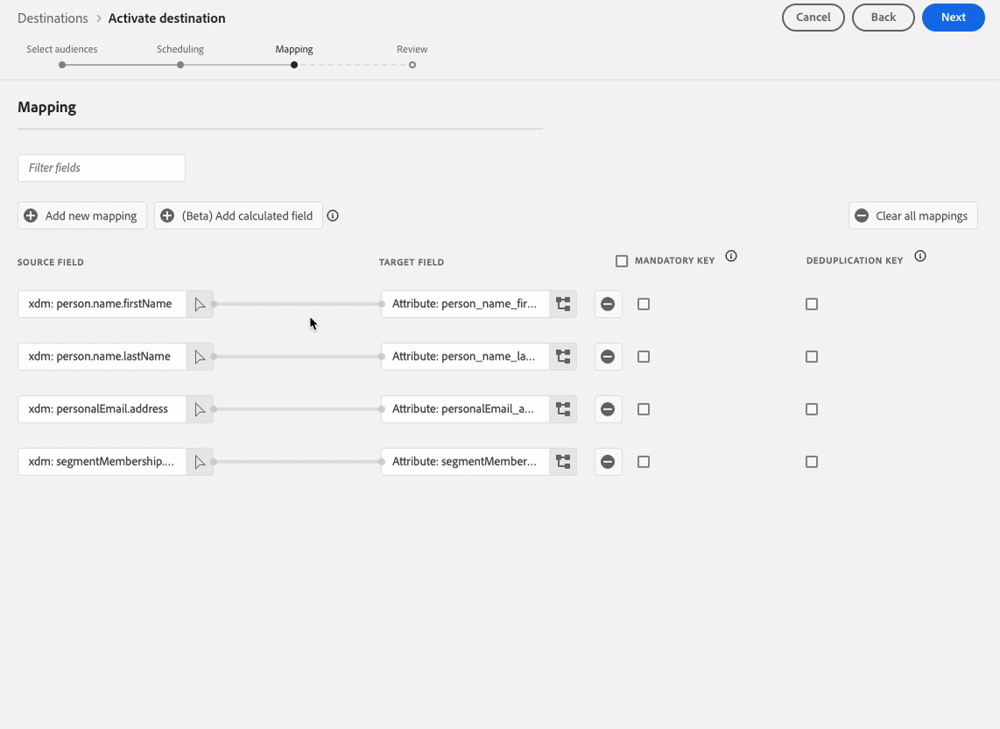
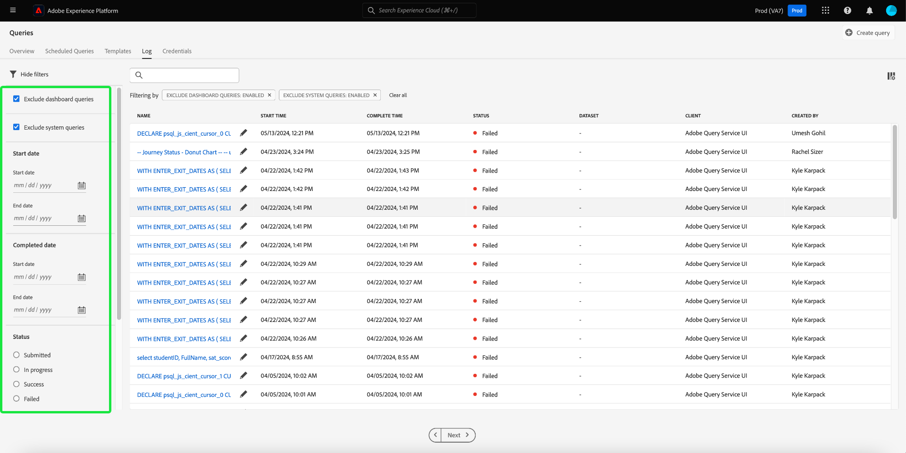

# Adobe Experience Platform リリースノート

**リリース日：2024年5月21日（PT）**

>[!TIP]
>
>[Experience PlatformAPI ドキュメント ](https://developer.adobe.com/experience-platform-apis/) がインタラクティブになりました。 ドキュメントページから直接 API エンドポイントを調べて、すぐにフィードバックを取得し、技術実装を高速化します。 新しい機能について ](#interactive-api-documentation) 詳細を参照 [。

Experience Platformの既存の機能に対するアップデート：

- [カタログサービス](#catalog-service)
- [ダッシュボード](#dashboards)
- [データガバナンス](#governance)
- [宛先](#destinations)
- [クエリサービス](#query-service)
- [セグメント化サービス](#segmentation)
- [ソース](#sources)

Adobe Experience Platformのその他のアップデート：

- [ドキュメントの更新](#documentation-updates)

## カタログサービス {#catalog-service}

カタログサービスは、Adobe Experience Platform 内のデータの場所と系列のレコードのシステムです。Experience Platformに取り込まれるすべてのデータはファイルおよびディレクトリとして Data Lake に保存されますが、カタログには、参照や監視のために、これらのファイルおよびディレクトリのメタデータと説明が保持されます。

**新機能または更新された機能**

| 機能 | 説明 |
| --- | --- |
| 一括アクション | データセットインベントリで一括アクションがサポートされるようになりました。 データ管理プロセスを合理化し、一括アクションでデータセットを効率的に管理できるようにします。 一括アクションを使用すると、多数のデータセットに対して複数のアクションを同時に実行することで時間を節約できます。  一括アクションには、[ フォルダーに移動 ](../../catalog/datasets/user-guide.md#move-to-folders)、[ タグを編集 ](../../catalog/datasets/user-guide.md#manage-tags)、[ 削除 ](../../catalog/datasets/user-guide.md#delete) データセットが含まれます。  {width="100" zoomable="yes"}   この機能について詳しくは、[ データセット UI ガイド ](../../catalog/datasets/user-guide.md#bulk-actions) を参照してください。 |

{style="table-layout:auto"}

## ダッシュボード {#dashboards}

Adobe Experience Platform では、毎日のスナップショットで得られた、組織のデータに関する重要なインサイトを確認できる複数のダッシュボードを提供しています。

**新機能または更新された機能**

| 機能 | 説明 |
| --- | --- |
| 拡張アプリレポート用のカスタマイズ可能なインサイト | SQL 分析の出力をシームレスに [ 分かりやすく使いやすいビジュアル形式に変換 ](../../dashboards/data-distiller/customizable-insights/overview.md) できます。 カスタム SQL クエリを使用すると、正確なデータ操作や、様々な構造化データセットからの動的グラフの作成を行えます。 Query pro モードを使用して、SQL で複雑な分析を実行し、カスタムダッシュボード上のグラフを通じて技術者以外のユーザーとこの分析を共有したり、CSV ファイルに書き出したりできます。 |

{style="table-layout:auto"}

## データガバナンス {#governance}

Adobe Experience Platform データガバナンスは、顧客データを管理し、データの使用に適用される規制、制限、ポリシーへの準拠を確保するために使用される一連の戦略とテクノロジーです。これは、[!DNL Experience Platform] において様々なレベルで重要な役割を果たします。例えば、カタログ作成、データ系列、データ使用のラベル付け、データアクセスポリシー、マーケティングアクションのデータに関するアクセス制御などです。

**新機能**

| 機能 | 説明 |
| --- | --- |
| HTTP API 宛先とAdobe Journey Optimizer カスタムアクションの mTLS サポート | 相互トランスポート層のセキュリティ（mTLS）プロトコルの強化されたセキュリティ対策で、顧客の信頼を構築します。 [Experience Platform HTTP API の宛先 ](../../destinations/catalog/streaming/http-destination.md#mtls-protocol-support) および [Adobe Journey Optimizerのカスタムアクションで ](https://experienceleague.adobe.com/en/docs/journey-optimizer/using/orchestrate-journeys/about-journey-building/using-custom-actions) 設定済みのエンドポイントにデータを送信する際に、mTLS プロトコルがサポートされるようになりました。 カスタムアクションや HTTP API 宛先で mTLS を有効化するための追加設定は必要ありません。このプロセスは、mTLS が有効なエンドポイントが検出された場合に自動的に実行されます。 [Adobe Journey Optimizer公開証明書をここからダウンロード ](../../landing/governance-privacy-security/encryption.md#download-certificates) できます。また、[Destinations Service 公開証明書をここからダウンロード ](../../landing/governance-privacy-security/encryption.md#download-certificates) できます。  データをサードパーティ製システムに書き出す際のネットワーク接続プロトコルについて詳しくは、[Experience Platformデータ暗号化のドキュメントを参照 ](../../landing/governance-privacy-security/encryption.md#mtls-protocol-support) してください。 |

{style="table-layout:auto"}

## 宛先 {#destinations}

[!DNL Destinations] は、Adobe Experience Platform からのデータの円滑なアクティベーションを可能にする、事前定義済みの出力先プラットフォームとの統合です。宛先を使用して、クロスチャネルマーケティングキャンペーン、メールキャンペーン、ターゲット広告、その他多くの使用事例に関する既知および不明なデータをアクティブ化できます。

**新機能または更新された機能** {#destinations-new-updated-functionality}

| 機能 | 説明 |
| ----------- | ----------- |
| バッチ宛先のマッピングフィールドの並べ替え | [ マッピングステップ ](../../destinations/ui/activate-batch-profile-destinations.md#mapping) でマッピングフィールドをドラッグ&amp;ドロップして、CSV 書き出しの列の順序を変更できるようになりました。 UI でマッピングされたフィールドの順序は、書き出された CSV ファイルの列の順序で上から下に反映されます。一番上の行は CSV ファイルの左端の列です。  {width="100" zoomable="yes"} |
| バッチ宛先のデフォルトの書き出しスケジュールがあらかじめ選択されています | Experience Platformは、各ファイル書き出しのデフォルトのスケジュールを自動的に設定するようになりました。 デフォルトのスケジュールを変更する方法については、[ オーディエンスの書き出しのスケジュール設定 ](../../destinations/ui/activate-batch-profile-destinations.md#scheduling) に関するドキュメントを参照してください。 |
| バッチ宛先の複数のオーディエンスアクティベーションスケジュールを編集 | [ 宛先の詳細ページ ](../../destinations/ui/destination-details-page.md#bulk-edit-schedule) の「アクティベーションデータ」タブから、バッチ（ファイルベース）の宛先に書き出された複数のオーディエンスのアクティベーションスケジュールを編集できるようになりました。****   {width="100" zoomable="yes"} |
| オンデマンドでの複数オーディエンスのバッチ宛先への書き出し | [ オンデマンドでのファイルの書き出し ](../../destinations/ui/export-file-now.md) 機能を使用して、複数のオーディエンスを選択してバッチ宛先に書き出すことができるようになりました。 |

{style="table-layout:auto"}

宛先の一般的な情報については、[宛先の概要](../../destinations/home.md)を参照してください。

## クエリサービス {#query-service}

クエリサービスを使用すると、標準 SQL を使用して Adobe Experience Platform [!DNL Data Lake] でデータに対してクエリを実行できます。任意のデータセットを [!DNL Data Lake] から結合し、クエリの結果を新しいデータセットとして取得することで、レポートや Data Science Workspace で使用したり、リアルタイム顧客プロファイルに取り込んだりできます。

**更新された機能**

| 機能 | 説明 |
| --- | --- |
| 従来のエディターの廃止 | 従来のエディターは非推奨（廃止予定）となり、使用できなくなりました。 その代わりに、[ クエリエディターの強化機能 ](../../query-service/ui/user-guide.md#query-authoring) を使用して、クエリの記述、検証および実行を行うことができます。 |
| クエリ実行遅延 | クエリ実行の遅延に関するアラートを設定して、計算時間を制御します。 特定の期間が経過してもクエリステータスが変化しない場合に、アラートを受け取るように選択できます。 Platform UI で目的の遅延時間を設定し、クエリの進行状況を常に把握できるようにします。 UI でこのアラートを設定する方法については、[ クエリスケジュールのドキュメント ](../../query-service/ui/query-schedules.md#alerts-for-query-status) または [ インラインクエリアクションのガイド ](../../query-service/ui/monitor-queries.md#query-run-delay) を参照してください。 |
| 効率的なクエリログインベントリ | [ 合理化されたクエリログ UI](../../query-service/ui/query-logs.md#filter-logs) により、改善されたトラブルシューティング効率とタスク監視を使用できるようになりました。 <ul><li> Platform UI は、デフォルトで「ログ」タブからすべての「システムクエリ」を除外するようになりました。 </li><li> 「システムクエリを除外 **のチェックを外して、システムクエリを表示** ます。 </li></ul>   {width="100" zoomable="yes"}   効率化されたクエリログ UI を使用すると、よりフォーカスのあるビューが表示され、関連するログをすばやく識別して分析することができます。 |
| データベースセレクター | 新しいデータベースセレクタードロップダウンメニューを使用して [Power BIまたは Tableau からCustomer Journey Analyticsデータビューに簡単にアクセス ](../../query-service/ui/credentials.md#connect-to-customer-journey-analytics) します。 Platform UI から目的のデータベースを直接選択して、BI ツールをよりシームレスに統合できるようになりました。  {width="100" zoomable="yes"}  |

{style="table-layout:auto"}

## セグメント化サービス {#segmentation}

[!DNL Segmentation Service] を使用すると、[!DNL Experience Platform] に保存されている、個人（顧客、見込み客、ユーザー、組織など）に関連するデータをオーディエンスにセグメント化できます。オーディエンスは、セグメント定義または [!DNL Real-Time Customer Profile] データの他のソースを通じて作成できます。これらのオーディエンスは [!DNL Platform] で一元的に設定および管理されており、Adobe ソリューションから簡単にアクセスできます。

**更新された機能**

| 機能 | 説明 |
| --- | --- |
| 外部で生成されたオーディエンスのインポート | 外部で生成されたオーディエンスの読み込みには、「オーディエンスを読み込み」権限が必要になりました。 権限について詳しくは、[ 権限 UI ガイド ](../../access-control/home.md#permissions) を参照してください。 |

{style="table-layout:auto"}

## ソース {#sources}

Experience Platform は、様々なデータプロバイダーのソース接続を簡単に設定できる RESTful API とインタラクティブ UI を備えています。これらのソース接続を使用すると、外部ストレージシステムおよび CRM サービスの認証と接続、取得実行時間の設定、データ取得スループットの管理を行うことができます。

Experience Platformのソースを使用すると、Adobeアプリケーションまたはサードパーティのデータソースからデータを取り込むことができます。

**新機能または更新された機能**

| 機能 | 説明 |
| --- | --- |
| [!DNL Salesforce] ソースの OAuth2 クライアント資格情報認証 | OAuth2 クライアント資格情報を使用して、Experience Platform時に [!DNL Salesforce] アカウントを認証できるようになりました。 詳しくは、[!DNL Salesforce] source [API ガイド ](../../sources/tutorials/api/create/crm/salesforce.md) および [UI ガイド ](../../sources/tutorials/ui/create/crm/salesforce.md) を参照してください。 |
| [!DNL Marketo Engage] ソースのサンプルデータフローのサポート | [!DNL Marketo Engage] ソースでサンプルデータフローがサポートされるようになりました。 サンプルデータフロー設定を有効にして取り込み率を制限してから、大量のデータを取り込まずにExperience Platform機能を試してください。 詳しくは、[UI でのデータフローの作成 ](../../sources/tutorials/ui/create/adobe-applications/marketo.md) に関するガイドを参照し  [!DNL Marketo Engage]  ください。 |
| IP アドレス許可リストの更新 | ストリーミングソースを正常に使用するには、場所に応じて、新しい IP アドレスのセットを許可リストに追加する必要があります。 新しい IP アドレスの包括的なリストについては、[IP アドレス許可リストガイド ](../../sources/ip-address-allow-list.md) を参照してください。 |

{style="table-layout:auto"}

**新規ドキュメントまたは更新されたドキュメント**

| ドキュメントの更新 | 説明 |
| --- | --- |
| [!DNL Google PubSub] のドキュメント更新 | [!DNL Google PubSub] ソースドキュメントが更新され、包括的な前提条件ガイドが追加されました。 新しい「前提条件」の節を使用して、サービスアカウントの作成方法、トピックまたは購読レベルでの権限の付与方法、[!DNL Google PubSub] ソースの使用を最適化するための設定方法を確認してください。 詳しくは、[[!DNL Google PubSub]  概要 ](../../sources/connectors/cloud-storage/google-pubsub.md) を参照してください。 |

{style="table-layout:auto"}

ソースについて詳しくは、[ ソースの概要 ](../../sources/home.md) を参照してください。

## ドキュメントの更新 {#documentation-updates}

### インタラクティブExperience PlatformAPI ドキュメント {#interactive-api-documentation}

[Experience PlatformAPI ドキュメント ](https://developer.adobe.com/experience-platform-apis/) がインタラクティブになりました。 すべての API リファレンスページに **試す** 機能が追加され、ドキュメント web サイトページで直接 API 呼び出しをテストするために使用できるようになりました。 [ 必要な認証資格情報を取得 ](/help/landing/api-authentication.md) し、機能の使用を開始して API エンドポイントを探索します。

この新しい機能を使用して、API エンドポイントへのリクエストと API エンドポイントからの応答を調べ、即座にフィードバックを取得し、技術実装を高速化します。 例えば、[ID サービス API](https://developer.adobe.com/experience-platform-apis/references/identity-service/) または [ スキーマレジストリ API](https://developer.adobe.com/experience-platform-apis/references/schema-registry/) エンドポイントにアクセスして、右側のパネルにある新しい **試す** 機能を確認します。

>[!CAUTION]
>
>ドキュメントページでインタラクティブ API 機能を使用すると、エンドポイントに対して実際の API 呼び出しを行うことになります。 実稼動用サンドボックスを使用して実験する際は、このことに注意してください。

### パーソナライズされたインサイトとエンゲージメント {#personalized-insights-engagement}

[1 回限りの値をライフタイム値に進化させる ](/help/rtcdp/use-case-guides/evolve-one-time-value-lifetime-value/evolve-one-time-value-to-lifetime-value.md) ための新しいエンドツーエンドのユースケースのドキュメントページが公開されました。 Real-Time CDPとAdobe Journey Optimizerを使用して、web プロパティへの散発的な訪問者を常連客に変換する方法については、このドキュメントを参照してください。
