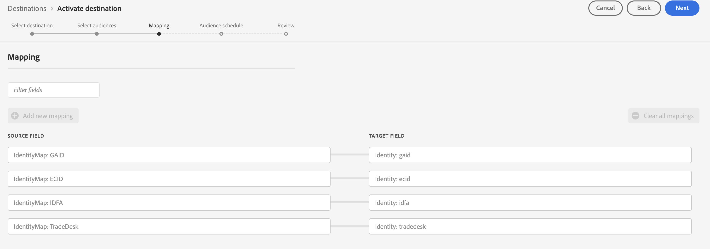
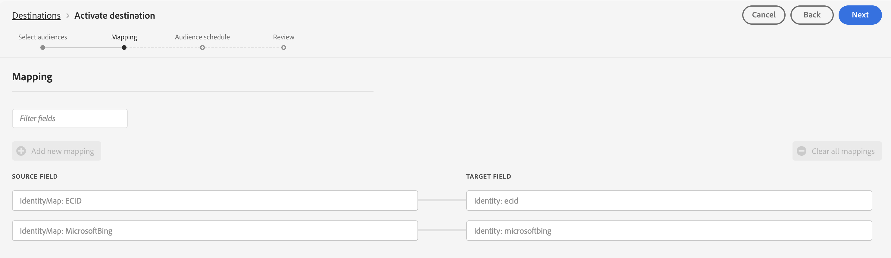

# Adobe Experience Platform リリースノート

>[!TIP]
>
>その他のAdobe Experience Platform アプリケーションのリリースノートについては、次のドキュメントを参照してください。
>
>- [Adobe Journey Optimizer](https://experienceleague.adobe.com/ja/docs/journey-optimizer/using/whats-new/release-notes)
>- [Adobe Journey Optimizer B2B](https://experienceleague.adobe.com/ja/docs/journey-optimizer-b2b/user/release-notes)
>- [Customer Journey Analytics](https://experienceleague.adobe.com/en/docs/analytics-platform/using/releases/pre-release-notes)
>- [連合オーディエンス構成](https://experienceleague.adobe.com/en/docs/federated-audience-composition/using/e-release-notes)
>- [Real-Time CDP Collaboration](https://experienceleague.adobe.com/en/docs/real-time-cdp-collaboration/using/latest)

**リリース日：2026年1月27日**

Adobe Experience Platformの既存の機能に対する新機能とアップデート：

- [Agent Orchestrator](#agent-orchestrator)
- [宛先](#destinations)
- [リアルタイム顧客プロファイル](#real-time-customer-profile)
- [セグメント化サービス](#segmentation-service)
- [ソース](#sources)

## Agent Orchestrator {#agent-orchestrator}

Agent Orchestratorを使用すると、ワークフローを自動化し、複数のチャネルをまたいで顧客とやり取りできる、AI を活用したエージェントを構築およびデプロイできます。

**新機能または更新された機能**

| 機能 | 説明 |
| --- | --- |
| Adobe Experience Platform Agents の使用制限トライアル | **一部のお客様は、Adobe Experience Platform Agents に無料で体験版アクセスできるようになりました**。 体験版を使用すると、Adobe Experience Platform Agent Orchestratorを搭載した AI Assistant インターフェイスを通じてエージェントを探索し、操作できます。 この体験版では、お客様の既存のExperience Cloud製品や環境のコンテキストで動作する AI エージェントを実際に体験できるため、チームは購入前に価値を評価できます。 Adobe Experience Platform エージェントは、ユーザー入力と監督によって導かれ、既存の製品レベルのアクセス制御を尊重します。これにより、ユーザーはアクションのみを実行し、基になるExperience Cloud アプリケーション内で権限を持つデータのみを表示できます。 開始方法について詳しくは、[Experience Platform エージェントの使用状況にバインドされた体験版の概要 &#x200B;](https://experienceleague.adobe.com/en/docs/experience-cloud-ai/experience-cloud-ai/agents/trial) を参照してください。 |

{style="table-layout:auto"}

詳しくは、[Agent Orchestrator ドキュメント &#x200B;](https://experienceleague.adobe.com/ja/docs/experience-cloud-ai/experience-cloud-ai/agents/agent-orchestrator) を参照してください。

## 宛先 {#destinations}

Experience Platformから [!DNL Destinations] データの円滑なアクティベーションを可能にする、事前定義済みの出力先プラットフォームとの統合です。 宛先を使用して、クロスチャネルマーケティングキャンペーン、メールキャンペーン、ターゲット広告、その他多くの使用事例に関する既知および不明なデータをアクティブ化できます。

**新規宛先または更新された宛先**

| 宛先 | 説明 |
| --- | --- |
| [&#x200B; ケベル宛先 &#x200B;](/help/destinations/catalog/advertising/kevel.md) コネクタが使用可能になりました | Adobe Experience Platformの [!DNL Kevel] ストリーミング先を使用すると、お客様は、Adobe オーディエンスを [!DNL Kevel] の UserDB API および Segment Management API に直接アクティブ化して、広告の意思決定時のリアルタイムターゲティングをサポートできます。 [[!DNL Kevel]](https://www.kevel.com/) は、革新的なコマースリーダーがリテールメディアでローンチ、拡大、成功するのを支援する、AI 対応のテクノロジーとエキスパートガイダンスを提供します。 [!DNL Kevel] の Retail Media Cloud は、オンサイト広告とオフサイト広告のために、ターゲットを絞った、帰属可能なカスタマイズ可能な広告フォーマットを強化します。 |
| [&#x200B; インデックス交換の宛先 &#x200B;](/help/destinations/catalog/advertising/index-exchange.md) コネクタが使用可能になりました | この宛先コネクタを使用すると、オーディエンスセグメントをAdobe Experience Platformから [!DNL Index Exchange] のプログラム広告プラットフォームに直接書き出すことができます。 [!DNL Index] は、メディア所有者が全画面にわたってコンテンツの価値を最大化するのに役立つ、グローバル広告のサプライサイドのプラットフォームです。 20 年以上にわたる業界のリーダーシップを持つ [!DNL Index] は、世界最大のブランドとプレミアムなエクスペリエンスメーカーを結び付け、高品質の消費者体験を提供します。 |
| Braze 接続の地域エンドポイントのサポート | [&#x200B; でサポートされているすべての &#x200B;](https://www.braze.com/docs/user_guide/administrative/access_braze/sdk_endpoints) 地域固有のエンドポイント [!DNL Braze] が、宛先設定フロー中に選択できるようになりました。 使用するエンドポイントインスタンスを [!DNL Braze] 担当者に問い合わせます。 |
| [Liveramp オンボーディング &#x200B;](../../destinations/catalog/advertising/liveramp-onboarding.md#scheduling) の毎週および毎月のスケジュールのサポート | Liveramp オンボーディング宛先の毎週および毎月の書き出しスケジュールを設定できるようになりました。   このリリースは徐々に展開されており、1 月 30 日までに完了する予定です。 |
| [The Trade Desk](../../destinations/catalog/advertising/tradedesk.md) と [Microsoft Bing](../../destinations/catalog/advertising/bing.md) の宛先のアクティベーションエクスペリエンスの強化 | Trade Desk とMicrosoft Bing の宛先に、最適化されたアクティベーションエクスペリエンスのための事前定義済みの必須マッピングが含まれるようになりました。    このリリースは徐々に展開されており、1 月 30 日までに完了する予定です。  {width="150" align="center" zoomable="yes"}    {width="150" align="center" zoomable="yes"} |
| [The Trade Desk - CRM](../../destinations/catalog/advertising/tradedesk-emails.md#phone-hashing) 接続の電話番号アクティベーションサポート | Trade Desk - CRM の宛先で、メールアドレスに加えて電話番号のアクティベーションがサポートされるようになりました。 CRM データに基づくオーディエンスのターゲティングおよび抑制のために、ハッシュ化されていない E.164 形式の電話番号とハッシュ化された電話番号（SHA256_E.164 形式）の両方を Trade Desk アカウントに対してアクティブ化できます。 アクティブ化する前に、電話番号を E.164 形式に正規化する必要があります。 |
| [Snowflake バッチ &#x200B;](../../destinations/catalog/warehouses/snowflake-batch.md) の宛先の更新 | Snowflake バッチ宛先に、宛先設定時の地域選択機能が含まれるようになりました。 インスタンスがプロビジョニングされる特定のSnowflake地域を選択して、最適なデータ転送と地域要件への準拠を確保できるようになりました。 さらに、デフォルトの結合ポリシー制限が削除され、任意の結合ポリシーにマッピングされたオーディエンスを書き出すことができるようになりました。   [!DNL Snowflake] バッチ宛先は、現在、Experience Platform VA7 リージョンでプロビジョニングされたReal-Time CDPのお客様のみが使用できます。 |

<!-- |AES256 encryption support for [Amazon S3](../../destinations/catalog/cloud-storage/amazon-s3.md#destination-details) destinations | You can now configure AES256 encryption for your Amazon S3 exports. Two options are available: <ul><li>**[!UICONTROL Default]**: Data will be encrypted at rest with the default encryption algorithm set on your bucket.</li><li>**[!UICONTROL SSE-S3/AES256]**: Experience Platform adds the `s3:x-amz-server-side-encryption": "AES256` header in the export and data will be encrypted at rest with the AES256 algorithm when it lands in S3. **This option takes precedence over any default encryption algorithm configured on your S3 bucket**.</li></ul> This release is being rolled out gradually and will be complete by January 30th.| -->

**新機能または更新された機能**

| 機能 | 説明 |
| --- | --- |
| [Adobe Target](../../destinations/catalog/personalization/adobe-target-connection.md) の宛先のガードレール制限を更新しました | 1 つのAdobe Targetの宛先にマッピングできるオーディエンスの最大数が 50 から 250 に増えました。 これにより、Adobe Targetが他の宛先の標準のオーディエンス制限に合わせられ、オーディエンスアクティベーションワークフローの柔軟性が向上します。 複数のデータフローを作成しなくても、Adobe Targetの宛先に対して、より多くのオーディエンスをアクティブ化できるようになりました。 |
| [&#x200B; 宛先の編集 &#x200B;](/help/destinations/ui/edit-destination.md) および [&#x200B; マーケティングアクションの編集 &#x200B;](/help/destinations/ui/edit-activation.md#edit-marketing-actions) 一般提供 | 宛先とマーケティングアクションを編集するオプションが、すべてのユーザーが使用できるようになりました。 |
| マッピングでのフィールド表示名の切り替え [&#x200B; 手順 &#x200B;](/help/destinations/ui/activate-segment-streaming-destinations.md#mapping) | スキーマフィールドを宛先にマッピングする際に、完全な XDM フィールド名の表示と表示名のみの表示を切り替えられるようになりました。   |

{style="table-layout:auto"}

詳しくは、[&#x200B; 宛先の概要 &#x200B;](../../destinations/home.md) を参照してください。

## リアルタイム顧客プロファイル {#real-time-customer-profile}

リアルタイム顧客プロファイルを使用すると、オンライン、オフライン、CRM、サードパーティデータなど、複数のチャネルのデータを組み合わせて、各顧客の全体像を確認できます。 プロファイルを使用すると、顧客データを統合ビューに統合して、顧客インタラクションごとにアクションにつながるタイムスタンプ付きアカウントを提供できます。

**新機能または更新された機能**

| 機能 | 説明 |
| --- | --- |
| [&#x200B; ストリーミング容量 &#x200B;](/help/landing/license-usage-and-guardrails/capacity.md) 適用 | Experience Platformでは、リアルタイム顧客プロファイルと ID サービスのストリーミングスループット機能を適用するようになりました。 顧客が契約したストリーミング容量を超えると、データは先入れ先出しの方法でキューに入れられ、処理されます。 これにより、予測可能なシステムパフォーマンスが確保され、容量違反によってデータ取り込みの品質に影響が及ぶのを防ぐことができます。 重要事項： <ul><li>処理能力を超えると、データレイクでアップサートのストリーミングを使用できなくなります</li><li>この適用は、Adobe Journey Optimizer ライセンスを持つお客様には適用されません</li><li>キュー内のデータは、容量が利用可能になると順番に処理されます。</li></ul> 詳しくは、[&#x200B; 処理能力の概要 &#x200B;](/help/landing/license-usage-and-guardrails/capacity.md) を参照してください。 |
| エンティティ参照の廃止 | エクスペリエンスイベントに対する Entity Lookup API の使用は、すべてのReal-Time CDP Prime ユーザーに対して非推奨（廃止予定）になりました。 この非推奨（廃止予定）は、Real-Time CDPとライセンス機能の連携に役立ちます。 この機能を使用するReal-Time CDP Ultimateのお客様は、Adobe カスタマーケアに連絡して、この機能を再度有効にしてもらうことができます。  詳しくは、[entities API ガイド &#x200B;](/help/profile/api/entities.md) を参照してください。 |
| プロファイル取り込みジョブステータスの監視 | プロファイル取り込みのバッチデータフロー実行のジョブレベルの進捗率を監視できるようになりました。 この機能は、バッチ取り込みジョブの現在の進行状況をリアルタイムで表示します。これには、取り込みが顧客のセグメント化およびAdobe Journey Optimizer検索に対応しているかどうかを示す重要なチェックポイントが含まれます。 処理に数時間かかる可能性のある大量の取り込みの場合、この進捗の透明性は、ジョブが正常に進行しているか、問題が発生しているかを理解するのに役立ち、データ処理中の不確実性を軽減します。 詳しくは、[&#x200B; プロファイルの監視ガイド &#x200B;](/help/dataflows/ui/monitor-profiles.md) を参照してください。 |
| プロファイルビューアの機能強化（GA） | プロファイルビューアに対する次の機能強化が一般公開されました。 <ul><li>**組み合わせビュー**：属性、イベント、インサイトが単一のビューに組み合わされました。</li><li>**AI で生成されたインサイト**：プロファイルの詳細ページに、AI で生成されたインサイトが表示され、プロファイルから生成された詳細を知ることができるようになりました。 これらのインサイトには、傾向スコアやトレンド分析などの情報を含めることができます。</li><li>**スタイルの更新**：プロファイルの詳細ページが視覚的に更新されました。</li><li>**参照**：検索とカスタマイズ機能を備えたインタラクティブカードベースのカルーセルを使用して、プロファイルを参照できるようになりました。</li></ul> 詳しくは、[&#x200B; プロファイルビューアガイド &#x200B;](/help/profile/ui/user-guide.md) を参照してください。 |

{style="table-layout:auto"}

詳しくは、[[!DNL Real-Time Customer Profile] 概要](../../profile/home.md)を参照してください。

## セグメント化サービス {#segmentation-service}

[!DNL Segmentation Service] は、顧客ベース内のマーケティング可能なユーザーグループを区別する基準を記述することで、プロファイルの特定のサブセットを定義します。オーディエンスは、レコードデータ（人口統計情報など）や、顧客によるブランドとのやり取りを表す時系列イベントに基づいて設定できます。

**新機能または更新された機能**

| 機能 | 説明 |
| ------- | ----------- |
| 外部オーディエンスデータの有効期限の更新 | 外部オーディエンス（CSV アップロードなど）で、データの有効期限設定に対して強制更新機能がサポートされるようになりました。 この機能を使用すると、外部オーディエンスのデータの有効期限を手動で更新でき、オーディエンスのライフサイクル管理をより詳細に制御できます。 これは、最初のデータ有効期限を超えて保持する必要があるオーディエンスや、データを再アップロードせずに再アクティブ化する必要があるオーディエンスで特に便利です。 この機能について詳しくは、[&#x200B; オーディエンスポータルの概要 &#x200B;](../../segmentation/ui/audience-portal.md#audience-summary) を参照してください。 |

詳しくは、[[!DNL Segmentation Service] 概要](../../segmentation/home.md)を参照してください。

## ソース {#sources}

Experience Platform は、様々なデータプロバイダーのソース接続を簡単に設定できる RESTful API とインタラクティブ UI を備えています。これらのソース接続を使用すると、外部ストレージシステムおよび CRM サービスの認証と接続、取得実行時間の設定、データ取得スループットの管理を行うことができます。

**新規または更新されたソース**

| ソース | 説明 |
| --- | --- |
| [[!DNL Oracle Eloqua]](/help/sources/connectors/marketing-automation/eloqua.md) V2 ソース | [!DNL Oracle Eloqua] 非推奨のコネクタ [&#x200B; に代わって、新しい &#x200B;](/help/sources/connectors/marketing-automation/oracle-eloqua.md) ソースコネクタが使用できるようになりました。 この更新されたコネクタにより、[!DNL Oracle Eloqua] からExperience Platformにデータを取り込む機能が強化され、信頼性が向上しています。 既存の接続は機能しなくなるので、既存のコネクタを使用しているお客様は、新しい実装に移行する必要があります。 新しいコネクタは、に接続してマーケティング自動化データを取り込むために必要なすべてのセットアップ [!DNL Oracle Eloqua] 設定手順をサポートしています。 |
| [[!DNL Salesforce Marketing Cloud]](/help/sources/connectors/marketing-automation/sfmc.md) V2 ソース | [!DNL Salesforce Marketing Cloud] 非推奨のコネクタ [&#x200B; に代わって、新しい &#x200B;](/help/sources/connectors/marketing-automation/salesforce-marketing-cloud.md) ソースコネクタが使用できるようになりました。 この更新されたコネクタにより、パフォーマンスが向上し、[!DNL Salesforce Marketing Cloud] からExperience Platformにデータを取り込む機能が増えました。 既存のコネクタを使用しているお客様は、新しい実装に移行する必要があります。 新しいコネクタには、[!DNL Salesforce Marketing Cloud] に接続してマーケティング自動化データを取り込むための包括的な設定手順が含まれています。 |

詳しくは、[ソースの概要](../../sources/home.md)を参照してください。

