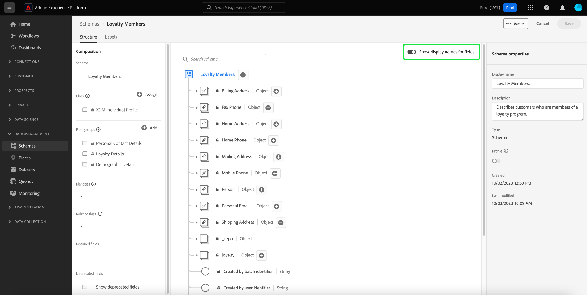

# Adobe Experience Platform リリースノート

**リリース日：2023年4月26日（PT）**

Adobe Experience Platform の既存の機能に対するアップデート：

- [ダッシュボード](#dashboards)
- [データ準備](#data-prep)
- [データ収集](#data-collection)
- [宛先](#destinations)
- [エクスペリエンスデータモデル](#xdm)
- [Real-Time Customer Data Platform](#rtcdp)
- [リアルタイム顧客プロファイル](#profile)
- [ソース](#sources)

## ダッシュボード {#dashboards}

Adobe Experience Platform では、毎日のスナップショットで得られた、組織のデータに関する重要なインサイトを確認できる複数のダッシュボードを提供しています。

**新機能または更新された機能** {#dashboards-new-updated-features}

| 機能 | 説明 |
| --- | --- |
| ユーザー定義ダッシュボード | ウィジェットのインサイトから&#x200B;**履歴データをフィルタリング**&#x200B;し、最近のデータまたはカスタム分析期間のいずれかを使用できるようになりました。詳しくは、 [ユーザー定義ダッシュボードガイド](../../dashboards/user-defined-dashboards.md#filter-historical-data) を参照してください。 また、**既存のウィジェットを複製**&#x200B;できるようになりました。複製をカスタマイズしてその属性を編集することで、新しい一意のウィジェットを作成する際に最初からやり直す必要がなくなります。詳しくは、 [ウィジェット複製ガイド](../../dashboards/user-defined-dashboards.md#duplicate-a-widget) を参照してください。 |

{style="table-layout:auto"}

アクセス権限の付与方法やカスタムウィジェットの作成方法など、ダッシュボードの詳細については、まず[ダッシュボードの概要](../../dashboards/home.md)を参照してください。

## データ準備 {#data-prep}

データ準備を使用すると、データエンジニアはエクスペリエンスデータモデル（XDM）との間でデータのマッピング、変換および検証を行うことができます。

**更新された機能**

| 機能 | 説明 |
| --- | --- |
| 非実稼動サンドボックスでの Adobe Analytics のバックフィル期間の更新 | 非実稼動サンドボックスでの Adobe Analytics のバックフィル期間が 3 か月に短縮されました。実稼動用サンドボックスのバックフィルは、13 か月で同じままです。この変更は新しいフローにのみ適用され、既存のフローには影響しません。詳しくは、[Adobe Analytics の概要](../../sources/connectors/adobe-applications/analytics.md)を参照してください。 |
| FPID 文字列を ECID に変換する新しいマッパー関数 | `fpid_to_ecid` 関数を使用すると、FPID 文字列を ECID に変換し、Experience Platform および Experience Cloud アプリケーションで使用できるようになります。詳しくは、[データ準備関数ガイド](../../data-prep/functions.md)を参照してください。 |

{style="table-layout:auto"}

データ準備について詳しくは、[データ準備の概要](../../data-prep/home.md)を参照してください。

## データ収集 {#data-collection}

Adobe Experience Platform では、クライアントサイドのカスタマーエクスペリエンスデータを収集し、Adobe Experience Platform Edge Network に送信できます。そこでデータを補強して変換し、アドビまたはアドビ以外の宛先に配信できます。

**新機能または更新された機能**

| 機能 | 説明 |
| --- | --- |
| データストリームの IP アドレスの難読化 | 部分的または完全なデータストリームレベルの IP 難読化オプションを [データストリーム設定 UI](../../edge/datastreams/configure.md).   データストリームレベルの IP 難読化の設定は、Adobe TargetおよびAudience Managerで設定された IP 難読化よりも優先されます。   Adobe Analyticsに送信されたデータは、データストリームレベルの影響を受けません [!UICONTROL IP Obfuscation（IP の不明化）] 設定。 Adobe Analyticsは現在、不明化されていない IP アドレスを受け取ります。 不明化された IP アドレスを Analytics が受け取るには、Adobe Analyticsで、個別に IP の不明化を設定する必要があります。 この動作は、今後のリリースで更新される予定です。   IP の難読化と設定方法の詳細については、 [datastream 設定ドキュメント](../../edge/datastreams/configure.md#advanced-options). |
| [データストリーム設定の上書き](../../edge/datastreams/overrides.md) | データストリームの追加の設定オプションを定義できるようになりました。これを使用して、イベントデータセット、Target プロパティトークン、ID 同期コンテナ、Analytics レポートスイートなど、特定の設定を上書きできます。   データストリーム設定の上書きは、次の 2 つの手順で行います。 <ol><li>まず、データストリーム設定の上書きを [datastream 設定ページ](../../edge/datastreams/configure.md).</li><li>次に、Web SDK コマンドを使用するか、Web SDK を使用して、オーバーライドを Edge ネットワークに送信する必要があります [タグ拡張](../../edge/extension/web-sdk-extension-configuration.md).</li></ol> |
| OAuth JWT 秘密鍵 | この [OAuth JWT 秘密鍵](https://experienceleague.adobe.com/docs/experience-platform/tags/event-forwarding/secrets.html?lang=en) では、AdobeおよびGoogleサービストークンを使用して、イベント転送でのサーバー間インタラクションをサポートできます。 |
| [!DNL Pinterest Conversions API] 拡張機能 | この [[!DNL Pinterest Conversions API]](https://experienceleague.adobe.com/docs/experience-platform/tags/extensions/server/pinterest/overview.html) イベント転送拡張機能を使用すると、Adobe Experience Platform Edge Network で取り込んだデータを活用し、 [!DNL Pinterest] を使用して、サーバー側のイベントの形式で [!DNL Pinterest Conversions API]. |

{style="table-layout:auto"}

## 宛先 {#destinations}

[!DNL Destinations] は、Adobe Experience Platform からのデータの円滑なアクティベーションを可能にする、事前定義済みの出力先プラットフォームとの統合です。宛先を使用して、クロスチャネルマーケティングキャンペーン、電子メールキャンペーン、ターゲット広告、その他多くの使用事例に関する既知および不明なデータをアクティブ化できます。

**新しい宛先** {#new-destinations}

| 宛先 | 説明 |
| ----------- | ----------- |
| [[!DNL Salesforce Marketing Cloud Account Engagement] 接続](../../destinations/catalog/email-marketing/salesforce-marketing-cloud-account-engagement.md) | SalesforceMarketing Cloudアカウントエンゲージメント（旧称 Pardot）の宛先を使用して、リードのキャプチャ、追跡、スコアリング、およびグレーディングをおこないます。 この宛先は、より長い販売サイクルと決定サイクルを必要とする複数の部門や意思決定者が関与する B2B の使用例に使用します。 |

{style="table-layout:auto"}

**新機能または更新された機能** {#destinations-new-updated-functionality}

| 機能 | 説明 |
| ----------- | ----------- |
| のデータフロー監視 [!DNL Custom Personalization] および [!DNL Adobe Commerce] 宛先 | 
 これで、 [Adobe Commerce](/help/destinations/catalog/personalization/adobe-commerce.md), [カスタムパーソナライゼーション](../../destinations/catalog/personalization/custom-personalization.md) そして [属性を含むカスタムパーソナライゼーション](../../destinations/catalog/personalization/custom-personalization.md) 接続。 
 
{width="100" zoomable="yes"}
  詳しくは、 [宛先ワークスペースでのデータフローの監視](../../dataflows/ui/monitor-destinations.md#monitor-dataflows-in-the-destinations-workspace) を参照してください。 |
| 新規 **[!UICONTROL セグメント名にセグメント ID を追加]** フィールド [!DNL Google Ad Manager] および [!DNL Google Ad Manager 360] 宛先 | 
これで、セグメント名を [[!DNL Google Ad Manager]](/help/destinations/catalog/advertising/google-ad-manager.md#parameters) および [[!DNL Google Ad Manager 360]](/help/destinations/catalog/advertising/google-ad-manager-360-connection.md#destination-details) 次のように、セグメントからExperience PlatformID を含めます。 `Segment Name (Segment ID)`.

{width="100" zoomable="yes"}
 |
| スケジュールされたオーディエンスのバックフィル | 
の [[!DNL Google Display & Video 360]](/help/destinations/catalog/advertising/google-dv360.md#specifics) 宛先に対するオーディエンスのバックフィルのアクティブ化は、セグメントが最初に宛先接続にマッピングされてから 24 ～ 48 時間後におこなわれるようにスケジュールされています。 この更新は、Googleのポリシーに応じて、データが取り込まれるまで 24 時間待ち、リアルタイム CDP との間の一致率が向上します。 [!DNL Google Display & Video 360].
 
これは、この宛先にのみ適用されるバックエンド設定で、UI のお客様が設定できるスケジュールオプションとは無関係です。
 |

{style="table-layout:auto"}

**修正および機能強化** {#destinations-fixes-and-enhancements}

- 問題を修正しました： **除外された ID** ファイルベースの宛先エクスポートのレポート指標。 お客様は、アクティブ化されたエクスポートから期待どおりに書き出されたすべての ID を受け取っていました。 ただし、 **除外された ID** UI のレポート指標で、書き出すとは思われない ID が正しくカウントされないため、除外された ID が誤って多数表示されていました。 (PLAT-149774)
- 問題を修正しました： **スケジュール** アクティベーションワークフローのステップ。 マッピング ID が必要な宛先の場合、既存の宛先接続に追加されたセグメントのマッピング ID を追加できませんでした。 (PLAT-148808)

<!--
- We have fixed an issue with the beta SFTP destination where the port number was previously hardcoded to 22. The port is now configurable for this destination. 

-->

宛先の一般的な情報については、[宛先の概要](../../destinations/home.md)を参照してください。

## エクスペリエンスデータモデル（XDM） {#xdm}

XDM は、Adobe Experience Platform に取り込むデータの共通構造および定義（スキーマ）を提供するオープンソース仕様です。XDM 標準規格に準拠しているため、すべての顧客体験データを共通の表現に反映させて、迅速かつ統合的な方法でインサイトを提供できます。顧客行動から有益なインサイトを得たり、セグメントを通じて顧客オーディエンスを定義したり、パーソナライゼーションのために顧客属性を使用したりできます。

**更新された機能**

| 機能 | 説明 |
| --- | --- |
| 表示名の切り替え | スキーマエディターでは、元のフィールド名と、さらに人間が読み取り可能な表示名との間で変更する切替スイッチを提供するようになりました。 {width="100" zoomable="yes"} この柔軟性により、フィールドの検出性とスキーマの編集性を向上できます。 標準フィールドグループの表示名はシステムで生成されますが、必要に応じて UI からカスタマイズすることもできます。詳しくは、 [表示名の切り替えドキュメント](https://experienceleague.adobe.com/docs/experience-platform/xdm/ui/resources/schemas.html#display-name-toggle) を参照してください。 |

{style="table-layout:auto"}

**新しい XDM コンポーネント**

| コンポーネントのタイプ | 名前 | 説明 |
| --- | --- | --- |
| スキーマ | [[!UICONTROL Adobe Target Classification Fields]](https://github.com/adobe/xdm/pull/1719/files) | Target のアクティビティとエクスペリエンスを分類する一連のメタデータフィールドを含む、Target 分類データセットの新しい XDM スキーマ。 |

{style="table-layout:auto"}

**更新された XDM コンポーネント**

| コンポーネントのタイプ | 名前 | 説明 |
| --- | --- | --- |
| フィールドグループ | [[!UICONTROL Adobe統合プロファイルサービスアカウント和集合拡張機能]](https://github.com/adobe/xdm/pull/1696/files) | リアルタイム顧客プロファイルのアカウント拡張フィールドグループが追加され、ユーザーがアカウント和集合でセグメントメンバーシップを追加できるようになりました。 |
| スキーマ | [[!UICONTROL 計算済み属性システムスキーマ]](https://github.com/adobe/xdm/pull/1696/files) | リアルタイム顧客プロファイルで使用される「計算済み属性」フィールドグループが、システム読み取り専用のグローバルスキーマに更新されました。 |
| フィールドグループ | 複数 | 複数のイベントを [[!UICONTROL 時系列スキーマ]](https://github.com/adobe/xdm/pull/1718/files). |
| フィールドグループ | プロファイルの忠誠度の詳細 | [タイトルを修正しました](https://github.com/adobe/xdm/pull/1717/files) 対象 `xdm:upgradeDate` を「プログラム名」から「アップグレード日」に変更しました。 |
| フィールドグループ | 複数 | 次の複数のフィールド： [[!UICONTROL 決定項目]](https://github.com/adobe/xdm/pull/1714/files) が更新され、ネストされた二重の階層が削除されました。 |

{style="table-layout:auto"}

Platform の XDM について詳しくは、[XDM システムの概要](../../xdm/home.md)を参照してください。

## Real-Time Customer Data Platform

Experience Platform上に構築、Real-time Customer Data Platform([!DNL Real-Time CDP]) は、企業が既知のデータと不明なデータを統合し、カスタマージャーニー全体を通じてインテリジェントな判定をおこなって、顧客プロファイルをアクティブ化するのに役立ちます。 [!DNL Real-Time CDP] は、複数の企業データソースを組み合わせて、リアルタイムで顧客プロファイルを作成します。 その後、これらのプロファイルから作成されたセグメントをダウンストリームの宛先に送信して、すべてのチャネルとデバイスにわたって 1 対 1 でパーソナライズされた顧客体験を提供できます。

**新機能**

| 機能 | 説明 |
| ------- | ----------- |
| Real-Time CDPホームページの強化 | この [Real-Time CDPホームページ](https://experience.adobe.com) は、見た目が更新され、パフォーマンスが向上しました。 これで、ホームページが権限に応じた状態になり、アクセス権のある機能に関連するウィジェットが表示されます。 詳しくは、 [Real-Time CDP home page dashboard の概要](../../rtcdp/home-page-dashboards.md). |
| 自己特定調査 | 自己識別サーベイは、Adobe Experience Platform UI ホームページで提供されている短いアンケートです。自己識別調査を使用して、Experience Platformの個人プロファイルを作成し、選択内容に基づいてカスタマイズされたガイドラインを受け取ります。 詳しくは、 [自己特定調査の概要](../../landing/self-identification.md). |

詳しくは、 [!DNL Real-Time CDP]を参照し、 [[!DNL Real-Time CDP] 概要](../../rtcdp/overview.md).

## リアルタイム顧客プロファイル {#profile}

Adobe Experience Platform を使用すると、顧客がいつどこからブランドとやり取りしても、顧客に合わせて調整された、一貫性と関連性のある体験を提供できます。リアルタイム顧客プロファイルでは、オンライン、オフライン、CRM、サードパーティデータなど、複数のチャネルのデータを組み合わせて、各顧客の全体像を確認できます。プロファイルを使用すると、顧客データを統合ビューに統合して、すべての顧客インタラクションの実用的なタイムスタンプ付きのアカウントを提供できます。

**更新された機能**

| 機能 | 説明 |
| ------- | ----------- |
| 偽名プロファイルデータの有効期限 | 偽名プロファイルデータの有効期限が一般に利用できるようになりました。このリリースでは、有効にすると、Experience Platform インスタンスから古い偽名プロファイルが継続的に削除されます。この機能と偽名プロファイルについて詳しくは、[偽名プロファイルデータの有効期限ガイド](../../profile/pseudonymous-profiles.md)を参照してください。 |

{style="table-layout:auto"}

## ソース {#sources}

Adobe Experience Platform では、外部ソースからデータを取り込むことができ、Platform サービスを使用してそのデータの構造化、ラベル付け、および拡張を行うことができます。アドビのアプリケーション、クラウドベースのストレージ、サードパーティのソフトウェア、CRM システムなど、様々なソースからデータを取り込むことができます。

Experience Platform は、様々なデータプロバイダーのソース接続を簡単に設定できる RESTful API とインタラクティブ UI を備えています。これらのソース接続を使用すると、外部ストレージシステムおよび CRM サービスの認証と接続、取得実行時間の設定、データ取得スループットの管理を行うことができます。

**更新された機能**

| 機能 | 説明 |
| --- | --- |
| Microsoft Dynamics、Salesforce CRM および Salesforce Marketing Cloud の行レベルデータをフィルタリングするための API サポート | 論理演算子と比較演算子を使用すると、Microsoft Dynamics、Salesforce CRM および Salesforce Marketing Cloud ソースの行レベルデータをフィルタリングできます。[API を使用したソースのデータのフィルタリング](../../sources/tutorials/api/filter.md)に関するガイドを参照してください。 |
| Shopify ストリーミングのベータ版の提供 | [Shopify ストリーミングソース](../../sources/connectors/ecommerce/shopify-streaming.md)のベータ版が利用可能になりました。Shopify ストリーミングソースを使用すると、Shopify パートナーアカウントから Experience Platform にデータをストリーミングできます。 |
| OneTrust 統合の一般提供 | [OneTrust 統合ソース](../../sources/connectors/consent-and-preferences/onetrust.md)は一般提供（GA）版になりました。OneTrust 統合ソースを使用すると、OneTrust 統合アカウントから Experience Platform に同意と環境設定のデータを取り込むことができます。 |
| Oracle Service Cloud の一般提供 | [Oracle Service Cloud ソース](../../sources/connectors/customer-success/oracle-service-cloud.md)は一般提供（GA）版になりました。Oracle Service Cloud ソースを使用すると、Oracle Service Cloud データを Experience Platform に取り込むことができます。 |

{style="table-layout:auto"}

ソースについて詳しくは、[ソースの概要](../../sources/home.md)を参照してください。