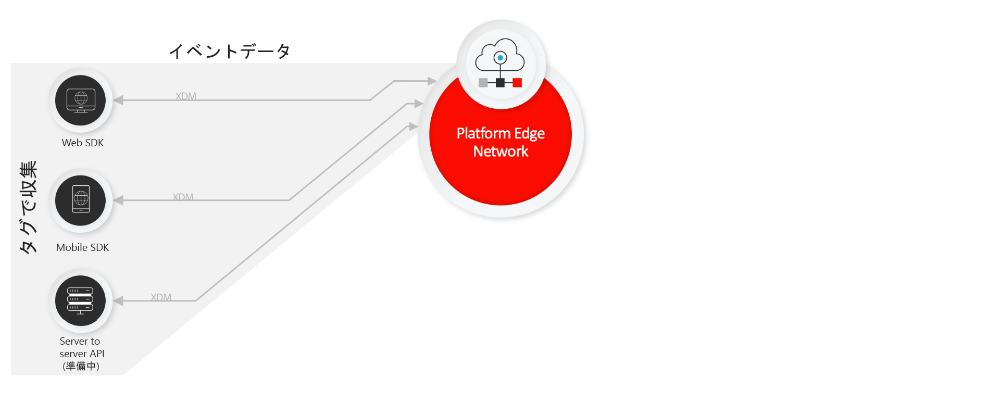
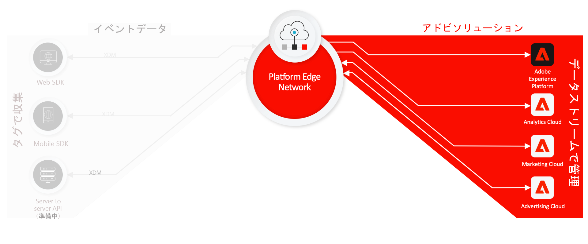
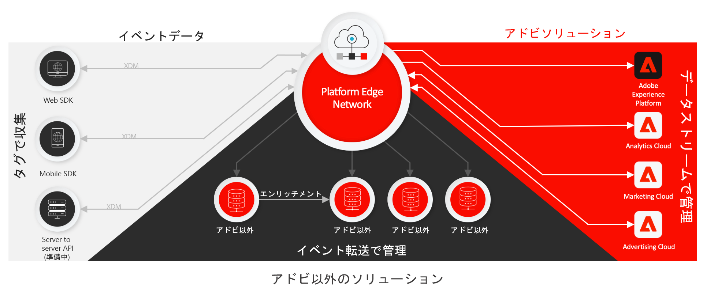

# Real-time Customer Data Platform接続の概要

Real-time Customer Data Platform(RTCDP)Connections は、クライアント側のソースから顧客体験データを収集し、Adobe Experience Platform Edge Network に送信して、AdobeやAdobe以外の宛先に数秒でエンリッチメント、変換、配布できるテクノロジーのスイートを提供します。

RTCDP 接続は、次のクライアント側ソースでサポートされています。

* Web ベースのアプリケーション
* ネイティブモバイルアプリケーション
* オーバーザトップ（OTT）アプリケーション

RTCDP 接続では、取り込んだデータセットの検出性とアクセシビリティに重点を置いて、次の項目を取り上げます。

* [Adobe Experience Platform Edge Network](https://experienceleague.adobe.com/docs/web-sdk-learn/tutorials/introduction-to-web-sdk-and-edge-network.html?lang=ja)
* [タグ](../tags/home.md)
* [データストリーム](../edge/datastreams/overview.md)
* [イベントの転送](../tags/ui/event-forwarding/overview.md)
* [Adobe Experience Platform Web SDK](../edge/home.md)
* [Adobe Experience Platform モバイル SDK](https://aep-sdks.gitbook.io/docs/)
* [Adobe Experience Platform デバッガー](https://chrome.google.com/webstore/detail/adobe-experience-platform/bfnnokhpnncpkdmbokanobigaccjkpob?hl=ja)
* [エクスペリエンスデータモデル（XDM）](../xdm/home.md)
* [Adobe Experience Platform ID サービス](../identity-service/home.md)

このガイドでは、RTCDP 接続の概要と、Platform Edge Network を通じてAdobe Experience Cloud製品およびAdobe以外のアプリケーションにデータを送信する方法について説明します。

## タグ、Web SDK および Mobile SDK

Platform Web SDK と Platform Mobile SDK には、すべてのアドビ製品ライブラリが、それぞれ web とモバイルのプラットフォーム用開発キットとしてまとめられています。 これらは、ローコードを使用するか、データ収集 UI から[タグ](../tags/home.md)を使用して実装できます。

これらのライブラリを圧縮すると、データ収集が高速化され、クライアントサイドデバイスから Platform Edge Network へという単一のストリームに複数の処理が統合されます。

## Platform Edge Network とデータストリーム {#edge}

Platform Edge Network とは、世界中に分散された信頼性の高い高速サーバーネットワークであり、データを極めて大規模に受信および処理できます。タグを使用すると、Adobe Target、Adobe Audience Manager、Adobe Analytics などの製品に対して[データストリーム](../edge/datastreams/overview.md)を設定できます。これにより、クライアントサイドのコードを変更せずに、サーバサイドでこれらの製品をアクティブ化できます。

>[!NOTE]
>
>Platform Edge Network について詳しくは、次の[インタラクティブ製品ツアー](https://adobe-ideacloud.forgedx.com/adobe-adobe-edge-collection/adobe-experience-edge/public/mx?SUID=hgb1a48ICSCpbM6MzBYHbxnsh9DgjUy1)を参照してください。

## イベント転送

[イベント転送](../tags/ui/event-forwarding/overview.md)では、任意の Experience Platform データストリームを利用できます。そのため、データの変換、エンリッチメントおよびアドビ以外の宛先への送信が可能で、しかも待ち時間は極めて短く、サードパーティのコードをクライアントデバイスに追加する必要もありません。

>[!NOTE]
>
>イベント転送は、Real-time Customer Data Platform Connections の機能の一部としてのみ含まれる有料機能です。

## 次の手順

このドキュメントでは、収集した顧客体験データをAdobe製品やサードパーティの宛先に送信するプロセスを自動化する RTCDP 接続の仕組みの概要を説明しました。

Edge ネットワークを介したイベントデータの送信に関する一般的なワークフローについて詳しくは、 [エンドツーエンドの概要](./e2e.md).
