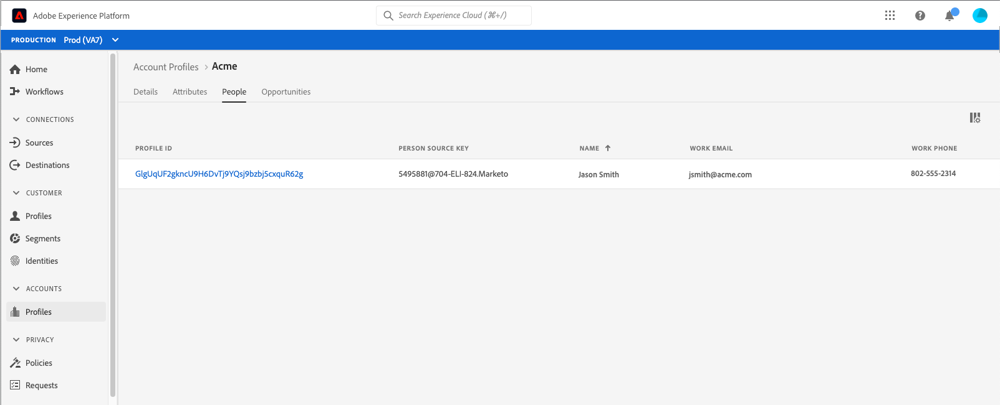

# アカウントプロファイル UI ガイド （ベータ版）

>[!IMPORTANT]
>
>Real-time Customer Data Platform B2B Edition は現在ベータ版です。 ドキュメントと機能は変更される場合があります。

>[!NOTE]
>
>アカウントプロファイルは、Real-time Customer Data Platform B2B Edition をご利用のお客様のみが利用できます。 各ライセンスタイプで使用できる機能など、Real-time CDP について詳しくは、まず[Real-time CDP の概要](../overview.md)を参照してください。

アカウントプロファイルを使用すると、複数のソースのアカウント情報を統合できます。 この統一されたアカウントビューは、多くのマーケティングチャネルや、顧客のアカウント情報を保存するために組織が現在使用している多様なシステムからのデータを統合します。このドキュメントは、Adobe Experience Platform ユーザーインターフェイス（UI）で使用できる Real-time CDP、B2B Edition 機能を使用してアカウントプロファイルを操作するためのガイドです。

## アカウントプロファイルの参照

アカウントプロファイルを参照するには、まず左のナビゲーションで「[!UICONTROL アカウント] 」の下の「**[!UICONTROL プロファイル]**」を選択します。

「**[!UICONTROL 参照]**」タブでは、接続されたエンタープライズソースのアカウント ID を使用して、またはソースの詳細を直接入力して、アカウントプロファイルを調べることができます。

### [!UICONTROL 接続されたエンタープライズソース]で参照

接続しているエンタープライズソース別にアカウントプロファイルを参照するには、「**[!UICONTROL 参照]**」ドロップダウンから「**[!UICONTROL 接続しているエンタープライズソース]**」を選択し、「**[!UICONTROL ソース]**」フィールドの横のセレクターボタンを使用して接続しているソースを選択します。

これにより、「**[!UICONTROL ソースを選択]**」ダイアログが開き、組織が確立した接続に基づいてソースを選択できます。

>[!NOTE]
>
>組織は、同じサービスプロバイダー（Marketo など）に対して複数のソースを設定することがあります。そのため、接続名、ソースシステム、およびソースシステムインスタンスを確認して、正しいソースインスタンスで検索していることを確認することが重要です。

エンタープライズソースの接続について詳しくは、[ソースの概要](../sources/sources-overview.md)を参照してください。

接続名の横のラジオボタンを選択してソースを選び、「**[!UICONTROL 選択]**」を使用して「[!UICONTROL 参照]」タブに戻ることができます。

ソースを選択した状態で、ソースに関連する&#x200B;**[!UICONTROL アカウント ID]** を入力する必要があります。例えば、Salesforce ソースを選択すると、その ID に関連付けられたアカウントプロファイルを表示するために、Salesforce インスタンスからアカウント ID を入力する必要があります。

>[!NOTE]
>
>Marketo のアカウント ID については、参照できるアカウントテーブルが 2 つあるため、正しいアカウントを確実に表示するには、特定の構文を使用する必要があります。
>
>最も一般的な標準構文は、`.mkto_org` が付加された Marketo アカウント ID です（例：`1234567.mkto_org`）。Marketo アカウントベースのマーケティングのお客様は、`.mkto_account` が付加された Marketo アカウント ID を使用して見つけることができる追加の値を持っている場合があります。使用する構文がわからない場合は、Marketo 管理者に確認してください。

### [!UICONTROL その他]で参照

Real-time CDP、B2B Edition では、表示したいアカウントの&#x200B;**[!UICONTROL ソース名]**、**[!UICONTROL ソースインスタンス]**、**[!UICONTROL アカウント ID]** を入力できるようにすることで、直接検索を実行する機能をサポートしています。ソース名とインスタンスを直接入力することで、Experience Platform が正しいアカウントプロファイルデータを検索して表示するのに必要なコンテキストを提供します。

直接検索を実行する機能は、ソースに直接データを接続できない状況下で役立ちます。例えば、組織で CRM への直接接続を妨げるデータガバナンスポリシーが設定されている場合、そのデータをクラウドストレージシステムに書き出してから、Experience Platform に取り込むことができます。

別の例として、データがシステムを離れてから Platform に入るまでの間に、データに対して変換を実行している場合があります。直接検索機能を使用して、データのコンテキストを提供できます ( 例えば、Amazon S3 バケットからのデータであるにもかかわらず、データが Marketo データであることを指定するなど )。これにより、データの検索場所と適切なレンダリング方法がわかります。

直接検索を開始するには、「**[!UICONTROL 参照方法]**」ドロップダウンから「**[!UICONTROL その他]**」を選択し、表示するアカウントの&#x200B;**[!UICONTROL ソース名]**、**[!UICONTROL ソースインスタンス]**、**[!UICONTROL アカウント ID]** を入力します。

## アカウントプロファイルの詳細の表示

「**[!UICONTROL 参照]**」タブを使用してアカウントプロファイルを検索した後、「**[!UICONTROL プロファイル ID]**」を選択すると、アカウントプロファイルの「**[!UICONTROL 詳細]**」タブが開きます。「**[!UICONTROL 詳細]**」タブに表示されるプロファイル情報は、複数のプロファイルフラグメントを結合し、個々のアカウントの単一のビューを形成したものです。これには、基本属性やソーシャルメディアデータなどのアカウントの詳細が含まれます。

表示されるデフォルトのフィールドは、組織レベルで変更して、優先アカウントプロファイル属性を表示することもできます。

>[!NOTE]
>
>同様の機能が顧客プロファイルで利用可能で、属性の追加と削除、パネルのサイズ変更などの手順が記載されたステップバイステップガイドが作成されています。詳しくは、[プロファイルの詳細カスタマイズガイド](../../profile/ui/profile-customization.md)を参照してください。

使用可能な別のタブを選択すると、アカウントに関連する追加の詳細を表示できます。これらのタブには、属性、人物、企業システム全体でそのアカウントに関連するオープンな機会とクローズされた機会を表示する機会タブが含まれます。各タブについて詳しくは、次の節を参照してください。

## 「属性」タブ

「**[!UICONTROL 属性]**」タブには、アカウントに関連するすべてのレコード情報が一覧表示されます。これには、アカウントの単一のビューを形成するために結合された複数のソースからの属性データが含まれます。

リスト内のデータを表示できることに加えて、検索バーを使用して特定の属性を検索したり、レコードデータを JSON 形式で表示したりできます。

## 「人物」タブ

「**[!UICONTROL 人物]**」タブには、アカウントに関連付けられた個々の人物のリストが表示されます。これらの人物は、組織内の様々なチームが管理する様々なエンタープライズシステムの連絡先やリードである場合がありますが、Real-time CDP B2B Edition では、単一のリストとしてまとめて表示され、アカウントの連絡先の全体像を確認できます。

>[!NOTE]
>
>「[!UICONTROL 人物]」タブには、アカウントに関連付けられた最大 25 人の人物のリストが表示されます。関連する人物が 25 人を超えるアカウントの場合、システムは 25 件のレコードのランダムサンプリングを表示します。

連絡先の情報のスナップショットを表示するほか、リストされている各ユーザーには&#x200B;**[!UICONTROL プロファイル ID]** も含まれています。これは、その個人のリアルタイム顧客プロファイルを参照できるクリック可能なリンクです。アカウントに関連する個々の顧客プロファイルの表示について詳しくは、[Real-time CDP B2B Edition でのプロファイルの参照](../profile/profile-browse.md)に関するガイドを参照してください。

## 「機会」タブ

「**[!UICONTROL 機会]**」タブには、アカウントに関連するオープンな機会およびクローズされた機会に関する情報が表示されます。これらの機会は複数のソースからExperience Platform に取り込むことができますが、Real-time CDP B2B エディションを使用すると、マーケティング担当者は、これらの機会をすべて 1 か所で簡単に確認できます。

>[!NOTE]
>
>「[!UICONTROL 機会]」タブには、アカウントに関連付けられている機会のリストが最大 25 個表示されます。関連する機会が 25 件を超えるアカウントの場合、システムは 25 件のレコードのランダムサンプリングを表示します。

各機会には、機会の名前、その金額、ステージ、機会がオープン、クローズ、成立、不成立のどれであるかなどの情報が含まれます。

