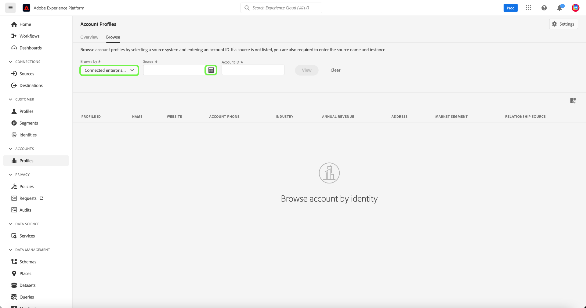

# アカウントプロファイル UI ガイド

>[!IMPORTANT]
>
>Real-time Customer Data Platform B2B Edition は現在ベータ版です。 ドキュメントと機能は変更される場合があります。

>[!NOTE]
>
>Account profiles are only available to Real-time Customer Data Platform B2B Edition customers. 各ライセンスタイプで使用できる機能など、リアルタイム CDP の詳細については、まず「[ リアルタイム CDP の概要 ](../overview.md)」を参照してください。

Account profiles enable you to unify account information from multiple sources. このアカウントの統合表示により、様々なマーケティングチャネルや、顧客アカウント情報の保存に組織が現在使用している様々なシステムのデータが統合されます。 このドキュメントでは、Adobe Experience Platformユーザーインターフェイス (UI) で使用できるリアルタイム CDP、B2B エディション機能を使用してアカウントプロファイルを操作する方法について説明します。

## アカウントプロファイルの参照

To browse account profiles, begin by selecting **[!UICONTROL Profiles]** under [!UICONTROL Accounts] in the left-navigation.

「**[!UICONTROL 参照]**」タブでは、接続されたエンタープライズソースのアカウント ID を使用して、またはソースの詳細を直接入力して、アカウントプロファイルを調べることができます。

### [!UICONTROL  接続されたエンタープライズソース ] で参照

接続されたエンタープライズソースでアカウントプロファイルを参照するには、**[!UICONTROL 「]** で参照」ドロップダウンから「**[!UICONTROL 接続されたエンタープライズソース]**」を選択し、「**[!UICONTROL ソース]**」フィールドの横のセレクターボタンを使用して接続されたソースを選択します。

**[!UICONTROL ソースを選択]** ダイアログが開き、組織が確立した接続に基づいてソースを選択できます。

>[!NOTE]
>
>同じサービスプロバイダー (Marketoなど ) に対して複数のソースが設定されている場合があるので、接続名、ソースシステム、ソースシステムの各インスタンスを確認し、正しいソースインスタンスで検索していることを確認することが重要です。

エンタープライズソースの接続について詳しくは、[ ソースの概要 ](../sources/sources-overview.md) を参照してください。

You can choose a source by selecting the radio button next to the connection name, and then use **[!UICONTROL Select]** to return to the [!UICONTROL Browse] tab.

With a source selected, you must now enter an **[!UICONTROL Account ID]** related to the source. For example, selecting a Salesforce source would require you to enter an account ID from the Salesforce instance in order to view the account profile tied to that ID.

>[!NOTE]
>
>Marketoアカウント ID には、参照可能な 2 つのアカウントテーブルがあるので、正しいアカウントを表示するために特定の構文を使用する必要があります。
>
>最も一般的な標準構文は、`.mkto_org` の後に付いたMarketoアカウント ID です（例：`1234567.mkto_org`）。 Marketo Account-Based Marketing customers may have additional values that can be found using the Marketo account ID appended by `.mkto_account`. If you are unsure of which syntax to use, please check with your Marketo administrator.

### Browse by [!UICONTROL Others]

リアルタイム CDP、B2B エディションは、表示するアカウントの **[!UICONTROL ソース名]**、**[!UICONTROL ソースインスタンス]**、**[!UICONTROL アカウント ID]** を入力でき、直接検索を実行できます。 By entering the source name and instance directly, you provide the context necessary for Experience Platform to search for, and display, the correct account profile data.

直接検索を実行する機能は、ソースからデータに直接接続できない状況で役立ちます。 For example, if your organization has data governance policies in place that prevent connecting directly to a CRM, you can export that data into a cloud storage system and then ingest it into Experience Platform.

別の例として、システムを離れて Platform に入る間に、データに対して変換を実行する場合があります。 You can use the direct lookup functionality to provide context for the data (such as specifying that it is Marketo data, despite the fact that it is coming from an Amazon S3 bucket, for example) so that the system knows where to look for, and how to properly render, the data.

直接参照を開始するには、**[!UICONTROL 「&lt;a3/で参照」ドロップダウンから「**[!UICONTROL  その他 ]**」を選択し、表示するアカウントの**[!UICONTROL  ソース名 ]**、**[!UICONTROL  ソースインスタンス ]**、**[!UICONTROL  アカウント ID ]**を入力します。]**

## アカウントプロファイルの詳細の表示

After using the **[!UICONTROL Browse]** tab to locate an account profile, selecting the **[!UICONTROL Profile ID]** opens the **[!UICONTROL Detail]** tab for the account profile. **[!UICONTROL 「詳細]**」タブに表示されるプロファイル情報は、複数のプロファイルフラグメントから結合され、個々のアカウントを単一の表示にできます。 これには、基本属性やソーシャルメディアデータなどのアカウントの詳細が含まれます。

表示されるデフォルトのフィールドは、組織レベルで変更して、優先するアカウントプロファイル属性を表示することもできます。

>[!NOTE]
>
>顧客プロファイルにも同様の機能があり、属性の追加と削除、パネルのサイズ変更などの手順を含むステップバイステップガイドが作成されました。 詳しくは、[ プロファイルの詳細カスタマイズガイド ](../../profile/ui/profile-customization.md) を参照してください。

利用可能なタブを選択すると、アカウントに関する追加の詳細を表示できます。 これらのタブには、属性、ユーザー、営業機会タブが含まれ、企業システム全体のアカウントに関連する営業機会と営業機会を示します。 各タブについて詳しくは、次の節を参照してください。

## 「属性」タブ

「**[!UICONTROL 属性]**」タブには、アカウントに関連するすべてのレコード情報が表示されます。 これには、複数のソースから得られる属性データが含まれ、結合後にアカウントの単一の表示が形成されます。

検索バーを使用して、リスト内のデータを表示できるだけでなく、特定の属性を検索したり、レコードデータを JSON 形式で表示したりできます。

## 「人」タブ

「**[!UICONTROL 人]**」タブには、アカウントに関連付けられた個々の人のリストが表示されます。 これらのユーザーは、組織内の様々なチームが管理する様々なエンタープライズシステムの連絡先やリードである場合がありますが、Real-time CDP, B2B Edition では、1 つのリストとしてまとめて表示され、アカウントの連絡先の全体像を確認できます。

>[!NOTE]
>
>The [!UICONTROL People] tab displays a list of up to 25 people associated with the account. For accounts with more than 25 associated people, the system shows a random sampling of 25 records.

In addition to showing you a snapshot of information for the contact, each person listed also includes a **[!UICONTROL Profile ID]**, which is a clickable link that allows you to explore the Real-time Customer Profile for that individual. To learn more about viewing individual customer profiles related to your accounts, please visit the guide for [browsing profiles in Real-time CDP, B2B Edition](../profile/profile-browse.md).

## 「オポチュニティ」タブ

「**[!UICONTROL Opportunity]**」タブには、アカウントに関連するオープン・オポチュニティとクローズ・オポチュニティの情報が表示されます。 These opportunities may be ingested into Experience Platform from multiple sources, however Real-time CDP, B2B Edition makes it easy for marketers to see all of these opportunities together in one place.

>[!NOTE]
>
>「[!UICONTROL Opportunity]」タブには、アカウントに関連付けられているオポチュニティのリストが最大 25 個表示されます。 関連するオポチュニティが 25 件を超えるアカウントの場合、25 件のレコードのランダムサンプリングが表示されます。

各オポチュニティには、オポチュニティの名前、その金額、ステージ、オポチュニティがオープン、クローズ、ウォン、ロストのどれであるかなどの情報が含まれます。

