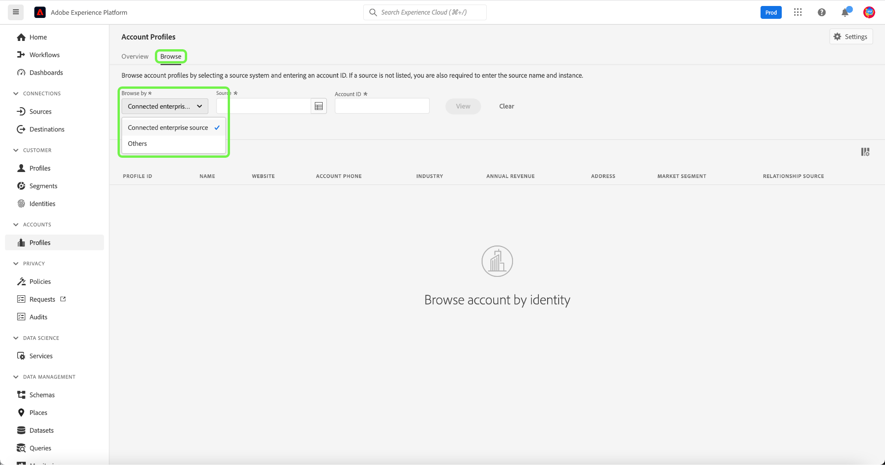
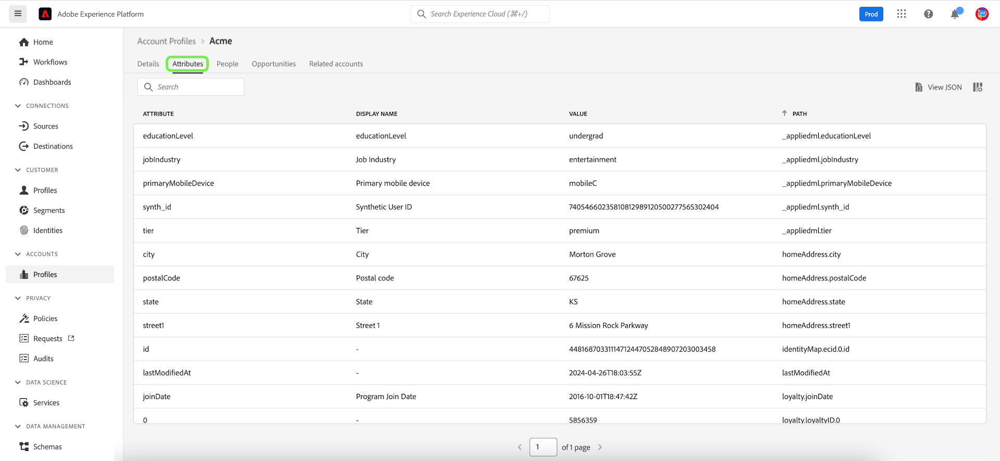

# アカウントプロファイル UI ガイド

>[!NOTE]
>
>アカウントプロファイルは、Real-time Customer Data Platform B2B Edition のお客様のみが利用できます。 各ライセンスタイプで使用できる機能など、Real-Time CDPの詳細については、まず [Real-Time CDPの概要](../overview.md).

アカウントプロファイルを使用すると、複数のソースのアカウント情報を統合できます。 この統一されたアカウントビューは、多くのマーケティングチャネルや、顧客のアカウント情報を保存するために組織が現在使用している多様なシステムからのデータを統合します。このドキュメントでは、Adobe Experience Platformユーザーインターフェイス (UI) で使用できるReal-Time CDP B2B エディション機能を使用して、アカウントプロファイルを操作する方法を説明します。

B2B ワークフローの一部としてアカウントプロファイルを作成する方法について詳しくは、[エンドツーエンドのチュートリアル](../b2b-tutorial.md)を参照してください。

## アカウントプロファイルの概要 {#account-profiles-overview}

選択 **[!UICONTROL プロファイル]** under [!UICONTROL アカウント] （左側のナビゲーション）アカウントプロファイルの概要を表示します。 以下 [!UICONTROL 概要] 」タブをクリックすると、ダッシュボードに、1 つのエントリポイントにウィジェットを表示するグラフィックまたはグラフが表示されます。

詳しくは、 [[!UICONTROL アカウントプロファイル]](../../dashboards/guides/account-profiles.md) ダッシュボードを参照してください。

## リードとアカウントの照合の設定 {#configure-lead-to-account-matching}

>[!IMPORTANT]
>
> リードとアカウントのマッチングサービスの有効化、無効化および設定を行えるのは、B2B AI 管理者だけです。 サービスを無効にすると、一致する結果は 24 時間以内に削除されます。

リードとアカウントの照合を設定するには、 **[!UICONTROL プロファイル]** under [!UICONTROL アカウント] をクリックします。 の **[!UICONTROL 概要]** タブ、選択 **[!UICONTROL 設定]** をクリックします。

この **[!UICONTROL アカウント設定]** ダイアログが開きます。 ここから、 **[!UICONTROL リード — アカウントマッチングの有効化]** 切り替えて機能を有効にします。 ドロップダウンメニューを使用して **[!UICONTROL 毎日]** の **[!UICONTROL 一致するケイデンス]** 設定。 最後に、関連する **[!UICONTROL 一致条件]** オプションの後に続く **[!UICONTROL 保存]** 設定を確認して、に戻るには、以下の手順に従います。 **[!UICONTROL アカウントプロファイル]** 画面

>[!NOTE]
>
> アドレスは、一致する唯一の条件として使用できません。 他の一致条件の 1 つ以上を選択する必要があります。

リードトゥアカウントマッチングの詳細については、 [Real-Time CDP B2B でのアカウントマッチングの概要](../../rtcdp/b2b-ai-ml-services/lead-to-account-matching.md).

## アカウントプロファイルの参照 {#browse-account-profiles}

アカウントプロファイルを参照するには、まず左のナビゲーションで「[!UICONTROL アカウント] 」の下の「**[!UICONTROL プロファイル]**」を選択します。

「**[!UICONTROL 参照]**」タブでは、接続されたエンタープライズソースのアカウント ID を使用して、またはソースの詳細を直接入力して、アカウントプロファイルを調べることができます。

### [!UICONTROL 接続されたエンタープライズソース]で参照 {#browse-by-connected-enterprise-source}

接続しているエンタープライズソース別にアカウントプロファイルを参照するには、「**[!UICONTROL 参照]**」ドロップダウンから「**[!UICONTROL 接続しているエンタープライズソース]**」を選択し、「**[!UICONTROL ソース]**」フィールドの横のセレクターボタンを使用して接続しているソースを選択します。

これにより、「**[!UICONTROL ソースを選択]**」ダイアログが開き、組織が確立した接続に基づいてソースを選択できます。

>[!NOTE]
>
>組織は、同じサービスプロバイダー（Marketo など）に対して複数のソースを設定することがあります。そのため、接続名、ソースシステム、およびソースシステムインスタンスを確認して、正しいソースインスタンスで検索していることを確認することが重要です。

エンタープライズソースの接続について詳しくは、[ソースの概要](../sources/sources-overview.md)を参照してください。

接続名の横のラジオボタンを選択してソースを選び、「**[!UICONTROL 選択]**」を使用して「[!UICONTROL 参照]」タブに戻ることができます。

ソースを選択した状態で、ソースに関連する&#x200B;**[!UICONTROL アカウント ID]** を入力する必要があります。例えば、Salesforce ソースを選択すると、その ID に関連付けられたアカウントプロファイルを表示するために、Salesforce インスタンスからアカウント ID を入力する必要があります。

>[!NOTE]
>
>Marketo のアカウント ID については、参照できるアカウントテーブルが 2 つあるため、正しいアカウントを確実に表示するには、特定の構文を使用する必要があります。
>
>最も一般的な標準構文は、`.mkto_org` が付加された Marketo アカウント ID です（例：`1234567.mkto_org`）。Marketo アカウントベースのマーケティングのお客様は、`.mkto_account` が付加された Marketo アカウント ID を使用して見つけることができる追加の値を持っている場合があります。使用する構文がわからない場合は、Marketo 管理者に確認してください。

### [!UICONTROL その他]で参照 {#browse-by-others}

Real-Time CDP, B2B Edition では、 **[!UICONTROL ソース名]**, **[!UICONTROL ソースインスタンス]**、および **[!UICONTROL アカウント ID]** 表示するアカウントに対して。 ソース名とインスタンスを直接入力することで、Experience Platform が正しいアカウントプロファイルデータを検索して表示するのに必要なコンテキストを提供します。

直接検索を実行する機能は、ソースに直接データを接続できない状況下で役立ちます。例えば、組織で CRM への直接接続を妨げるデータガバナンスポリシーが設定されている場合、そのデータをクラウドストレージシステムに書き出してから、Experience Platform に取り込むことができます。

別の例として、データがシステムを離れてから Platform に入るまでの間に、データに対して変換を実行している場合があります。直接検索機能を使用して、データのコンテキストを提供できます ( 例えば、Amazon S3 バケットからのデータであるにもかかわらず、データが Marketo データであることを指定するなど )。これにより、データの検索場所と適切なレンダリング方法がわかります。

直接検索を開始するには、「**[!UICONTROL 参照方法]**」ドロップダウンから「**[!UICONTROL その他]**」を選択し、表示するアカウントの&#x200B;**[!UICONTROL ソース名]**、**[!UICONTROL ソースインスタンス]**、**[!UICONTROL アカウント ID]** を入力します。

## アカウントプロファイルの詳細の表示 {#view-account-profile-details}

「**[!UICONTROL 参照]**」タブを使用してアカウントプロファイルを検索した後、「**[!UICONTROL プロファイル ID]**」を選択すると、アカウントプロファイルの「**[!UICONTROL 詳細]**」タブが開きます。「**[!UICONTROL 詳細]**」タブに表示されるプロファイル情報は、複数のプロファイルフラグメントを結合し、個々のアカウントの単一のビューを形成したものです。これには、基本属性やソーシャルメディアデータなどのアカウントの詳細が含まれます。

表示されるデフォルトのフィールドは、組織レベルで変更して、優先アカウントプロファイル属性を表示することもできます。

>[!NOTE]
>
>同様の機能が顧客プロファイルで利用可能で、属性の追加と削除、パネルのサイズ変更などの手順が記載されたステップバイステップガイドが作成されています。詳しくは、[プロファイルの詳細カスタマイズガイド](../../profile/ui/profile-customization.md)を参照してください。

使用可能な別のタブを選択すると、アカウントに関連する追加の詳細を表示できます。これらのタブには、属性、人物、企業システム全体でそのアカウントに関連するオープンな機会とクローズされた機会を表示する機会タブが含まれます。各タブについて詳しくは、次の節を参照してください。

## 「属性」タブ {#attributes-tab}

「**[!UICONTROL 属性]**」タブには、アカウントに関連するすべてのレコード情報が一覧表示されます。これには、アカウントの単一のビューを形成するために結合された複数のソースからの属性データが含まれます。

リスト内のデータを表示できることに加えて、検索バーを使用して特定の属性を検索したり、レコードデータを JSON 形式で表示したりできます。

## 「人物」タブ {#people-tab}

「**[!UICONTROL 人物]**」タブには、アカウントに関連付けられた個人のリストが表示されます。組織内の様々なチームが管理する様々なエンタープライズシステムの連絡先やリードですが、Real-Time CDP、B2B Edition では、1 つのリストとしてまとめて表示され、アカウントの連絡先の全体像を把握できます。

>[!NOTE]
>
>「[!UICONTROL 人物]」タブには、アカウントに関連付けられた最大 25 人の人物のリストが表示されます。関連する人物が 25 人を超えるアカウントの場合、システムは 25 件のレコードのランダムサンプリングを表示します。

連絡先の情報のスナップショットを表示するほか、リストされている各ユーザーには&#x200B;**[!UICONTROL プロファイル ID]** も含まれています。これは、その個人のリアルタイム顧客プロファイルを参照できるクリック可能なリンクです。お使いのアカウントに関連する個々の顧客プロファイルの表示について詳しくは、 [Real-Time CDP, B2B Edition でのプロファイルの参照](../profile/profile-browse.md).

## 「機会」タブ {#opportunities-tab}

「**[!UICONTROL 機会]**」タブには、アカウントに関連するオープンな機会およびクローズされた機会に関する情報が表示されます。これらのオポチュニティは複数のソースからExperience Platformに取り込むことができますが、Real-Time CDP, B2B Edition を使用すると、マーケターは、これらのオポチュニティを 1 か所でまとめて簡単に確認できます。

>[!NOTE]
>
>「[!UICONTROL 機会]」タブには、アカウントに関連付けられている機会のリストが最大 25 個表示されます。関連する機会が 25 件を超えるアカウントの場合、システムは 25 件のレコードのランダムサンプリングを表示します。

各機会には、機会の名前、その金額、ステージ、機会がオープン、クローズ、成立、不成立のどれであるかなどの情報が含まれます。

## 「関連アカウント」タブ {#related-accounts-tab}

この **[!UICONTROL 関連するアカウント]** 「 」タブには、閲覧中のアカウントに関連する他のアカウントに関する情報が表示されます。 この機能の詳細については、 [関連アカウントの概要](/help/rtcdp/b2b-ai-ml-services/related-accounts.md).

>[!NOTE]
>
>* 関連アカウントグループには、最大 30 個のアカウントプロファイルを含めることができます。 関連するアカウントプロファイルが 30 件を超える場合、それらは任意に複数のグループに分割され、それぞれのグループのメンバーは 30 人以下になります。 アカウントプロファイルの関連アカウントグループには、常にそれ自体が含まれます。
>* この [!UICONTROL 関連するアカウント] 現在、「 」タブには、参照しているアカウントに関連する最大 25 件のアカウントの一覧が表示されます。 これは、今後のアップデートで対処される予定の制限です。 この UI の制限にもかかわらず、セグメント定義で関連アカウントを使用する場合、30 件の関連アカウントプロファイルのグループに対して、すべてのプロファイルがターゲティングに使用されます。

各関連アカウントには、アカウントプロファイル ID や名前、アカウントのソースキーなどの情報のほか、ホームページ、住所、親アカウント、電話、業界、年間売上高に関する情報が含まれます。

このリスト内の関連するアカウントをセグメント化に使用できます。 参照先 [セグメント化の例](/help/rtcdp/segmentation/b2b.md#related-account) を参照してください。