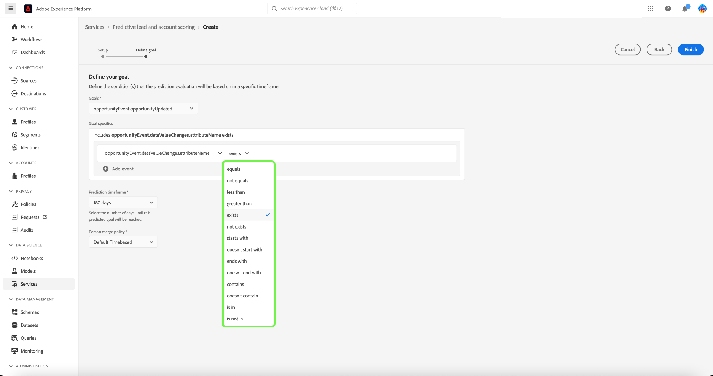
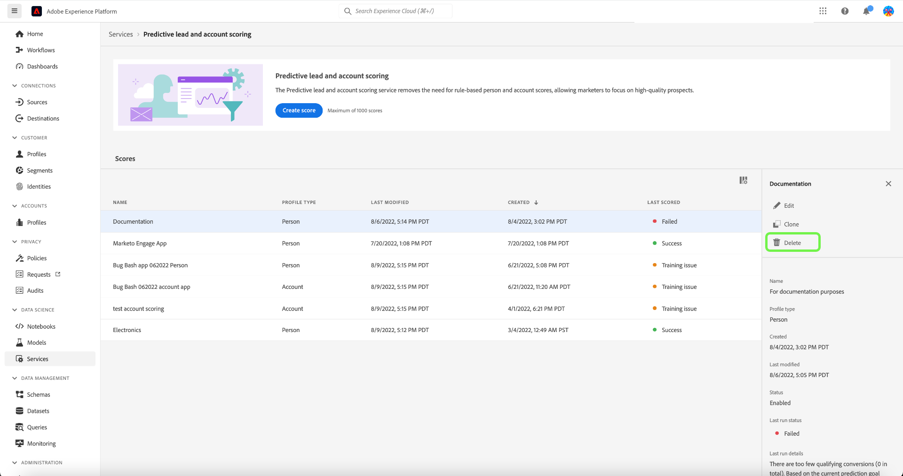

# Adobe Real-time Customer Data Platform, B2B Edition での予測リードとアカウントスコアリングの管理

>[!NOTE]
>
>B2B AI の管理権限を持つユーザーのみがスコア目標の作成、変更、削除をおこなえます。

このチュートリアルでは、予測リードおよびアカウントスコアリングサービスのスコア目標を管理する手順について説明します。 スコア目標は、担当者プロファイルまたはアカウントプロファイルのどちらに対しても設定できます

## 新しいスコアを作成

新しいスコアを作成するには、 **[!UICONTROL サービス]** サイドバーで、 **[!UICONTROL スコアを作成]**.

この **[!UICONTROL 基本情報]** 画面が表示され、プロファイルのタイプの選択、名前の入力、オプションの説明の入力を求められます。 終了したら、「**[!UICONTROL 次へ]**」を選択します。

この **[!UICONTROL 目標を定義]** 画面が表示されます。 ドロップダウン矢印を選択し、表示されるドロップダウンウィンドウから目標タイプを選択します。

この **[!UICONTROL 目標の詳細]** ダイアログが開きます。 ドロップダウン矢印を選択し、表示されるドロップダウンウィンドウから「目標フィールド名」を選択します。

この **[!UICONTROL 目標条件]** 選択が表示されます。 ドロップダウン矢印を選択し、表示されるドロップダウンウィンドウから条件を選択します。

この **[!UICONTROL 目標値]** フィールドが表示されます。 次に、 [!UICONTROL 目標の詳細]. を選択します。 [!UICONTROL フィールド値を入力] パネルを開き、目標値を入力します。

>[!NOTE]
>
>複数の目標値を追加できます。

フィールドを追加するには、「 **[!UICONTROL フィールドを追加]**.

予測期間を設定するには、ドロップダウンの矢印を選択し、目的の期間を選択します。

選択した結合ポリシーによって、人物プロファイルのフィールド値の選択方法が決まります。 ドロップダウン矢印を使用して、目的の結合ポリシーを選択し、「 」を選択します。 **[!UICONTROL 完了]**.

この **[!UICONTROL スコアリングの設定が完了しました]** 新しいスコアが作成されたことを確認するダイアログが表示されます。 「**[!UICONTROL OK]**」を選択します。

>[!NOTE]
>
> 各スコアリングプロセスが完了するまで、最大 24 時間かかる可能性があります。

次の場所に戻ります： **[!UICONTROL サービス]** タブの「スコア」リストで、新しいスコアを作成できます。

スコアを選択すると、最後の実行の詳細と追加情報が表示されます。

前回の実行の詳細で確認できるエラーコードの詳細については、 [リード AI パイプラインのエラーコード](#leads-ai-pipeline-error-codes) 」を参照してください。

## スコアの編集

スコアを編集するには、 **[!UICONTROL サービス]** 「 」タブで「 」を選択します。 **[!UICONTROL 編集]** 画面の右側にある追加の詳細パネルから。

この **[!UICONTROL インスタンスを編集]** ダイアログが表示され、スコアの説明を編集できます。 変更を加え、「 」を選択します。 **[!UICONTROL 保存]**.

>[!NOTE]
>
>スコアの設定は変更できません。これにより、モデルの再トレーニングと再トリガーが行われます。 これは、スコアを削除して新しいスコアを作成するのと同じです。 スコアの設定を編集するには、このスコアを複製するか、新しいスコアを作成する必要があります。

次の場所に戻ります： **[!UICONTROL サービス]** タブをクリックします。 スコアを選択すると、画面の右側にある追加の詳細パネルに、更新された説明の詳細が表示されます。

## スコアの複製

スコアを複製するには、 **[!UICONTROL サービス]** 「 」タブで「 」を選択します。 **[!UICONTROL 複製]** 画面の右側にある追加の詳細パネルから。

この **[!UICONTROL 基本情報]** 画面が表示されます。 プロファイルのタイプ、名前および説明が、元のスコアから複製されます。 これらの詳細を修正し、「 」を選択します。 **[!UICONTROL 次へ]**.

この **[!UICONTROL 目標を定義]** 画面が表示されます。 新しいスコアを作成する際と同様に、「目標」セクションに入力し、「 」を選択します。 **[!UICONTROL 完了]**.

次の場所に戻ります： **[!UICONTROL サービス]** タブに移動し、新しく複製されたスコアをリストに表示できます。

>[!NOTE]
>
>この **[!UICONTROL 目標を定義]** セクションは、元のスコアから複製されません。

## スコアの削除

スコアを削除するには、 **[!UICONTROL サービス]** 「 」タブで「 」を選択します。 **[!UICONTROL 削除]** 画面の右側にある追加の詳細パネルから。

この **[!UICONTROL ドキュメントの削除]** 確認ダイアログが表示されます。 「**[!UICONTROL 削除]**」を選択します。

>[!NOTE]
>
>スコアの定義を削除すると、ユーザープロファイルまたはアカウントプロファイルの予測スコアもすべて削除されますが、スコア定義用に作成されたフィールドグループは削除されません。 フィールドグループは、データモデルで「親なし」のままになります。

次の場所に戻ります： **[!UICONTROL サービス]** 」タブをクリックします。このタブには、リストにスコアが表示されなくなりました。

## リード AI パイプラインのエラーコード

| エラーコード | エラーメッセージ |
| --- | --- |
| 401 | エラー 401。 リード AI パイプラインが停止しました：アカウントスコアリングの有効なアカウントが不足しています。 アカウント数：{}。 |
| 402 | エラー 402。 リード AI パイプラインが停止しました：連絡先スコアリングに対して有効な連絡先が不足しています。 連絡先の数：{}。 |
| 403 | エラー 403。 リード AI パイプラインが停止しました：モデルトレーニングのアクティビティの量が足りません。 イベント数：{}。 |
| 404 | エラー 404。 リード AI パイプラインが停止しました：モデルトレーニングのコンバージョンが不十分です。 コンバージョン数：{}。 |
| 405 | エラー 405。 リード AI パイプラインが停止しました：有効なモデルトレーニングに対してアクティビティが少なすぎます。 アクティビティを持つアカウントの {}%のみ。 |
| 406 | エラー 406。 リード AI パイプラインが停止しました：有効なモデルトレーニングに対してアクティビティが少なすぎます。 アクティビティを持つ連絡先の {}%のみ。 |
| 407 | エラー 407。 リード AI パイプラインが停止しました：スコアリングデータのアクティビティタイプがトレーニングデータと一致しません。 |
| 408 | エラー 408。 リード AI パイプラインが停止しました：不足率はアクティビティ機能に対して高すぎます。 不足率：{}。 |
| 409 | エラー 409。 リード AI パイプラインが停止しました：テスト auc が低すぎます。 テスト auc :{}。 |
| 410 | エラー 410。 リード AI パイプラインが停止しました：パラメータの調整後、テスト auc が低すぎます。 テスト auc :{}。 |
| 411 | エラー 411。 リード AI パイプラインが停止しました：トレーニングデータには、信頼性の高いモデルを生成するのに十分なコンバージョンがありません。 コンバージョン数: {}. |
| 412 | エラー 412。 リード AI パイプラインが停止しました：AUC - ROC を計算するためのコンバージョンはテストデータに含まれません。 |

| 警告/情報コード | メッセージ |
| --- | --- |
| 100 | 情報 100。 リード AI 品質チェック：アカウント数：{}。 |
| 101 | 情報 101。 リード AI 品質チェック：連絡先の数：{}。 |
| 102 | 情報 102。 リード AI 品質チェック：オポチュニティの数：{}。 |
| 103 | 情報 103。 リード AI 品質チェック：auc のテストは低い。 パラメータの調整を開始します。 テスト auc :{}。 |
| 200 | 警告 200。 リード AI 品質チェック：ファーモグラフィック機能の欠落率は次のとおりです。{}。 |
| 201 | 警告 201。 リード AI 品質チェック：アクティビティ機能が欠落している率：{}。 |

## 次の手順

このチュートリアルに従うと、スコアを正しく作成および管理できます。 詳しくは、次のドキュメントを参照してください。

* [予測リードとアカウントスコアリング](/help/rtcdp/b2b-ai-ml-services/predictive-lead-and-account-scoring.md)
* [予測リードおよびアカウントスコアリングジョブの監視](/help/dataflows/ui/b2b/monitor-profile-enrichment.md)
