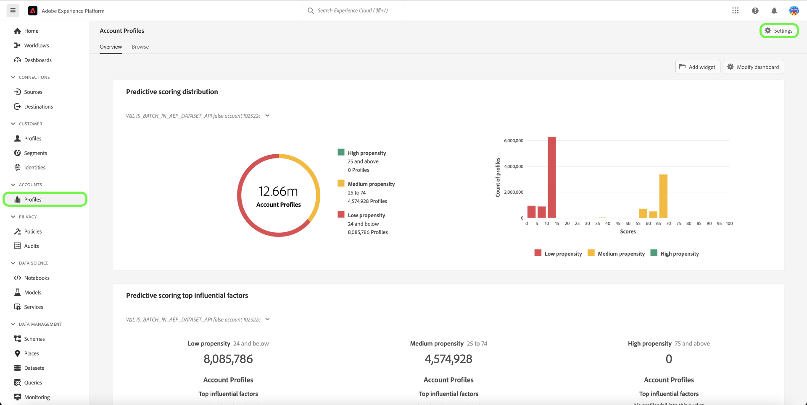
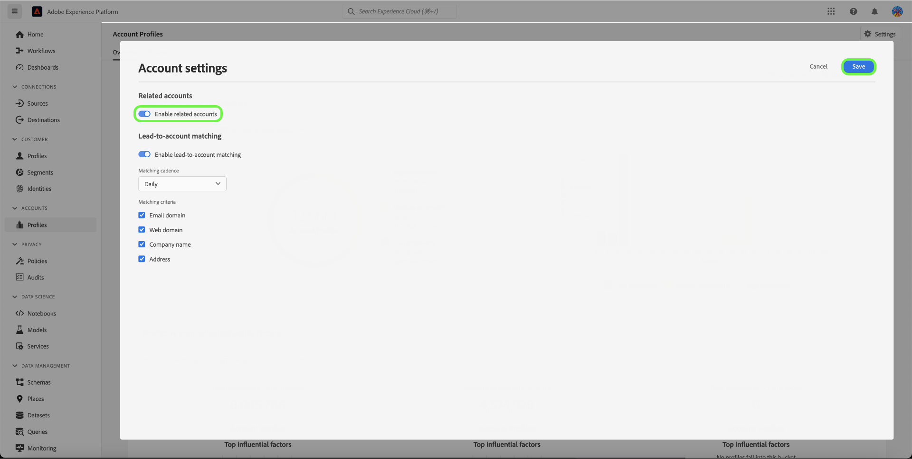

# Real-Time CDP B2B Edition の関連するアカウント

## 概要 {#overview}

B2B 企業では、多くの場合、顧客情報が複数のシステムに保存されており、それぞれのシステムには、同じ実世界のビジネスエンティティに関するデータの一部のみ、または矛盾するデータが含まれています。そのため、顧客を正確に把握することが難しく、B2B マーケティングや営業活動の効率や効果を低下させるという大きな課題を抱えています。

| ID | 名前 | Web サイト | 業界 | 都道府県 | Phone | 金額 > `$1 million` のオープン商談があります |
|---|---|---|---|---|---|---|
| 1 | アクメ | acme.com | ソフトウェア | CA | （408） 536-6000 |   |
| 2 | アクメ | acm.com | ソフトウェア | CA | 4085366000 | x |
| 3 | アクメ株式会社 |   |   | CA | （408） 5366000 |   |
| 4 | Acme コンサルティングサービス | `http://www.acme.com/consulting` | 技術コンサルティング | NY | （212） 471-0904 | x |
| 5 | IT にアクセス |   |   | CA |   |   |

{style="table-layout:auto"}

関連するアカウント [!DNL Real-Time CDP B2B] は、参照中のアカウントに類似したアカウントのリストが表示されるようになりました。

この機能を使用して、Experience Platform UI でアカウントプロファイルに関連するアカウントプロファイルを表示し、関連するアカウントをセグメント定義に含めることで、リーチを広げたり、オーディエンスにより広い条件を適用したりできます。

## 関連アカウントサービスの有効化 {#enable}

サービスを有効にするには、サイドバーで「**[!UICONTROL Profiles]**」を選択し、次に「**[!UICONTROL Settings]**」を選択します。

[!UICONTROL Enable related accounts] の横にあるトグルを選択してサービスを有効にし、「**[!UICONTROL Save]**」を選択します。

## 仕組み {#how-it-works}

毎日実行される機械学習ジョブは、階層アルゴリズムを使用して、次の 3 つの要因に基づいて類似したアカウントプロファイルをグループにクラスター化します。

* 親アカウントリンク
* Web ドメイン
* アカウント名

処理ジョブが成功すると、アカウントプロファイルグループの各メンバーには、関連するアカウント リストがタグ付けされます。 アカウントプロファイルページの **関連アカウント** タブでリストを表示し、セグメント定義で関連するアカウントを使用できます。

[ プロファイルエンリッチメント関連アカウントジョブ ](/help/dataflows/ui/b2b/monitor-profile-enrichment.md) について詳しくは、ドキュメントを参照してください。

## 関連するアカウントの表示方法 {#how-to-view}

Experience Platform UI で参照しているアカウントに関連するアカウントを表示できます。

[UI で関連アカウントを検索する方法 ](/help/rtcdp/accounts/account-profile-ui-guide.md#related-accounts-tab) について詳しくは、ドキュメントを参照してください。

## 関連するアカウントの使用方法 {#how-to-use}

セグメント化でアカウントと関連アカウントを使用できます。 セグメント定義で関連するアカウントを使用するかどうかの決定は、マーケティングユースケースによって異なります。 例えば、メールマーケティングや広告キャンペーンに関連するアカウントを使用すると、より広いリーチと引き換えに、精度を下げることができます。

関連するアカウントを使用する [ セグメント化の例 ](/help/rtcdp/segmentation/b2b.md#related-accounts) を参照してください。
