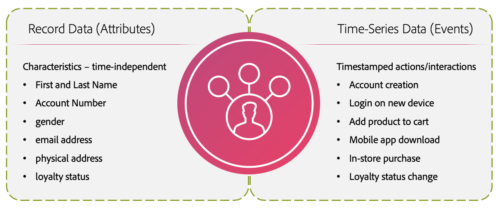
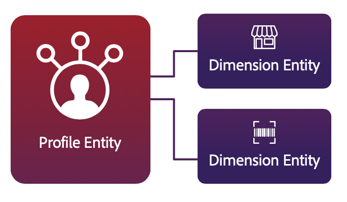

# Real-Time Customer Data Platform B2B editionのデフォルトガードレール

>[!NOTE]
>
>このドキュメントに記載されている制限は、Real-Time Customer Data Platform B2B editionによって有効になった変更を表します。 Real-Time CDP B2B editionのデフォルトの制限の詳細については、これらの制限と、リアルタイム顧客プロファイルデータのドキュメント [ ガードレール ](../profile/guardrails.md)に記載されている一般的なAdobe Experience Platformの制限を組み合わせてください。

Real-Time Customer Data Platform B2B editionなら、リアルタイムの顧客プロファイルとアカウントプロファイルを利用して、行動インサイトと顧客属性にもとづいてパーソナライズされたクロスチャネルエクスペリエンスを提供できます。 プロファイルに対するこの新しいアプローチをサポートするために、Experience Platform では、従来のリレーショナルデータモデルとは異なる、高度に非正規化されたハイブリッドデータモデルを使用します。

>[!IMPORTANT]
>
>このガードレール ページに加えて、実際の使用制限について、セールスオーダーと対応する[製品説明](https://helpx.adobe.com/jp/legal/product-descriptions.html)のライセンス使用権限を確認してください。

このドキュメントでは、最適なシステムパフォーマンスを得るためにデータをモデルリングする際に役立つ、デフォルトの使用方法とレートの上限について説明します。次のガードレールを確認する際は、データが正しくモデル化されていることが前提になっています。データのモデル化方法に関するご質問は、カスタマーサービス担当者にお問い合わせください。

>[!INFO]
>
>ほとんどのお客様は、これらのデフォルトの上限を超えることはありません。カスタムの上限について詳しくは、カスタマーケア担当者にお問い合わせください。

## 上限のタイプ

このドキュメントでは、次の 2 種類のデフォルトの上限について説明します。

| ガードレール型 | 説明 |
| -------------- | ----------- |
| **パフォーマンスガードレール （ソフト制限）** | パフォーマンスガードレールは、ユースケースの範囲に関連する使用制限です。 パフォーマンスのガードレールを超えると、パフォーマンスの低下や遅延が発生する場合があります。 Adobeはこのようなパフォーマンス低下の責任を負いません。 パフォーマンスのガードレールを常に超えているお客様は、パフォーマンスの低下を回避するために、追加の容量のライセンスを取得できます。 |
| **システムが適用するガードレール （ハード制限）** | システムによって適用されるガードレールは、Real-Time CDP UIまたはAPIによって適用されます。 UIとAPIによってブロックされたり、エラーが返されたりするため、これらの制限を超えることはできません。 |

>[!INFO]
>
>このドキュメントで概要を説明する上限は、常に改善されています。 定期的にアップデートを確認してください。カスタムの上限について知りたい場合は、カスタマーケア担当者にお問い合わせください。

## データモデルの上限

リアルタイム顧客プロファイルデータをモデル化する際には、次のガードレールが推奨されます。 プライマリエンティティとディメンションエンティティについて詳しくは、付録の[エンティティタイプ](#entity-types) に関する節を参照してください。

### プライマリエンティティのガードレール

>[!NOTE]
>
>この節で説明するデータモデルの制限は、Real-Time Customer Data Platform B2B editionで有効になっている変更を表します。 Real-Time CDP B2B editionのデフォルトの制限の詳細については、これらの制限と、リアルタイム顧客プロファイルデータのドキュメント [ ガードレール ](../profile/guardrails.md)に記載されている一般的なAdobe Experience Platformの制限を組み合わせてください。

| ガードレール | 上限 | 上限のタイプ | 説明 |
| --------- | ----- | ---------- | ----------- |
| Real-Time CDP B2B edition標準XDM クラスデータセット | 60 | パフォーマンスガードレール | Real-Time CDP B2B editionが提供する標準のExperience Data Model （XDM）クラスを活用するデータセットは、最大60個までをお勧めします。 B2B ユースケース向けの標準XDM クラスの完全なリストについては、Real-Time CDP B2B edition ドキュメント [の](schemas/b2b.md) スキーマを参照してください。   *メモ：Experience Platform の非正規化ハイブリッドデータモデルの性質上、ほとんどのお客様がこの上限を超えることはありません。データのモデル化方法やカスタムの上限について詳しくは、カスタマーケア担当者にお問い合わせください。* |
| ID グラフの個々のアカウントのID数 | 50 | パフォーマンスガードレール | 個人アカウントのID グラフのIDの最大数は50です。 50を超えるIDを持つプロファイルは、セグメント化、書き出し、参照から除外されます。 |
| 従来のマルチエンティティ関係 | 20 | パフォーマンスガードレール | プライマリエンティティとディメンションエンティティの間に定義されるマルチエンティティの関係は、最大 20 個を推奨します。既存の関係が削除されるか無効になるまで、追加の関係マッピングは行わないでください。 |
| XDM クラスあたりの多対 1 の関係 | 2 | パフォーマンスガードレール | XDM クラスあたりる最大 2 つの多対 1 の関係を定義することをお勧めします。 既存の関係が削除されるか無効になるまで、追加の関係マッピングは行わないでください。2 つのスキーマ間の関係を作成する手順については、[B2B スキーマの関係の定義](../xdm/tutorials/relationship-b2b.md)に関するチュートリアルを参照してください。 |

### ディメンションエンティティのガードレール

>[!NOTE]
>
>この節で説明するデータモデルの制限は、Real-Time Customer Data Platform B2B editionで有効になっている変更を表します。 Real-Time CDP B2B editionのデフォルトの制限の詳細については、これらの制限と、リアルタイム顧客プロファイルデータのドキュメント [ ガードレール ](../profile/guardrails.md)に記載されている一般的なAdobe Experience Platformの制限を組み合わせてください。

| ガードレール | 上限 | 上限のタイプ | 説明 |
| --------- | ----- | ---------- | ----------- |
| ネストされたレガシー関係がありません | 0 | パフォーマンスガードレール | 2 つの非 [!DNL XDM Individual Profile] スキーマ間に関係を作成しないでください。関係の作成は、**結合スキーマに含まれていない任意のスキーマに対して** not[!DNL Profile]推奨されます。 |
| 多対 1 の関係に追加できるのはB2B オブジェクトのみ | 0 | システム強制ガードレール | システムは、B2B オブジェクト間の多対 1 の関係のみをサポートします。 多対 1 の関係について詳しくは、[B2B スキーマの関係の定義](../xdm/tutorials/relationship-b2b.md)に関するチュートリアルを参照してください。 |
| B2B オブジェクト間のネストされた関係の最大深度 | 3 | システム強制ガードレール | B2B オブジェクト間でネストされた関係の最大深度は 3 です。つまり、高度にネストされたスキーマでは、B2B オブジェクト間の関係を 3 レベルをより深くネストしないでください。 |
| 各次元エンティティの単一スキーマ | 1 | システム強制ガードレール | 各ディメンションエンティティには、1つのスキーマが必要です。 複数のスキーマから作成されたディメンションエンティティを使用しようとすると、セグメント化の結果に影響を与える可能性があります。 異なるディメンションエンティティには、別々のスキーマが必要です。 |

## データサイズの上限

次のガードレールは、データサイズを参照し、意図したとおりに取り込み、保存し、クエリできるデータの推奨される上限を提供します。プライマリエンティティとディメンションエンティティについて詳しくは、付録の[エンティティタイプ](#entity-types)に関する節を参照してください。

>[!INFO]
>
>データサイズは、取り込み時に JSON で非圧縮データとして測定されます。

### プライマリエンティティのガードレール

>[!NOTE]
>
>この節で説明するデータサイズの制限は、Real-Time Customer Data Platform B2B editionで有効になっている変更を表します。 Real-Time CDP B2B editionのデフォルトの制限の詳細については、これらの制限と、リアルタイム顧客プロファイルデータのドキュメント [ ガードレール ](../profile/guardrails.md)に記載されている一般的なAdobe Experience Platformの制限を組み合わせてください。

| ガードレール | 上限 | 上限のタイプ | 説明 |
| --------- | ----- | ---------- | ----------- |
| 1 日に取り込まれるバッチ（XDM クラスあたり） | 45 | パフォーマンスガードレール | 1 日に取り込まれるバッチの合計数は、XDM クラスあたり 45 を超えないようにしてください。追加のバッチを取り込むと、最適なパフォーマンスが妨げられる場合があります。 |

### ディメンションエンティティのガードレール

>[!NOTE]
>
>この節で説明するデータサイズの制限は、Real-Time Customer Data Platform B2B editionで有効になっている変更を表します。 Real-Time CDP B2B editionのデフォルトの制限の詳細については、これらの制限と、リアルタイム顧客プロファイルデータのドキュメント [ ガードレール ](../profile/guardrails.md)に記載されている一般的なAdobe Experience Platformの制限を組み合わせてください。

| ガードレール | 上限 | 上限のタイプ | 説明 |
| --------- | ----- | ---------- | ----------- |
| すべてのディメンションエンティティの合計サイズ | 5GB | パフォーマンスガードレール | すべてのディメンションエンティティの推奨合計サイズは 5 GB です。大きなディメンションエンティティの取り込みは、システムのパフォーマンスに影響を与える可能性があります。例えば、10 GB の製品カタログをディメンションエンティティとして読み込むことはお勧めしません。 |
| ディメンショナルエンティティスキーマごとのデータセット | 5 | パフォーマンスガードレール | 各ディメンショナルエンティティスキーマに関連付けるデータセットの数は、最大で 5 個にすることをお勧めします。 例えば、「products」のスキーマを作成し、関連する 5 個のデータセットを追加する場合、products スキーマに関連付けられる 6 個目のデータセットを作成しないでください。 |
| 1 日に取り込まれるディメンションエンティティバッチ | エンティティごとに 4 個 | パフォーマンスガードレール | 1 日に取り込まれるディメンションエンティティバッチの推奨最大数は、エンティティあたり 4 個です。 例えば、製品カタログのアップデートを 1 日に最大 4 回取り込むことができます。同じエンティティに対して追加のディメンションエンティティバッチを取り込むと、システムのパフォーマンスに影響を与える可能性があります。 |

## セグメンテーションガードレール

このセクションで解説したガードレールでは、Experience Platform内で企業が構築できるオーディエンスの数と性質、およびオーディエンスと配信先のマッピングとアクティブ化について説明します。

>[!NOTE]
>
>この節で説明するセグメント化の制限は、Real-Time Customer Data Platform B2B editionで有効になっている変更点を表します。 Real-Time CDP B2B editionのデフォルトの制限の詳細については、これらの制限と、リアルタイム顧客プロファイルデータのドキュメント [ ガードレール ](../profile/guardrails.md)に記載されている一般的なAdobe Experience Platformの制限を組み合わせてください。

| ガードレール | 上限 | 上限のタイプ | 説明 |
| --------- | ----- | ---------- | ----------- |
| B2B サンドボックスごとのセグメント定義 | 400 | パフォーマンスガードレール | 組織は、個々のB2B サンドボックスに400未満のセグメント定義がある限り、合計で400を超えるセグメント定義を持つことができます。 追加のセグメント定義を作成しようとすると、システムのパフォーマンスに影響を与える可能性があります。 |

## 次の手順

このドキュメントに記載されている制限は、Real-Time Customer Data Platform B2B editionによって有効になった変更を表します。 Real-Time CDP B2B editionのデフォルトの制限の詳細については、これらの制限と、リアルタイム顧客プロファイルデータのドキュメント [ ガードレール ](../profile/guardrails.md)に記載されている一般的なAdobe Experience Platformの制限を組み合わせてください。

## 付録

このセクションでは、このドキュメントに記載の上限に関する追加の詳細を示します。

### エンティティタイプ

[!DNL Profile] ストアデータモデルは、[ プライマリエンティティ ](#primary-entity)と[ ディメンションエンティティ ](#dimension-entity)の2つのコアエンティティタイプで構成されています。

#### プライマリエンティティ

プライマリエンティティ（プロファイルエンティティ）は、データを結合して個人の「信頼できる唯一の情報源」を形成します。 この統合データは、「結合ビュー」と呼ばれるものを使用して表されます。統合ビューは、同じクラスを実装するすべてのスキーマのフィールドを、1 つの結合スキーマに集約します。[!DNL Real-Time Customer Profile] の結合スキーマは、すべてのプロファイル属性と行動イベントのコンテナとして機能する、非正規化されたハイブリッドデータモデルです。

時間に依存しない属性（「レコードデータ」とも呼ばれる）は、[!DNL XDM Individual Profile]、時系列データ（「イベントデータ」とも呼ばれる）は [!DNL XDM ExperienceEvent] を使用してモデル化されます。レコードと時系列データが Adobe Experience Platform に取り込まれると、[!DNL Real-Time Customer Profile] がトリガーされ、使用可能なデータの取り込みが開始されます。 取り込まれるインタラクションや詳細が多いほど、個人プロファイルは正確になります。

#### Dimension エンティティ

プロファイルデータを管理するプロファイルデータストアはリレーショナルストアではありませんが、Profileは、オーディエンスを簡素化して直感的な方法で作成するために、小さなディメンションエンティティとの統合を可能にします。 この統合は[ マルチエンティティ セグメンテーション ](../segmentation/tutorials/multi-entity-segmentation.md)と呼ばれます。

組織では、店舗、製品、資産など、個人以外のものを記述する XDM クラスを定義することもできます。 これらの[!DNL XDM Individual Profile]以外のスキーマは「ディメンション エンティティ」（「ルックアップエンティティ」とも呼ばれます）と呼ばれ、時系列データは含まれません。 ディメンション エンティティを表すスキーマは、[ スキーマ関係](../xdm/tutorials/relationship-ui.md)を使用してプロファイル エンティティにリンクされます。

ディメンションエンティティは、複数エンティティのセグメント定義を支援および簡素化するルックアップデータを提供します。また、セグメントエンジンが、処理の最適化（高速ポイントルックアップ）のためにデータセット全体をメモリに読み込めるようディメンションエンティティのサイズは小さくする必要があります。

