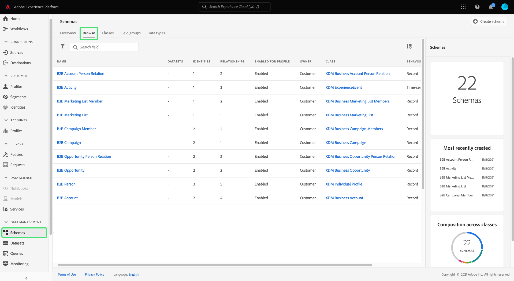

# Real-time Customer Data Platform B2B Edition の概要

このドキュメントでは、Real-time Customer Data Platform(CDP)B2B Edition を使い始めるための、主要な概念を説明する使用例を使用した、エンドツーエンドの高レベルなワークフローを示します。

テクノロジー企業である Bodea 社は、メールと LinkedIn による新製品の広告キャンペーンで効果的に顧客のターゲティングを行うために、分断された様々なたデータソースの個人データとアカウントデータを組み合わせたいと考えています。Bodea は Marketo Engage をマーケティング自動化プラットフォームとして使用しており、顧客データを含む複数の CRM から B2B 固有のオーディエンスをセグメント化する必要があります。

## はじめに

このチュートリアルワークフローは、デモンストレーションの一部として複数の Adobe Experience Platform サービスを利用しています。次のサービスを理解した上で利用することをお勧めします。

- [エクスペリエンスデータモデル（XDM）](../xdm/home.md)
- [ソース](../sources/home.md)
- [セグメント化](../segmentation/home.md)
- [宛先](../destinations/home.md)

## データのスキーマの作成

初期セットアップの一環として、Bodea の IT 部門は、Platform に取り込む際にデータが標準形式に従い、様々な Platform サービスや Adobe Experience Cloud 製品（Adobe Analytics や Adobe Target など）をまたいでそれらのデータを行動につなげられるようにする XDM スキーマを作成する必要があります。

>[!WARNING]
>
>このチュートリアル全体を通じてリンクされている関連ソースのドキュメントに記載しているように、取り込みパターンに従う必要があります。その他のフィールドマッピングメソッドは、動作を保証するものではありません。

Adobe Experience Platform を使用すると、B2B データソースに必要なスキーマと名前空間を自動的に生成できます。このツールは、作成されたスキーマが構造的に再利用可能な方法でデータを記述していることを保証します。セットアッププロセスの完全なリファレンスについては、[B2B 名前空間とスキーマ自動生成ユーティリティのドキュメント](../sources/connectors/adobe-applications/marketo/marketo-namespaces.md) に従ってください。

Adobe Experience Platform UI 内で、Bodea のマーケターは左パネルで「**[!UICONTROL スキーマ]**」を選択してから、「**[!UICONTROL 参照]**」タブを選択します。Marketo Engage 自動生成ユーティリティを使用したため、新しい空のスキーマがリストに表示され、すべてのプレフィックスが「B2B」になります。

自動生成ユーティリティは、基本的な B2B データエンティティをキャプチャする標準の XDM B2B クラス（[XDM Business Account](../xdm/classes/b2b/business-account.md) および [XDM Business Opportunity](../xdm/classes/b2b/business-opportunity.md) など）を使用して、スキーマのデータモデル構造を定義しました。さらに、これらのクラスで構築された自動生成 B2B スキーマには、高度なセグメント化のユースケース可能にする関係が事前に確立されています。データ構造に必要な追加のフィールドグループは、UI を通じてここで簡単に作成できます。詳しくは、[XDM UI ガイド、スキーマセクションへのフィールドグループの追加](../xdm/ui/resources/schemas.md#add-field-groups)を参照してください。

>[!NOTE]
> 
>自動生成ユーティリティを使用していない場合、または新しく関係を作成する必要がある場合は、[B2B スキーマ間の関係の作成](../xdm/tutorials/relationship-b2b.md)に関するチュートリアルを参照してください。

リアルタイム顧客プロファイルは、異なるソースのデータを結合して、主要な B2B エンティティの統合プロファイルを作成します。 プロファイルは単一のクラスに基づいて生成されるため、自動生成ユーティリティでは、一般的なビジネス使用例に基づいてスキーマ間の関係を設定します。その結果、Bodea のチームは B2B スキーマに基づいてデータを取り込む準備が整いました。

>[!NOTE]
> 
>自動生成ユーティリティでスキーマ用に作成されたデフォルトの ID 名前空間、プライマリキー、関係は、スキーマワークスペース内で簡単に見つけることができます。
>
>

## Experience Platform へのデータの取り込み

次に、Bodea のマーケターは、[Marketo Engage コネクタ](../sources/connectors/adobe-applications/marketo/marketo.md)を使用して、ダウンストリームサービスで使用するデータを Platform に取り込みます。また、Real-Time CDP B2B Edition 用の承認済みソースの 1 つを使用して、データを取り込むこともできます。

>[!NOTE]
> 
>組織で使用可能なソースコネクタを確認するには、Platform UI でソースカタログを表示します。 カタログにアクセスするには、左側のナビゲーションで、「**ソース**」を選択してから、「**カタログ**」を選択します。

Marketo アカウントと Platform の間の接続を作成するには、認証資格情報を取得する必要があります。詳しくは、[Marketo ソースコネクタ認証資格情報の取得に関するガイド](../sources/connectors/adobe-applications/marketo/marketo-auth.md)を参照してください。

認証資格情報を取得した後、Bodea マーケターはMarketoアカウントと Platform 組織の間に接続を作成します。 [Platform UI を使用した Marketo アカウントの接続方法](../sources/tutorials/ui/create/adobe-applications/marketo.md)については、ドキュメントを参照してください。

Marketo Engage ソースコネクタは、すべてのデータフィールドを新しく作成されたスキーマのデータフィールドにマッピングするプロセスをはるかに簡単にする自動マッピング機能を提供します。

>[!NOTE]
> 
>XDM スキーマでカスタムフィールドグループを作成した場合、プロセスのこの段階で未接続のフィールドが発生することがあります。カスタムフィールドグループに入力されているすべての値を確認してください。

Bodea のマーケターは、すべてのフィールドグループが適切にマッピングされていることを確認し、データフローを初期化してソース設定プロセスを続行します。Marketo データを取り込むデータフローを作成することで、受信データをダウンストリームの Platform サービスで使用できます。最初の取得プロセス中に、データはバッチとして Experience Platform に取り込まれます。この後、後続の取り込みデータは、ほぼリアルタイムで更新され、プロファイルにストリーミングされます。

## セグメントを作成してデータを評価

次のタスクでは、ソースデータ内の関連エンティティの特定の属性に基づいて、Bodea の新しいメールマーケティングキャンペーン向けにオーディエンスを作成します。Bodea のマーケターは、Platform UI の左側のナビゲーションで「**[!UICONTROL セグメント]**」、「**[!UICONTROL セグメントを作成]**」の順に選択します。

この例では、セグメントは、営業部門に所属し、オープンな商談が 1 つ以上あるアカウントに関連するすべての人を検索します。このセグメントでは、XDM Individual Profile クラス、XDM Business Account クラス、XDM Business Opportunity クラスの間をリンクさせる必要があります。

>[!NOTE]
> 
>データを評価するセグメントを作成する方法については、[セグメントビルダー UI ガイド](../segmentation/ui/segment-builder.md)を参照してください。B2B セグメント化の具体的な使用例については、 [Real-Time CDP B2B Edition のセグメント化の概要](./segmentation/b2b.md).

セグメントビルダーを使用すると、リアルタイム顧客プロファイルデータからマーケティング可能なオーディエンスを作成し、定義した属性、イベントおよび既存のオーディエンスの組み合わせに基づいて、見込みオーディエンスの推定を表示できます。

## 評価したデータを宛先に対してアクティブ化

セグメントが正常に作成されると、概要がワークスペースの「[!UICONTROL 詳細]」セクションに表示されます。現在、セグメントに対してアクティブ化されている宛先がないため、Bodea のマーケターは、オーディエンスをデータセットにエクスポートし、アクセスして操作できるようにする必要があります。

Platform UI の[!UICONTROL セグメント]ワークスペースから、Bodea マーケターは「**[!UICONTROL 宛先へのアクティブ化]**」を選択します。

>[!NOTE]
> 
>これを実現するための包括的な手順については、[宛先へのセグメントのアクティブ化](https://experienceleague.adobe.com/docs/marketo/using/product-docs/core-marketo-concepts/smart-lists-and-static-lists/static-lists/push-an-adobe-experience-cloud-segment-to-a-marketo-static-list.html?lang=ja)に関するチュートリアルを参照してください。

Bodea マーケターは、セグメントを Marketo の宛先に対してアクティブ化します。これにより、セグメントデータを Platform から Marketo Engage に静的リストの形式でプッシュできます。詳しくは、[Marketo の宛先](https://experienceleague.adobe.com/docs/experience-platform/destinations/catalog/adobe/marketo-engage.html?lang=ja)に関するガイドを参照してください。

## 次の手順

このチュートリアルに従うことで、Real-Time CDP B2B Edition で使用される様々なAdobe Experience Platformサービスを活用できました。 その結果、様々なチャネルをまたいで関与できる実用的なオーディエンスとして、B2B データを取得、セグメント化、評価およびエクスポートする方法を学習しました。
