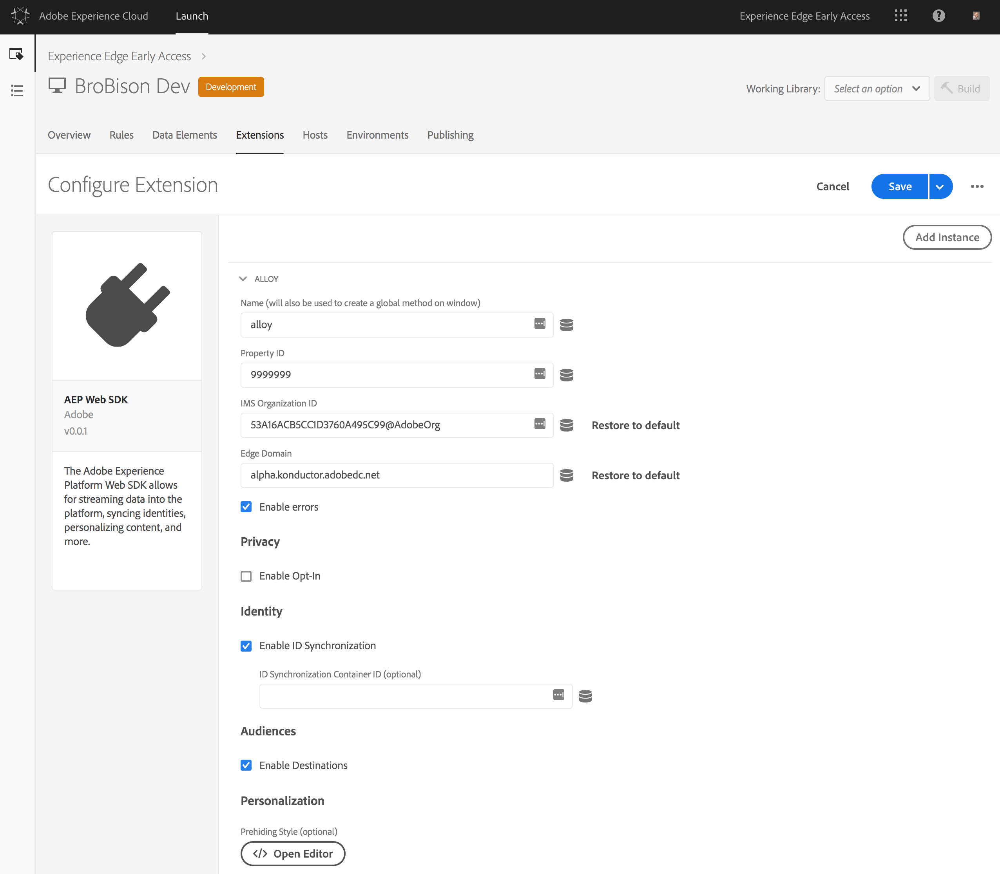

# チュートリアル：Adobe Launch を使用した Web サイトタグの実装

このチュートリアルでは、Adobe Launch を使用して Adobe Experience Platform にデータを送信する Web サイトタグを実装する方法について説明します。

## 前提条件

* The necessary schema and dataset are created in [!DNL Platform].
* The necessary configuration has been deployed in [!DNL Experience Edge] and has the matching Configuration ID and [!DNL Edge] domain.
* The company CMS has already been configured to deliver a JavaScript object on each page with the data you need to send to [!DNL Platform].

## 手順

このチュートリアルでは、次の手順を実行します。

1. Install the Adobe Experience Platform [!DNL Web SDK] extension.
1. Create a rule to tell [!DNL Launch] what data to send.
1. 拡張機能とルールをライブラリにバンドルします。

## Install the Adobe Experience Platform [!DNL Web SDK] extension

First, install the Adobe Experience Platform [!DNL Web SDK] extension.

1. In [!DNL Launch], open the **[!UICONTROL Extensions]** tab.

   

1. Select the Adobe Experience Platform Web SDK extension from the [!DNL Launch] Extension [!DNL Catalog]
The configuration screen opens.

   

   詳しくは、 ドキュメントの「[拡張機能](https://docs.adobe.com/content/help/ja-JP/launch/using/reference/manage-resources/extensions/overview.html)」を参照してください。[!DNL Launch]

1. 拡張機能を設定します。

   現在必要な設定は以下のみです。

   * **設定 ID**：Adobe 担当者から取得した設定 ID を指定します。
   * **Edge ドメイン**：Adobe 担当者から取得した Edge ドメインを指定します。

1. 「**[!UICONTROL 保存]**」をクリックし、次の手順に進みます。

## Create a rule to tell [!DNL Launch] what data to send

Next, create a rule to let [!DNL Launch] know what data you want to send to Adobe Experience Platform and when you want to send it.

1. 「**[!UICONTROL ルール]**」タブで、 ライブラリが読み込まれたときに Web サイトの新しい各ページでトリガーされるイベントを設定します。[!DNL Launch]

   

1. アクションを追加します。

   To configure the action, tell [!DNL Launch] where to find your data layer. データレイヤーは、ページ上に存在する JavaScript オブジェクトで、Web ページをレンダリングするのと同じ CMS から配信されます。データオブジェクトへの JavaScript パスを指定します。

   

   送信するデータオブジェクトは、設定 ID に接続されたデータセットが使用するスキーマに対して検証された有効な XDM である必要があります。

1. 「**[!UICONTROL 変更を保存]**」をクリックします。

詳しくは、 ドキュメントの「[ルール](https://docs.adobe.com/content/help/ja-JP/launch/using/reference/manage-resources/rules.html)」を参照してください。[!DNL Launch]

## ライブラリでの拡張機能とルールのバンドル

次に、ライブラリで新しいルールを[拡張機能とバンドル](https://docs.adobe.com/content/help/ja-JP/launch/using/reference/publish/overview.html)し、それらの変更を開発環境でテストします。

テストが完了したら、ワークフローを通じてライブラリをプロモーションし、実稼働サイトにデプロイできるようにします。これで、個々のユーザーから Adobe Experience Platform にデータが流れるようになりました。

詳しくは、 ドキュメントの「[ライブラリ](https://docs.adobe.com/content/help/ja-JP/launch/using/reference/publish/libraries.html)」を参照してください。[!DNL Launch]