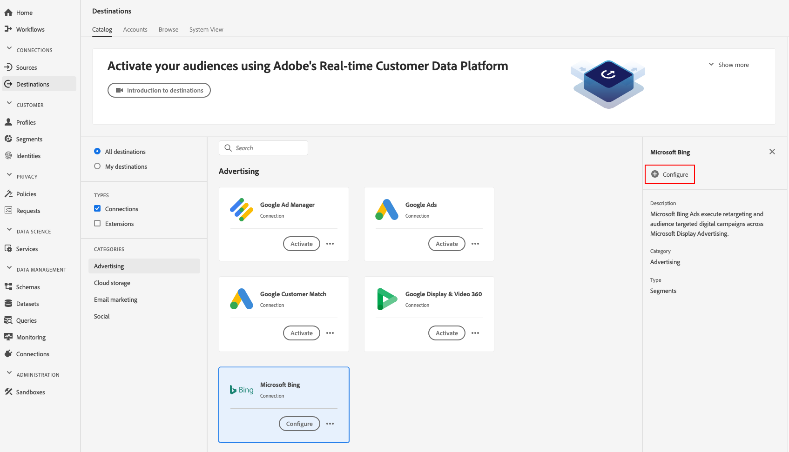

# [!DNL Microsoft Bing] destination

## 概要 {#overview}

送信先は、 [!DNL Microsoft Bing] プロファイルデータの送信先に役立ち [!DNL Microsoft Display Advertising]ます。

にプロファイルデータを送信するに [!DNL Microsoft Bing]は、まず宛先に接続する必要があります。

## 宛先の仕様 {#destination-specs}

Note the following details that are specific to the [!DNL Microsoft Bing] destination:

* You can send the following [identities](../../identity-service/namespaces.md) to [!DNL Microsoft Bing] destinations: [!DNL Microsoft ID].

## 使用例 {#use-cases}

マーケターとして、複数のチャネルにわたるディスプレイ広告を通じて、ターゲットのユーザーに組み込まれたセグメント [!DNL Microsoft Advertising IDs] を使用できるようにしたいと思い [!DNL Microsoft Advertising] ます。

## 書き出しタイプ {#export-type}

**[!DNL Segment Export]**  — セグメント(オーディエンス)のすべてのメンバーを [!DNL Microsoft Bing] 宛先にエクスポートします。

## 前提条件 {#prerequisites}

宛先を設定する際に、次の情報を入力するように求められます。

* [!UICONTROL アカウントID]:これは、整数形式 [!DNL Bing Ads CID]のユーザーのものです。

## 宛先に接続 {#connect-destination}

1. **[!UICONTROL 接続]** / **[!UICONTROL 宛先]**、を選択し、「 [!DNL Microsoft Bing]設定 ****」を選択します。

   

   >[!NOTE]
   >
   >この宛先との接続が既に存在する場合は、宛先カードに **[!UICONTROL 「アクティブ化]** 」ボタンが表示されます。 「 **[!UICONTROL アクティブ化]** 」と「 **[!UICONTROL 設定]**」の違いについて詳しくは、表示先ワークスペースのドキュメントの「 [カタログ](../destinations/destinations-workspace.md#catalog) 」セクションを参照してください。
   >
   >

1. 「 [!UICONTROL 認証] 」の手順で、宛先接続の詳細を入力する必要があります。

   * **[!UICONTROL 名前]**:この宛先が将来認識される名前。
   * **[!UICONTROL 説明]**:この宛先を将来特定するのに役立つ説明です。
   * **[!UICONTROL アカウントID]**:あなたの [!DNL Bing Ads CID]。
   * **[!UICONTROL マーケティングの使用例]**:マーケティングの使用例は、データがエクスポート先にエクスポートされる意図を示します。 Adobe定義のマーケティングの使用例から選択するか、独自のマーケティングの使用例を作成することができます。 マーケティングの使用例について詳しくは、「 [データガバナンス(Adobe Experience Platform](../privacy/data-governance-overview.md#destinations) )」ページを参照してください。 個々のAdobe定義マーケティングの使用例について詳しくは、 [データ使用ポリシーの概要を参照してください](../../data-governance/policies/overview.md#core-actions)。

   

1. 「 **[!UICONTROL 作成先]**」をクリックします。 これで宛先が作成されました。You can click [!UICONTROL Save &amp; Exit] if you want to activate segments later on, or you can click [!UICONTROL Next] to continue the workflow and select segments to activate. In either case, see the next section, [Activate Segments](#activate-segments), for the rest of the workflow.

## セグメントのアクティブ化 {#activate-segments}

セグメントのアクティベーションワークフローについて詳しくは、「[宛先へのプロファイルとセグメントのアクティブ化](activate-destinations.md#select-attributes)」を参照してください。

セグメ [ントのスケジュール](activate-destinations.md#segment-schedule) ：手順で、セグメントを宛先の対応するIDまたはフレンドリ名に手動でマップする必要があります。

セグメントをマッピングする場合は、使いやすいように、セグメント名を短くすることをお勧めします。 [!DNL Platform] ただし、宛先のセグメントIDまたは名前が、アカウントのセグメントIDまたは名前と一致している必要はありません [!DNL Platform] 。 マッピングフィールドに挿入した値は、すべて宛先に反映されます。

## 書き出されたデータ {#exported-data}

データが正常に宛先にエクスポートされたかどうかを確認するには、アカウントを確認して [!DNL Microsoft Bing] く [!DNL Microsoft Bing Ads] ださい。 アクティベーションに成功すると、オーディエンスがアカウントに入力されます。