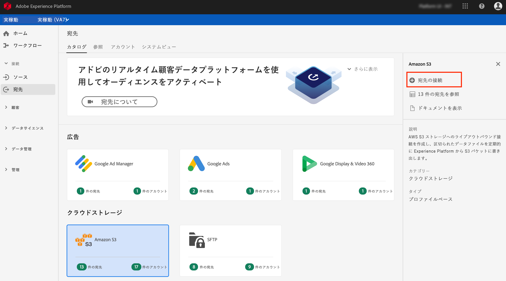
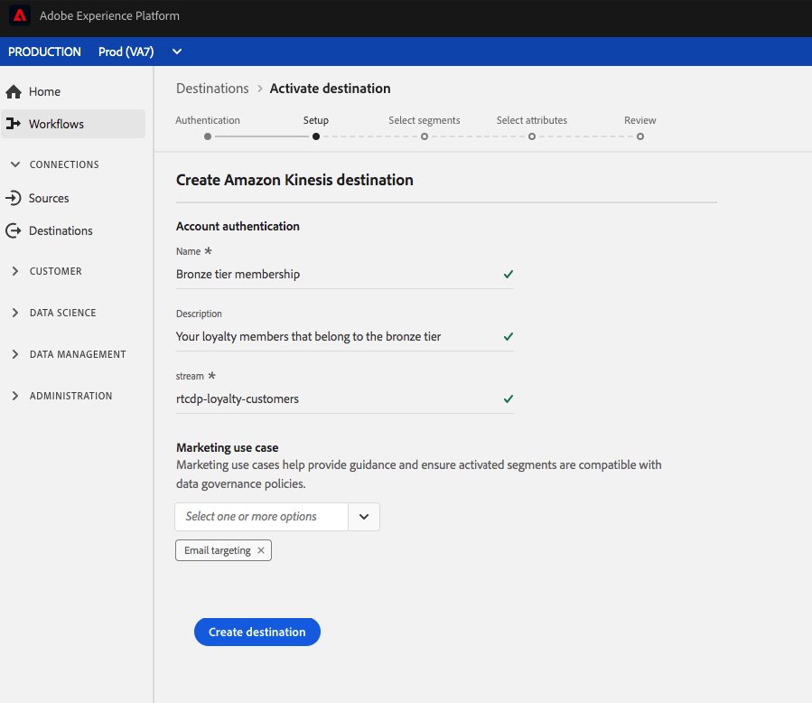

# クラウドストレージの宛先を作成するためのワークフロー

## 概要

このページでは、アドビのリアルタイム顧客データプラットフォームでクラウドストレージの場所に接続する方法について説明します。

1. **[!UICONTROL 接続]** / **[!UICONTROL 宛先]**&#x200B;で、目的のクラウドストレージの宛先を選択し、「 **[!UICONTROL 設定]**」を選択します。

   

   >[!NOTE]
   >
   >この宛先との接続が既に存在する場合は、宛先カードに **[!UICONTROL 「アクティブ化]** 」ボタンが表示されます。 「 **[!UICONTROL アクティブ化]** 」と「 **[!UICONTROL 設定]**」の違いについて詳しくは、表示先ワークスペースのドキュメントの「 [カタログ](/help/rtcdp/destinations/destinations-workspace.md#catalog) 」セクションを参照してください。

2. クラウドストレージの宛先への接続を既に設定している場合は、**[!UICONTROL 認証]**&#x200B;手順で「**[!UICONTROL 既存のアカウント]**」を選択し、既存の接続を選択します。または、「**[!UICONTROL 新しいアカウント]**」を選択して、クラウドストレージの宛先への新しい接続を設定できます。アカウント認証資格情報を入力し、「**[!UICONTROL 宛先に接続]**」を選択します。  認証手順の秘密鍵証明書の入力について詳しくは、 [AmazonS3](/help/rtcdp/destinations/amazon-s3-destination.md) 宛先、宛先、 [[!DNL Amazon Kinesis]](/help/rtcdp/destinations/amazon-kinesis-destination.md) 宛先、 [[!DNL Azure Event Hubs]](/help/rtcdp/destinations/azure-event-hubs-destination.md) SFTP [宛先を参照して](/help/rtcdp/destinations/sftp-destination.md)**** ください。

   >[!NOTE]
   >
   >アドビのリアルタイム CDP は、認証プロセスでの資格情報の検証をサポートし、クラウドのストレージの場所に誤った資格情報が入力されるとエラーメッセージを表示します。これにより、間違った資格情報を使用してワークフローを完了できなくします。

   

3. 「**[!UICONTROL 設定]**」手順で、アクティベーションフローの「**[!UICONTROL 名前]**」と「**[!UICONTROL 説明]**」を入力します。 
また、この手順では、この宛先に適用する **[!UICONTROL マーケティングの使用例]** を選択できます。 マーケティングの使用例は、データがエクスポート先にエクスポートされる意図を示します。 Adobe定義のマーケティングの使用例から選択するか、独自のマーケティングの使用例を作成することができます。 マーケティングの使用例の詳細については、Real-time CDP [（リアルタイムCDP）ページの「](/help/rtcdp/privacy/data-governance-overview.md#destinations) Data Governance（データ・ガバナンス）」を参照してください。 個々のAdobe定義マーケティングの使用例について詳しくは、 [データ使用ポリシーの概要を参照してください](/help/data-governance/policies/overview.md#core-actions)。  
Amazon S3 の宛先の場合は、ファイルが配信されるクラウドストレージの宛先に「**[!UICONTROL バケット名]**」と「**[!UICONTROL フォルダーパス]**」を挿入します。上記のフィールドに入力した後、「**[!UICONTROL 宛先を作成]**」を選択します。

   

   SFTP の宛先の場合は、ファイルが配信される「**[!UICONTROL フォルダーパス]**」を挿入します。上記のフィールドに入力した後、「**[!UICONTROL 宛先を作成]**」を選択します。

   

   宛先の場合は、ア [!DNL Amazon Kinesis] カウント内の既存のデータストリームの名前を指定し [!DNL Amazon Kinesis] ます。 AdobeReal-time CDPは、このストリームにデータをエクスポートします。 上記のフィールドに入力した後、「**[!UICONTROL 宛先を作成]**」を選択します。

   

   宛先の場合は、ア [!DNL Azure Event Hubs] カウント内の既存のデータストリームの名前を指定し [!DNL Amazon Kinesis] ます。 AdobeReal-time CDPは、このストリームにデータをエクスポートします。 上記のフィールドに入力した後、「**[!UICONTROL 宛先を作成]**」を選択します。

   

4. これで宛先が作成されました。後でセグメントをアクティブにする場合は、「**[!UICONTROL 保存して終了]**」を選択します。また、「**[!UICONTROL 次へ]**」を選択してワークフローを続行し、アクティブ化するセグメントを選択することもできます。いずれの場合も、データをエクスポートする残りのワークフローについては、次の「[セグメントのアクティブ化](#activate-segments)」の節を参照してください。

## セグメントのアクティブ化 {#activate-segments}

セグメントのアクティベーションワークフローについて詳しくは、「[宛先へのプロファイルとセグメントのアクティブ化](/help/rtcdp/destinations/activate-destinations.md)」を参照してください。