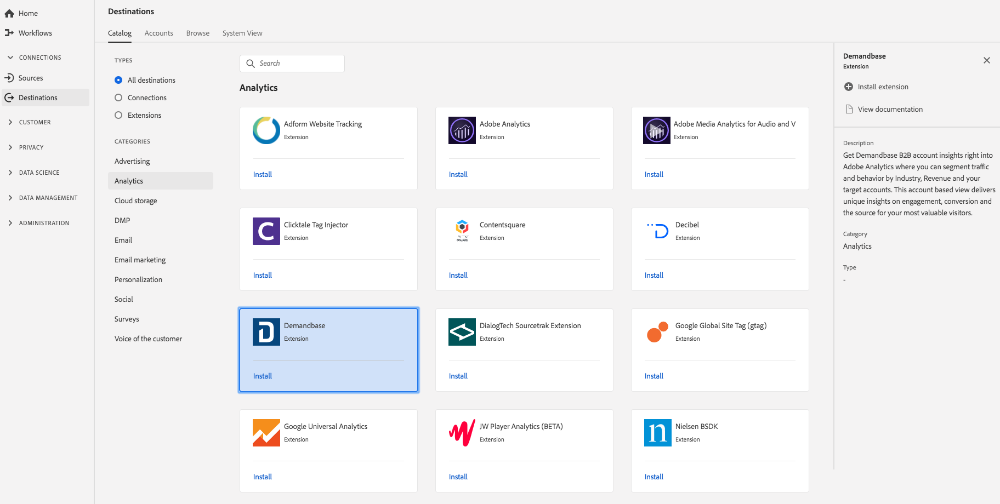

# [!DNL Demandbase] 拡張機能 {#demandbase-extension}

## 概要 {#overview}

B2BアカウントのインサイトをアドビのAnalyticsで入手し、業界、売上高、およびターゲットアカウント別にトラフィックと行動をセグメント化できます。 [!DNL Demandbase] このアカウントベースの表示は、最も価値ある訪問者の関与、コンバージョン、ソースに関する独自のインサイトを提供します。

[!DNL Demandbase] は、アドビのリアルタイム顧客データPlatformのanalytics拡張です。 拡張機能の詳細については、 [Adobe Exchangeの拡張機能ページを参照してください](https://exchange.adobe.com/experiencecloud.details.101605.html)。

この宛先はExperience Platform Launchの拡張です。 Adobe Real-time CDPでのLaunch拡張機能の動作について詳しくは、 [Experience Platform Launch拡張機能の概要を参照してください](/help/rtcdp/destinations/experience-platform-launch-extensions.md)。

## 前提条件 {#prerequisites}

この拡張機能は、アドビのリアルタイムCDPを購入したすべてのお客様のDestinationsカタログで利用できます。

この拡張機能を使用するには、Experience Platform Launchにアクセスする必要があります。 Adobe Experience Cloudのお客様には、付加価値機能としてExperience Platform Launchが提供されます。 Launchへのアクセス権を取得するには、組織管理者に連絡して、拡張機能をインストールできるように **[!UICONTROL manage_properties]** 権限を付与するように依頼します。

## 拡張機能のインストール {#install-extension}

拡張機能をインストールするに [!DNL Demandbase] は：

1. [Adobe Real-time CDPインターフェイスで](http://platform.adobe.com/)、 **[!UICONTROL Destinations/Catalogに移動します]**。
2. カタログから拡張子を選択するか、検索バーを使用します。
3. リンク先をクリックしてハイライト表示し、右側のレールで「 **[!UICONTROL Install Extension]** 」を選択します。 「 **[!UICONTROL Install Extension]** 」コントロールが灰色表示になっている場合は、 **[!UICONTROL manage_properties]** 権限がありません。 「 [前提条件](#prerequisites)」を参照してください。
4. 「使用可能な起動プロパティ **[!UICONTROL を選択]** 」ウィンドウで、拡張機能をインストールするLaunchプロパティを選択します。 また、「起動」で新しいプロパティを作成するオプションもあります。 プロパティは、ルール、データ要素、設定された拡張機能、環境およびライブラリの集まりです。プロパティについては、起動ドキュメントの [プロパティページセクション](https://docs.adobe.com/content/help/en/launch/using/reference/admin/companies-and-properties.html#properties-page) で説明します。
5. ワークフローが起動し、インストールが完了します。

拡張機能の設定オプションについて詳しくは、Adobe Exchangeの [Demandbase拡張機能ページ](https://exchange.adobe.com/experiencecloud.details.101605.html) を参照してください。

拡張機能は、 [Experience Platform Launchインターフェイスに直接インストールすることもできます](https://launch.adobe.com/)。 Launchドキュメ [ントで新しい拡張機能を追加参照してください](https://docs.adobe.com/content/help/en/launch/using/reference/manage-resources/extensions/overview.html#add-a-new-extension) 。

## 拡張機能の使用方法 {#how-to-use}

拡張機能をインストールすると、「起動」で直接、拡張機能のルール設定を開始できます。

「起動」では、特定の状況でのみイベントデータを拡張子の宛先に送信するように、インストール済みの拡張子のルールを設定できます。 拡張機能のルールの設定について詳しくは、「ルール [ドキュメント](https://docs.adobe.com/help/ja-JP/launch/using/reference/manage-resources/rules.html)」を参照してください。

## 拡張機能の設定、アップグレード、削除 {#configure-upgrade-delete}

起動インターフェイスでは、拡張機能の設定、アップグレードおよび削除が可能です。

>[!TIP]
>
>拡張機能が既にいずれかのプロパティにインストールされている場合、Adobe Real-time CDP UIには、拡張機能の **[!UICONTROL Install]** と表示されます。 「 [Install extension](#install-extension) 」の説明に従ってインストールワークフローを開始し、拡張機能を起動して設定または削除します。

拡張機能をアップグレードするには、Launchドキュメントの [Extensionアップグレード](https://docs.adobe.com/content/help/en/launch/using/reference/manage-resources/extensions/extension-upgrade.html) を参照してください。

