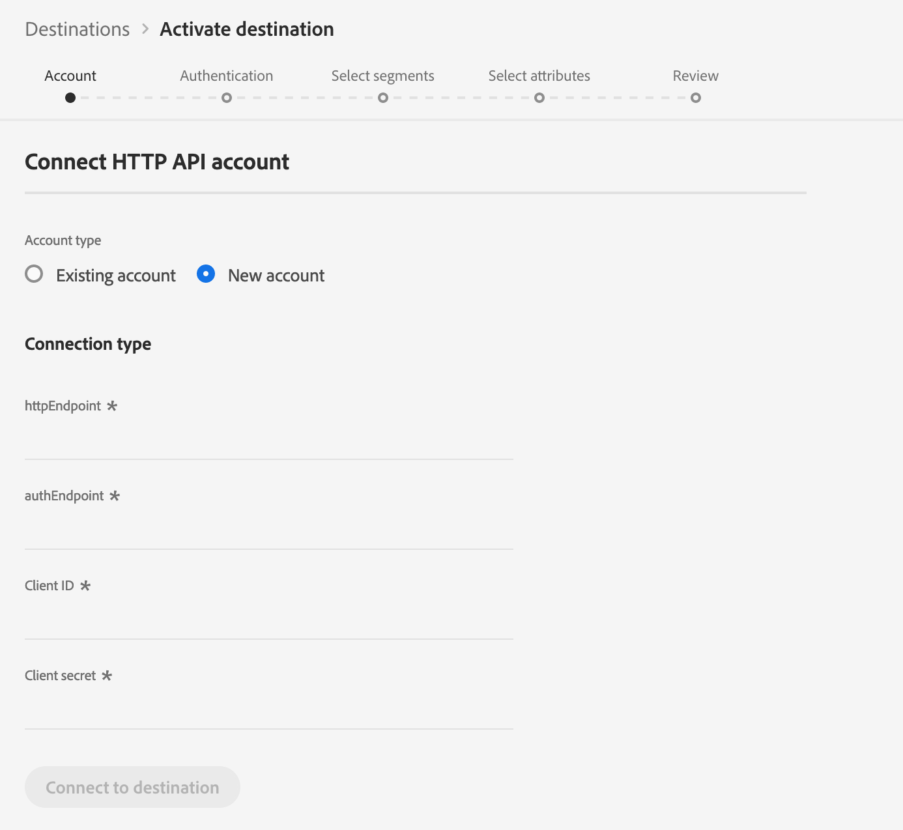

# （アルファ） [!DNL HTTP] 宛先

>[!IMPORTANT]
>
>AdobeReal-time CDPの [!DNL HTTP] 宛先は現在アルファ値です。 ドキュメントと機能は変更される場合があります。

## 概要 {#overview}

宛先は、サードパーティのエンドポイントにプロファイルデータを送信するのに役立つ [!DNL HTTP] ストリーミング [!DNL Real-time Customer Data Platform][!DNL HTTP] 宛先です。

プロファイルデータをエンドポイントに送信するには、まず [!DNL HTTP] で宛先に接続する必要があり [[!DNL Real-time Customer Data Platform]](#connect-destination)ます。

## 使用例 {#use-cases}

宛先は、XDMプロファイルデータとオーディエンスセグメントを汎用エンドポイントに書き出す必要があるお客様を対象としてい [!DNL HTTP][!DNL HTTP] ます。

[!DNL HTTP] エンドポイントは、お客様が所有するシステムまたはサードパーティのソリューションのいずれかになります。

## Connect to Destination {#connect-destination}

1. **[!UICONTROL 接続]** / **[!UICONTROL 宛先]**、を選択し、「 [!DNL HTTP API]設定 ****」を選択します。

   

   >[!NOTE]
   >
   >この宛先との接続が既に存在する場合は、宛先カードに **[!UICONTROL 「アクティブ化]** 」ボタンが表示されます。 「 **[!UICONTROL アクティブ化]** 」と「 **[!UICONTROL 設定]**」の違いについて詳しくは、表示先ワークスペースのドキュメントの「 [カタログ](../destinations/destinations-workspace.md#catalog) 」セクションを参照してください。
   >
   >

2. 「 [!UICONTROL アカウント] 」手順で、HTTPエンドポイント接続の詳細を定義する必要があります。 「 **[!UICONTROL 新規アカウント]** 」を選択し、接続先のHTTPエンドポイントの接続の詳細を入力します。
   * **[!UICONTROL httpEndpoint]**:プロファイルデータ [!DNL URL] の送信先のHTTPエンドポイントの完全な情報です。
      * 必要に応じて、httpEndpoint  にクエリパラメーターを追加できます [!DNL URL]。
   * **[!UICONTROL authEndpoint]**:認証に使用 [!DNL URL] されるHTTPエンドポイントの完全 [!DNL OAuth2] です。
   * **[!UICONTROL クライアントID]**:クライアント資格情報で使用される [!DNL clientID] パラメーター [!DNL OAuth2] 。
   * **[!UICONTROL クライアントシークレット]**:クライアント資格情報で使用される [!DNL clientSecret] パラメーター [!DNL OAuth2] 。

   >[!NOTE]
   >
   >現在、 [!DNL OAuth2] クライアント資格情報のみがサポートされています。

   
3. Click **[!UICONTROL Connect to destination]**.
4. 接続が成功したら、「 **[!UICONTROL Next]**」をクリックします。
5. 「 [!UICONTROL 認証] 」の手順で、アカウント認証資格情報を入力します。
   * **[!UICONTROL 名前]**:この宛先を認識するための名前を入力します。
   * **[!UICONTROL 説明]**:この宛先を将来特定するのに役立つ説明を入力します。
   * **[!UICONTROL Custom Headers]**:宛先呼び出しに含めるカスタムヘッダーを入力します。次の形式に従います。 `header1:value1,header2:value2,...headerN:valueN`.

      >[!IMPORTANT]
      >
      >現在の実装には、少なくとも1つのカスタムヘッダーが必要です。 この制限は、今後の更新で解決されます。
   

6. **[!UICONTROL マーケティングの使用例]**:マーケティングの使用例は、データがエクスポート先にエクスポートされる意図を示します。 Adobe定義のマーケティングの使用例から選択するか、独自のマーケティングの使用例を作成することができます。 マーケティングの使用例の詳細については、Real-time CDP [（リアルタイムCDP）ページの「](../privacy/data-governance-overview.md#destinations) Data Governance（データ・ガバナンス）」を参照してください。 個々のAdobe定義マーケティングの使用例について詳しくは、 [データ使用ポリシーの概要を参照してください](../../data-governance/policies/overview.md#core-actions)。
7. 「 **[!UICONTROL 作成先]**」をクリックします。

## セグメントのアクティブ化

セグメントのアクティベーションワークフローについて詳しくは、「[宛先へのプロファイルとセグメントのアクティブ化](activate-destinations.md#select-attributes)」を参照してください。

## 宛先属性

属性を [[!UICONTROL 選択]](activate-destinations.md#select-attributes) ( [Select attributes](activate-destinations.md) )の手順で、宛先に対するセグメントを [!DNL HTTP] アクティブ化する場合は、 [和集合スキーマから一意の識別子を選択することをお勧めします](../../profile/home.md#profile-fragments-and-union-schemas)。 宛先に書き出す一意の識別子およびその他の XDM フィールドを選択します。

## 書き出されたデータ {#exported-data}

書き出した [!DNL Experience Platform] データは、JSON形式で [!DNL HTTP] 宛先に格納されます。 例えば、次のイベントには、特定のセグメントに該当し、別のセグメントから離脱したオーディエンスの電子メールアドレスプロファイル属性が含まれています。 この見込み客のIDは電子メール [!DNL ECID] および電子メールです。

```json
{
  "person": {
    "email": "yourstruly@adobe.con"
  },
  "segmentMembership": {
    "ups": {
      "7841ba61-23c1-4bb3-a495-00d3g5fe1e93": {
        "lastQualificationTime": "2020-05-25T21:24:39Z",
        "status": "exited"
      },
      "59bd2fkd-3c48-4b18-bf56-4f5c5e6967ae": {
        "lastQualificationTime": "2020-05-25T23:37:33Z",
        "status": "existing"
      }
    }
  },
  "identityMap": {
    "ecid": [
      {
        "id": "14575006536349286404619648085736425115"
      },
      {
        "id": "66478888669296734530114754794777368480"
      }
    ],
    "email_lc_sha256": [
      {
        "id": "655332b5fa2aea4498bf7a290cff017cb4"
      },
      {
        "id": "66baf76ef9de8b42df8903f00e0e3dc0b7"
      }
    ]
  }
}
```
