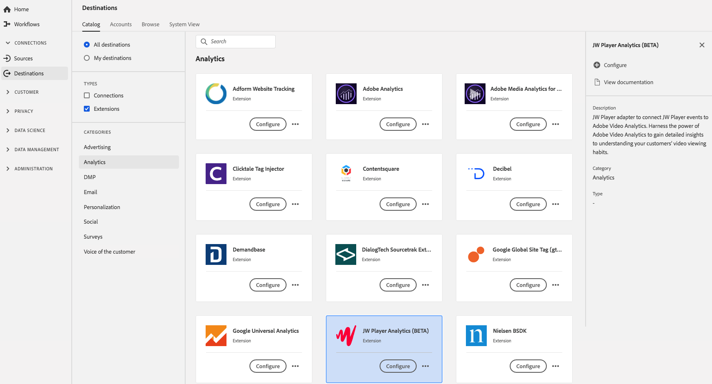

# [!DNL JW Player Analytics] （ベータ版）拡張機能 {#jw-player-analytics-extension}

## 概要 {#overview}

This extension installs the [!DNL JW Player] adapter to connect [!DNL JW Player] events to Adobe Video Analytics. Adobe Video Analytics の機能を活用して、顧客のビデオ視聴習慣を把握するための詳細なインサイトを得ます。

[!DNL JW Player Analytics] （ベータ版）は、リアルタイム顧客データプラットフォームのAnalytics拡張機能です。 拡張機能について詳しくは、[Adobe Exchange](https://exchange.adobe.com/experiencecloud.details.101523.jw-player-analytics-launch-extension.html) の拡張機能のページを参照してください。

この目的地はAdobe Experience Platform Launchの延長線です。 For more information about how Platform Launch extensions work in Adobe Real-time CDP, see [Adobe Experience Platform Launch extensions overview](/help/rtcdp/destinations/experience-platform-launch-extensions.md).

## 前提条件 {#prerequisites}

This extension is available in the [!DNL Destinations] catalog for all customers who have purchased Adobe Real-time CDP.

この拡張機能を使用するには、Adobe Experience Platform Launchにアクセスする必要があります。  Platform Launch は、Adobe Experience Cloud に付属の付加価値機能として提供されています。Contact your organization administrator to get access to Platform Launch and ask them to grant you the **[!UICONTROL manage_properties]** permission so you can install extensions.

## 拡張機能のインストール {#install-extension}

To install the [!DNL JW Player Analytics] (BETA) extension:

1. [AdobeReal-time CDPインターフェイスで](http://platform.adobe.com/)、 **[!UICONTROL Destinations]** / **[!UICONTROL Catalog]**&#x200B;に移動します。
2. カタログから拡張機能を選択するか、検索バーを使用します。
3. Click on the destination to highlight it, then select **[!UICONTROL Configure]** in the right rail. **[!UICONTROL Configure]** コントロールが灰色表示になっている場合は、 **[!UICONTROL manage_properties]** 権限がありません。 [前提条件](#prerequisites)を確認してください。
4. In the **[!UICONTROL Select available Platform Launch property]** window, select the Platform Launch property in which you want to install the extension. また、「プラットフォームの起動」で新しいプロパティを作成するオプションもあります。 プロパティは、ルール、データ要素、設定された拡張機能、環境およびライブラリの集まりです。Learn about properties in the [Properties page section](https://docs.adobe.com/content/help/ja-JP/launch/using/reference/admin/companies-and-properties.html#プロパティページ) of the Platform Launch documentation.
5. このワークフローにより、プラットフォーム起動に移動してインストールを完了します。

拡張機能の設定オプションについて詳しくは、Adobe Exchange の [JW Player Analytics（BETA）拡張機能ページ](https://exchange.adobe.com/experiencecloud.details.101523.jw-player-analytics-launch-extension.html)を参照してください。

You can also install the extension directly in the [Adobe Experience Platform Launch interface](https://launch.adobe.com/). See [Add a new extension](https://docs.adobe.com/content/help/ja-JP/launch/using/reference/manage-resources/extensions/overview.html#add-a-new-extension) in the Platform Launch documentation.

## 拡張機能の使用方法 {#how-to-use}

拡張機能をインストールすると、「プラットフォームの起動」で直接、拡張機能のルール設定を開始できます。

Platform Launchでは、特定の状況でのみイベントデータを拡張の宛先に送信するように、インストール済みの拡張機能のルールを設定できます。 拡張機能のルールの設定について詳しくは、[ルールに関するドキュメント](https://docs.adobe.com/help/ja-JP/launch/using/reference/manage-resources/rules.html)を参照してください。

## 拡張機能の設定、アップグレード、削除 {#configure-upgrade-delete}

プラットフォーム起動インターフェイスで、拡張機能の設定、アップグレードおよび削除ができます。

>[!TIP]
>
>拡張機能が既にいずれかのプロパティにインストールされている場合、アドビのリアルタイム CDP UI には、拡張機能に対して「**[!UICONTROL インストール]**」が表示されます。Kick off the installation workflow as described in [Install extension](#install-extension) to get to Platform Launch and configure or delete your extension.

To upgrade your extension, see [Extension upgrade](https://docs.adobe.com/content/help/ja-JP/launch/using/reference/manage-resources/extensions/extension-upgrade.html) in the Platform Launch documentation.

