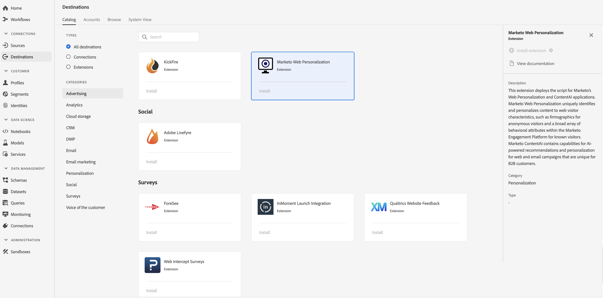

# [!DNL Marketo Web Personalization] 拡張機能 {#marketo-web-personalization-extension}

## 概要 {#overview}

この拡張機能は、 [!DNL Marketo’s] WebパーソナライゼーションおよびContentAIアプリケーションのスクリプトをデプロイします。 [!DNL Marketo] Webパーソナライゼーションは、匿名訪問者の画像や既知の訪問者のアクションPlatform内の幅広い行動属性など、Web訪問者の特性に応じてコンテンツを一意に識別し、パーソナライズします。 [!DNL Marketo] [!DNL Marketo] ContentAIには、B2Bのお客様に固有の、AIに基づくレコメンデーション機能と、Webキャンペーンおよび電子メールユーザー向けのパーソナライズ機能が含まれています。

[!DNL Marketo Web Personalization] は、アドビのリアルタイム顧客データPlatformでのパーソナライゼーション拡張です。 拡張機能の詳細については、 [Adobe Exchangeの拡張機能ページを参照してください](https://exchange.adobe.com/experiencecloud.details.101232.marketo-web-personalization.html)。

この宛先はExperience Platform Launchの拡張です。 Adobe Real-time CDPでのLaunch拡張機能の動作について詳しくは、 [Experience Platform Launch拡張機能の概要を参照してください](/help/rtcdp/destinations/experience-platform-launch-extensions.md)。

## 前提条件 {#prerequisites}

この拡張機能は、Adobe Real-time CDPを購入したすべてのお客様の [!DNL Destinations] カタログで入手できます。

この拡張機能を使用するには、Experience Platform Launchにアクセスする必要があります。 Adobe Experience Cloudのお客様には、付加価値機能としてExperience Platform Launchが提供されます。 Launchへのアクセス権を取得するには、組織管理者に連絡して、拡張機能をインストールできるように **[!UICONTROL manage_properties]** 権限を付与するように依頼します。

## 拡張機能のインストール {#install-extension}

拡張機能をインストールするに [!DNL Marketo Web Personalization] は：

1. [Adobe Real-time CDPインターフェイスで](http://platform.adobe.com/)、 **[!UICONTROL Destinations/Catalogに移動します]**。
2. カタログから拡張子を選択するか、検索バーを使用します。
3. リンク先をクリックしてハイライト表示し、右側のレールで「 **[!UICONTROL Install Extension]** 」を選択します。 「 **[!UICONTROL Install Extension]** 」コントロールが灰色表示になっている場合は、 **[!UICONTROL manage_properties]** 権限がありません。 「 [前提条件](#prerequisites)」を参照してください。
4. 「使用可能な起動プロパティ **[!UICONTROL を選択]** 」ウィンドウで、拡張機能をインストールするLaunchプロパティを選択します。 また、「起動」で新しいプロパティを作成するオプションもあります。 プロパティは、ルール、データ要素、設定された拡張機能、環境およびライブラリの集まりです。プロパティについては、起動ドキュメントの [プロパティページセクション](https://docs.adobe.com/content/help/en/launch/using/reference/admin/companies-and-properties.html#properties-page) で説明します。
5. ワークフローが起動し、インストールが完了します。

拡張機能の構成オプションとインストールのサポートについて詳しくは、Adobe Exchangeの [マーケティングWebパーソナライゼーションページを参照してください](https://exchange.adobe.com/experiencecloud.details.101232.marketo-web-personalization.html)。

拡張機能は、 [Experience Platform Launchインターフェイスに直接インストールすることもできます](https://launch.adobe.com/)。 Launchドキュメ [ントで新しい拡張機能を追加参照してください](https://docs.adobe.com/content/help/en/launch/using/reference/manage-resources/extensions/overview.html#add-a-new-extension) 。

## 拡張機能の使用方法 {#how-to-use}

拡張機能をインストールすると、「起動」で直接、拡張機能のルール設定を開始できます。

「起動」では、特定の状況でのみイベントデータを拡張子の宛先に送信するように、インストール済みの拡張子のルールを設定できます。 拡張機能のルールの設定について詳しくは、「ルール [ドキュメント](https://docs.adobe.com/help/ja-JP/launch/using/reference/manage-resources/rules.html)」を参照してください。

## 拡張機能の設定、アップグレード、削除 {#configure-upgrade-delete}

起動インターフェイスでは、拡張機能の設定、アップグレードおよび削除が可能です。

>[!TIP]
>
>拡張機能が既にいずれかのプロパティにインストールされている場合、Adobe Real-time CDP UIには、拡張機能の **[!UICONTROL Install]** と表示されます。 「 [Install extension](#install-extension) 」の説明に従ってインストールワークフローを開始し、拡張機能を起動して設定または削除します。

拡張機能をアップグレードするには、Launchドキュメントの [Extensionアップグレード](https://docs.adobe.com/content/help/en/launch/using/reference/manage-resources/extensions/extension-upgrade.html) を参照してください。