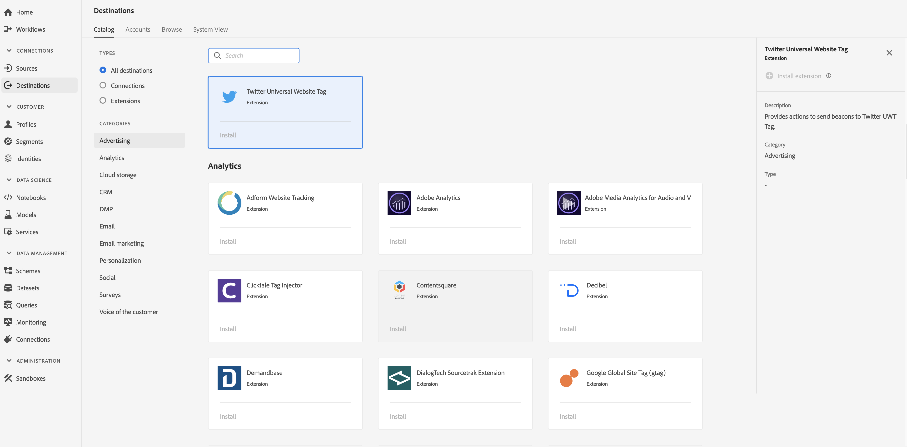

# [!DNL Twitter Universal Website Tag] 拡張子 {#twitter-uwt-extension}

## 概要 {#overview}

[!DNL Twitter Universal Website Tag] は、Twitter UWTタグにビーコンを送信するアクションを提供します。

[!DNL Twitter Universal Website Tag] は、リアルタイム顧客データプラットフォームの広告拡張です。 拡張機能について詳しくは、「[高度なコンバージョントラッキング](https://business.twitter.com/en/solutions/twitter-ads/website-clicks/advanced-conversion-tracking.html)」を参照してください。

この目的地はAdobe Experience Platform Launchの延長線です。 For more information about how Platform Launch extensions work in Adobe Real-time CDP, see [Adobe Experience Platform Launch extensions overview](/help/rtcdp/destinations/experience-platform-launch-extensions.md).

## 前提条件 {#prerequisites}

This extension is available in the [!DNL Destinations] catalog for all customers who have purchased Adobe Real-time CDP.

この拡張機能を使用するには、Adobe Experience Platform Launchにアクセスする必要があります。  Platform Launch は、Adobe Experience Cloud に付属の付加価値機能として提供されています。Contact your organization administrator to get access to Platform Launch and ask them to grant you the **[!UICONTROL manage_properties]** permission so you can install extensions.

## 拡張機能のインストール {#install-extension}

拡張機能をインストールするに [!DNL Twitter Universal Website Tag] は：

1. [AdobeReal-time CDPインターフェイスで](http://platform.adobe.com/)、 **[!UICONTROL Destinations]** / **[!UICONTROL Catalog]**&#x200B;に移動します。
2. カタログから拡張機能を選択するか、検索バーを使用します。
3. Click on the destination to highlight it, then select **[!UICONTROL Configure]** in the right rail. **[!UICONTROL Configure]** コントロールが灰色表示になっている場合は、 **[!UICONTROL manage_properties]** 権限がありません。 [前提条件](#prerequisites)を確認してください。
4. In the **[!UICONTROL Select available Platform Launch property]** window, select the Platform Launch property in which you want to install the extension. また、「プラットフォームの起動」で新しいプロパティを作成するオプションもあります。 プロパティは、ルール、データ要素、設定された拡張機能、環境およびライブラリの集まりです。Learn about properties in the [Properties page section](https://docs.adobe.com/content/help/ja-JP/launch/using/reference/admin/companies-and-properties.html#プロパティページ) of the Platform Launch documentation.
5. このワークフローにより、プラットフォーム起動に移動してインストールを完了します。

You can also install the extension directly in the [Adobe Experience Platform Launch interface](https://launch.adobe.com/). See [Add a new extension](https://docs.adobe.com/content/help/ja-JP/launch/using/reference/manage-resources/extensions/overview.html#add-a-new-extension) in the Platform Launch documentation.

## 拡張機能の使用方法 {#how-to-use}

拡張機能をインストールすると、「プラットフォームの起動」で直接、拡張機能のルール設定を開始できます。

拡張機能のルールの設定について詳しくは、[ルールに関するドキュメント](https://docs.adobe.com/help/ja-JP/launch/using/reference/manage-resources/rules.html)を参照してください。

## 拡張機能の設定、アップグレード、削除 {#configure-upgrade-delete}

プラットフォーム起動インターフェイスで、拡張機能の設定、アップグレードおよび削除ができます。

>[!TIP]
>
>拡張機能が既にいずれかのプロパティにインストールされている場合、アドビのリアルタイム CDP UI には、拡張機能に対して「**[!UICONTROL インストール]**」が表示されます。Kick off the installation workflow as described in [Install extension](#install-extension) to get to Platform Launch and configure or delete your extension.

To upgrade your extension, see [Extension upgrade](https://docs.adobe.com/content/help/ja-JP/launch/using/reference/manage-resources/extensions/extension-upgrade.html) in the Platform Launch documentation.