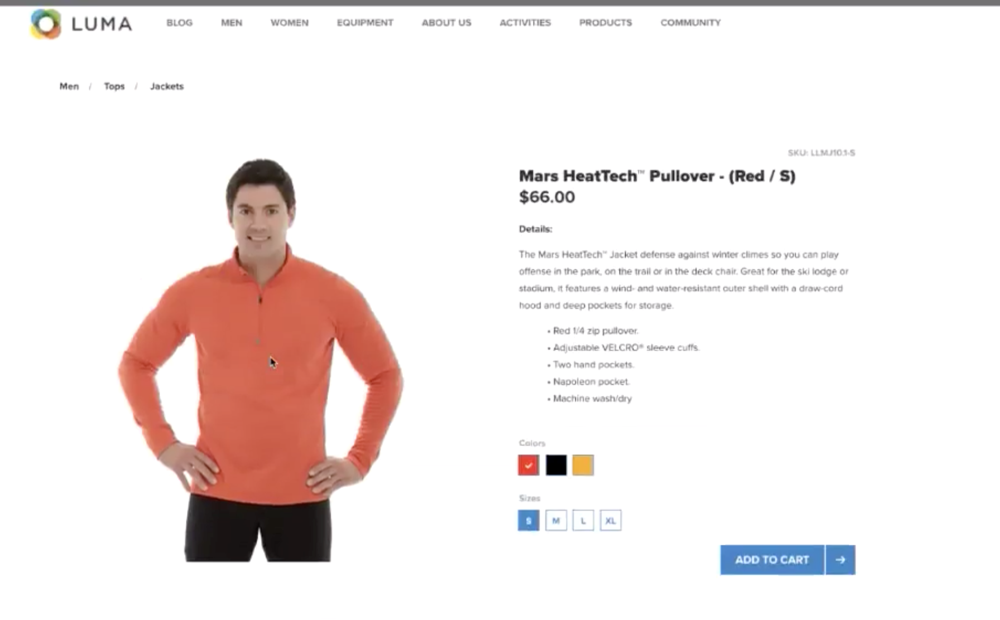
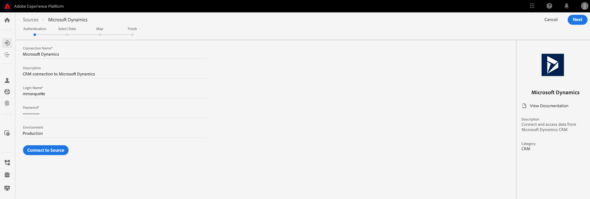
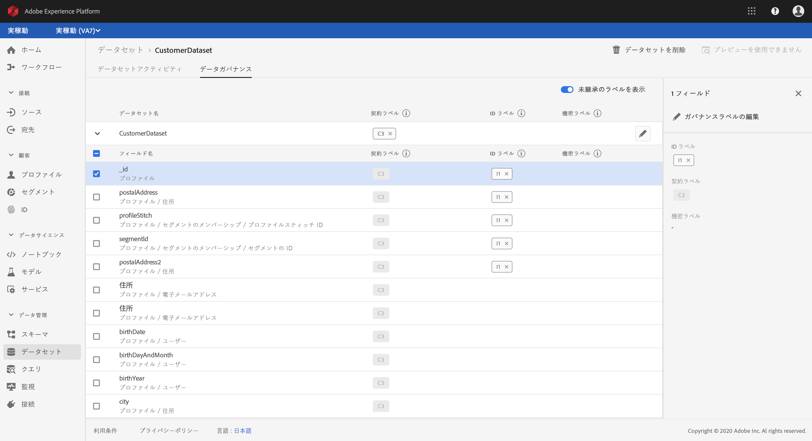
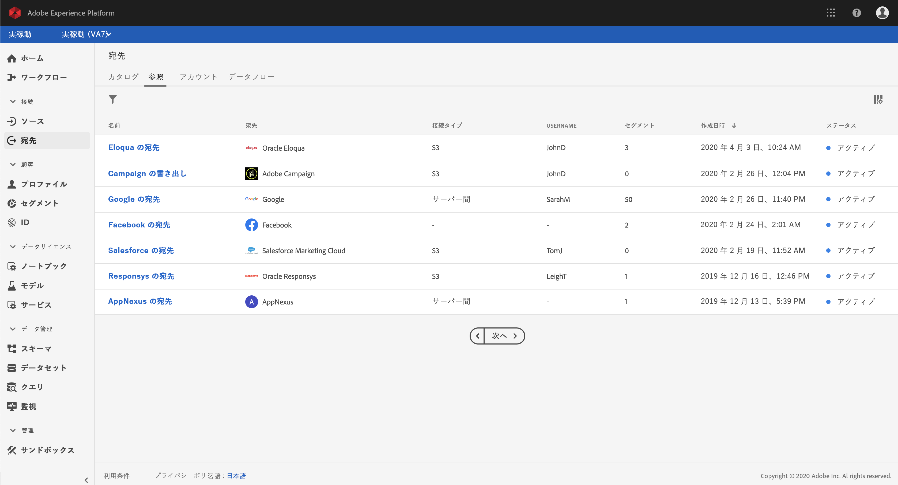

# Real-time Customer Data Platformの概要

この入門ガイドでは、Real-time Customer Data Platform（リアルタイム CDP）のサンプル実装を順を追って説明します。 独自の実装を設定する場合に例としてご使用ください。このガイドでは具体的な例を示していますが、設定の作成時に使用できる追加情報へのリンクを示しています。

この例は、 Experience Platform が提供するアドビのリアルタイム顧客データプラットフォームの次の機能を示しています。

* 複数のソースからデータを取り込む
* それらを単一のに結合 [!DNL real-time customer profile]
* デバイス間で一貫性のある、関連性の高いパーソナライズされたエクスペリエンスを提供します。

## 使用例

スポーツアパレル会社の Luma は、常に顧客体験の向上に努めています。Luma にはギフト関連の売り上げを増やす新しいイニシアチブがあります。また、Luma は顧客に付きまとう迷惑広告などの過度の露出は抑えたいと考えています。

現在、訪問者が将来購入しない品目に対してリターゲティングをおこなうメディアに多くの費用がかかっています。例えば、Luma は、1 回限りのギフト購入品目に対してのリターゲティングはしたくありません。

現在、Luma のデータは複数のソースに分散されています。その結果、次のような大きな課題に直面しています。

* マーケティング組織は、Web サイト、モバイルアプリ、ロイヤリティープログラム、CRM など、各チームがデータソースを所有している様々なチームと連携する必要がある。
* データはマーケティングチームがアクセスできるまでに古くなり、時間の影響を受けやすいキャンペーンに使用できなくなる場合が多くある。
* Luma は、データを統合し、チャネルではなく人をターゲットする必要があります。

その結果、Luma のビジネス目標は次になります。

* 消費者を異なるデータソースからリアルタイムで単一表示する。
* 様々なチャネルやデバイスに関連するメッセージを使用して、マーケティングキャンペーンをパーソナライズする。

これらの目標を満たすには、マーケティングチームが大規模な顧客データを管理できる必要があります。

Adobe Experience Platform を利用した Real-time CDP を使用すると、Luma のマーケティング組織は次のことができます。

1. 異なるプラットフォームからデータを収集し、他のマーケティング活動でダウンストリームで使用できることを確認する。
1. データの発信元とは無関係に、消費者に関する単一のリアルタイムビューを作成する。
1. すべてのタッチポイントにわたって、一貫性のある、関連性の高いパーソナライズされたエクスペリエンスを提供する。

## 手順

このチュートリアルでは、次の手順を実行します。

1. [顧客プロファイル](#customer-profile)を作成する
1. [ユーザーエクスペリエンス](#personalizing-the-user-experience)をパーソナライズする
1. [複数のデータソース](#using-multiple-data-sources)を使用する
1. [データソースを設定する](#configuring-a-data-source)
1. [特定の顧客のデータ](#bringing-the-data-together-for-a-specific-customer)を収集する
1. [セグメント](#segments)を設定する
1. [宛先](#destinations)を設定する
1. [デバイス間でプロファイルを結合する](#cross-device-identity-stitching)。
1. [プロファイルを分析する](#analyzing-the-profile)。

## 顧客プロファイル

顧客が初めてサイトを訪問したとき、その顧客に関する情報は何もありません。


訪問者がナビゲーションすると、データがリアルタイムで取得され、Adobe Analyticsのレポートスイートに送信されるだけでなく、Adobe Experience Platformに直接送信されます。 データが収集されると、 [!DNL Experience Platform's real-time customer profile].

Web サイトの訪問者の多くは、以前に Luma から購入したリピート客である可能性があります。新規訪問者とリピーターの両方、および既知の顧客に対応するために、メッセージングとオファーをパーソナライズすることが重要です。

### 新規顧客の初回訪問

例えば、未特定の訪問者が Luma サイトのメンズセクションに移動し、2、3 着のランニングトレーナーを表示したとします。


顧客がこれらの製品に関する詳細情報に移動すると、これらの製品表示はAdobe Analyticsで収集され、に送信されます。 [!DNL Experience Platform].

<!---->

Luma は、訪問者の行動を Adobe Experience Platform のユーザープロファイルにマッピングし、そのユーザーの行動をより深く把握できるようになります。

### 顧客の詳細の把握

顧客が Web サイトでやりとりを続けるにつれ、より明確な画像が浮上します。例えば、訪問者が買い物かごに製品を追加し、ログインしたとします。

ログインするときに、顧客は Sarah Rose と名乗ります。


2 つの ID が結合されます。

* 匿名閲覧データ
* Sarah Rose のアカウントに関連付けられた既存のデータ

両方の ID は、 [!DNL Experience Platform]. Luma は今、この消費者を統一的に見ています。

サイトのメンズセクションで匿名訪問者が閲覧した行動に基づいて、顧客が男性であると想定されていた可能性があります。ログイン後、Luma は Sarah Rose を認識します。Luma は、 [!DNL Real-time Customer Profile] 様々なチャネルに配信されるメッセージを絞り込むため。

## ユーザーエクスペリエンスのパーソナライズ

Sarah はブロンズ会員であることを感謝して特典の詳細や会員ステータスとポイントの向上に関する情報を提供する、ロイヤリティープログラムのメッセージを受け取ります。

Sarah はホームページに移動し、さらに参照します。


Sarah は、自分のページに基づいて動的に配信される、パーソナライズされたホームページエクスペリエンスを受け取ります [!DNL Real-time Customer Profile] Adobe Experience Platform

Adobe Target の Adobe Sensei によるパーソナライズ機能により、ランニング用のアパレルやギアに対する過去の購入とアフィニティが考慮され、関連するコンテンツが表示されます。Luma はまた、最近閲覧した男性向けのランニングギアに沿って、男性向けカタログの内容を調整します。

ページの下の方には、特集商品と、最近閲覧された品目に基づく新しいレコメンデーショントレイを表示します。

このパーソナライズされたコンテンツは、Sarah が関連アイテムをすばやく見つけるのに役立ちます。これにより、コンバージョンが向上し、より楽しい顧客体験が得られます。

### 顧客をサイトに戻す

Sarah は気が散ってサイトを離れ、セッションを終了します。Adobe Experience Platform のデータは、Sarah を Luma サイトに戻すのに役立ちます。

 Experience Platform によるアドビのリアルタイム顧客データプラットフォームは、顧客体験管理を目的として構築されています。これにより、組織では次のことが可能になります。

* データの統合とアクティベーションのシンプル化
* 既知のデータと不明なデータの使用の管理
* 大規模なマーケティング使用事例の加速

## 複数のデータソースの使用

Luma のチームは、顧客の行動とデータをすべて 1 か所にまとめています。


以下のソースからデータを取り込むことができます。

* 既存の Adobe Experience Cloud ソリューションデータ
* Luma のロイヤリティープログラム、コールセンター、POS システムデータなどのアドビ以外のソース
* Luma データソースからのリアルタイムストリーミングデータ
* アドビソリューションからのリアルタイムデータ（新しいタグは不要）

異なるソースからのこのデータはすべて、単一の統合された顧客プロファイルに結合されます。

## データソースの設定

用途 [!DNL Real-time Customer Data Platform] を使用して、新しいデータソースを Platform に取り込みます。 リアルタイム CDP には、迅速かつ容易にプロファイルに追加できるデータソースのカタログが含まれます。


例えば、Luma の CRM データを取り込むには、*CRM* でカタログをフィルターし、*CRM* を含むすべてのあらかじめ用意されているコネクタが表示されます 。追加するには [!DNL Microsoft Dynamics CRM] データ：

1. 接続を許可します。

   

1. XDM の事前マッピング済みテーブルの推奨リストから、インポートする内容を選択します。

   <!--     -->

   例えば、「**[!UICONTROL 連絡先]**」を選択します。連絡先データのプレビューが自動的に読み込まれ、すべてが期待どおりに表示されることを確認できます。

   Adobe Experience Platform は、標準フィールドを [!DNL Experience Data Model] (XDM) プロファイルスキーマ。

1. フィールドマッピングを確認します。

   <!--     -->

   例えば、連絡先の電子メールフィールドが正しくマッピングされていることを再確認します。\
   データをプレビューし、高度なマッピングを実行するオプションもあります。

1. スケジュールを設定します。

   

これで完了です。追加しました [!DNL Microsoft CRM] をデータソースとして [!DNL Experience Platform].

### 取り込んだデータに使用ポリシーのラベルを付ける

Luma　には、収集した特定の種類の情報の使用を制限する内部ポリシーが多数あります。また、データの使用に関する法的な問題やプライバシーに関する問題にも準拠する必要があります。Adobe Experience Platform データガバナンスを使用すると、事前定義されたデータ使用ラベルをデータセット（およびこれらのデータセット内の特定のフィールド）に適用でき、Luma は特定の使用制限に従ってデータを分類できます。



データ使用ラベルが適用されると、Luma はデータガバナンスを使用してデータ使用ポリシーを作成できます。データ使用ポリシーは、特定のラベルを含むデータで実行可能なアクションの種類を記述するルールです。ポリシー違反を構成する Real-time CDP でアクションを実行しようとすると、アクションを実行できず、どのポリシーに違反したかとその理由を示すアラートが表示されます。

## 特定の顧客データの統合

このシナリオでは、Sarah Rose のプロファイルを検索します。プロファイルが表示され、ログインに使用した電子メールが送信されます。

<!--  -->

Luma が所有する Sarah に関するプロファイル情報がすべて表示されます。これには、住所、電話番号、連絡環境設定、資格を持つセグメントなどの個人情報が含まれます。

| カテゴリ | 説明 |
|---|---|
| ID | 内でリンクされている ID を表示します [!DNL Platform] チャネルやデバイスをまたいだ Sarah の Luma とのやり取りから Web サイトから Sarah の ECID が表示されます。また、モバイルアプリの ECID、電子メール ID、最近追加されたからの CRM ID も含まれます [!DNL Microsoft Dynamics] データセットと、Luma ロイヤリティーシステムからAdobe Experience Platformに渡されるロイヤリティー ID。 |
| イベント | Sarah の Luma ブランドとのインタラクションデータをすべて表示します。これには、Sarah が先ほど閲覧した品目、過去に閲覧したもの、受信した電子メール、コールセンターとのやりとり、またそれぞれのインタラクションが発生したチャネルとデバイスが含まれます。 |

Real-time CDP プロファイルは、Luma マーケティングチームのワークフローを数週間から数分に短縮し、この 360 度の顧客ビューに基づいてパーソナライズ機能の可能性をアンロックします。このプロファイルは、サインイン前にサイトを閲覧した際の行動データと、既存の顧客プロファイルを結合し、Sarah の包括的なビューを作成します。

マーケティングチームは、この拡張機能を使用できます。 [!DNL Real-time Customer Profile] を使用すると、Sarah のエクスペリエンスをより適切にパーソナライズし、Luma とのブランドロイヤルティを高めることができます。

## セグメント

強力なAdobe Experience Platformのセグメント化機能を使用すると、マーケターは、 [!DNL Real-time Customer Profile].

<!--  -->

このシナリオでは、Sarah が最近サイトで行った操作は、以前の操作とは異なる行動を示しています。Sarah は普段婦人服を買います。しかし、彼女の買い物かごの中には大人の男性用のトレーナーが入っています。

Luma データサイエンスチームは、購入傾向に関するモデルを作成しています。あるモデルは、既存の消費者の衣料品カテゴリ（女性や紳士服など）やサイズの急激な変化を識別します。購入行動の変化から、Sarah は自分のために買い物をしていないことがわかります。

<!--  -->

### セグメントの定義

ギフトの購入過程にあるように見える買い物かごの放棄者を表すセグメントを変更または作成します。

```sql
Profile: Category != Preferred Category 
AND 
Product Size != Preferred Size 
in last 7 days.  
AND 
Abandoned Cart 
AND 
Loyalty member 
```

<!-- -->

Sarah が買い物かごにギフトと思われる品物を追加したまま放棄したので、Luma は無料ギフトラップオファーで彼女をターゲットにすることができます。

## 宛先

「買い物かごの放棄者へのオファー」セグメントを追加すると、このセグメントに含まれる人の数をおおまかに確認できます。様々なチャネルに対して対応し、パーソナライズ機能を活用することができます。

選択 **[!UICONTROL 宛先に送信]**.

 Real-time CDP では、Luma はオーディエンスセグメントにシームレスに対応して、パーソナライズできます。\
以下に、Luma がこの宛先を送信する際に使用できるすべての宛先（アドビソリューションとアドビ以外のソリューションの両方）を示します。



### 宛先の選択

このシナリオでは、Luma は、次の宛先にわたるパーソナライズ機能を使用して、このオーディエンスを再ターゲット化します。

* Google（表示）

   <!--* Facebook -->
* Adobe Campaign（電子メール）

<!--  -->

### 宛先のスケジュール

また、特定の時刻に開始または終了するようにセグメントをスケジュールすることもできます。セグメントが投稿され、スケジュールされた日付に設定済みのプラットフォームで自動的に更新されます。

>[!NOTE]
>
>必要に応じて、日付フィールドを選択すると、90 日後に自動的にスケジュールされます。

選択 **[!UICONTROL 保存]** をクリックして次のページに移動します。

このオーディエンスの顧客が購入すると、その顧客のこのオーディエンスへのメンバーシップはリアルタイムで抑制されます。 彼らのステータスが変わり、オーディエンス対象外となります。

これにより、対象外のオーディエンスのために在庫を使い果たさないことで、Luma のメディアチームのディレクターは数十万ドルを節約できます。

### 宛先に対するデータ使用ポリシーの施行

Adobe Experience Platform　には、セグメントを特定の宛先に対してアクティブ化できるかどうかを判断するための、プライバシーとセキュリティのコントロールが含まれています。アクティベーションは、作成時に宛先に割り当てられたマーケティングの目的と、組織が定義したデータ使用ポリシーに基づいて有効化または制限されます。

アクティビティがポリシーに違反する場合は、警告が表示されます。この警告には、ポリシーが違反された理由と、違反の解決方法を識別するのに役立つデータ系列情報が含まれています。

これらの制御を使用して [!DNL Experience Platform] は、Luma が責任を持って規制やマーケティングに対応するのに役立ちます。 これらのコントロールは柔軟性が高く、Luma のセキュリティチームやガバナンスチームの要件に合わせて変更することができます。これにより、既知顧客データや不明な顧客データの管理に関する地域の要件や組織の要件に自信を持って対応できます。

### データフローキャンバス

保存すると、視覚的なデータフローキャンバスに、統合プロファイルから選択した 3 つの宛先にマッピングされたセグメントが表示されます。


## デバイス間での ID の結合

Sarah がモバイルデバイスでソーシャルメディアサイトを閲覧すると、Luma の広告が表示されます。広告では買い物かごに残した品物があることをリマインドします。

その後、Sarah がメールをチェックすると、再ターゲット化されたメッセージがあります。Sarah は E メールから Luma へのリンクを選択します。

このリンクから Sarah は Luma のモバイルホームページに移動して、Adobe Target が提供するパーソナライズされたエクスペリエンスを閲覧します。

* Sarah はブロンズ会員として歓迎されます。
* 「ギフト」メッセージが表示されます。
* また、「無料ギフトラップ」のメッセージも表示されます。これはブロンズレベルの特典の一部です。
* ランニングへのアフィニティに基づいて、Sarah は引き続きヒーロー画像でターゲットされています。

Sarah はトレーナーを購入し、ギフトラップを追加して、ギフトメッセージを書きます。Sarah は、また、このイベントを保存して来年ギフトを購入するためのリマインダーを受け取ることもできます。Sarah はリマインダーを受け取ることに同意し、翌年新しいギフトを購入するよう促すメールキャンペーンに参加することになります。

オーディエンス管理機能のおかげで、Sarah を男性用のトレーナーについてターゲットすることはなくなります。

## プロファイルの分析

Luma は、Adobe Experience Platform を使用して、Real-time CDP ダッシュボード上のギフトギバーセグメントを調べます。このイニシアチブの成果を時間の経過と共に見て、成長していることがわかります。顧客はオファーに応えて、より多くのお金を費やしています。

これらの洞察により、マーケティング担当者はこの信号に対して行動を起こすことができます。これは、CDP でこのデータを利用でき、Sarah のような顧客をセグメントに追加することで加速されます。

Luma は、この CDP データを使用して、忠誠度と顧客満足度を高めます。
