# Real-Time Customer Data Platformの導入方法

この入門ガイドでは、Real-Time Customer Data Platform（Real-Time CDP）の実装例を紹介します。 独自の実装を設定する場合に例としてご使用ください。このガイドでは具体的な例を示していますが、設定の作成時に使用できる追加情報へのリンクを示しています。

この例では、Adobe Experience Platformを活用したReal-Time Customer Data Platformの機能を次のように示します。

* 複数のソースからデータを取り込む
* それらを単一の[!DNL real-time customer profile]に結合
* デバイス間で一貫性のある、関連性の高いパーソナライズされたエクスペリエンスを提供します。

## 使用例

スポーツアパレル会社の Luma は、常に顧客体験の向上に努めています。Luma にはギフト関連の売り上げを増やす新しいイニシアチブがあります。また、Luma は顧客に付きまとう迷惑広告などの過度の露出は抑えたいと考えています。

現在、訪問者が購入しない商品をリターゲティングするメディアに多額の投資をおこなっています。 例えば、Lumaは、1回限りの購入を目的とした商品を他の人にリターゲティングしたくありません。

現在、Luma のデータは複数のソースに分散されています。その結果、次のような大きな課題に直面しています。

* マーケティング組織は、web サイト、モバイルアプリ、ロイヤルティプログラム、CRM など、各チームがデータソースを所有している様々なチームと連携する必要がある。
* データはマーケティングチームがアクセスできるまでに古くなり、時間の影響を受けやすいキャンペーンに使用できなくなる場合が多くある。
* Luma は、データを統合し、チャネルではなく人をターゲットする必要があります。

その結果、Luma のビジネス目標は次になります。

* 消費者を異なるデータソースからリアルタイムで単一表示する。
* 様々なチャネルやデバイスに関連するメッセージを使用して、マーケティングキャンペーンをパーソナライズする。

これらの目標を満たすには、マーケティングチームが大規模な顧客データを管理できる必要があります。

Lumaのマーケティング部門は、Adobe Experience PlatformをベースとしたReal-Time CDPにより、次のことが可能になります。

1. 異なるプラットフォームからデータを収集し、他のマーケティング活動でダウンストリームで使用できることを確認する。
1. データの発信元とは無関係に、消費者に関する単一のリアルタイムビューを作成する。
1. すべてのタッチポイントにわたって、一貫性のある、関連性の高いパーソナライズされたエクスペリエンスを提供する。

## 手順

このチュートリアルでは、次の手順を実行します。

1. [顧客プロファイル](#customer-profile)を作成する
1. [ユーザーエクスペリエンス](#personalizing-the-user-experience)をパーソナライズする
1. [複数のデータソース](#using-multiple-data-sources)を使用する
1. [データソースを設定する](#configuring-a-data-source)
1. [特定の顧客のデータ](#bringing-the-data-together-for-a-specific-customer)を収集する
1. [&#x200B; オーディエンス &#x200B;](#audiences)を設定します。
1. [宛先](#destinations)を設定する
1. [デバイス間でプロファイルを結合する](#cross-device-identity-stitching)。
1. [プロファイルを分析する](#analyzing-the-profile)。

## 顧客プロファイル

顧客が初めてサイトを訪問したとき、その顧客に関する情報は何もありません。

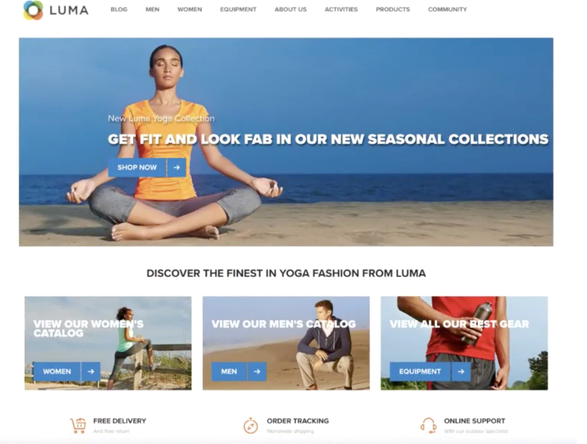

ナビゲーション中のデータはリアルタイムで取り込まれ、Adobe Analyticsのレポートスイートに送信されるだけでなく、Adobe Experience Platformに直接送信されます。 データが収集されると、[!DNL Experience Platform's real-time customer profile]の行動データに基づいて、消費者の単一のビューを形成し始めます。

Web サイトの訪問者の多くは、以前に Luma から購入したリピート客である可能性があります。新規訪問者とリピーターの両方、および既知の顧客に対応するために、メッセージングとオファーをパーソナライズすることが重要です。

### 新規顧客の初回訪問

例えば、未特定の訪問者がLuma サイトの「男性」セクションに移動し、スウェットシャツを着用しているカップルを閲覧したとします。

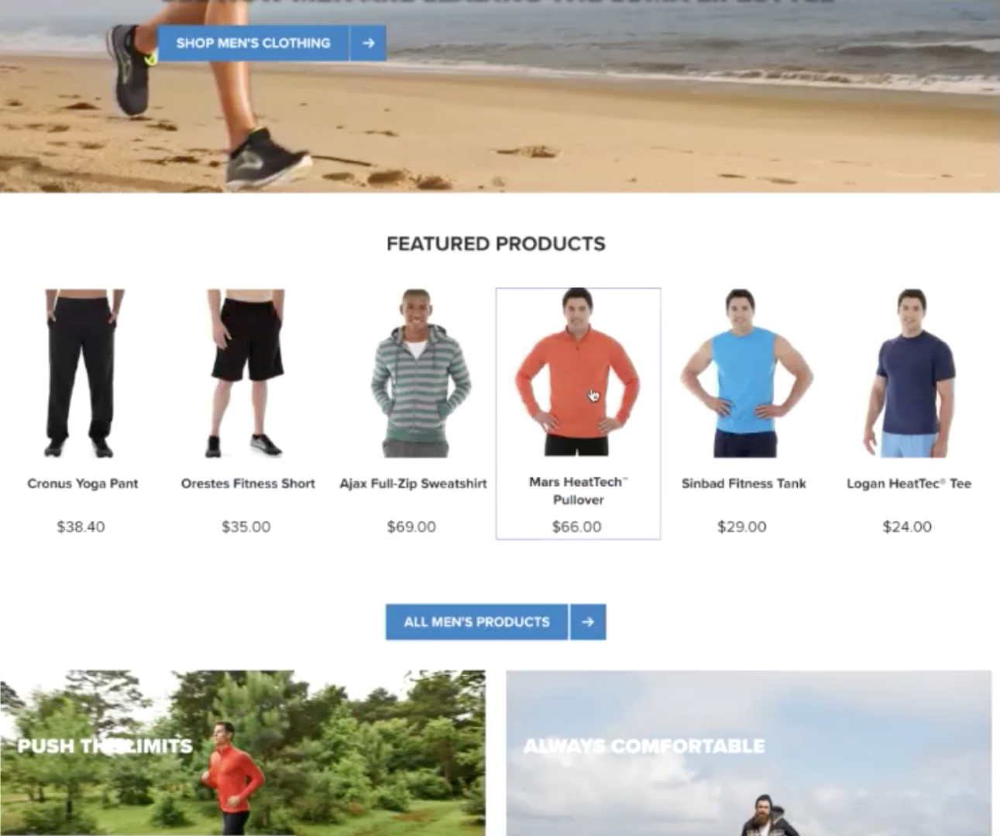

お客様がこれらの製品の詳細を確認するために移動すると、これらの製品ビューはAdobe Analyticsで収集され、[!DNL Experience Platform]に送信されます。

<!--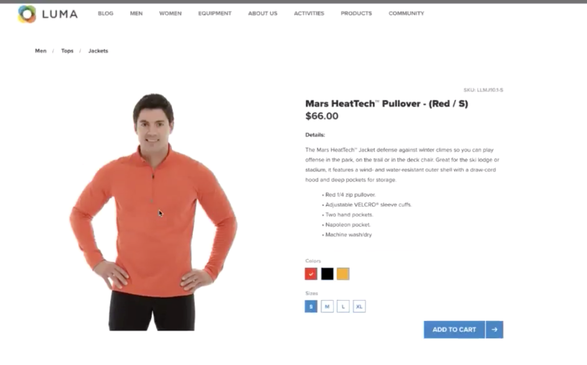-->

Luma は、訪問者の行動を Adobe Experience Platform のユーザープロファイルにマッピングし、そのユーザーの行動をより深く把握できるようになります。

### 顧客の詳細の把握

顧客が Web サイトでやりとりを続けるにつれ、より明確な画像が浮上します。例えば、訪問者が買い物かごに製品を追加し、ログインしたとします。

ログインするときに、顧客は Sarah Rose と名乗ります。

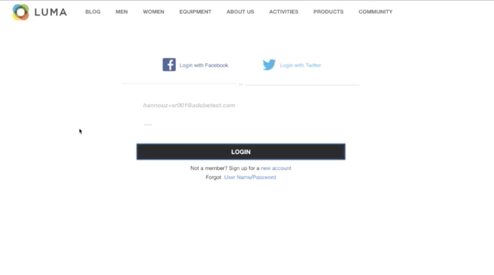

2 つの ID が結合されます。

* 匿名閲覧データ
* Sarah Rose のアカウントに関連付けられた既存のデータ

両方のIDが[!DNL Experience Platform]で単一のプロファイルに結合されます。 Luma は今、この消費者を統一的に見ています。

サイトのメンズセクションで匿名訪問者が閲覧した行動に基づいて、顧客が男性であると想定されていた可能性があります。ログインすると、LumaはSarah Roseを識別します。 Lumaは[!DNL Real-Time Customer Profile]の力を使用して、チャネル全体で彼女に配信されるメッセージを調整します。

## ユーザーエクスペリエンスのパーソナライズ

Sarah はブロンズ会員であることを感謝して特典の詳細や会員ステータスとポイントの向上に関する情報を提供する、ロイヤルティプログラムのメッセージを受け取ります。

ホームページに移動し。

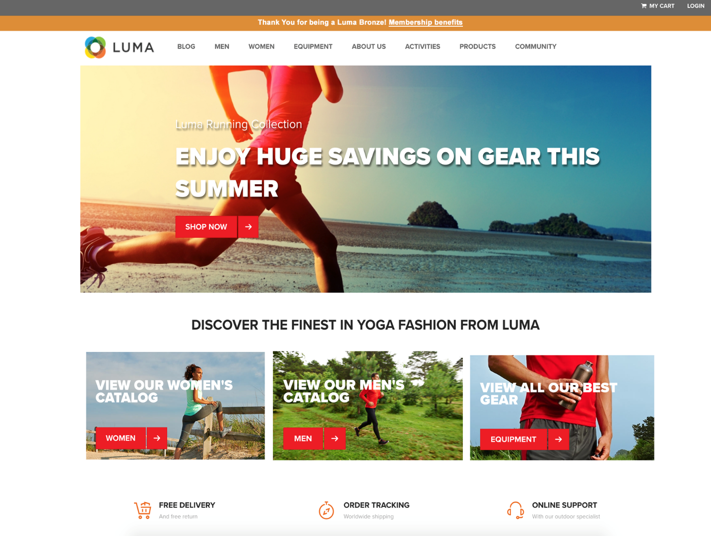

Sarahは、Adobe Experience Platformの[!DNL Real-Time Customer Profile]に基づいて、パーソナライズされたホームページ体験を動的に配信されます。

Adobe Target の Adobe Sensei によるパーソナライズ機能により、ランニング用のアパレルやギアに対する過去の購入とアフィニティが考慮され、関連するコンテンツが表示されます。Lumaはまた、直近の閲覧履歴にもとづいて、男性向けランニングギアに向けて男性のカタログコンテンツを調整しています。

ページの下の方には、特集商品と、最近閲覧された品目に基づく新しいレコメンデーショントレイを表示します。

このパーソナライズされたコンテンツは、Sarah が関連アイテムをすばやく見つけるのに役立ちます。これにより、コンバージョンが向上し、より楽しい顧客体験が得られます。

### 顧客をサイトに戻す

Sarah は気が散ってサイトを離れ、セッションを終了します。Adobe Experience Platform のデータは、Sarah を Luma サイトに戻すのに役立ちます。

Adobe Experience PlatformをベースとしたReal-Time Customer Data Platformは、顧客体験管理向けに構築されています。 これにより、組織では次のことが可能になります。

* データの統合とアクティベーションのシンプル化
* 既知のデータと不明なデータの使用の管理
* 大規模なマーケティング使用事例の加速

## 複数のデータソースの使用

Luma のチームは、顧客の行動とデータをすべて 1 か所にまとめています。

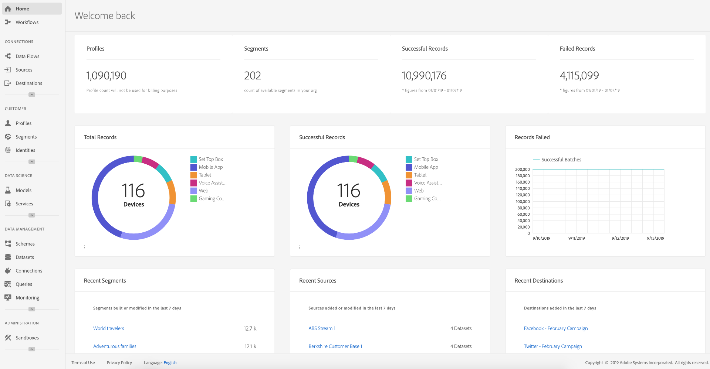

以下のソースからデータを取り込むことができます。

* 既存の Adobe Experience Cloud ソリューションデータ
* Luma のロイヤルティプログラム、コールセンター、POS システムデータなどのアドビ以外のソース
* Luma データソースからのリアルタイムストリーミングデータ
* アドビソリューションからのリアルタイムデータ（新しいタグは不要）

異なるソースからのこのデータはすべて、単一の統合された顧客プロファイルに結合されます。

## データソースの設定

[!DNL Real-Time Customer Data Platform]を使用して、新しいデータソースをExperience Platformに取り込みます。 Real-Time CDPには、プロファイルに迅速かつ容易に追加できるデータソースカタログが用意されています。

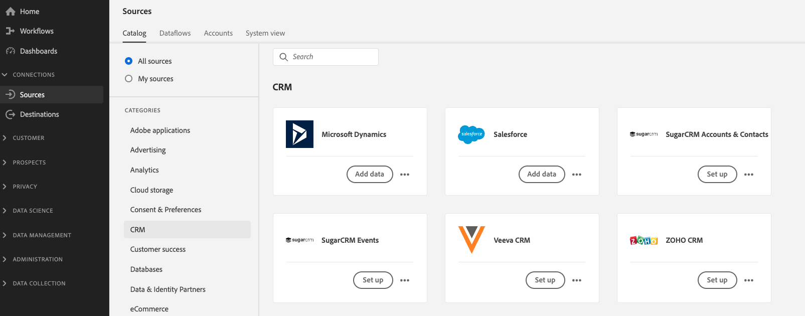

例えば、LumaのCRM データを取り込むには、*CRM*&#x200B;でカタログをフィルタリングし、*CRM*&#x200B;を含むすべての標準コネクタを一覧表示します。 [!DNL Microsoft Dynamics CRM] データを追加するには：

1. 接続を許可します。

   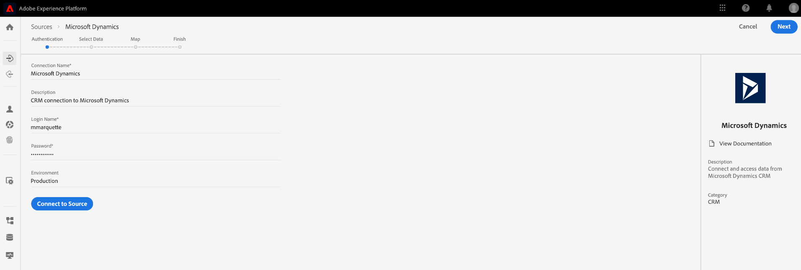

1. XDM の事前マッピング済みテーブルの推奨リストから、インポートする内容を選択します。

   <!--    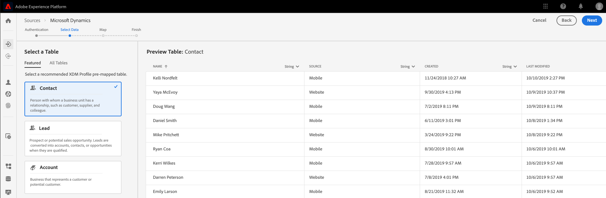 -->

   例えば、**[!UICONTROL Contacts]**&#x200B;を選択します。 連絡先データのプレビューが自動的に読み込まれ、すべてが期待どおりに表示されることを確認できます。

   Real-Time CDPでは、標準フィールドを[!DNL Experience Data Model] （XDM）プロファイルスキーマに自動マッピングすることで、このプロセスの手作業が大幅に削減されます。

1. フィールドマッピングを確認します。

   <!--    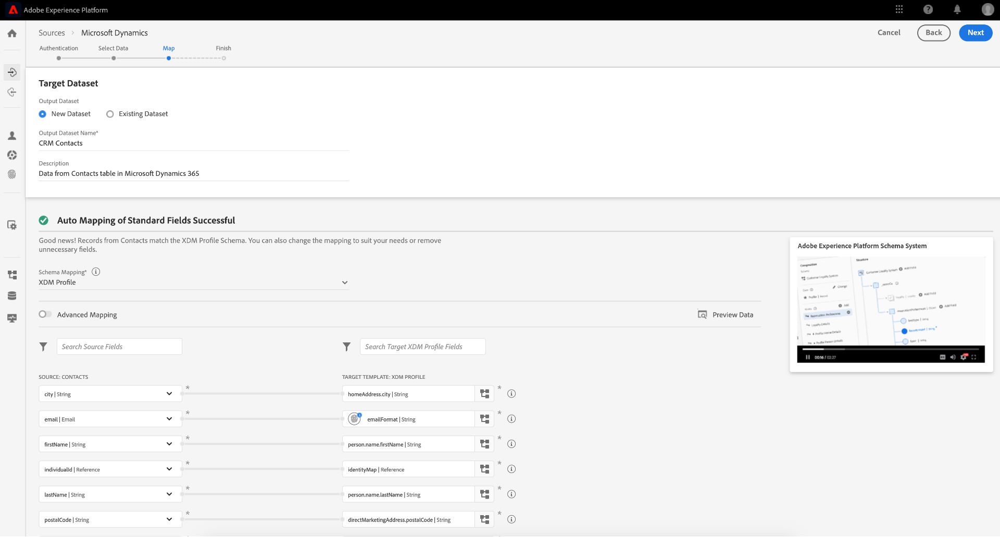 -->

   例えば、連絡先の電子メールフィールドが正しくマッピングされていることを再確認します。\
   データをプレビューし、高度なマッピングを実行するオプションもあります。

1. スケジュールを設定します。

   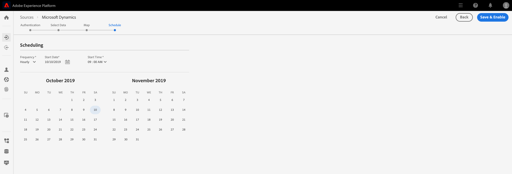

これで完了です。[!DNL Microsoft CRM]をデータソースとして[!DNL Experience Platform]に追加しました。

### 取り込んだデータに使用ポリシーのラベルを付ける

Luma　には、収集した特定の種類の情報の使用を制限する内部ポリシーが多数あります。また、データの使用に関する法的な問題やプライバシーに関する問題にも準拠する必要があります。Adobe Experience Platform データガバナンスを使用すると、事前定義されたデータ使用ラベルをデータセット（およびこれらのデータセット内の特定のフィールド）に適用でき、Luma は特定の使用制限に従ってデータを分類できます。

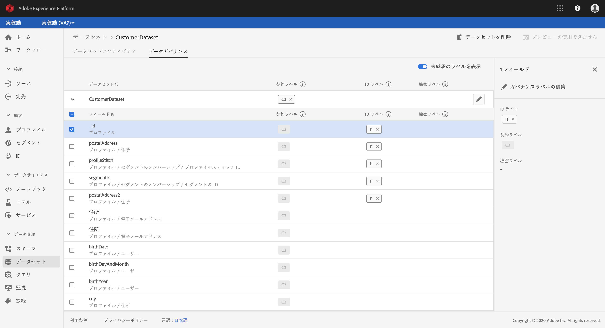

データ使用ラベルが適用されると、Luma はデータガバナンスを使用してデータ使用ポリシーを作成できます。データ使用ポリシーは、特定のラベルを含むデータで実行可能なアクションの種類を記述するルールです。Real-Time CDPでポリシー違反に該当するアクションを実行しようとすると、そのアクションは防止され、どのポリシーに違反したかとその理由を示すアラートが表示されます。

さらに、Real-Time CDPは

## 特定の顧客データの統合

このシナリオでは、Sarah Rose のプロファイルを検索します。プロファイルが表示され、ログインに使用した電子メールが送信されます。

<!-- 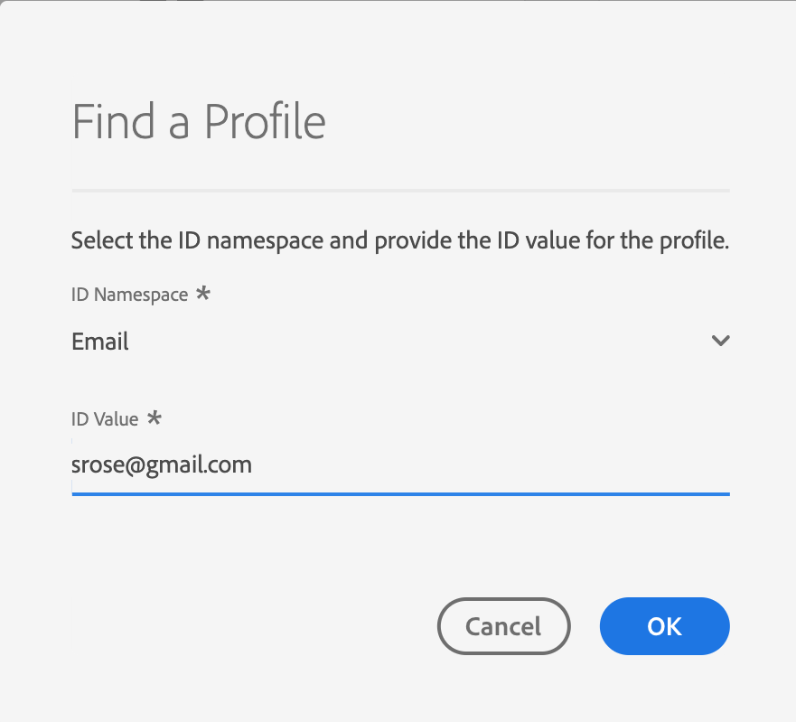 -->

Luma が所有する Sarah に関するプロファイル情報がすべて表示されます。これには、住所や電話番号、コミュニケーションの好み、対象となるオーディエンスなど、氏の個人情報が含まれます。

| カテゴリ | 説明 |
|---|---|
| ID | チャネルやデバイスをまたいでSarahとLumaとのやり取りから[!DNL Experience Platform]にリンクされたIDが表示されます。 Web サイトから Sarah の ECID が表示されます。彼女のIDには、モバイルアプリからのECID、電子メール ID、最近追加された[!DNL Microsoft Dynamics] データセットからのCRM ID、Luma ロイヤルティシステムからAdobe Experience Platformに渡されたロイヤルティ IDも含まれます。 |
| イベント | Sarah の Luma ブランドとのインタラクションデータをすべて表示します。これには、Sarah が先ほど閲覧した品目、過去に閲覧したもの、受信した電子メール、コールセンターとのやりとり、またそれぞれのインタラクションが発生したチャネルとデバイスが含まれます。 |

Real-Time CDPプロファイルは、Luma マーケティング部門のワークフローを数週間から数分に短縮し、この360度の顧客像にもとづいてパーソナライゼーションの可能性を引き出します。 このプロファイルは、サインイン前にサイトを閲覧した際の行動データと、既存の顧客プロファイルを結合し、Sarah の包括的なビューを作成します。

マーケティング部門は、この強化された[!DNL Real-Time Customer Profile]機能を利用して、Sarahの体験をより詳細にパーソナライズし、Lumaに対するブランドロイヤルティを高めることができます。

## オーディエンス

Adobe Experience Platformの強力なセグメンテーション機能により、マーケターは[!DNL Real-Time Customer Profile]に取り込まれたデータに基づいて、属性、イベント、既存のオーディエンスを組み合わせることができます。

<!-- 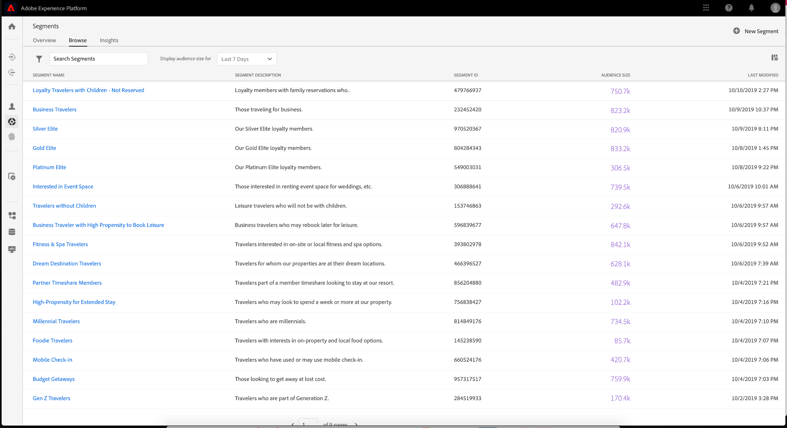 -->

このシナリオでは、Sarah が最近サイトで行った操作は、以前の操作とは異なる行動を示しています。Sarah は普段婦人服を買います。しかし、彼女の買い物かごの中のアイテムは男性の大きなスウェットシャツです。

Luma データサイエンスチームは、購入傾向に関するモデルを作成しています。あるモデルは、既存の消費者の衣料品カテゴリ（女性や紳士服など）やサイズの急激な変化を識別します。サラの購買行動の変化は、彼女が自分で買い物をしていないことを示唆しています。

<!-- 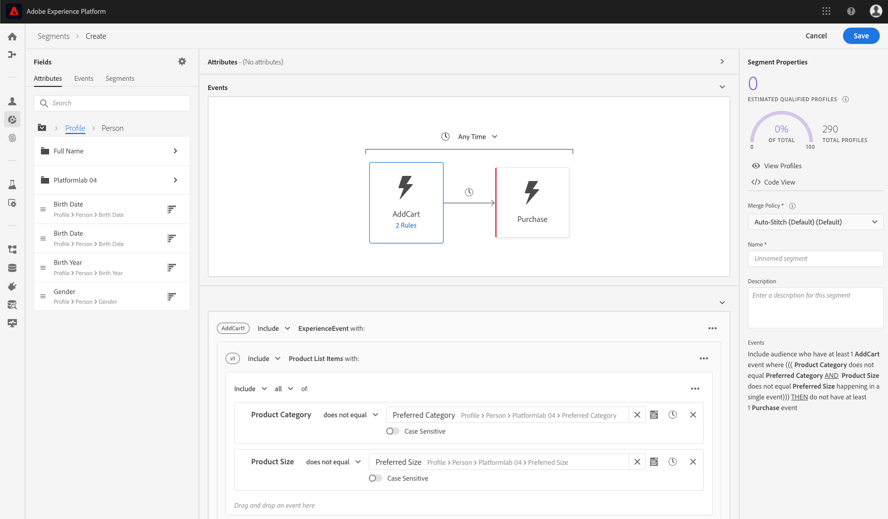 -->

### オーディエンスの定義

オーディエンスワークスペースの様々なビジュアル構成またはコードベースの式エディターオプションを使用して、ギフトを購入する過程にあるように見えるカート放棄ユーザーを表すオーディエンスを変更または作成します。

```sql
Profile: Category != Preferred Category 
AND 
Product Size != Preferred Size 
in last 7 days.  
AND 
Abandoned Cart 
AND 
Loyalty member 
```

<!-- 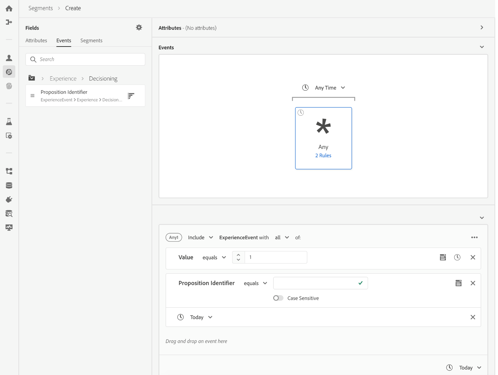-->

Sarah が買い物かごにギフトと思われる品物を追加したまま放棄したので、Luma は無料ギフトラップオファーで彼女をターゲットにすることができます。

## 宛先

「カートを放棄した人に贈るギフト」オーディエンスを追加すると、このオーディエンスに含まれている人数を大まかに確認できます。 それに対してアクションを起こし、チャネルをまたいだパーソナライゼーションに利用できます。

**[!UICONTROL Send to destinations]** を選択します。

Real-Time CDPでは、Lumaは、パーソナライズのためにオーディエンスにシームレスに対応できます。\
以下に、Luma がこの宛先を送信する際に使用できるすべての宛先（アドビソリューションとアドビ以外のソリューションの両方）を示します。

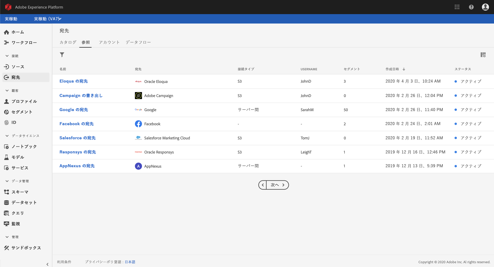

### 宛先の選択

このシナリオでは、Luma は、次の宛先にわたるパーソナライズ機能を使用して、このオーディエンスを再ターゲット化します。

* Google（表示）
  <!--* Facebook -->
* Adobe Campaign（電子メール）

<!-- 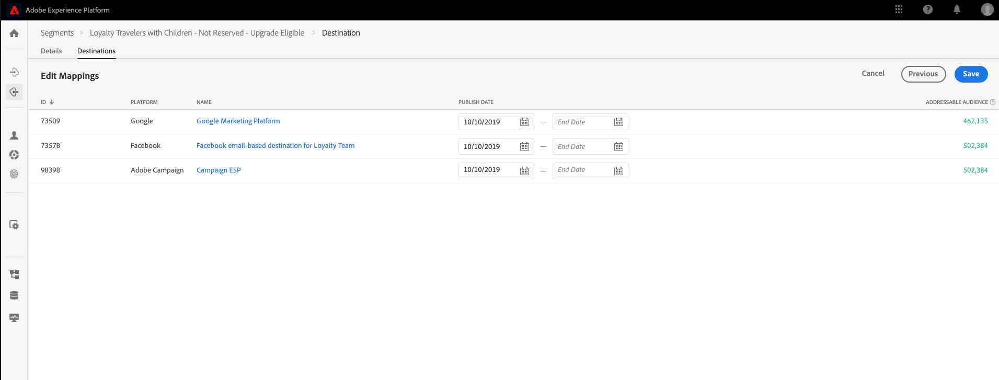 -->

### 宛先のスケジュール

特定の時間にオーディエンスの書き出しを開始または終了するようにスケジュールすることもできます。 オーディエンスは登録され、スケジュールされた日付に設定されたプラットフォームで自動的に更新されます。

>[!NOTE]
>
>オプションで、日付フィールドを選択すると、90日間のスケジュールが自動的に設定されます。

**[!UICONTROL Save]**&#x200B;を選択して次のページに移動します。

このオーディエンスの顧客が購入すると、そのオーディエンスに対するメンバーシップはリアルタイムで抑制されます。 ステータスが変更されたため、もう資格がありません。

これにより、対象外のオーディエンスのために在庫を使い果たさないことで、Luma のメディアチームのディレクターは数十万ドルを節約できます。

### 宛先に対するデータ使用ポリシーの施行

Adobe Experience Platformには、特定の宛先に対してオーディエンスをアクティブ化できるかどうかを判断するための、プライバシーとセキュリティの制御が含まれています。 アクティベーションは、作成時に宛先に割り当てられたマーケティングの目的と、組織が定義したデータ使用ポリシーに基づいて有効化または制限されます。

アクティビティがポリシーに違反する場合は、警告が表示されます。この警告には、ポリシーが違反された理由と、違反の解決方法を識別するのに役立つデータ系列情報が含まれています。

これらの制御により、[!DNL Experience Platform]はLumaが規制に準拠し、責任あるマーケティングを行うのに役立ちます。 これらの制御は柔軟で、Lumaのセキュリティおよびガバナンスチームの要件を満たすために変更でき、既知および未知の顧客データを管理するための地域および組織の要件に自信を持って対応することができます。

<!--

### Data flow canvas

When you save, a visual data flow canvas shows the segment mapped from the unified profile to the three destinations you selected.

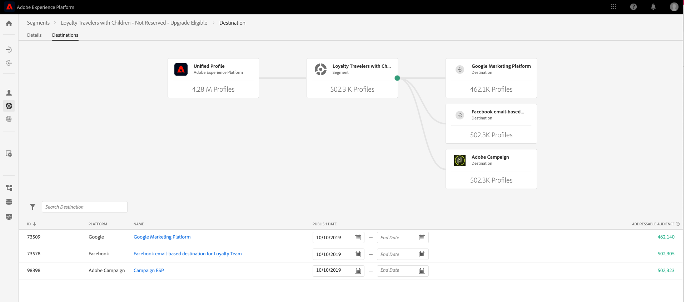

-->

## デバイス間での ID の結合

Sarah がモバイルデバイスでソーシャルメディアサイトを閲覧すると、Luma の広告が表示されます。広告では買い物かごに残した品物があることをリマインドします。

その後、Sarah がメールをチェックすると、再ターゲット化されたメッセージがあります。彼女はメールからLumaへのリンクを選択します。

このリンクから Sarah は Luma のモバイルホームページに移動して、Adobe Target が提供するパーソナライズされたエクスペリエンスを閲覧します。

* Sarah はブロンズ会員として歓迎されます。
* 彼女は「贈り物」メッセージを見ます。
* 彼女はまた、ブロンズ会員特典の一部である「無料ギフトラップ」メッセージを見ています。
* ランニングへのアフィニティに基づいて、Sarah は引き続きヒーロー画像でターゲットされています。

Sarah はトレーナーを購入し、ギフトラップを追加して、ギフトメッセージを書きます。Sarah は、また、このイベントを保存して来年ギフトを購入するためのリマインダーを受け取ることもできます。Sarah はリマインダーを受け取ることに同意し、翌年新しいギフトを購入するよう促すメールキャンペーンがスケジュールされます。

オーディエンス管理機能のおかげで、Sarah を男性用のトレーナーについてターゲットすることはなくなります。

## プロファイルの分析

Lumaのマーケターは、Adobe Experience Platformを使用して、Real-Time CDP ダッシュボードのギフトギブオーディエンスを確認します。 このイニシアチブの成果を時間の経過と共に見て、成長していることがわかります。顧客はオファーに応えて、より多くのお金を費やしています。

マーケターは、これらのインサイトにより、このシグナルに対してアクションを起こすことができます。CDPでこのデータを利用でき、Sarahのような顧客がオーディエンスに結び付けられることで、このシグナルに拍車をかけたのです。

Luma は、この CDP データを使用して、ロイヤルティと顧客満足度を高めます。
