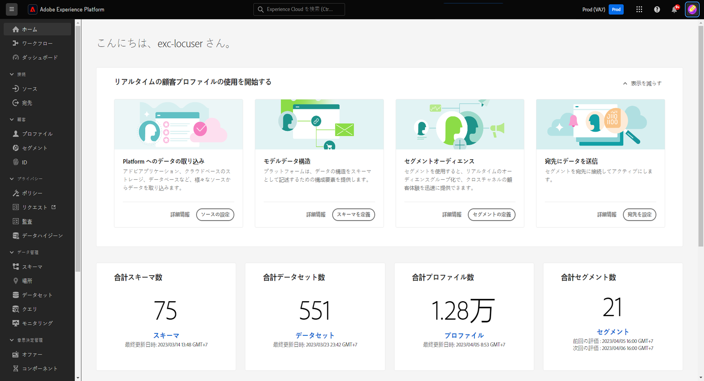
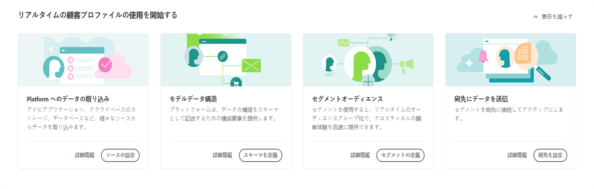
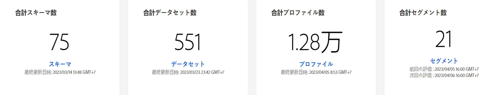
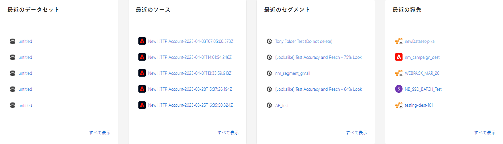
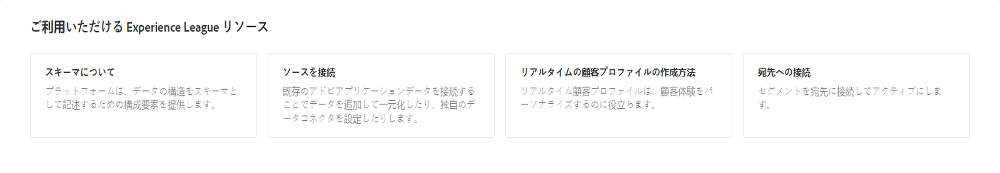

# [!DNL Real-Time Customer Data Platform] ホームページ

>[!NOTE]
>
>この [!DNL Real-Time Customer Data Platform] ホームページはベータ版です。 機能とドキュメントは変更される場合があります。

Adobe Real-time Customer Data Platform(Real-Time CDP) ホームページは、Real-Time CDPにログインした後に表示される最初のページです。

Real-Time CDPのホームページには、様々な機能にすばやくアクセスできる「はじめに」ウィジェットと、組織内のデータに関する最新の情報を表示する指標セクションが含まれています。

このドキュメントでは、Real-Time CDPのホームページと指標ダッシュボードの概要を説明します。

## はじめにウィジェット

この [!UICONTROL リアルタイム顧客プロファイルの概要] ウィジェットは次の 4 つのセクションに分かれています。

* **データの Platform への取り込み**:このウィジェットはソースカタログに移動します。 ソースカタログを使用してソースを選択し、データをExperience Platformに取り込みます。 詳しくは、 [ソースの概要](../sources/home.md)
* **モデルのデータ構造**:このウィジェットは、スキーマの概要に移動します。 スキーマの概要を使用して、既存のスキーマを参照するか、データの構造を記述する構築ブロックを作成します。 詳しくは、 [スキーマの概要](../xdm/home.md).
* **セグメントオーディエンス**:このウィジェットは、 [!DNL Segment Builder] を使用します。 以下を使用： [!DNL Segment Builder] を使用して、プロファイルデータ要素を操作し、セグメントのルールを定義します。 詳しくは、 [セグメント化サービスの概要](../segmentation/home.md).
* **宛先へのデータ送信**:このウィジェットは宛先カタログに移動します。 宛先カタログを使用して、接続してセグメントを送信できる宛先を選択します。 詳しくは、 [宛先の概要](../destinations/home.md)

## 指標ダッシュボード

指標ダッシュボードには、指標データに関する最新の情報がExperience Platformされます。 ダッシュボードは次の 2 つのセクションに分かれています。

### リーダーボード

リーダーボードには、組織内の現在のスキーマ、データセット、プロファイル、セグメントの合計数と最新の更新日が表示されます。

* **合計スキーマ**:この **合計スキーマ** カウンターは、システム内のスキーマの数を表示します。 このカウンターは、スキーマが作成されると更新されます。 詳しくは、 [スキーマの概要](../xdm/home.md).
* **合計データセット**:この **合計データセット** カウンターは、システム内のデータセットの数と、 [!DNL Platform]. このカウンターは、データセットの作成時に更新されます。データセットの詳細については、 [データセットの概要](../catalog/datasets/overview.md).
* **合計プロファイル数**:この **プロファイル** 数は、 [!DNL Real-Time Customer Profile]. プロファイルフラグメントは含まれません。これは、アドレス可能なオーディエンスの合計です。このカウントでは、「統合プロファイル」の[結合ポリシー](profile/merge-policies.md)構成で設定された既定の結合ポリシーを使用します。プロファイルの数は 24 時間ごとに更新されます。プロファイルの詳細については、 [リアルタイム顧客プロファイルの概要](../profile/home.md).
* **合計セグメント数**: **セグメント** 組織に対して作成されたセグメントの合計数が表示されます。 この数は、新しいセグメントが作成されると更新されます。セグメントの詳細については、 [セグメント化サービスの概要](../segmentation/home.md).

### 最近の項目

最近の項目には、組織内の最新の変更が一覧表示されます。 次の例では、データセット、ソース、セグメント、宛先に関する最新の変更です。

* **最近のデータセット**:この **[!UICONTROL 最近のデータセット]** カードには、組織内で作成された最新の 5 つのデータセットが表示されます。 このリストは、新しいデータセットが作成されると更新されます。データセットを選択してその項目の詳細を表示するか、「 」を選択します。 **[!UICONTROL すべて表示]** データセットのリスト用。 ここから、特定のソースを選択して詳細を表示できます。 データセットの詳細については、「[データセットの概要](../catalog/datasets/overview.md)」を参照してください。
* **最近のソース**:この **[!UICONTROL 最近のソース]** 指標カードには、組織内で作成された最新の 5 つのソースが表示されます。 このリストは、新しいソースが作成されると更新されます。ソースを選択してその項目の詳細を表示するか、「 」を選択します。 **[!UICONTROL すべて表示]** を参照してください。 ここから、特定のソースを選択して詳細を表示できます。 ソースについて詳しくは、「[ソースの概要](../sources/home.md)」を参照してください。
* **最近のセグメント**:この **[!UICONTROL 最近のセグメント]** 指標カードには、組織内で作成された最新の 5 つのセグメントが表示されます。 このリストは、新しいセグメントが作成されると更新されます。セグメントを選択してその項目の詳細を表示するか、「 」を選択します。 **[!UICONTROL すべて表示]** ：セグメントのリスト。 セグメントについて詳しくは、「[セグメント化サービスの概要](../segmentation/home.md)」を参照してください。
* **最近の宛先**:この **[!UICONTROL 最近の宛先]** 指標カードには、組織内で作成された最新の 5 つの宛先が表示されます。 このリストは、新しい宛先が作成されると更新されます。宛先を選択してその項目の詳細を表示するか、「 」を選択します **[!UICONTROL すべて表示]** ：宛先のリスト。 詳しくは、 [宛先の概要](../destinations/home.md).

## リソース

最後に、リソースウィジェットには、参照可能な追加のドキュメントリソースが表示されます。 これには、以下が含まれます。

* [スキーマ](../xdm/schema/composition.md)
* [ソースの接続](../sources/home.md)
* [リアルタイム顧客プロファイルの入力方法](../profile/home.md)
* [宛先の接続](../destinations/home.md)
* [アクセスの管理](../access-control/abac/overview.md)

<!-- ### Successful profile records

In the leaderboard **[!UICONTROL Successful profile records]** shows the total number of records that have been successfully processed into the profile.

There is also a metric card that shows the percentage of successful records. Select **[!UICONTROL View datasets]** to see more details about the profile records. Hover over the colored area of the graph to see additional details:

The number of successful profile records is updated hourly. 

For more information about profiles, see [A unified view of your customer in Real-Time CDP](profile/profile-overview.md).

### Total profile records

The **[!UICONTROL Total profile records]** metric card shows the total number of data records enabled to feed into the profiles, and the percentage that are successful, updated once per day. This does not include all data in the data lake, because some data might not be enabled to feed into the profiles.

 Hover over the colored area of the graph to see additional details about the successful profiles:

Select **[!UICONTROL View profiles]** to see more details about the profile records.

For more information about profiles, see [A unified view of your customer in Real-Time CDP](profile/profile-overview.md).

For more information about viewing a specific profile, see [Profile viewer](profile/profile-viewer.md).

### Failed profile records

In the leaderboard, **[!UICONTROL Failed profile records]** counts the number of records that failed to process into the profile.

The **[!UICONTROL Failed profile records]** metric card shows this count, and includes a graphical representation that helps you see how failures have trended during the time shown below the graphic. This chart is updated hourly. Select **[!UICONTROL View datasets]** to see more details about the profile records.

The number of failed profile records is updated hourly. -->
