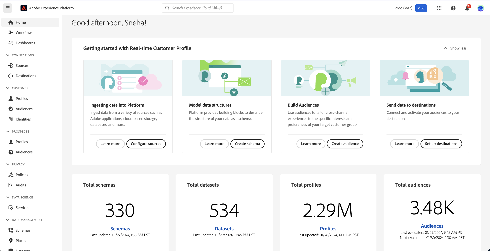
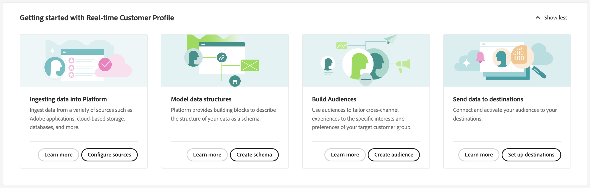
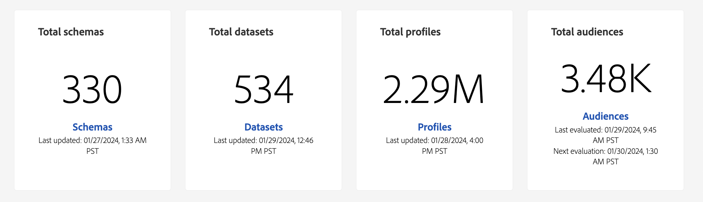
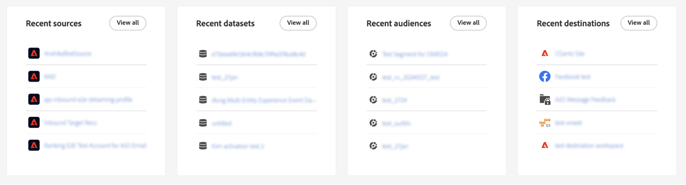
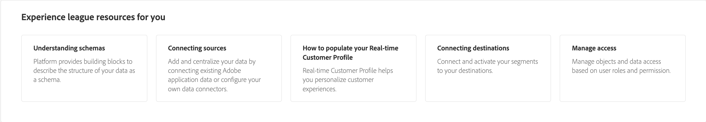
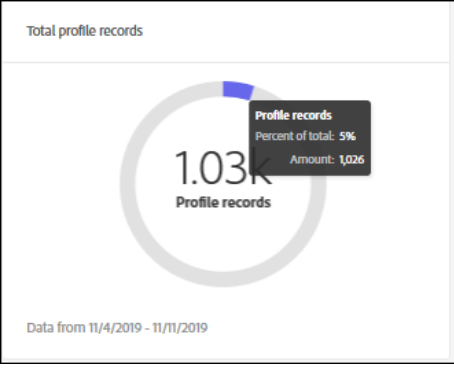
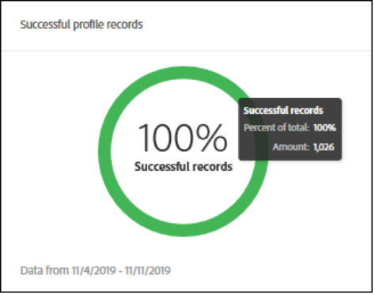

# [!DNL Real-Time Customer Data Platform] ホームページ

Adobe Real-Time Customer Data Platform（Real-Time CDP）のホームページは、Real-Time CDPにログインした後に最初に表示されるページです。

Real-Time CDPのホームページには、いくつかの機能にすばやくアクセスできる入門ウィジェットと、組織内のデータに関する最新情報を表示する指標セクションが含まれています。

このドキュメントでは、Real-Time CDP ホームページと指標ダッシュボードの概要を説明します。

## はじめに

[!UICONTROL Getting started with Real-Time Customer Profile] ウィジェットは4つのセクションに分かれています。

* **Experience Platformにデータを取り込む**：このウィジェットは、ソースカタログに移動します。 ソースカタログを使用してソースを選択し、データをExperience Platformに取り込みます。 「**[ソースを設定]**」を選択して、ソースカタログに移動します。 詳しくは、[ソースの概要](../sources/home.md)を参照してください。
* **モデル データ構造**：このウィジェットは、スキーマの概要に移動します。 スキーマの概要を使用して、既存のスキーマを参照するか、データの構造を説明するブループリントを作成します。 **[!UICONTROL Create schema]**&#x200B;を選択して、スキーマ作成インターフェイスに移動します。 詳しくは、[ スキーマの概要](../xdm/home.md)を参照してください。
* **オーディエンスを作成**：このウィジェットは、UIのセグメントビルダーに移動します。 セグメントビルダーを使用してプロファイルデータ要素を操作し、セグメント定義の基準を定義します。 **[!UICONTROL Create audience]**&#x200B;を選択してセグメントビルダーに移動します。 詳しくは、[ セグメント化サービスの概要](../segmentation/home.md)を参照してください。
* **宛先にデータを送信**：このウィジェットは、宛先カタログに移動します。 宛先カタログを使用して、オーディエンスの接続先および送信先となる宛先を選択します。 宛先カタログに移動するには、**[!UICONTROL Set up destinations]**&#x200B;を選択します。 詳しくは、[宛先の概要](../destinations/home.md)を参照してください。

## 指標ダッシュボード {#metrics-dashboard}

>[!CONTEXTUALHELP]
>id="platform_home_metrics_totalProfiles"
>title="合計プロファイル数"
>abstract="組織が Experience Platform 内に持つプロファイルの合計数。この数は、組織の結合ポリシーに基づいており、プロファイルフラグメントは含まれません。プロファイルの数は 24 時間ごとに更新されます。"
>additional-url="https://experienceleague.adobe.com/docs/experience-platform/profile/ui/user-guide.html?lang=ja#profile-count" text="詳しくは、ドキュメントを参照してください"

指標ダッシュボードには、Experience Platform データに関する最新情報が表示されます。 ダッシュボードは次の2つのセクションに分かれています。

### リーダーボード

リーダーボードには、組織内の現在のスキーマ、データセット、プロファイル、オーディエンスの合計数と、最新の更新日が表示されます。

* **合計スキーマ**: **合計スキーマ** カウンターには、システム内のスキーマの数が表示されます。 このカウンターは、スキーマの作成時に更新されます。 詳しくは、[ スキーマの概要](../xdm/home.md)を参照してください。
* **合計データセット**: **合計データセット** カウンターには、システム内のデータセットの数とExperience Platform内のデータの量が表示されます。 このカウンターは、データセットの作成時に更新されます。 データセットについて詳しくは、[ データセットの概要](../catalog/datasets/overview.md)を参照してください。
* **合計プロファイル**: **プロファイル**&#x200B;数は、組織がExperience Platform内に保持しているプロファイルの合計数を示します。 プロファイルフラグメントは含まれません。これがTAMです。 このカウントは、Real-Time Customer Profileの結合ポリシー設定で設定されているデフォルトの[結合ポリシー](profile/merge-policies.md)を使用します。 プロファイルの数は、24時間ごとに1回更新されます。 「**[!UICONTROL Profiles]**」を選択して、プロファイルの概要ページに移動し、すべてのプロファイル指標を表示します。 プロファイルについて詳しくは、[ リアルタイム顧客プロファイルの概要](../profile/home.md)を参照してください。
* **合計オーディエンス**: **合計オーディエンス** カウンターには、組織で作成されたオーディエンスの合計数が表示されます。 この数値は、新しいオーディエンスが作成されたときに更新されます。 オーディエンスについて詳しくは、[ セグメント化サービスの概要](../segmentation/home.md)を参照してください。

### 最近使用した項目

「最近使用した項目」には、組織の最新の変更が一覧表示されます。 次の例では、最新の変更はデータセット、ソース、オーディエンス、宛先に関連しています。

* **最近のデータセット**: **[!UICONTROL Recent datasets]** カードには、組織内で作成された5つの最新のデータセットが表示されます。 このリストは、新しいデータセットが作成されたときに更新されます。 データセットを選択して、その項目の詳細を表示するか、データセットのリストで&#x200B;**[!UICONTROL View all]**&#x200B;を選択します。 そこから、特定のソースを選択して詳細を確認できます。 データセットの詳細については、「[データセットの概要](../catalog/datasets/overview.md)」を参照してください。
* **最近のソース**: **[!UICONTROL Recent sources]**&#x200B;指標カードには、組織内で作成された5つの最新のソースが表示されます。 このリストは、新しいソースが作成されたときに更新されます。 ソースを選択して、その項目の詳細を表示するか、ソースのリストで&#x200B;**[!UICONTROL View all]**&#x200B;を選択します。 そこから、特定のソースを選択して詳細を確認できます。 ソースについて詳しくは、「[ソースの概要](../sources/home.md)」を参照してください。
* **最近のオーディエンス**: **[!UICONTROL Recent audiences]**&#x200B;指標カードには、組織内で作成された5つの最新のオーディエンスが表示されます。 このリストは、新しいオーディエンスが作成されたときに更新されます。 オーディエンスを選択して、その項目の詳細を表示するか、オーディエンスのリストに「**[!UICONTROL View all]**」を選択します。 オーディエンスについて詳しくは、[ セグメント化サービスの概要](../segmentation/home.md)を参照してください。
* **最近の宛先**: **[!UICONTROL Recent destinations]**&#x200B;指標カードには、組織内で作成された5つの最新の宛先が表示されます。 このリストは、新しい宛先が作成されたときに更新されます。 宛先を選択して、その項目の詳細を表示するか、宛先のリストに&#x200B;**[!UICONTROL View all]**&#x200B;を選択します。 詳しくは、[宛先の概要](../destinations/home.md)を参照してください。

## リソース

最後に、リソースウィジェットには、参照できる追加のドキュメントリソースが表示されます。 これには、以下が含まれます。

* [スキーマ](../xdm/schema/composition.md)
* [ソースを接続](../sources/home.md)
* [リアルタイム顧客プロファイルの作成方法](../profile/home.md)
* [宛先への接続](../destinations/home.md)
* [アクセスの管理](../access-control/abac/overview.md)

<!-- 
### Successful profile records

In the leaderboard **[!UICONTROL Successful profile records]** shows the total number of records that have been successfully processed into the profile.

There is also a metric card that shows the percentage of successful records. Select **[!UICONTROL View datasets]** to see more details about the profile records. Hover over the colored area of the graph to see additional details:

The number of successful profile records is updated hourly. 

For more information about profiles, see [A unified view of your customer in Real-Time CDP](profile/profile-overview.md).

### Total profile records

The **[!UICONTROL Total profile records]** metric card shows the total number of data records enabled to feed into the profiles, and the percentage that are successful, updated once per day. This does not include all data in the data lake, because some data might not be enabled to feed into the profiles.

 Hover over the colored area of the graph to see additional details about the successful profiles:

Select **[!UICONTROL View profiles]** to see more details about the profile records.

For more information about profiles, see [A unified view of your customer in Real-Time CDP](profile/profile-overview.md).

For more information about viewing a specific profile, see [Profile viewer](profile/profile-viewer.md).

### Failed profile records

In the leaderboard, **[!UICONTROL Failed profile records]** counts the number of records that failed to process into the profile.

The **[!UICONTROL Failed profile records]** metric card shows this count, and includes a graphical representation that helps you see how failures have trended during the time shown below the graphic. This chart is updated hourly. Select **[!UICONTROL View datasets]** to see more details about the profile records.

The number of failed profile records is updated hourly. 
-->
