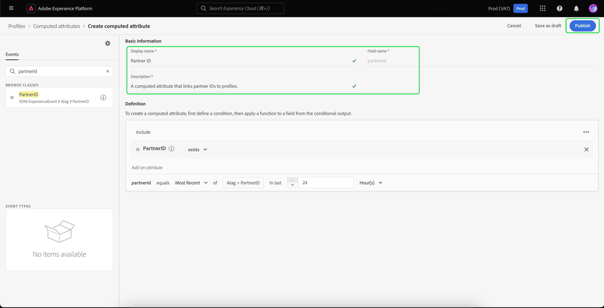
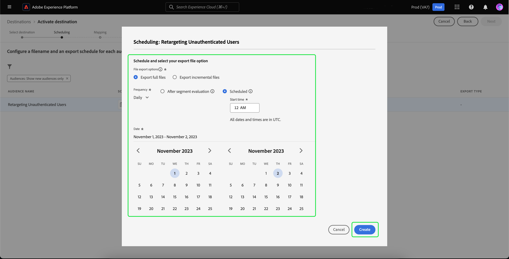

# 未認証訪問者のオフサイトリターゲティング

>[!AVAILABILITY]
>
>この機能は、Real-Time CDP(App Service)、Adobe Experience Platform Activation、Real-Time CDP、Real-Time CDP Prime、Real-Time CDP Ultimate のライセンスを持つお客様が利用できます。 これらのパッケージについて詳しくは、[製品の説明](https://helpx.adobe.com/jp/legal/product-descriptions.html)を参照し、アドビ担当者にお問い合わせください。

未認証の訪問者のオーディエンスを構築し、パートナー提供の永続 ID を使用して再ターゲティングする方法を説明します。

## この使用例を考慮する理由 {#why-use-case}

サードパーティ Cookie の廃止に伴い、デジタルマーケターは、匿名の訪問者との再エンゲージメントに向けた戦略を再考する必要があります。 リアルタイムの訪問者認識のために ID ベンダーとの統合を選択したブランドは、オフサイトの有料メディアのリターゲティングにパートナーが提供した永続的な識別子も利用できます。

大量のトラフィックにもかかわらず、多くのブランドでは、コンバージョン段階で大幅な減少が見られます。 訪問者はコンテンツや製品のデモに関与しますが、登録や購入をせずに離脱します。

オンサイトエンゲージメントに基づいてオーディエンスを構築してマーケティングメッセージをパーソナライズできるだけでなく、Adobeのパートナー ID に対するサポートを利用して、有料メディアの宛先をまたいで訪問者と再び関わることもできます。

## 前提条件と計画 {#prerequisites-and-planning}

未認証の訪問者の再ターゲティングを計画する場合は、計画プロセス中に次の前提条件を考慮してください。

- 適切な ID 名前空間を使用してパートナー ID を設定したか。

さらに、このユースケースを実装するには、次のReal-Time CDP機能と UI 要素を利用します。 これらの領域に必要な属性ベースのアクセス制御権限を持っていることを確認するか、必要な権限をシステム管理者に付与するように依頼してください。

- [オーディエンス](../../segmentation/home.md)
- [計算属性](../../profile/computed-attributes/overview.md)
- [宛先](../../destinations/home.md)
- [Web SDK](../../edge/home.md)

## パートナーデータをReal-Time CDPに取得する {#get-data-in}

未認証の訪問者のオーディエンスを作成するには、まずパートナーデータをReal-Time CDPに取り込む必要があります。

Web SDK を使用してReal-Time CDPにデータを最適にインポートする方法については、 [データ管理およびイベントデータ収集の節](./onsite-personalization.md#data-management) オンサイトパーソナライゼーションの使用例を参照してください。

## パートナーが提供した ID を転送する {#bring-partner-ids-forward}

パートナー提供の ID をイベントデータセットに読み込んだ後、このデータをプロファイルレコードに取り込む必要があります。 これをおこなうには、計算済み属性を使用します。

計算済み属性を使用すると、プロファイル行動データをプロファイルレベルで集計値にすばやく変換できます。 その結果、「全期間購入合計」などの式をプロファイルに使用して、計算済み属性をオーディエンス内で簡単に使用できます。 計算済み属性の詳細については、 [計算済み属性の概要](../../profile/computed-attributes/overview.md).

計算済み属性にアクセスするには、「 **[!UICONTROL プロファイル]** 続いて **[!UICONTROL 計算済み属性]** および **[!UICONTROL 計算済み属性を作成]**.

![The [!UICONTROL 計算済み属性の作成] ボタンは、 [!UICONTROL 計算済み属性] タブ内の [!UICONTROL プロファイル] ワークスペース。](../assets/offsite-retargeting/create-ca.png)

The **[!UICONTROL 計算済み属性を作成]** ページが表示されます。 このページでは、コンポーネントを使用して計算済み属性を作成できます。

>[!NOTE]
>
>計算済み属性の作成の詳細については、 [計算済み属性 UI ガイド](../../profile/computed-attributes/ui.md).

この使用例では、計算済み属性を作成できます。パートナー ID が存在する場合、過去 24 時間以内にパートナー ID の最新の値を取得します。

検索バーを使用して、「Partner ID」イベントを検索して追加できます。 [オンサイトパーソナライゼーションの使用例で作成した](#get-data-in) を計算済み属性キャンバスに追加します。

![The [!UICONTROL イベント] 」タブと検索バーがハイライト表示されます。](../assets/offsite-retargeting/ca-add-partner-id.png)

「Partner ID」イベントを定義に追加した後、イベントのフィルター条件を **[!UICONTROL 存在する]**、イベントのフィルター条件を **[!UICONTROL 最新]** 追加されたパートナー ID の値、および 24 時間のルックバック期間。

計算済み属性に適切な名前（「パートナー ID」など）と説明を入力し、「 」を選択します。 **[!UICONTROL 公開]** をクリックして、計算済み属性の作成プロセスを完了します。

## 計算済み属性を使用したオーディエンスの作成 {#create-audience}

計算済み属性を作成したら、この計算済み属性を使用してオーディエンスを作成できます。 この例では、今月 5 回以上 Web サイトを訪問したが、まだサインアップしていない訪問者で構成されるオーディエンスを作成します。

オーディエンスを作成するには、 **[!UICONTROL オーディエンス]**&#x200B;に続いて **[!UICONTROL オーディエンスを作成]**.

![The [!UICONTROL オーディエンスを作成] ボタンがハイライト表示されます。](../assets/offsite-retargeting/create-audience.png)

ダイアログが表示され、次のいずれかを選択するよう求められます。 [!UICONTROL オーディエンスを作成] および [!UICONTROL ルールを作成]. 選択 **[!UICONTROL ルールを作成]** 続いて **[!UICONTROL 作成]**.

![The [!UICONTROL ルールを作成] ボタンがハイライト表示されます。](../assets/offsite-retargeting/select-build-rule.png)

セグメントビルダーページが表示されます。 このページでは、コンポーネントを使用してオーディエンスを構築できます。

>[!NOTE]
>
>セグメントビルダーの使用方法の詳細については、 [セグメントビルダー UI ガイド](../../segmentation/ui/segment-builder.md).

これらの訪問者を見つける目標を達成するには、まず **[!UICONTROL ページビュー]** イベントをオーディエンスに送信します。 を選択します。 **[!UICONTROL イベント]** 下のタブ **[!UICONTROL フィールド]**&#x200B;をクリックし、 **[!UICONTROL ページビュー]** イベントを追加し、イベントセクションキャンバスに追加します。

![The [!UICONTROL イベント] 」タブをクリックします。 [!UICONTROL フィールド] セクションがハイライト表示され、 [!UICONTROL ページビュー]イベント。](../assets/offsite-retargeting/add-page-view.png)

新しく追加された **[!UICONTROL ページビュー]** イベント。 ルックバック期間を次の値から変更： **[!UICONTROL いつでも]** から **[!UICONTROL 今月]**&#x200B;をクリックし、イベントルールを変更して、次を含めます。 **5 以上**.

![追加されたの詳細 [!UICONTROL ページビュー] イベントが表示されます。](../assets/offsite-retargeting/edit-event.png)

イベントを追加した後、属性を追加する必要があります。 未認証の訪問者を扱っているので、先ほど作成した計算済み属性を追加できます。 新しく作成された計算済み属性を使用すると、パートナー ID をオーディエンスにリンクできます。

計算済み属性を追加するには、次の場所にあります。 **[!UICONTROL 属性]**&#x200B;を選択します。 **[!UICONTROL XDM 個人プロファイル]**&#x200B;に続いて **[組織のテナント ID](../../xdm/api/getting-started.md#know-your-tenant-id).**, **[!UICONTROL SystemComputedAttributes]**、および **[!UICONTROL PartnerID]**. 次に、 **[!UICONTROL 値]** の計算済み属性をキャンバスの「属性」セクションに追加します。

さらに、 **[!UICONTROL 電子メール（個人）]** をクリックし、 **[!UICONTROL 住所]** 以下の属性 **[!UICONTROL PartnerID]** をキャンバスの「属性」セクションに追加します。

![The [!UICONTROL PartnerID] 計算済み属性と [!UICONTROL 個人の電子メールアドレス] 属性がセグメントビルダーキャンバスでハイライト表示されています。](../assets/offsite-retargeting/added-attributes.png)

属性を追加したら、評価基準を設定する必要があります。 の場合 **[!UICONTROL PartnerID]**、条件をに設定します。 **[!UICONTROL 存在する]**&#x200B;の場合は、の場合は **[!UICONTROL 住所]**、条件をに設定します。 **[!UICONTROL 存在しない]**.

これで、パートナーが提供した ID を持つが、まだサイトにサインアップしていない高い頻度の訪問者を探すオーディエンスが正常に作成されました。 オーディエンスに「Retargeting Unauthenticated Users」という名前を付け、を選択します。 **[!UICONTROL 保存]** をクリックして、オーディエンスの作成を完了します。

## オーディエンスをアクティブ化 {#activate-audience}

オーディエンスを正常に作成したら、ダウンストリームの宛先に対してこのオーディエンスをアクティブ化できます。 選択 **[!UICONTROL オーディエンス]** 左側のナビゲーションレールで、新しく作成したオーディエンスを探し、省略記号アイコンを選択して、「 」を選択します。 **[!UICONTROL 宛先に対して有効化]**.

![The [!UICONTROL 宛先に対して有効化] ボタンがハイライト表示されます。](../assets/offsite-retargeting/activate-to-destination.png)

>[!NOTE]
>
>すべての宛先タイプ（ファイルベースの宛先を含む）は、パートナー ID を使用したオーディエンスのアクティベーションをサポートします。
>
>宛先に対するオーディエンスのアクティブ化について詳しくは、 [アクティベーションの概要](../../destinations/ui/activation-overview.md).

The **[!UICONTROL 宛先を有効化]** ページが表示されます。 このページでは、宛先をアクティブ化する宛先を選択できます。 目的の宛先を選択したら、「 」を選択します。 **[!UICONTROL 次へ]**.

The **[!UICONTROL スケジュール]** ページが表示されます。 このページでは、オーディエンスをアクティブ化する頻度を決定するスケジュールを作成できます。 選択 **[!UICONTROL スケジュールを作成]** ：オーディエンスのアクティベーションのスケジュールを作成します。

![The [!UICONTROL スケジュールを作成] ボタンがハイライト表示されます。](../assets/offsite-retargeting/select-create-schedule.png)

The [!UICONTROL スケジュール] ポップオーバーが表示されます。 このページでは、オーディエンスのアクティベーションのスケジュールを作成できます。 スケジュールを設定したら、 **[!UICONTROL 作成]** をクリックして続行します。

スケジュールの詳細を確認したら、 **[!UICONTROL 次へ]**.

The **[!UICONTROL 属性を選択]** ページが表示されます。 このページでは、アクティブ化されたオーディエンスと共に、書き出す属性を選択できます。 少なくとも、パートナー ID を含めると、再ターゲット化する予定の訪問者を識別できます。そのため、この ID を使用すると、パートナー ID を再ターゲット化する必要が生じます。 選択 **[!UICONTROL 新しいマッピングを追加]** 計算済み属性を検索します。 必要な属性を追加したら、「 」を選択します。 **[!UICONTROL 次へ]**.

![両方の [!UICONTROL 新しいマッピングを追加] ボタンと計算済み属性がハイライト表示されます。](../assets/offsite-retargeting/add-new-mapping.png)

The **[!UICONTROL レビュー]** ページが表示されます。 このページでは、オーディエンスのアクティベーションの詳細を確認できます。 指定した詳細情報に問題がない場合は、「 」を選択します。 **[!UICONTROL 完了]**.

![The [!UICONTROL レビュー] ページが表示され、audience activation の詳細が表示されます。](../assets/offsite-retargeting/review-destination-activation.png)

これで、未認証ユーザーのオーディエンスを、さらなる再ターゲティングのためにダウンストリームの宛先に対してアクティブ化しました。

## その他の使用例 {#other-use-cases}

Real-Time CDPのパートナーデータサポートを通じて有効化されたその他のユースケースを調べることができます。

- [新規顧客を惹きつけ、獲得する](./prospecting.md) パートナーデータを使用して。
- [オンサイトエクスペリエンスのパーソナライズ](./offsite-retargeting.md) パートナーの支援による訪問者の認識を使用して
- [ファーストパーティプロファイルの補足](./supplement-first-party-profiles.md) と、パートナーが指定した属性。
