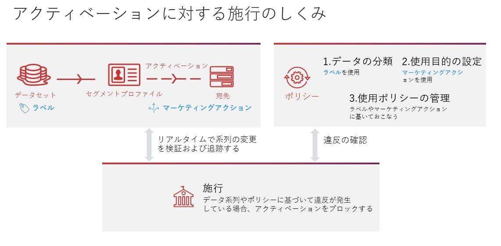
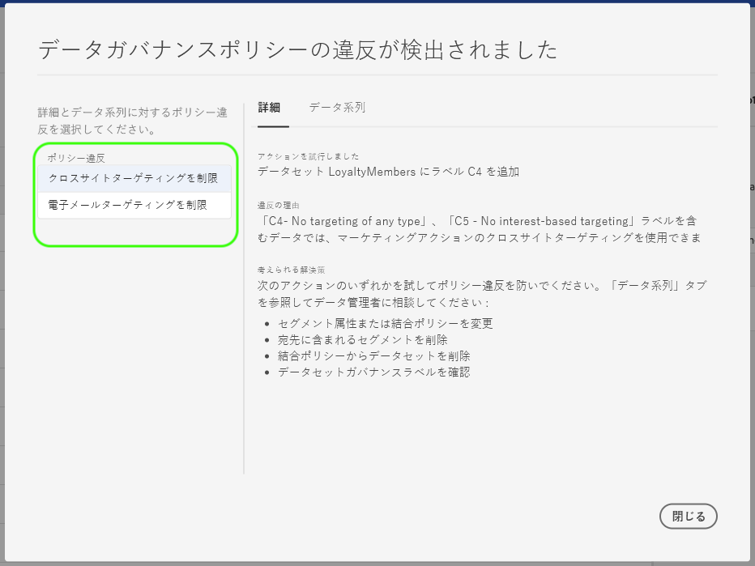
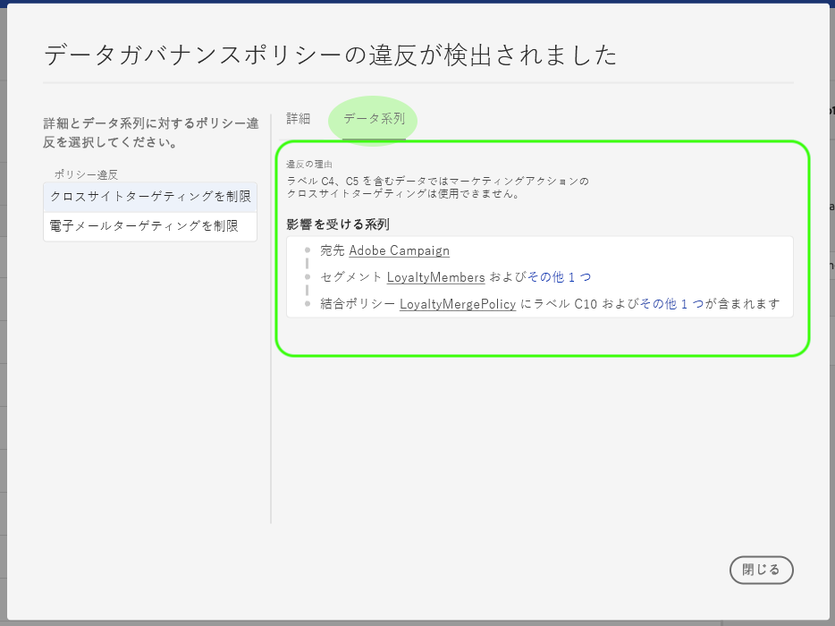

# [!DNL Data Governance] リアルタイムCDP

[!DNL Real-time Customer Data Platform] （リアルタイムCDP）は、複数のエンタープライズ・システムからのデータを統合し、マーケティング担当者が顧客をより良く識別、理解、関与できるようにします。 このデータは、組織または法規制によって定義された使用制限の対象となる場合があります。したがって、リアルタイム CDP が使用ポリシーに準拠していることを確認し、データを処理することが重要です。

Adobe Experience Platform [!DNL Data Governance] allows you to manage customer data and ensure compliance with regulations, restrictions, and policies applicable to data use. データガバナンスは リアルタイム CDP 内で重要な役割を果たし、使用ポリシーの定義、それらのポリシーに基づくデータの分類、特定のマーケティングアクションの実行時のポリシー違反を確認できるようになります。

Real-time CDP is built on top of Adobe Experience Platform, and therefore the majority of [!DNL Data Governance] capabilities are covered in the [!DNL Experience Platform] documentation. 本書は、 の『[データガバナンスの概要](../../data-governance/home.md)』を補完するものであり、リアルタイム CDP で利用可能なガバナンス機能の概要を説明しています。[!DNL Experience Platform]以下のトピックを取り上げます。

* [データへの使用状況ラベルの適用](#labels)
* [データ使用ポリシーの管理](#policies)
* [データ使用コンプライアンスの実施](#enforce-data-usage-compliance)

## データへの使用状況ラベルの適用 {#labels}

[!DNL Data Governance] 使用状況ラベルをデータセットレベルまたはデータセットフィールドレベルでデータに適用できます。 データ使用状況ラベルを使用すると、データに適用される使用ポリシーに従ってデータを分類できます。

データ使用状況ラベルの使用について詳しくは、Adobe Experience Platform の『[データ使用ラベルユーザーガイド](../../data-governance/labels/overview.md)』を参照してください。

## 宛先のマーケティング使用例の設定 {#destinations}

宛先にデータの使用制限を設定するには、その宛先に対するマーケティングの使用例（マーケティングアクションとも呼ばれます）を定義します。 宛先のマーケティングの使用例は、その宛先にエクスポートされるデータの意図を示します。

>[!NOTE]
>
>マーケティングアクションとデータ使用ポリシーでのその使用について詳しくは、ドキュメントの [データ使用ポリシーの概要](../../data-governance/policies/overview.md)[!DNL Experience Platform] を参照してください。

宛先に対するマーケティングの使用例を定義すると、それらの宛先に送信されるプロファイルやセグメントがデータ使用ポリシーに確実に準拠していることを確認できます。 したがって、アクティベーションに対するポリシー制限を実施するための組織のニーズに基づいて、目的のマーケティングの使用例を宛先に追加する必要があります。

マーケティングの使用例は、宛先を初めて設定する場合にのみ選択できます。 操作している宛先のタイプに応じて、マーケティングの使用例を設定するオポチュニティは、セットアップワークフローの様々なポイントに表示されます。 特定の [宛先を設定する手順については、](../destinations/destinations-overview.md) 宛先ドキュメントを参照してください。

## データ使用ポリシーの管理 {#policies}

データ使用状況ラベルがデータのコンプライアンスを効果的にサポートするためには、データ使用ポリシーを定義し、有効にする必要があります。データ使用ポリシーは、リアルタイム CDP 内のデータに対して実行を許可（／制限）するマーケティングアクションの種類を記述するルールです詳しくは、 で『[!DNL Experience Platform][データガバナンスの概要](../../data-governance/home.md)』の「データ使用ポリシー」の節を参照してください。

Adobe Experience Platform では、一般的な顧客体験の使用例に対して、いくつかの&#x200B;**コアポリシー**&#x200B;があります。これらのポリシーは、「 **[!UICONTROL ポリシー]** 」ワークスペースに移動し、「 **[!UICONTROL 参照]** 」タブを選択すると、UIで表示できます。 独自のカスタムポリシーの作成方法など、UIでのポリシーの操作に関する詳細な手順については [、](../../data-governance/policies/user-guide.md) ドキュメントの「 [!DNL Experience Platform] policiesユーザーガイド」を参照してください。

## データ使用コンプライアンスの実施 {#enforce-data-usage-compliance}

データにラベルが付けられ、使用ポリシーが定義されたら、データ使用に対するポリシーのコンプライアンスを適用できます。When activating audience segments to destinations in Real-time CDP, [!DNL Data Governance] automatically enforces usage policies should any violations occur.

次の図は、ポリシーの実施により、セグメントのアクティベーションのデータフローにどのように統合されるかを示しています。

When a segment is first activated, DULE [!DNL Policy Service] checks for policy violations based on the following factors:

* アクティブ化するセグメント内のフィールドおよびデータセットに適用される、データ使用ラベル。
* 宛先のマーケティングの目的。

>[!NOTE]
>
>データセット内の特定のフィールド（データセット全体ではなく）にのみ適用されたデータ使用量ラベルがある場合、アクティベーションに対するこれらのフィールドレベルラベルの適用は、次の条件でのみ発生します。
>* これらのフィールドは、セグメント定義で使用されます。
>* フィールドは、ターゲット先の投影属性として設定されます。

### ポリシー違反メッセージ {#enforcement}

セグメントをアクティブ化（または[既にアクティブ化されたセグメントを編集](#policy-enforcement-for-activated-segments)）しようとするとポリシー違反が発生した場合、アクションは実行されず、1 つ以上のポリシーに違反したことを示すポップオーバーが表示されます。ポリシー違反の詳細を表示するには、その違反の左列のポップオーバーでポリシー違反を選択します。

ポップオーバーの「*[!UICONTROL 詳細]*」タブには、違反をトリガーしたアクションと違反が発生した理由、および問題を解決できる可能性がある方法の案が表示されます。

「**[!UICONTROL データ系列]**」をクリックして、違反をトリガーしたデータラベルが付けられた宛先、セグメント、結合ポリシーまたはデータセットを追跡します。

違反がトリガーされると、データ使用ポリシーに従って適切なコンポーネントが更新されるまで「**[!UICONTROL 保存]**」ボタンはアクティベーションできなくなります。

### アクティブ化されたセグメントに対するポリシー施行 {#policy-enforcement-for-activated-segments}

ポリシーの施行は、アクティブ化された後も引き続きセグメントに適用され、ポリシー違反の原因となったセグメントや宛先に対する変更が制限されます。宛先へのセグメントのアクティブ化には多くのコンポーネントが関与しているので、次のいずれかの操作をおこなうと違反が発生する可能性があります。

* データ使用ラベルの更新
* セグメントのデータセットの変更
* セグメント述語の変更
* 宛先設定の変更

上記のアクションのいずれかで違反がトリガーされると、そのアクションは保存されず、ポリシー違反のメッセージが表示され、データ使用ポリシーが変更されると、アクティブ化されたセグメントが引き続きそのポリシーを遵守するようにします。

## 次の手順

Now that you have been introduced to the key [!DNL Data Governance] features on Real-time CDP and how [!DNL Experience Platform] enables them, please continue to the [documentation for Data Governance on Adobe Experience Platform](../../data-governance/home.md). The documentation provides overviews of essential [!DNL Data Governance] concepts, as well as step-by-step workflows for managing data usage labels and policies.

次のビデオは、宛先でのマーケティングの使用例 [!DNL Data Governance] の使用、様々なシナリオでのワークフロー例を含む、Real-time CDPの概要を示しています。

>[!VIDEO](https://video.tv.adobe.com/v/33631?quality=12&learn=on)