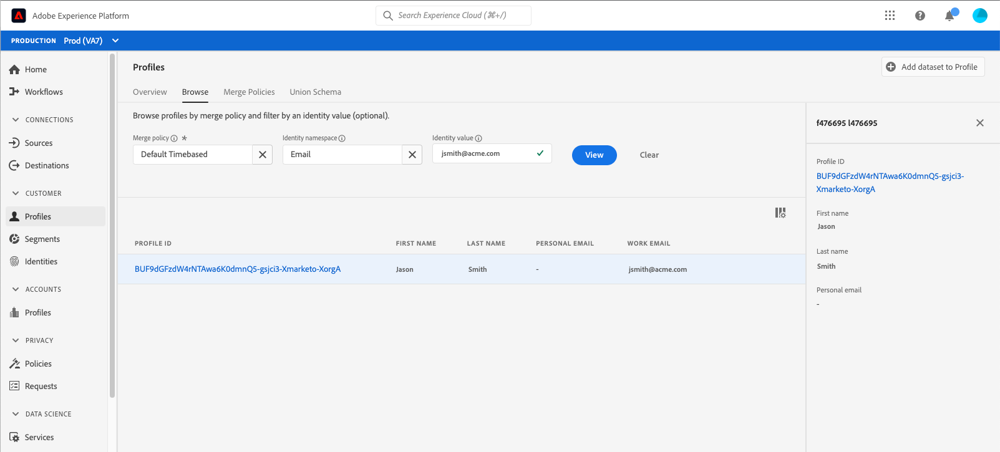
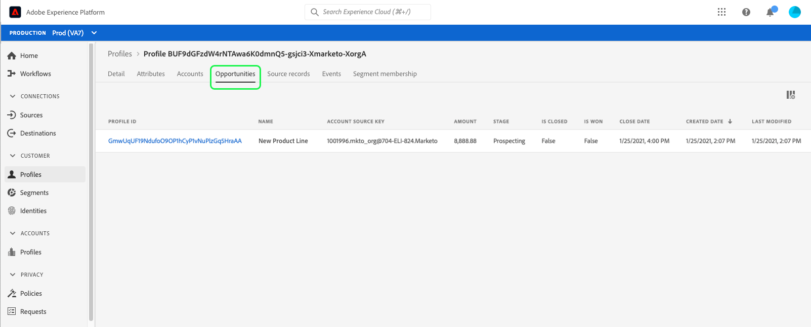

# Real-Time Customer Data Platformでのプロファイルの参照

リアルタイム顧客プロファイルは、オンライン、オフライン、CRM、サードパーティデータなど複数のチャネルからのデータを組み合わせて、個々の顧客の全体像を作成します。 個々のプロファイルは様々なソースからシステムに取り込まれるデータに基づいて集計されるので、各プロファイルでは、顧客のブランドとのやり取りがすべて、タイムスタンプ付きで実用的に記述されます。

Adobe Experience Platformのユーザーインターフェイス内では、これらの読み取り専用プロファイルを表示し、環境設定、過去のイベント、インタラクション、個人が属するオーディエンスなど、個々の顧客に関する重要な情報を確認できます。

Adobe Real-Time Customer Data PlatformはAdobe Experience Platformをベースに構築されているので、Experience Platform UI のプロファイル表示機能を利用できます。 Experience Platform ユーザーインターフェイス内で顧客プロファイルを表示する詳細なガイドについては、[&#x200B; リアルタイム顧客プロファイルユーザーガイド &#x200B;](../../profile/ui/user-guide.md) を参照してください。

## Real-Time CDP B2B Edition のプロファイルの機能強化

Adobe Experience Platform、Real-Time CDPでサポートされているプロファイル参照機能に加えて、B2B edition ユーザーは、「[!UICONTROL Attributes]」および「[!UICONTROL Events]」タブの顧客プロファイル内の B2B 属性とイベントにそれぞれアクセスできます。 B2B データを使用してセグメント化を実行することもできます。これらのオーディエンスは、B2B 以外のオーディエンスと共に顧客の「[!UICONTROL Audience membership]」タブの下に表示されます。

また、B2B editionのReal-Time CDPを使用すると、個々の顧客に関連付けられている全社ソースから [!UICONTROL Accounts]、[!UICONTROL Opportunities]、[!UICONTROL Source records] を参照することもできます。

これらの機能強化を確認するには、まず [&#x200B; リアルタイム顧客プロファイルユーザーガイド &#x200B;](../../profile/ui/user-guide.md) で説明されている手順に従って、結合ポリシーまたは ID 名前空間でプロファイルを参照します。

プロファイルの詳細には、顧客プロファイルで提供される標準情報に加えて、「[!UICONTROL Accounts]」、「[!UICONTROL Opportunities]」、「[!UICONTROL Source records]」の各タブへのアクセスが含まれ、B2B のイベントと属性でも機能強化されています。

Experience Platform UI に表示されるプロファイルの詳細について詳しくは、[&#x200B; プロファイルダッシュボードのドキュメントの詳細 &#x200B;](../../dashboards/guides/profiles.md#browse-profiles) を参照してください。

### 「アカウント」タブ

「**[!UICONTROL Accounts]**」を選択して、プロファイルに関連するアカウントのリストを表示します。 このリストには、アカウントの名前、Web サイト、業界など、アカウントプロファイルの基本情報や、アカウントプロファイルへのリンクが含まれます。

アカウントプロファイルの表示と調査について詳しくは、まず [&#x200B; アカウントプロファイルの概要 &#x200B;](../accounts/account-profile-overview.md) をお読みください。

### 「機会」タブ

「**[!UICONTROL Opportunities]**」タブには、アカウントに関連するオープンな機会およびクローズされた機会に関する詳細が表示されます。 これらのオポチュニティは複数のソースからExperience Platformに取り込むことができますが、Real-Time CDPのB2B editionを使用すると、マーケターは、これらのオポチュニティをすべて 1 か所で簡単に確認できます。

各機会には、機会の名前、その金額、ステージ、機会がオープン、クローズ、成立、不成立のどれであるかなどの情報が含まれます。

### 「Source レコード」タブ

「**[!UICONTROL Source records]**」タブを使用すると、単一の顧客プロファイルに関与する複数のソースレコードをエンタープライズソースから簡単に確認できます。 [!UICONTROL Person source key] とメールアドレスに加えて、各ソースレコードは、レコードのタイプ（「連絡先」や「リード」レコードなど）とソースも提供します。

