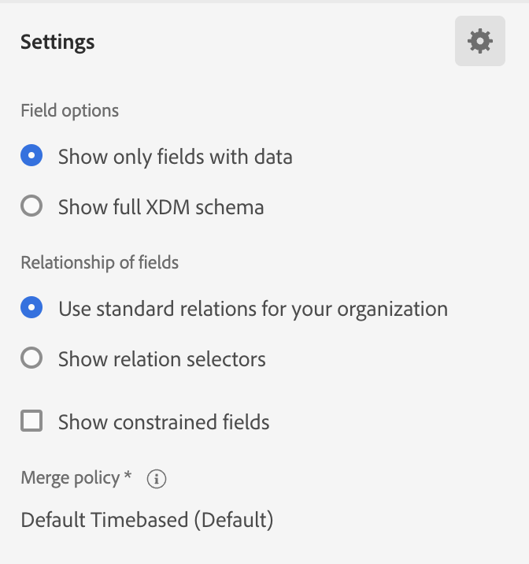
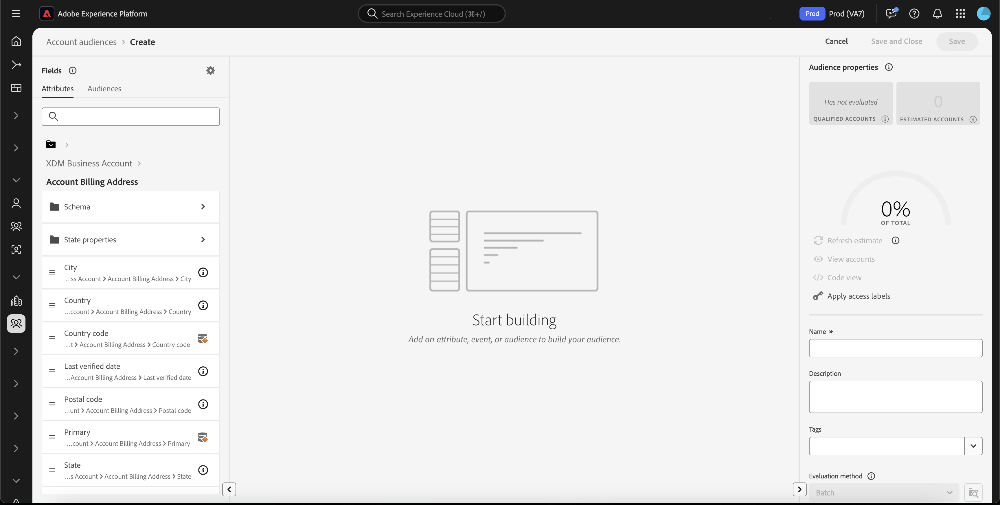
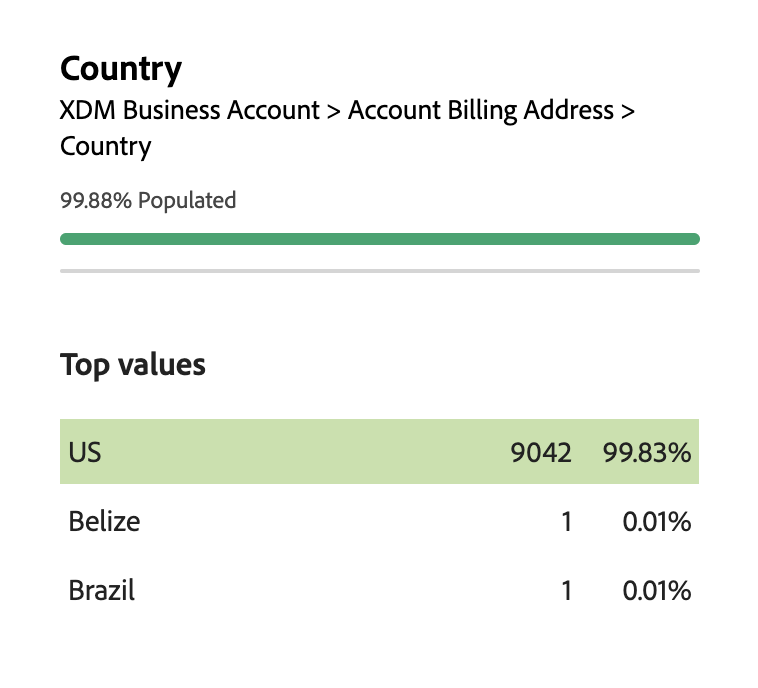
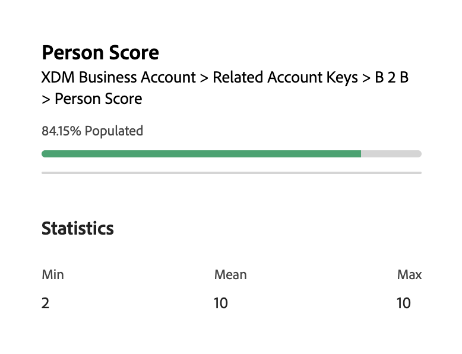
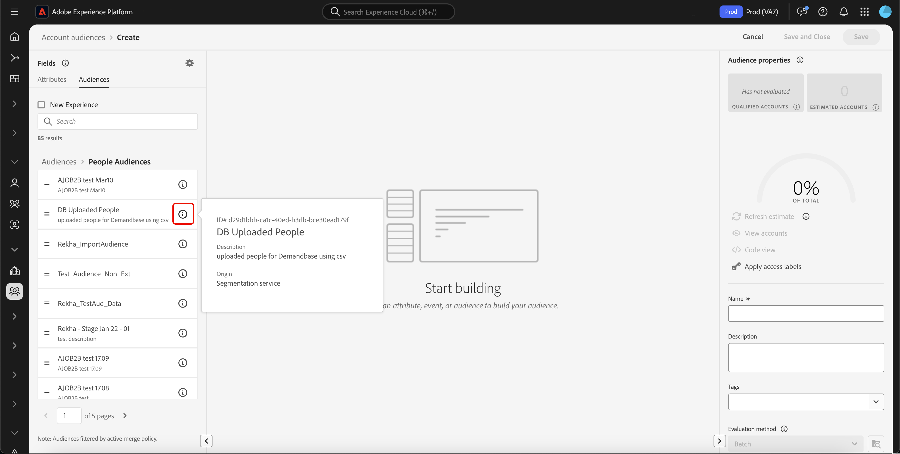
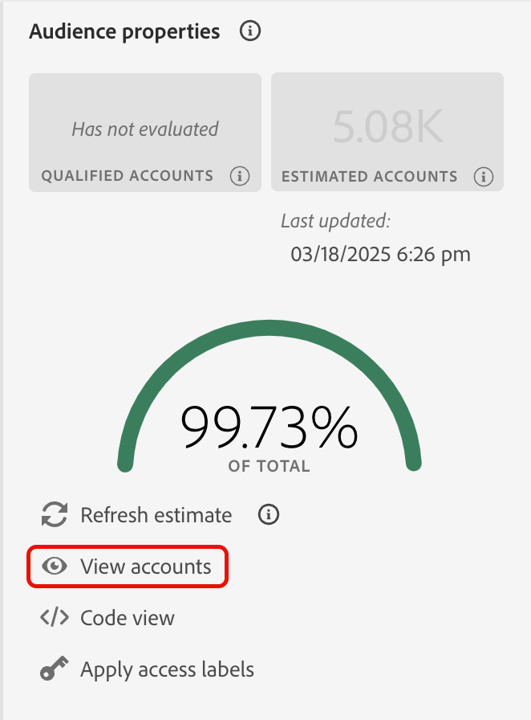
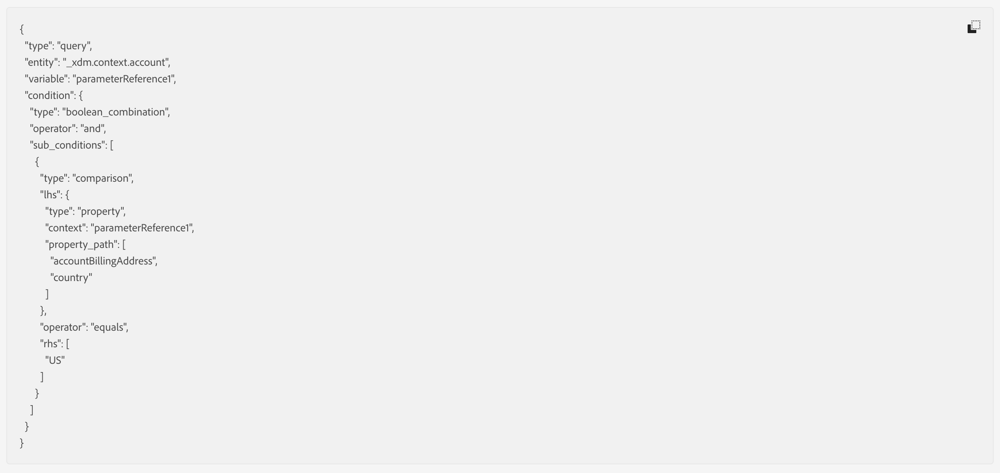
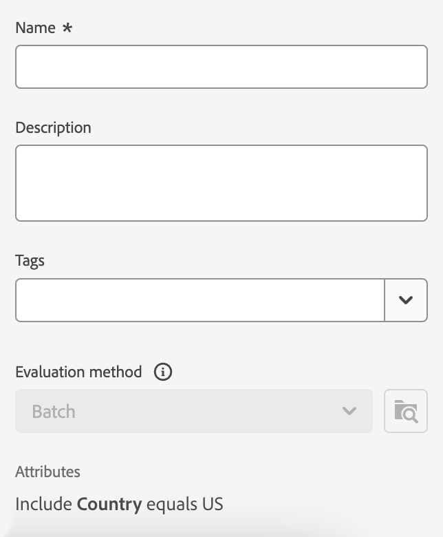

# Real-Time Customer Data Platformのオーディエンスビルダー

Adobe Experience Platform上に構築された[!DNL Adobe Real-Time Customer Data Platform]は、[!DNL Experience Platform]に含まれる完全なAudience Builder機能を利用できます。 ワークスペースには、ルールを作成および編集するための直感的なコントロール（例えば、データプロパティを表示する際に使用するドラッグ＆ドロップタイルなど）があります。

{zoomable="yes"}

## フィールド {#fields}

>[!CONTEXTUALHELP]
>id="platform_b2b_audiencebuilder_showfullxdmschema"
>title="完全な XDM スキーマの表示"
>abstract="デフォルトでは、データを含むフィールドのみが表示されます。このオプションを有効にして、XDM スキーマ内のすべてのフィールドを表示します。"

>[!CONTEXTUALHELP]
>id="platform_b2b_audiencebuilder_showrelationselectors"
>title="関係セレクターの表示"
>abstract="デフォルトでは、組織の標準の関係が使用されます。このオプションを有効にして、使用される関係セレクターを表示します。"

>[!CONTEXTUALHELP]
>id="platform_b2b_audiencebuilder_showconstrainedfields"
>title="制限されたフィールドの表示"
>abstract="デフォルトでは、何の制限もないフィールドのみが表示されます。このオプションを有効にして、制限が設定されているフィールドを表示します。"

アカウントにAudience Builderを使用する場合、アカウント属性または既存のオーディエンスをオーディエンスのフィールドとして使用できます。

を選択して、表示されるフィールドの設定を調整できます。

{zoomable="yes"}

[!UICONTROL Settings] セクションが表示されます。 このセクションでは、表示されるフィールドと、フィールドの関係を更新できます。

**[!UICONTROL Field options]**&#x200B;では、データを含むフィールドまたは完全なXDM スキーマのみを表示できます。

**[!UICONTROL Relationship of fields]**&#x200B;では、組織の標準リレーションを使用するか、リレーションセレクターを表示できます。

{width="300"}

### 属性 {#attributes}

「[!UICONTROL Attributes]」タブでは、XDM ビジネスアカウントクラスに属するアカウント属性、および商談とピープルベースの属性を参照できます。 各フォルダーを展開して追加の属性を表示できます。各属性は、ワークスペースの中央にある[&#x200B; ルールビルダーキャンバス &#x200B;](#rule-builder-canvas)にドラッグできるタイルです。

>[!NOTE]
>
>概要データは&#x200B;**可用性が制限**&#x200B;されています。

属性を選択すると、[情報アイコン &#x200B;](../../images/icons/info.png)を選択して概要データを表示できます。 概要データには、上位の値、フィールドの説明、値のレコード数、この属性の値を含むアカウントの割合などの情報が含まれます。

**[!UICONTROL Populated]** セクションには、属性が入力されたレコードの数と、使用可能なレコードの合計数、およびこのフィールドに値を持つアカウントの割合が表示されます。

**[!UICONTROL Top values]** セクションには、属性に対して最も頻繁に発生する値が表示され、値、値を持つレコードの数、値が表す合計レコードの割合などの詳細が含まれます。 各フィールドのレコード数は、プロファイルスナップショットによって決まります。このスナップショットは、すべての貢献元データセットデータが結合された後のレコードの統合ビューを提供します。

{width="300"}

または、最小値、平均値、最大値が表示されたデータの分布を確認することもできます。

{width="300"}

アカウントの25%未満が属性に入力した場合は、代わりにが表示されます。 属性に関わらず、同じ概要データが表示されます。

{width="300"}

>[!NOTE]
>
>概要データは、属性がアカウント、人物、または商談スキーマに属する場合にのみ使用できます。 さらに、上位の値は、フィールドに異なる値が&#x200B;**not**&#x200B;個あり、それらのフィールドの値が一般的に繰り返される場合にのみ表示されます。
>
>この概要データは&#x200B;**日単位**&#x200B;で更新されます。

さらに、属性には&#x200B;**[!UICONTROL Ingestion Type]**&#x200B;があります。 取り込みタイプは、データの出所を知ることができ、次のいずれかの値にすることができます：**[!UICONTROL Batch]**、**[!UICONTROL Streaming/Edge]**、または&#x200B;**[!UICONTROL No Data Ingested]**。

{width="300"}

Audience Builder内の属性について詳しくは、[Audience Builder ユーザーガイド &#x200B;](../../segmentation/ui/segment-builder.md){target="_blank"}を参照してください。

### オーディエンス {#audiences}

「**[!UICONTROL Audiences]**」タブには、Experience Platform内で利用可能なすべてのピープルベースおよびアカウントベースのオーディエンスが一覧表示されます。

オーディエンスの横にあるにカーソルを合わせると、ID、説明、フォルダー階層などのオーディエンスに関する情報を表示して、オーディエンスを見つけることができます。

{zoomable="yes"}

## ルールビルダーキャンバス {#rule-builder-canvas}

オーディエンスビルダーで作成されるオーディエンスは、ターゲットオーディエンスの主要な特性や行動を説明するために使用されるルールのコレクションです。 これらのルールは、オーディエンスビルダーの中央にあるルールビルダーキャンバスを使用して作成されます。

セグメント定義に新しいルールを追加するには、「**[!UICONTROL Fields]**」タブからタイルをドラッグし、ルールビルダーキャンバスにドロップします。

{zoomable="yes"}

ルールビルダーキャンバスの使用について詳しくは、[&#x200B; セグメントビルダーのドキュメント &#x200B;](../../segmentation/ui/segment-builder.md#rule-builder-canvas){target="_blank"}を参照してください。

### コンテナ {#containers}

オーディエンスルールは、リストされた順序で評価されます。 コンテナを使用すると、ネストされたクエリを使用して、実行順序をより詳細に制御できます。

コンテナについて詳しくは、[&#x200B; セグメントビルダーのドキュメント &#x200B;](../../segmentation/ui/segment-builder.md#containers){target="_blank"}を参照してください。

## オーディエンスのプロパティ {#properties}

**[!UICONTROL Audience properties]** セクションには、オーディエンスの推定サイズを含む、オーディエンスに関する情報が表示されます。 名前、説明、タグなど、オーディエンスに関する詳細を指定することもできます。

{width="300"}

**[!UICONTROL Qualified accounts]**&#x200B;は、オーディエンスのルールに一致する実際のアカウント数を示します。 この数値は、セグメント化ジョブが実行された後、24時間ごとに更新されます。

**[!UICONTROL Estimated accounts]**&#x200B;は、サンプル ジョブに基づくアカウントの概算の数を示します。 この値は、新しいルールまたは条件を追加し、**[!UICONTROL Refresh estimate]**&#x200B;を選択した後で更新できます。

{width="300"}

**[!UICONTROL View accounts]**&#x200B;を選択すると、現在のルールを持つオーディエンスに適格なアカウントのサンプルを表示できます。

{width="300"}

**[!UICONTROL Code view]**&#x200B;は、オーディエンスのルールに関するテキストベースのコード説明を提供します。

**[!UICONTROL Apply access labels]**&#x200B;を選択して、オーディエンスに関連するアクセスラベルを適用できます。 アクセスラベルについて詳しくは、[&#x200B; ラベルの管理ガイド &#x200B;](../../access-control/abac/ui/labels.md){target="_blank"}を参照してください。

「オーディエンスのプロパティ」セクションの残りの部分では、名前、説明、タグなど、アカウントオーディエンスに関連する詳細を編集できます。

{width="300"}

すべてのアカウントオーディエンスがバッチセグメント化を使用して評価されるため、**アカウントオーディエンスの評価方法を変更することはできません**。

## 次の手順 {#next-steps}

Audience Builderには、XDM ビジネスアカウントデータからオーディエンスを作成できる豊富なワークフローが用意されています。

顧客プロファイルデータのセグメント化サービスについて詳しくは、[&#x200B; セグメント化サービスの概要](../../segmentation/home.md){target="_blank"}を参照してください。
