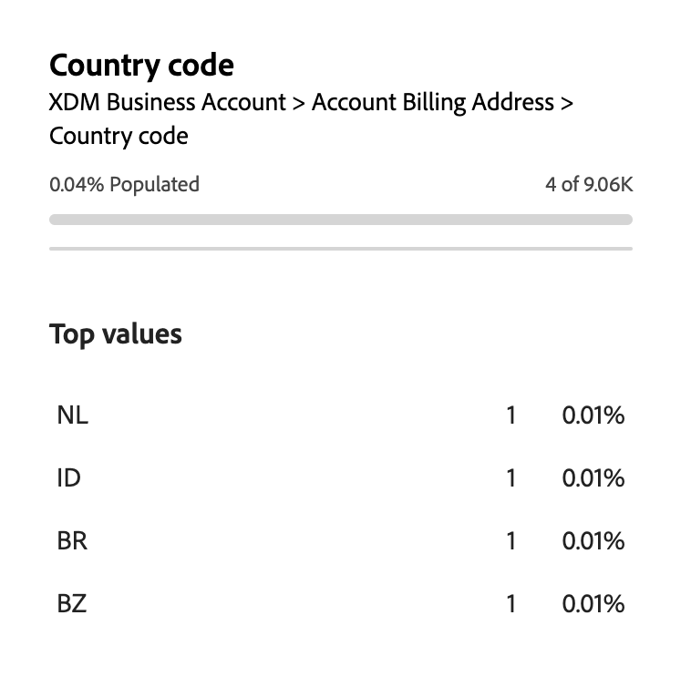

# Real-Time Customer Data Platformの Audience Builder

Adobe Experience Platform上に構築され [!DNL Adobe Real-Time Customer Data Platform] ので、[!DNL Experience Platform] の一部である Audience Builder の全機能を利用できます。 ワークスペースには、ルールを作成および編集するための直感的なコントロール（例えば、データプロパティを表示する際に使用するドラッグ＆ドロップタイルなど）があります。

{zoomable="yes"}

## フィールド {#fields}

アカウントに Audience Builder を使用する場合、オーディエンスのフィールドとしてアカウント属性または既存のオーディエンスを使用できます。

 を選択して、表示されるフィールドの設定を調整できます。

{zoomable="yes"}

>[!NOTE]
>
>「**[!UICONTROL フィールドオプション]**」セクションは現在ベータ版で、一部のお客様のみご利用いただけます。 詳しくは、Adobe カスタマーケアにお問い合わせください。

[!UICONTROL  設定 ] セクションが表示されます。 このセクションでは、表示するフィールドとフィールドの関係を更新できます。

**[!UICONTROL フィールドオプション]** の場合は、データを含むフィールドのみ、または完全な XDM スキーマを表示できます。

**[!UICONTROL フィールドの関係]** については、組織の標準の関係を使用するか、関係セレクターを表示できます。

{width="300"}

### 属性 {#attributes}

「[!UICONTROL  属性 ]」タブでは、XDM ビジネスアカウントクラスに属するアカウント属性と、機会および人物ベースの属性を参照できます。 各フォルダーを展開すると、追加の属性を表示できます。各属性は、ワークスペースの中央にある [ ルールビルダーキャンバス ](#rule-builder-canvas) にドラッグできるタイルです。

属性を選択すると、[ 情報アイコン ](../../images/icons/info.png) を選択して概要データを表示できます。 概要データには、上位の値、フィールドの内容の説明、この属性の値を含む勘定科目の割合などの情報が含まれます。

{width="300"}

属性に入力されるアカウントの割合が 25% 未満の場合は、代わりに  が表示されます。 属性に関しては、同じ概要データが表示されます。

{width="300"}

>[!NOTE]
>
>概要データは、属性がアカウント、人物または商談のスキーマに属している場合にのみ使用できます。 また、上位の値は、フィールドに含まれる異なる値が多すぎる **ない** 場合と、それらのフィールドの値が一般的に繰り返される場合にのみ表示されます。
>
>この概要データは **毎日** 更新されます。

Audience Builder について詳しくは、[Audience Builder ユーザーガイド ](../../segmentation/ui/segment-builder.md){target="_blank"} を参照してください。

### オーディエンス {#audiences}

「**[!UICONTROL オーディエンス]**」タブには、Experience Platform内で使用できる人物ベースのオーディエンスとアカウントベースのオーディエンスがすべて表示されます。

オーディエンスの横にある  にカーソルを合わせると、ID、説明、オーディエンスが存在するフォルダー階層など、オーディエンスに関する情報が表示されます。

{zoomable="yes"}

## ルールビルダーキャンバス {#rule-builder-canvas}

Audience Builder で作成されたオーディエンスは、ターゲットオーディエンスの重要な特徴や行動の説明に使用されるルールの集まりです。 これらのルールは、Audience Builder の中央にあるルールビルダーキャンバスを使用して作成します。

セグメント定義に新しいルールを追加するには、「**[!UICONTROL フィールド]**」タブからタイルをドラッグし、ルールビルダーキャンバスにドロップします。

{zoomable="yes"}

ルールビルダーキャンバスの使用について詳しくは、[ セグメントビルダードキュメント ](../../segmentation/ui/segment-builder.md#rule-builder-canvas){target="_blank"} を参照してください。

### コンテナ {#containers}

オーディエンスルールは、リストに表示されている順序で評価されます。 コンテナを使用すると、ネストされたクエリを使用することで、実行順序をより詳細に制御できます。

コンテナについて詳しくは、[ セグメントビルダードキュメント ](../../segmentation/ui/segment-builder.md#containers){target="_blank"} を参照してください。

## オーディエンスのプロパティ {#properties}

「**[!UICONTROL オーディエンスプロパティ]**」セクションには、オーディエンスの推定サイズなど、オーディエンスに関する情報が表示されます。 また、名前、説明、タグなど、オーディエンスに関する詳細を指定できます。

{width="300"}

**[!UICONTROL 認定済みアカウント]** は、オーディエンスのルールに一致する実際のアカウント数を示します。 この数は、セグメント化ジョブが実行されてから 24 時間ごとに更新されます。

**[!UICONTROL 推定勘定科目]** は、サンプル・ジョブに基づいた勘定科目のおおよその数を示します。 この値は、新しいルールまたは条件を追加して **[!UICONTROL 見積もりを更新]** を選択した後に更新できます。

{width="300"}

**[!UICONTROL アカウントの表示]** を選択して、現在のルールでオーディエンスに適合するアカウントのサンプリングを確認できます。

{width="300"}

**[!UICONTROL コードビュー]** は、オーディエンスのルールの説明をテキストベースで表示します。

**[!UICONTROL アクセスラベルを適用]** を選択して、オーディエンスに関連するアクセスラベルを適用できます。 アクセスラベルの詳細については、[ ラベル管理ガイド ](../../access-control/abac/ui/labels.md){target="_blank"} を参照してください。

「オーディエンスプロパティ」セクションの残りの部分では、名前、説明、タグなど、アカウントオーディエンスに関する詳細を編集できます。

{width="300"}

すべてのアカウントオーディエンスがバッチセグメント化を使用して評価されるので、アカウントオーディエンスの評価方法は変更 **できません**。

## 次の手順 {#next-steps}

Audience Builder には、XDM ビジネスアカウントデータからオーディエンスを作成できる機能豊富なワークフローが用意されています。

顧客プロファイルデータのセグメント化サービスについて詳しくは、[ セグメント化サービスの概要 ](../../segmentation/home.md){target="_blank"} を参照してください。
