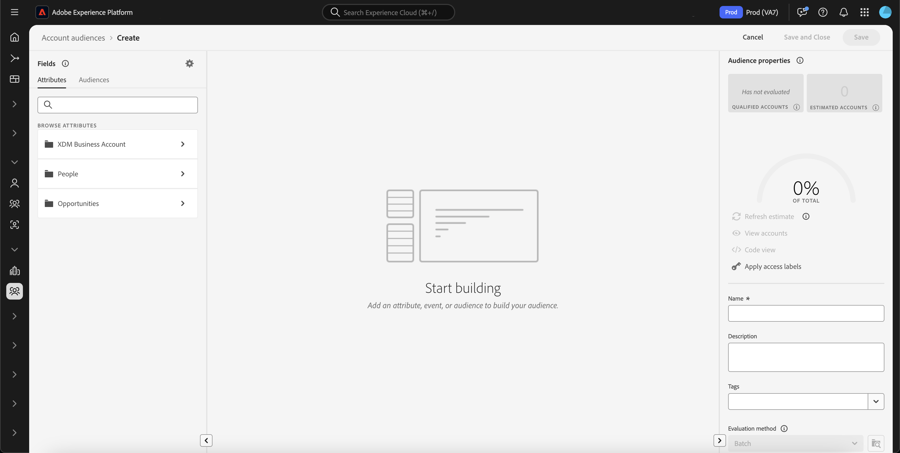
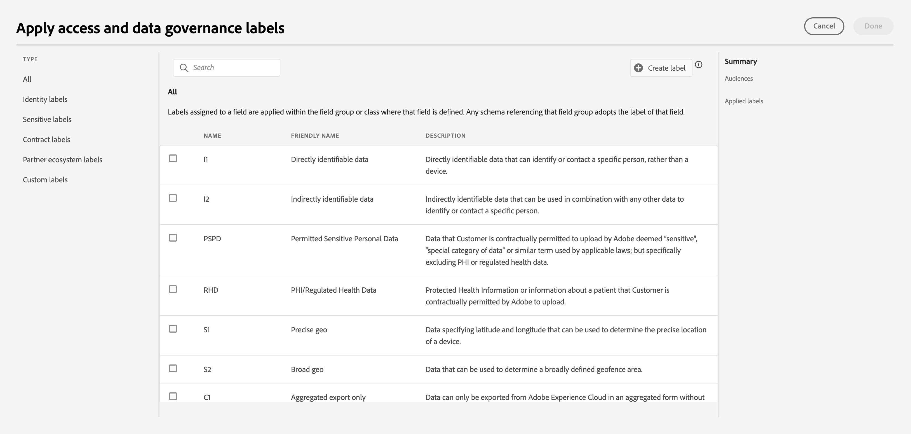

# Real 時間 Customer データ Platform の オーディエンス Builder

Adobe Experience Platform上に構築され [!DNL Adobe Real-Time Customer Data Platform] ので、[!DNL Experience Platform] の一部である Audience Builder の全機能を利用できます。 ワークスペースには、ルールを作成および編集するための直感的なコントロール（例えば、データプロパティを表示する際に使用するドラッグ＆ドロップタイルなど）があります。

{zoomable="yes"}

## フィールド {#fields}

>[!CONTEXTUALHELP]
>id="platform_b2b_audiencebuilder_showfullxdmschema"
>title="完全な XDM スキーマの表示"
>abstract="デフォルトでは、データを含むフィールドのみが表示されます。このオプションを有効にして、XDM スキーマ内のすべてのフィールドを表示します。"

>[!CONTEXTUALHELP]
>id="platform_b2b_audiencebuilder_showrelationselectors"
>title="関係セレクターの表示"
>abstract="デフォルトでは、組織の標準の関係が使用されます。このオプションを有効にして、使用される関係セレクターを表示します。"

>[!CONTEXTUALHELP]
>id="platform_b2b_audiencebuilder_showconstrainedfields"
>title="制限されたフィールドの表示"
>abstract="デフォルトでは、何の制限もないフィールドのみが表示されます。このオプションを有効にして、制限が設定されているフィールドを表示します。"

取引先に オーディエンス Builder を使用する場合は、アカウント属性または既存のオーディエンスをオーディエンスの項目として使用できます。

を選択して、表示されるフィールドの設定を調整できます。

{zoomable="yes"}

>[!NOTE]
>
>**[!UICONTROL Field options]**&#x200B;セクションは現在ベータ版であり、一部のお客様のみが利用できます。詳しくは、アドビカスタマーケアにお問い合わせください。

[ [!UICONTROL Settings] ] セクションが表示されます。 このセクションでは、表示するフィールドとフィールドの関係を更新できます。

**[!UICONTROL Field options]** の場合、データを含むフィールドのみ、または完全な XDM スキーマを表示できます。

**[!UICONTROL Relationship of fields]** の場合、組織の標準リレーションを使用するか、リレーションセレクターを表示することができます。

{width="300"}

### 属性 {#attributes}

[!UICONTROL Attributes]タブでは、XDM 法人取引先クラスに属する取引先属性、および商談と人ベースの属性を参照できます。各フォルダーを展開すると、追加の属性を表示できます。各属性は、ワークスペースの中央にある [&#x200B; ルールビルダーキャンバス &#x200B;](#rule-builder-canvas) にドラッグできるタイルです。

属性を選択すると、[&#x200B; 情報アイコン &#x200B;](../../images/icons/info.png) を選択して概要データを表示できます。 概要データには、上位の値、フィールドの内容の説明、この属性の値を含む勘定科目の割合などの情報が含まれます。

{width="300"}

属性に入力されるアカウントの割合が 25% 未満の場合は、代わりに  が表示されます。 属性に関しては、同じ概要データが表示されます。

{width="300"}

>[!NOTE]
>
>概要データは、属性がアカウント、人物または商談のスキーマに属している場合にのみ使用できます。 また、上位の値は、フィールドに含まれる異なる値が多すぎる **ない** 場合と、それらのフィールドの値が一般的に繰り返される場合にのみ表示されます。
>
>この概要データは **毎日** 更新されます。

Audience Builder について詳しくは、[Audience Builder ユーザーガイド &#x200B;](../../segmentation/ui/segment-builder.md){target="_blank"} を参照してください。

### オーディエンス {#audiences}

**[!UICONTROL Audiences]**&#x200B;タブには、Experience Platform 内で使用できるすべてのユーザーベースおよびアカウントベースのオーディエンスが一覧表示されます。

オーディエンスの横にある  にマウスポインターを置くと、ID、説明、オーディエンスを見つけるためのフォルダー階層など、オーディエンスに関する情報表示できます。

{zoomable="yes"}

## ルールビルダーキャンバス {#rule-builder-canvas}

オーディエンスビルダーで作成されるオーディエンスは、ターゲットオーディエンスの主要な特性や動作を記述するために使用されるルールコレクションです。 これらのルールは、オーディエンスビルダーの中央にあるルールビルダーキャンバスを使用して作成されます。

セグメント定義に新しいルールを追加するには、「**[!UICONTROL Fields]**」タブからタイルをドラッグし、ルールビルダーキャンバスにドロップします。

{zoomable="yes"}

ルールビルダーキャンバスの使用について詳しくは、 [セグメントビルダー ドキュメント](../../segmentation/ui/segment-builder.md#rule-builder-canvas){target="_blank"}を参照してください。

### コンテナ {#containers}

オーディエンスルールは、リストされている順序で評価されます。 コンテナーを使用すると、入れ子になったクエリを使用して、実行順序をより細かく制御できます。

コンテナについて詳しくは、[&#x200B; セグメントビルダードキュメント &#x200B;](../../segmentation/ui/segment-builder.md#containers){target="_blank"} を参照してください。

## オーディエンスのプロパティ {#properties}

**[!UICONTROL Audience properties]** セクションには、オーディエンスの推定サイズなど、オーディエンスに関する情報が表示されます。 また、名前、説明、タグなど、オーディエンスに関する詳細を指定できます。

{width="300"}

**[!UICONTROL Qualified accounts]** は、オーディエンスのルールに一致する実際のアカウント数を示します。 この数は、セグメント化ジョブが実行された後、24 時間ごとに更新されます。

**[!UICONTROL Estimated accounts]**&#x200B;は、サンプルジョブに基づくアカウントの概数を示します。この値は、新しいルールまたは条件を追加して **[!UICONTROL Refresh estimate]**&#x200B;を選択した後に更新できます。

{width="300"}

**[!UICONTROL View accounts]**&#x200B;を選択すると、現在のルールでオーディエンスの対象になるアカウントサンプリングを表示できます。

{width="300"}

この **[!UICONTROL Code view]** は、オーディエンスのルールの説明をテキストベースで提供します。

**[!UICONTROL Apply access labels]** を選択すると、オーディエンスに関連するアクセスラベルを適用できます。 アクセスラベルの詳細については、[&#x200B; ラベル管理ガイド &#x200B;](../../access-control/abac/ui/labels.md){target="_blank"} を参照してください。

オーディエンス プロパティ セクションの残りの部分では、名前、説明、タグなど、アカウントオーディエンスに関連する詳細を編集できます。

{width="300"}

すべてのアカウントオーディエンスがバッチセグメント化を使用して評価されるので、アカウントオーディエンスの評価方法は変更 **できません**。

## 次の手順 {#next-steps}

Audience Builder には、XDM ビジネスアカウントデータからオーディエンスを作成できる機能豊富なワークフローが用意されています。

顧客プロファイルデータのセグメント化サービスについて詳しくは、[&#x200B; セグメント化サービスの概要 &#x200B;](../../segmentation/home.md){target="_blank"} を参照してください。
