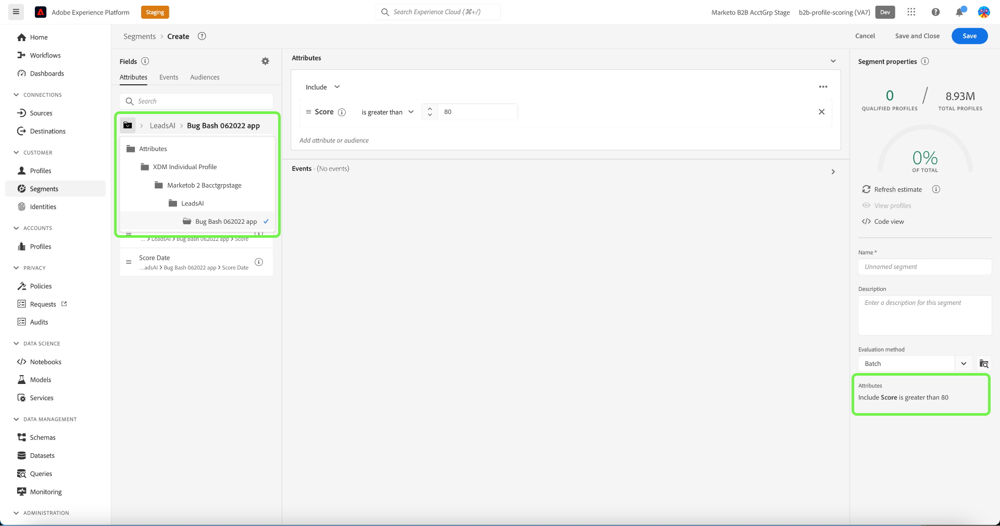

# Real-time Customer Data Platform B2B Edition のセグメント化の使用例

このドキュメントでは、Adobe Real-time Customer Data Platform B2B Edition のセグメント定義の例と、一般的な B2B の使用例で様々な種類の属性を組み合わせる方法を示します。 宛先が B2B ワークフローにどのように適合するかを理解するには、 [エンドツーエンドのチュートリアル](../b2b-tutorial.md#create-a-segment-to-evaluate-your-data).

>[!NOTE]
>
>これらのセグメント化の使用例に必要な属性は、 Real-time Customer Data Platform B2B Edition のお客様のみが使用できます。 Real-time Customer Data Platform B2B Edition を使用していない場合は、 [セグメントの概要](./segmentation-overview.md) 代わりに、

## 前提条件 {#prerequisites}

B2B クラスのセグメント化属性を使用する前に、次の手順を実行する必要があります。

1. B2B クラスを使用するスキーマを作成します。 B2B Edition クラスには、アカウント、キャンペーン、商談、マーケティングリストなどが含まれます。 詳しくは、 [B2B クラスで使用するスキーマの設定方法](../schemas/b2b.md) スキーマのドキュメントを参照してください。
1. Experience Data Model(XDM)B2B スキーマ間の関係を作成します。 B2B エディション属性に基づくセグメントでは、拡張 B2B セグメント化機能を完全に使用するために、クラス間の関係が必要です。 詳しくは、 [2 つの B2B スキーマ間の関係を定義する方法](../../xdm/tutorials/relationship-b2b.md) を参照してください。
1. B2B スキーマに基づくデータセットを使用してデータを取り込みます。 以下のソースに関するドキュメントを参照してください。 [データの取り込み方法に関する情報](../../sources/connectors/adobe-applications/marketo/marketo.md).
1. 詳しくは、 [セグメントビルダーユーザーガイド](../../segmentation/ui/segment-builder.md) を参照してください。

これらの要件が満たされたら、B2B の一般的な使用例でこれらの属性を組み合わせることができます。

## はじめに {#getting-started}

B2B クラスの和集合スキーマに関係が確立され、データの取り込みに使用されると、その属性がセグメントビルダーの左側のパネルで使用できるようになります。

B2B クラスとその属性には、 `B2B` ラベルを使用して、Real-time Customer Data Platformで標準として使用できるラベルと区別できます。

B2B の使用例のセグメントを効果的に作成するには、スキーマに関する深い知識を持ち、データモデルがどのように表示されるかを理解することが重要です。 また、データがデータオブジェクト間を移動するパスを把握するのにも便利です。

次の画像は、Real-Time CDP B2B Edition 内で使用可能な B2B クラス間の関係を示しています。

データモデルは複雑になる可能性があるので、Platform UI を使用して、データモデルのより詳細な視覚的表現を表示し、使用例に関連する属性を見つけるのに役立てることができます。 開始するには、Platform UI に移動し、左のナビゲーションで「スキーマ」を選択します。

使用可能なリストから適切なスキーマを選択し、 [!UICONTROL 構成] サイドレール。 以下の例では、「人」関係を選択すると、現在のスキーマのどの属性が関連する「人」スキーマを参照しているか（関係のソーススキーマの場合）、または「人」スキーマで参照されているか（関係の宛先スキーマの場合）が表示されます。

この関係は、 `Key` フォルダーを作成します（下の画像を参照）。

詳しくは、 [スキーマ (Real-time Customer Data Platform B2B Edition ドキュメント )](../schemas/b2b.md) を参照してください。

以下の使用例では、これらの結果を達成するために異なるスキーマ間の関係を確立するために使用されるクラスに関する情報を提供します。 これらの例を使用すると、独自のセグメントを作成できます。

## 様々なセグメントの使用例 {#use-cases}

B2B エディションでのセグメント化の使用例を次に示します。 各例では、セグメントの動作の説明と、セグメントの作成に使用されるクラスの説明を示します。 提供された画像は、 [!UICONTROL 属性] スキーマの構造を反映するサイドレール。 この [!UICONTROL セグメントのプロパティ] セクションの右側には、セグメントの属性が書き込まれた分類が表示されます。

### 例 1:B2B のオポチュニティに関する「意思決定者」を見つける {#find-decision-maker}

任意のオポチュニティの「意思決定者」であるすべての人を検索します。 このセグメントでは、 [!UICONTROL XDM 個人プロファイル] クラスと [!UICONTROL XDM ビジネスオポチュニティ人物関係] クラス。

### 例 2:特定のドル額で商談に割り当てられた B2B プロファイルを見つける {#find-opportunities-amount}

商談額が指定の金額（$100 万）を超える商談に直接割り当てられているすべての人を検索します。 このセグメントでは、 [!UICONTROL XDM 個人プロファイル] クラス [!UICONTROL XDM ビジネスオポチュニティ人物関係] クラスおよび [!UICONTROL XDM ビジネスオポチュニティ] クラス。

### 例 3:事業所別に商談に割り当てられた B2B プロファイルを検索 {#find-opportunities-location}

特定の場所（カナダ）にアカウントがある商談に直接割り当てられているすべての担当者を検索します。 このセグメントでは、 [!UICONTROL XDM 個人プロファイル] クラス [!UICONTROL XDM ビジネスオポチュニティ人物関係] クラス [!UICONTROL XDM ビジネスオポチュニティ] クラスおよび [!UICONTROL XDM ビジネスアカウント] クラス。

### 例 4:業界別および閲覧行動別のオポチュニティに関して「意思決定者」を見つける {#find-industry-browsing-behavior}

アカウントが「金融」業界に存在する任意のオポチュニティの「意思決定者」であるすべての人を見つけ、過去 3 日間に価格ページを訪問しました。 このセグメントでは、 [!UICONTROL XDM 個人プロファイル] クラス [!UICONTROL XDM ビジネスオポチュニティ人物関係] クラス [!UICONTROL XDM ビジネスオポチュニティ] クラスおよび [!UICONTROL XDM ビジネスアカウント] クラスおよび [!UICONTROL XDM ExperienceEvent] クラス。

### 例 5:部門名と商談額別に商談の B2B プロファイルを検索 {#find-department-opportunity-amount}

人事 (HR) 部門で働くすべての人を検索し、1 つ以上のオープン商談がある特定の金額（100 万ドル）以上のアカウントに関連します。 このセグメントでは、 [!UICONTROL XDM 個人プロファイル] クラス [!UICONTROL XDM ビジネスアカウント] クラスおよび [!UICONTROL XDM ビジネスオポチュニティ] クラス。

### 例 6:役職および年間アカウント売上高別に B2B プロファイルを検索 {#find-by-job-title-and-revenue}

役職が副社長で、指定した金額（$1 億）以上の年間売上高を持つ任意のアカウントに関連するすべての人を検索し、先月に少なくとも 3 回価格ページを訪問しました。 このセグメントでは、 [!UICONTROL XDM 個人プロファイル] クラス [!UICONTROL XDM ビジネスアカウント] クラスおよび [!UICONTROL XDM ExperienceEvent] クラス。

### 例 7:商談のステータスと閲覧行動別に「意思決定者」を見つける {#find-by-opportunity-status-and-browsing-behavior}

クローズしたオポチュニティの「意思決定者」であるすべての人を見つけ、先週の価格ページを訪問しました。 このセグメントでは、 [!UICONTROL XDM 個人プロファイル] クラス [!UICONTROL XDM ビジネスオポチュニティ人物関係] クラス [!UICONTROL XDM ビジネスオポチュニティ] クラスおよび [!UICONTROL XDM ExperienceEvent] クラス。

### 例 8:関連アカウントを使用してセグメント化のリーチを拡大する {#related-accounts}

人事 (HR) 部門で働くすべての人を検索し、任意のアカウントに関連する *またはアカウントの関連アカウントのいずれか* 1 つ以上のオープンな商談が、指定された金額（100 万ドル）以上に相当します。 このセグメントでは、 [!UICONTROL XDM 個人プロファイル] クラス [!UICONTROL XDM ビジネスアカウント] クラスおよび [!UICONTROL XDM ビジネスオポチュニティ] クラス。

### 例 9:リードスコアやアカウントスコアを使用してプロファイルを評価する {#account-scoring}

リードスコアが 80 を超えるすべてのプロファイルを見つけます。

## 次の手順 {#next-steps}

この概要を読み終えると、Real-Time CDP, B2B Edition を使用してセグメント化をおこなう方法について理解できるようになります。 セグメント化サービスの詳細については、[セグメント化に関するドキュメント](../../segmentation/home.md)を参照してください。
