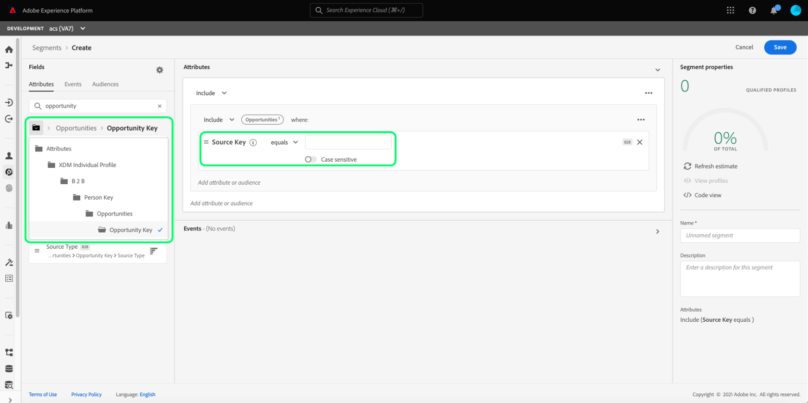

# リアルタイム顧客データプラットフォーム B2B エディション（ベータ版）のセグメント化の使用例の概要

<!-- This document relates to this [ticket](https://jira.corp.adobe.com/browse/PLAT-100468) -->

>[!IMPORTANT]
>
>リアルタイム CDP B2B エディションは現在ベータ版です。 ドキュメントと機能は変更される場合があります。

このドキュメントでは、リアルタイム CDP B2B エディションで使用できるセグメント化と、一般的な B2B の使用例で様々な種類の属性を組み合わせる方法に関する例を示します。

>[!NOTE]
>
>これらのセグメント化の使用例に必要な属性は、リアルタイム顧客データプラットフォーム B2B エディションのお客様のみ利用できます。 各ライセンスタイプで使用できる機能など、リアルタイム CDP の詳細については、まず「[ リアルタイム CDP の概要 ](../overview.md)」を参照してください。

## 前提条件

B2B クラスのセグメント化属性を使用する前に、次の手順を実行する必要があります。

1. B2B クラスを使用するスキーマを作成します。 B2B Edition クラスには、アカウント、キャンペーン、オポチュニティ、マーケティングリストなどが含まれます。 [B2B クラス ](../schemas/b2b.md) で使用するスキーマの設定方法については、スキーマのドキュメントを参照してください。
1. エクスペリエンスデータモデル (XDM)B2B スキーマ間の関係を作成します。 B2B エディション属性に基づくセグメントでは、拡張 B2B セグメント化機能を完全に使用するために、クラス間の関係が必要です。 詳しくは、[2 つの B2B スキーマ間の関係を定義する方法 ](../../xdm/tutorials/relationship-b2b.md) のドキュメントを参照してください。
1. B2B スキーマに基づくデータセットを使用してデータを取り込みます。 [ データの取り込み方法 ](../../sources/connectors/adobe-applications/marketo/marketo.md) については、ソースのドキュメントを参照してください。
1. セグメントの作成方法に関する詳細なガイダンスについては、『[ セグメントビルダーユーザーガイド ](../../segmentation/ui/segment-builder.md)』を参照してください。

これらの要件が満たされると、一般的な B2B の使用例でこれらの属性を組み合わせることができます。

## はじめに

B2B クラスの和集合スキーマに関係が確立され、データの取り込みに使用されると、その属性がセグメントビルダーの左側のパネルで使用可能になります。

B2B クラスとその属性には、リアルタイム顧客データプラットフォーム内で標準として使用できるラベルと区別するために、セグメント化ワークスペース内に `B2B` ラベルが追加されます。

B2B の使用例のセグメントを効果的に作成するには、スキーマに関する深い知識を持ち、データモデルがどのように表示されるかを理解することが重要です。 また、データがデータオブジェクト間を移動するパスを認識しておくと便利です。

次の図は、リアルタイム CDP B2B エディション内で使用可能な B2B クラス間の関係を示しています。

データモデルは複雑になる可能性があるので、Platform UI を使用して、データモデルのより詳細な視覚表現を表示し、使用事例に関連する属性を見つけるのに役立ちます。 開始するには、Platform UI に移動し、左のナビゲーションで「スキーマ」を選択します。

使用可能なリストから適切なスキーマを選択し、[!UICONTROL  構成 ] サイドレールから適切な関係を選択します。 次の例では、「Person」関係を選択すると、現在のスキーマのどの属性が関連する「Person」スキーマを参照しているか（関係のソーススキーマの場合）、または「Person」スキーマで参照されているか（関係の宛先スキーマの場合）が表示されます。

この関係は、次の図に示すように、`Key` フォルダーを使用してセグメントビルダー内に反映されます。

使用可能な B2B クラスの詳細については、リアルタイム顧客データプラットフォーム B2B エディションのドキュメント ](../schemas/b2b.md) の [ スキーマを参照してください。

以下の使用例では、異なるスキーマ間の関係を確立してこれらの結果を達成するためにどのクラスが使用されるかに関する情報を提供します。 これらの例を使用して、独自のセグメントを作成できます。

## 様々な使用例の例

B2B エディションでのセグメント化の使用例を次に示します。 各例では、セグメントの動作と、セグメントの作成に使用されるクラスの説明を示します。 提供された画像は、スキーマの構造を反映した [!UICONTROL  属性 ] サイドレールのファイルパスをハイライトします。 表示の右側の [!UICONTROL  セグメントのプロパティ ] セクションには、セグメントの属性の書き込み済みの分類が含まれています。

### 例 1

あらゆる機会の「意思決定者」であるすべての人を見つけます。 このセグメントには、[!UICONTROL XDM Individual Profile] クラスと [!UICONTROL XDM Business Opportunity Person Relation] クラスの間のリンクが必要です。

### 例 2

商談金額が指定金額（100 万ドル）を超える場合、直接割り当てられているすべての人を検索します。 このセグメントには、[!UICONTROL XDM Individual Profile] クラス、[!UICONTROL XDM Business Opportunity Person Relation] クラス、[!UICONTROL XDM Business Opportunity] クラス間のリンクが必要です。

### 例 3

特定の場所（カナダ）にアカウントが配置されているオポチュニティに直接割り当てられているすべての人を検索します。 このセグメントには、[!UICONTROL XDM Individual Profile] クラス、[!UICONTROL XDM Business Opportunity Person Relation] クラス、[!UICONTROL XDM Business Opportunity] クラス、[!UICONTROL XDM Business Account] クラスの間のリンクが必要です。

### 例 4

アカウントが「金融」業界に存在するあらゆる機会の「意思決定者」であるすべての人を検索し、過去 3 日間に価格設定ページを訪問しました。 このセグメントには、[!UICONTROL XDM Individual Profile] クラス、[!UICONTROL XDM Business Opportunity Person Relation] クラス、[!UICONTROL XDM Business Opportunity] クラス、[!UICONTROL XDM Business Account] クラスと &lt;a8/xdm ExperienceEvent] クラス。[!UICONTROL 

### 例 5

人事部門で働くすべての人を検索し、1 つ以上のオープン・オポチュニティを持つ任意のアカウントに関連している（100 万ドル以上）。 このセグメントには、[!UICONTROL XDM Individual Profile] クラス、[!UICONTROL XDM Business Account] クラス、[!UICONTROL XDM Business Opportunity] クラス間のリンクが必要です。

### 例 6

役職が副社長で、所定の金額（$1 億）以上の年間売上高を持つ任意のアカウントに関連するすべての人を検索し、前月に 3 回以上価格設定ページを訪問しました。 このセグメントには、[!UICONTROL XDM Individual Profile] クラス、[!UICONTROL XDM Business Account] クラス、[!UICONTROL XDM ExperienceEvent] クラス間のリンクが必要です。

### 例 7

閉じられた機会の「意思決定者」であるすべての人を見つけ、先週の価格設定ページを訪問しました。 このセグメントには、[!UICONTROL XDM Individual Profile] クラス、[!UICONTROL XDM Business Opportunity Person Relation] クラス、[!UICONTROL XDM Business Opportunity] クラス、[!UICONTROL XDM ExperienceEvent] クラス間のリンクが必要です。

## 次の手順

この概要を読むと、リアルタイム CDP、B2B エディションを使用して利用できるセグメント化の可能性を理解できます。 セグメント化サービスの詳細については、[セグメント化に関するドキュメント](../../segmentation/home.md)を参照してください。
