# Real-Time Customer Data Platform B2B editionのセグメント化ユースケース

>[!IMPORTANT]
>
>B2B エンティティ（キャンペーンやマーケティングリストなど）を参照するエクスペリエンスイベントを含むオーディエンスは、サポートされなくなりました。 詳しくは、[Real-Time CDP B2B edition アーキテクチャのアップグレード ](../../rtcdp/b2b-architecture-upgrade.md)の概要をご覧ください。

このドキュメントでは、Adobe Real-Time Customer Data Platform B2B editionのセグメント定義の例と、一般的なB2B ユースケースで様々なタイプの属性を組み合わせる方法について説明します。 宛先がB2B ワークフローにどのように適合するかを理解するには、[ エンドツーエンドのチュートリアル ](../b2b-tutorial.md#create-a-segment-to-evaluate-your-data)を参照してください。

>[!NOTE]
>
>これらのセグメント化ユースケースに必要な属性は、Real-Time Customer Data Platform B2B editionのお客様のみが使用できます。 Real-Time Customer Data Platform B2B editionを使用していない場合は、代わりに[ セグメント化の概要](./segmentation-overview.md)を参照してください。

>[!BEGINSHADEBOX]

## 結合ポリシーの変更

Real-Time CDP B2B edition アーキテクチャへのアップグレードの一環として、B2B属性を持つマルチエンティティオーディエンスでは、複数の結合ポリシーではなく、1つの結合ポリシー（デフォルトの結合ポリシー）のみをサポートするようになりました。 さらに、プロファイルがオーディエンスに適格となる変更は、アクティベーション、ジャーニーオーケストレーション、キャンペーンのターゲティングなどのワークフローに影響を与える可能性があります。 データが期待どおりに機能していることを確認するために、次の手順を実行することをお勧めします。

- デフォルト以外の結合ロジックに依存するオーディエンスを確認してテストし、この更新の潜在的な影響を把握します。
- 主要なオーディエンスのオーディエンスのクオリフィケーション基準を再評価し、マージロジックの変更がクオリフィケーションに影響を与えるかどうかを把握します。
- アクティベーション結果を監視して、結合ポリシーの変更によるオーディエンス結果の変化を検出します。

>[!ENDSHADEBOX]

## 前提条件 {#prerequisites}

B2B クラスのセグメント化属性を使用する前に、次の手順を完了する必要があります。

1. B2B クラスを使用するスキーマを作成します。 B2B editionのクラスには、Account、Campaign、Opportunity、Marketing Listなどがあります。 [B2B クラスで使用するスキーマを設定する方法](../schemas/b2b.md)について詳しくは、スキーマのドキュメントを参照してください。
2. Experience Data Model （XDM） B2B スキーマ間の関係を作成します。 B2B editionの属性にもとづくオーディエンスでは、拡張されたB2B セグメンテーション機能を完全に使用するために、クラス間の関係が必要です。 詳しくは、[2つのB2B スキーマ間の関係を定義する方法](../../xdm/tutorials/relationship-b2b.md)に関するドキュメントを参照してください。
3. B2B スキーマにもとづくデータセットを使用してデータを取り込みます。 データの取り込み方法[については、](../../sources/connectors/adobe-applications/marketo/marketo.md)のソースドキュメントを参照してください。
4. オーディエンスの構築方法に関する詳細なガイダンスについては、[ セグメントビルダーのユーザーガイド ](../../segmentation/ui/segment-builder.md)を参照してください。

これらの要件を満たすと、一般的なB2B ユースケースにこれらの属性を組み合わせることができます。

## はじめに {#getting-started}

B2B クラスの結合スキーマに関係が確立され、データの取り込みに使用されると、それらの属性はセグメントビルダーの左側のパネルで使用できるようになります。

B2B クラスとその属性には、セグメント化ワークスペース内に`B2B` ラベルが追加され、Real-Time Customer Data Platform内で標準として使用できるものと区別されます。

B2B ユースケースのオーディエンスを効果的に作成するには、スキーマに関する詳細な知識と、データモデルがどのようなものかを理解することが重要です。 また、あるデータオブジェクトから別のデータオブジェクトへのデータのパスを把握することも便利です。

次の図は、Real-Time CDP B2B edition内で使用可能なB2B クラス間の関係を示しています。

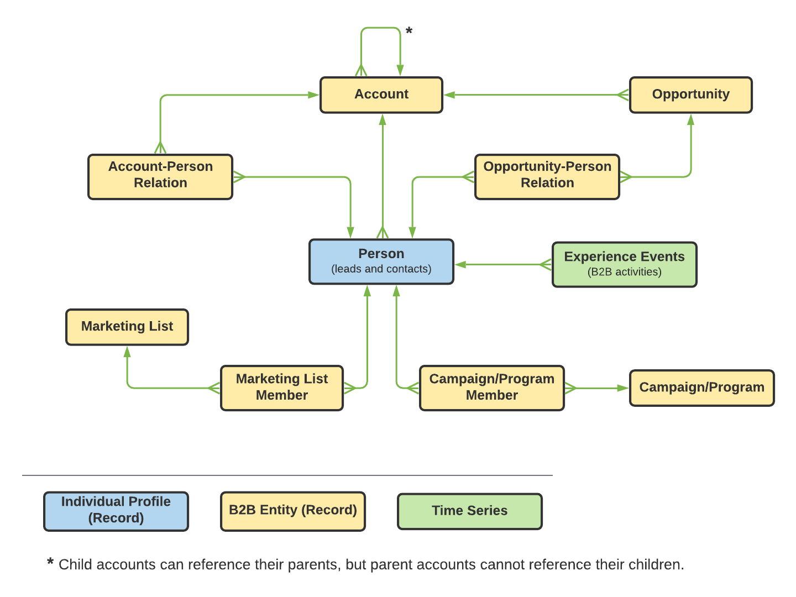

データモデルは複雑になる可能性があるため、Platform UIを使用して、データモデルのより詳細な視覚的表現を表示し、ユースケースに関連する属性を見つけやすくすることができます。 まず、Platform UIに移動し、左側のナビゲーションで「スキーマ」を選択します。

使用可能なリストから適切なスキーマを選択し、[!UICONTROL Composition] サイドレールから適切な関係を選択します。 次の例では、「人物」関係を選択すると、現在のスキーマ内のどの属性が関連する「人物」スキーマを参照するか（関係のソーススキーマの場合）、「人物」スキーマで参照されているか（関係の参照スキーマの場合）が表示されます。

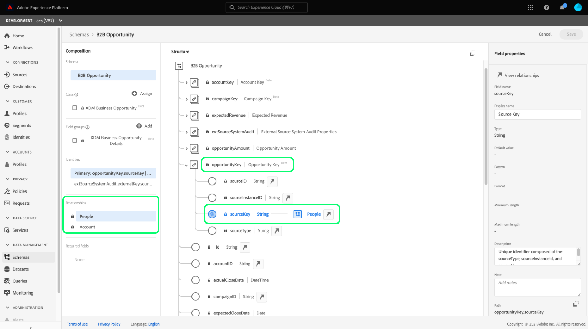

この関係は、次の画像に示すように、`Key` フォルダーを使用してセグメントビルダー内に反映されます。

セグメント ワークスペースでセグメントビルダーを使用する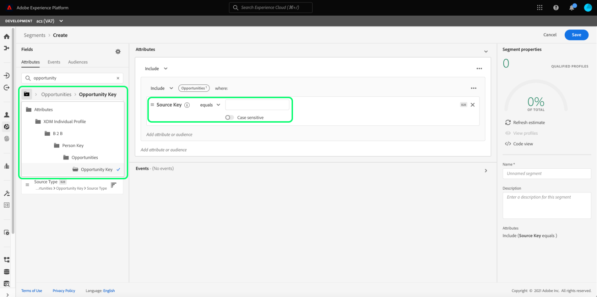

使用可能なB2B クラスについて詳しくは、Real-Time Customer Data Platform B2B edition ドキュメント [の](../schemas/b2b.md) スキーマを参照してください。

以下のユースケースでは、これらの結果を達成するために、異なるスキーマ間の関係を確立するために使用されるクラスに関する情報を提供します。 これらの例は、独自のオーディエンスを作成するのに役立ちます。

## セグメンテーションの様々なユースケースの例 {#use-cases}

B2B editionを使用したセグメント化には、次のユースケースを使用できます。 それぞれの例では、オーディエンスの機能の説明と、その作成に使用されるクラスの説明を提供します。 提供された画像は、スキーマの構造を反映する[!UICONTROL Attributes] サイドレールのファイルパスを強調表示します。 ディスプレイの右側にある[!UICONTROL Segment properties] セクションには、オーディエンスの属性の内訳が記載されています。

### 例1:B2B ビジネスの機会に関する「意思決定者」の特定 {#find-decision-maker}

あらゆる商談の「意思決定者」であるすべての人物を検索します。 このオーディエンスには、[!UICONTROL XDM Individual Profile] クラスと[!UICONTROL XDM Business Opportunity Person Relation] クラスの間のリンクが必要です。

例1の設定を表示する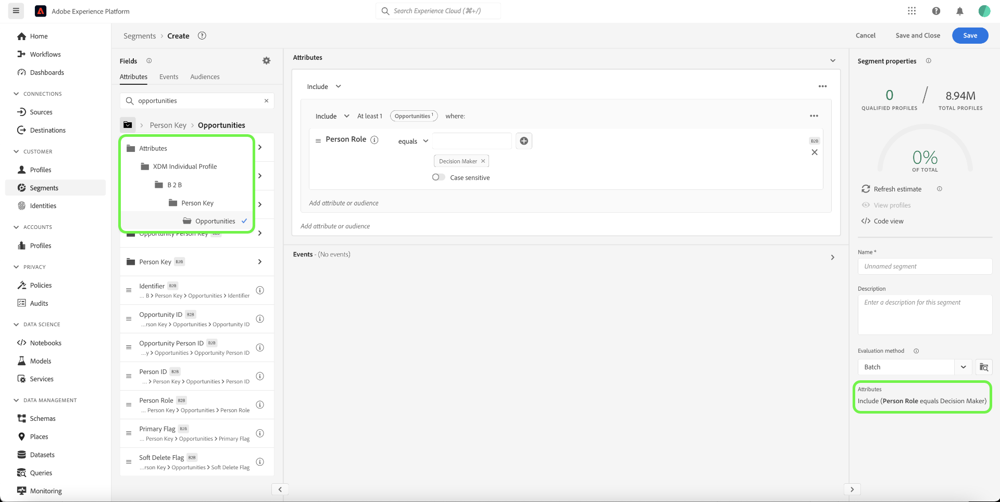

### 例2：一定額の商談に割り当てられたB2B プロファイルを特定 {#find-opportunities-amount}

商談金額が指定された金額（100万ドル）を超える商談に直接割り当てられたすべての人物を検索します。 このオーディエンスには、[!UICONTROL XDM Individual Profile] クラス、[!UICONTROL XDM Business Opportunity Person Relation] クラスおよび[!UICONTROL XDM Business Opportunity] クラスの間のリンクが必要です。

例2の設定を表示する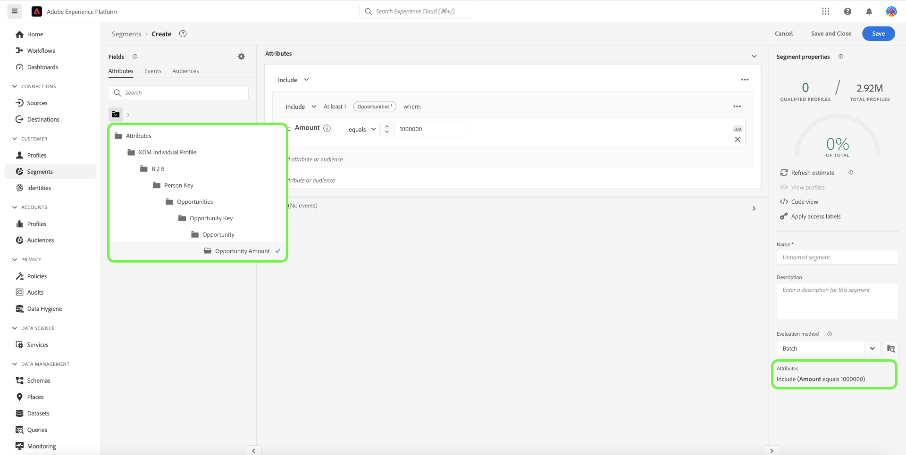

### 例3：場所ごとに商談に割り当てられたB2B プロファイルを検索する {#find-opportunities-location}

アカウントが特定の場所（カナダ）にある商談に直接割り当てられているすべての人物を検索します。 このオーディエンスには、[!UICONTROL XDM Individual Profile] クラス、[!UICONTROL XDM Business Opportunity Person Relation] クラス、[!UICONTROL XDM Business Opportunity] クラスおよび[!UICONTROL XDM Business Account] クラスの間のリンクが必要です。

例3の設定を表示する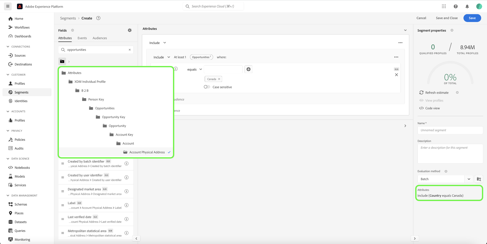

### 例4：業界と閲覧行動ごとの機会の「意思決定者」を見つける {#find-industry-browsing-behavior}

アカウントが「金融」業界にある機会の「意思決定者」であるすべての人を検索し、過去3日間に価格ページを訪問しました。

このオーディエンスを作成するには、過去3日間に価格ページを訪問したすべてのユーザーの基本オーディエンスを作成して、「セグメントのセグメント」を使用する必要があります。

基本オーディエンスを表示する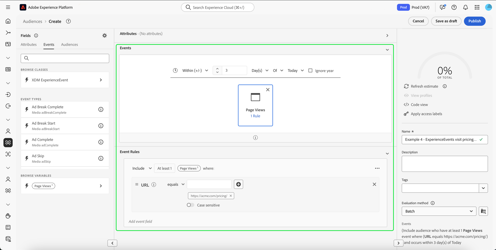

最初のオーディエンスを作成した後、アカウントが「金融」業界にある機会の「意思決定者」である別のオーディエンスと組み合わせることができます。

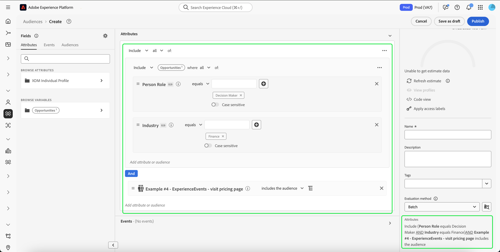

### 例5：部門名と商談金額で商談のB2B プロファイルを検索する {#find-department-opportunity-amount}

人事（HR）部門で働くすべての人を見つけ、与えられた金額（100万ドル）以上の価値がある少なくとも1つのオープンな機会を持つアカウントを持っています。 このオーディエンスには、[!UICONTROL XDM Individual Profile] クラス、[!UICONTROL XDM Business Account] クラスおよび[!UICONTROL XDM Business Opportunity] クラスの間のリンクが必要です。

例5の設定を表示する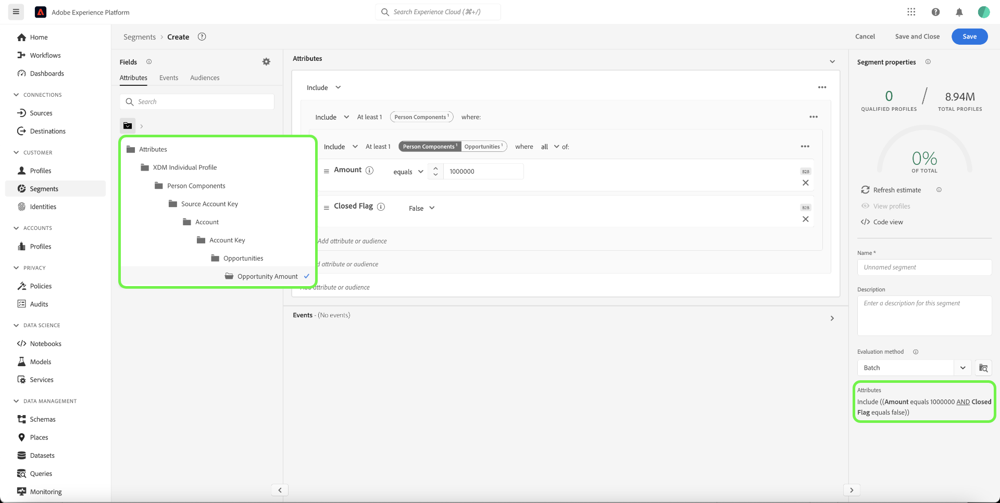

### 例6：役職と年間アカウント収益でB2B プロファイルを検索する {#find-by-job-title-and-revenue}

役職が副社長で、年間収入が特定の金額（1億ドル）以上のアカウントを持ち、先月少なくとも3回は価格ページを訪れた人をすべて見つけます。 このオーディエンスには、[!UICONTROL XDM Individual Profile] クラス、[!UICONTROL XDM Business Account] クラスおよび[!UICONTROL XDM ExperienceEvent] クラスの間のリンクが必要です。

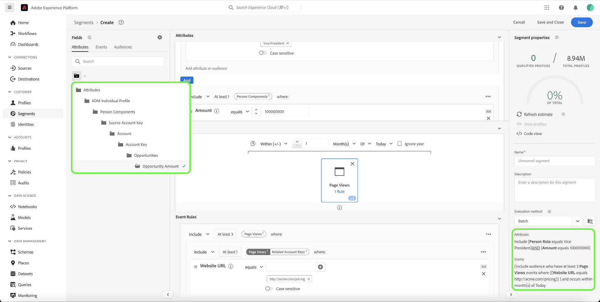

### 例7：商談のステータスと閲覧行動で「意思決定者」を特定 {#find-by-opportunity-status-and-browsing-behavior}

クローズした商談の「意思決定者」であるすべての人物を検索し、過去3日間に価格ページを訪問しました。

このオーディエンスを作成するには、過去3日間に価格ページを訪問したすべてのユーザーの基本オーディエンスを作成して、「セグメントのセグメント」を使用する必要があります。

基本オーディエンスを表示する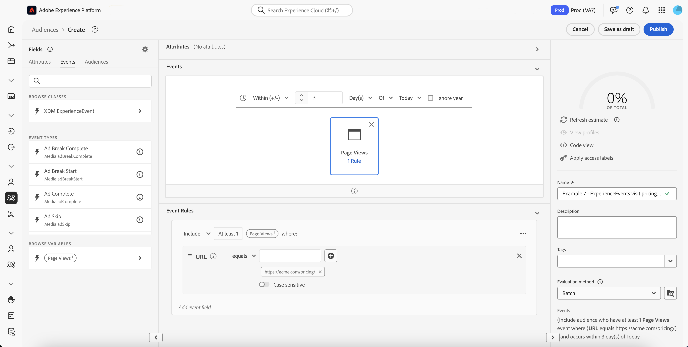

最初のオーディエンスを作成した後は、そのオーディエンスを、商談の「意思決定者」である別のオーディエンスと組み合わせることができます。これらのオーディエンスでは、「クローズドフラグ」がtrueに設定され、「ロストフラグ」がfalseに設定されています。

例7の設定を表示する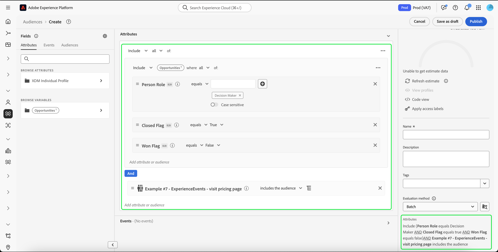

### 例8：関連アカウントを活用してセグメンテーションリーチを拡大 {#related-accounts}

人事（HR）部門で働き、任意のアカウント *またはアカウントの関連アカウント*&#x200B;に関連し、指定された金額（100万ドル）以上の価値のあるオープン商談が少なくとも1つ存在するすべての人物を検索します。 このオーディエンスには、[!UICONTROL XDM Individual Profile] クラス、[!UICONTROL XDM Business Account] クラスおよび[!UICONTROL XDM Business Opportunity] クラスの間のリンクが必要です。

関連アカウントのセグメンテーションを表示する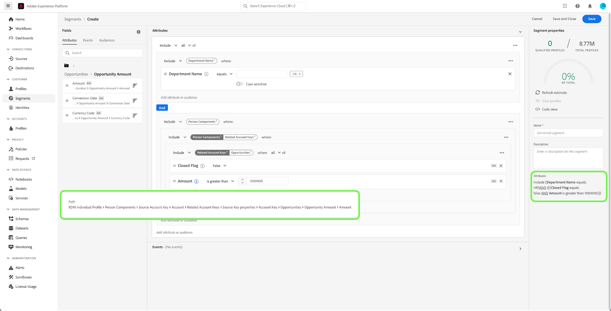

### 例9：リードスコアやアカウントスコアを使用してプロファイルを選定 {#account-scoring}

リードスコアが80を超える、すべてのプロファイルを検索する。

予測リードとアカウントスコアリングのセグメント化を表示する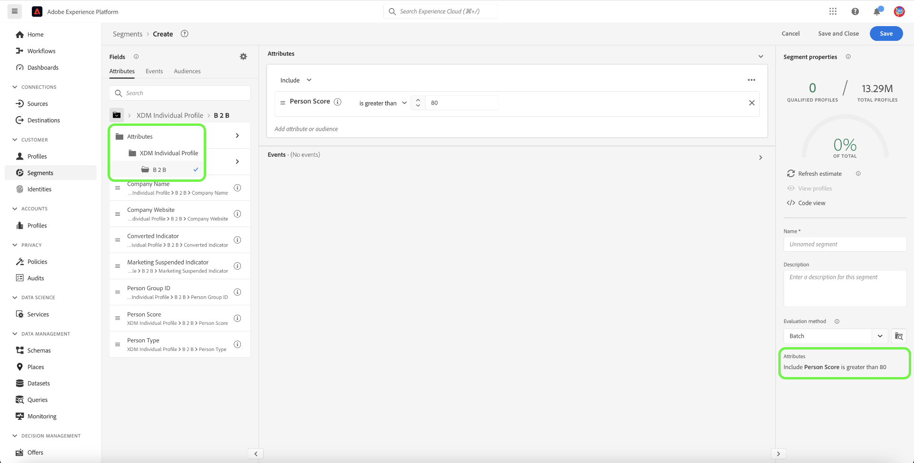

### 例10：親組織が一定額の収益を持つアカウントに関連付けられたB2B プロファイルを検索する {#find-parent-org-amount}

親組織が指定された金額（100,000,000 ドル）を超える収益を持つアカウントに関連付けられているすべての人物を検索します。

セグメント化の親組織を表示する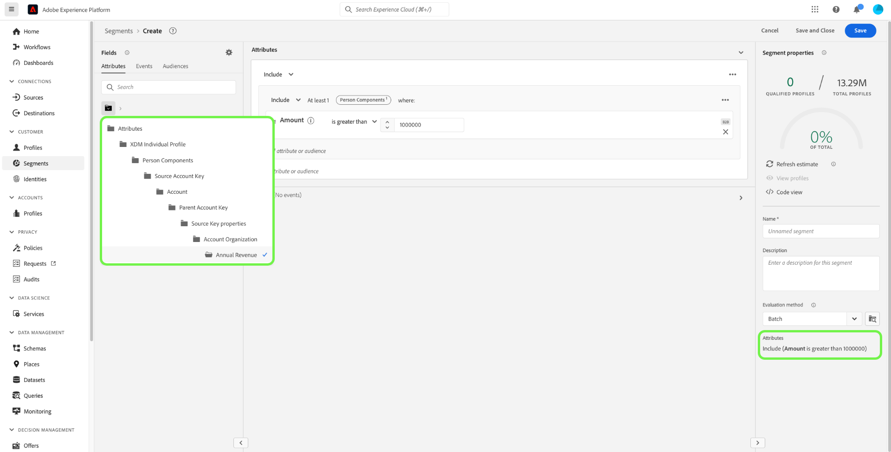

### 例11：アクティブな関係を持つ役職とアカウント名でB2B プロファイルを検索する {#find-by-job-title-and-account-name}

アカウント関係が「アクティブ」であるアカウント「Acme」の「マネージャー」であるすべての人を見つけます。

セグメント化の親組織を表示する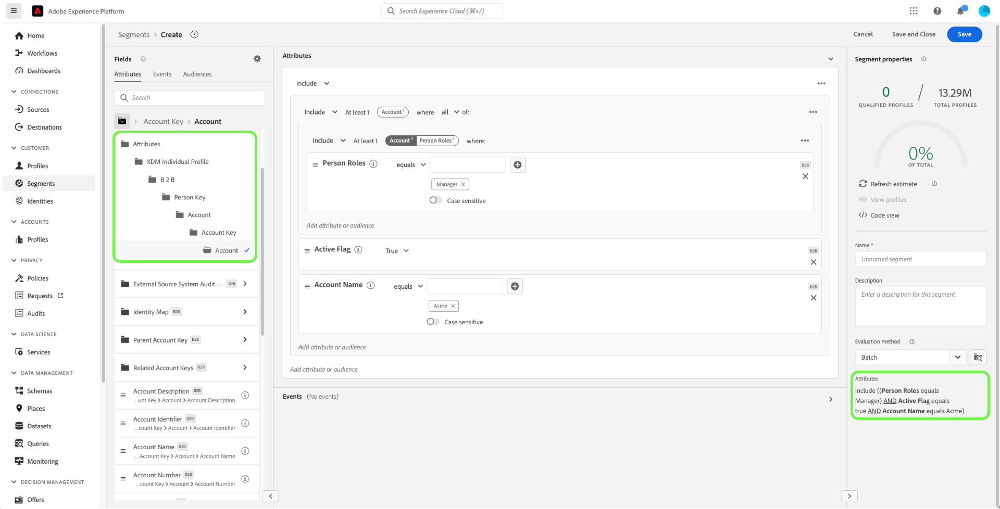

### 例12：実際のコストが予算コストを超えるキャンペーンのターゲットとなるB2B プロファイルを検索する {#find-actualcost-exceed-budgetcost}

実際のコストが予算コストを超えたキャンペーンの対象となるすべてのユーザーを検索します。

セグメント化の親組織を表示する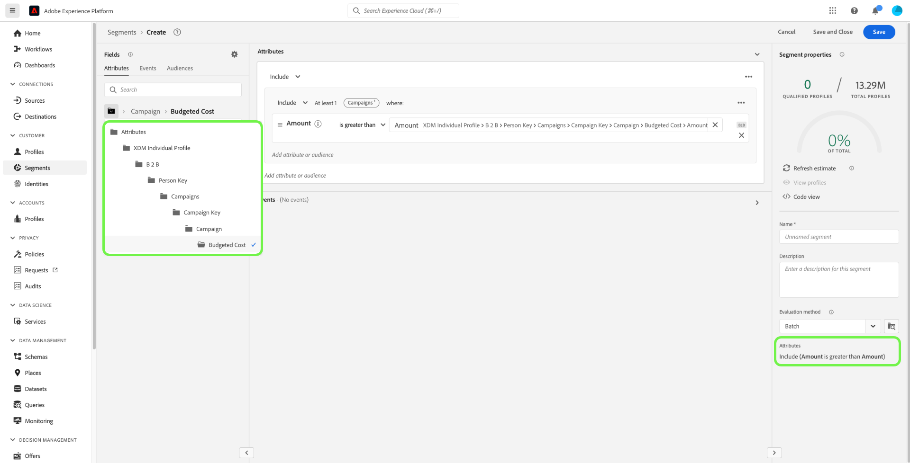

### 例13:Marketo静的リストに属するB2B プロファイルを検索し、isDeleted=false {#find-marketo-static-list}

isDeleted=falseのMarketo Static list &quot;Anniversary users&quot;に属するすべてのユーザーを検索します。

セグメント化の親組織を表示する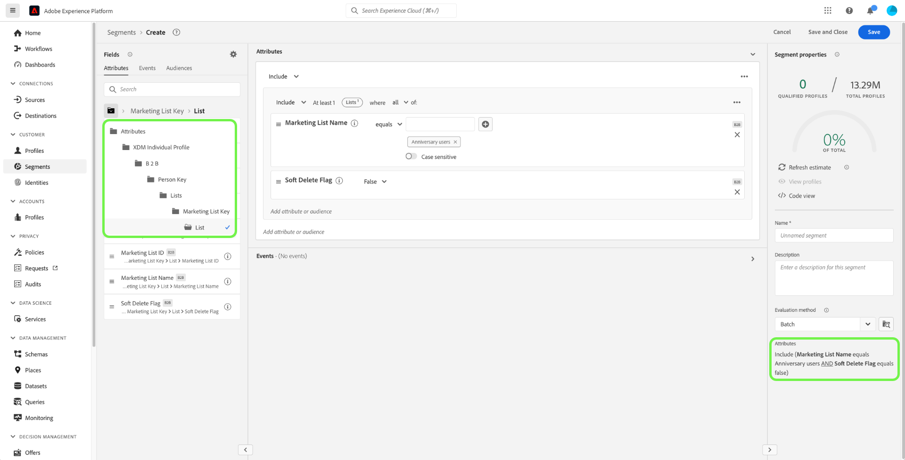

<!-- 
### Example 14: Find "decision makers" by opportunity status using streaming or edge segmentation {#find-decision-makers-personalization}

>[!NOTE]
>
>This example uses **streaming or edge** segmentation, as opposed to batch segmentation.

Find all the people who are a "Decision Maker" of any closed-lost opportunity and visited the pricing page in the last 24 hours. This example can be evaluated using streaming or edge segmentation, to support more real-time use cases.

To create this audience, you must use "segment of segments" by creating a base audience of all the people who visited the pricing page in the last 24 hours.

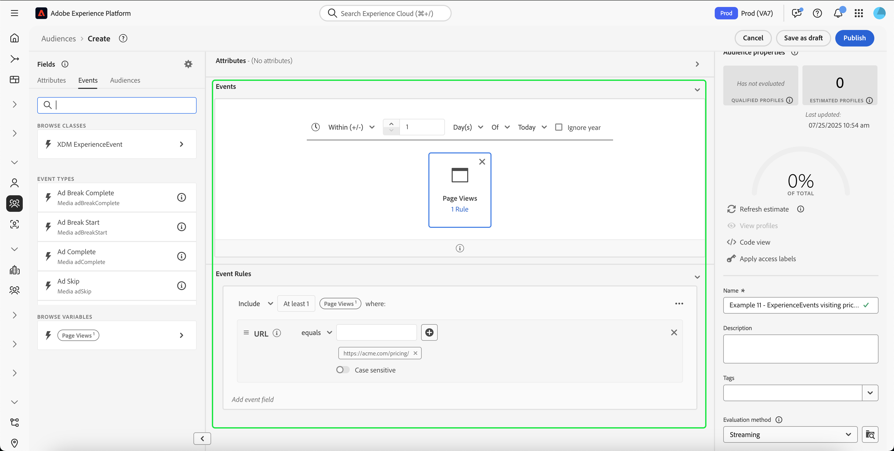

After creating the first audience, you can combine that with another audience of  people who are a "Decision Maker" of any opportunity where both the "Closed Flag" is set to true and the "Lost Flag" is set to false.

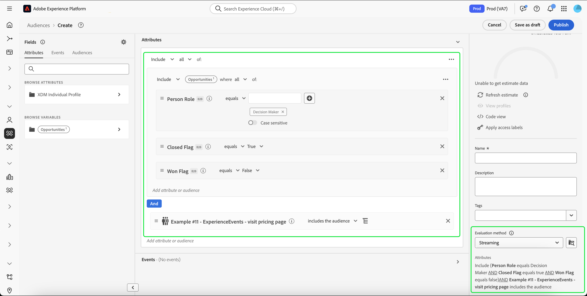 
-->

## 次の手順 {#next-steps}

この概要では、B2B editionのReal-Time CDPを使用して利用できるセグメンテーションの可能性について説明します。 セグメント化サービスの詳細については、[セグメント化に関するドキュメント](../../segmentation/home.md)を参照してください。
