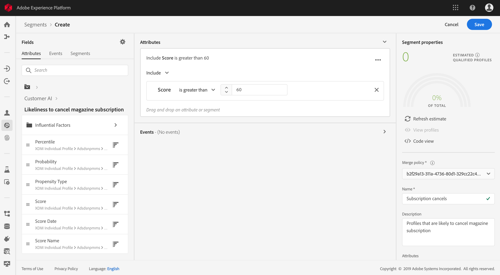

# 顧客 AI（アルファ）を使用した顧客傾向スコアの予測

>[!NOTE]
>このドキュメントで概要を説明する顧客 AI 機能はアルファです。ドキュメントと機能は変更される場合があります。

Adobe Experience Platform の顧客 AI は、Adobe Sensei によって構築され、Adobe Sensei を活用して、機械学習の側面を気にすることなく、カスタム傾向スコアを生成できます。

このチュートリアルでは、Experience Platform ユーザーインターフェイスを使用して顧客 AI を操作する手順を説明します。次のトピックの手順を説明します。

* [インスタンスの設定](#configure-an-instance)
* [予測スコアを使用した顧客セグメントの作成](#create-customer-segments-with-predicted-scores)

## はじめに

このガイドでは、顧客 AI の使用に関連する様々なプラットフォームサービスについて、実際に理解している必要があります。このチュートリアルを始める前に、次のドキュメントを確認してください。

* [リアルタイム顧客プロファイルの概要](https://www.adobe.io/apis/experienceplatform/home/profile-identity-segmentation/profile-identity-segmentation-services.html#!api-specification/markdown/narrative/technical_overview/unified_profile_architectural_overview/unified_profile_architectural_overview.md)
* [セグメント化サービスの概要](https://www.adobe.io/apis/experienceplatform/home/profile-identity-segmentation/profile-identity-segmentation-services.html#!api-specification/markdown/narrative/technical_overview/segmentation/segmentation-overview.md)
* [セグメントビルダーユーザーガイド](https://www.adobe.io/apis/experienceplatform/home/profile-identity-segmentation/profile-identity-segmentation-services.html#!api-specification/markdown/narrative/technical_overview/segmentation/segment-builder-guide.md)

## インスタンスの設定

Experience Platform の顧客 AI は、簡単に使用できる Adobe Sensei サービスとして提供されており、様々な使用事例に対して設定できます。次の節では、顧客 AI のインスタンスを設定する手順を説明します。

### インスタンスの設定

プラットフォーム UI で、左側のナビゲーションの「**サービス**」をクリックします。「**サービス**」ブラウザーが表示され、使用可能なすべてのサービスが表示されます。顧客 AI のコンテナで、「**開く**」をクリックします。

*顧客 AI* 画面には、既存のすべての顧客 AI インスタンスが表示されます。「**インスタンス作成**」をクリックします。

「*設定*」から始まり、インスタンス作成ワークフローが表示されます。

インスタンスに指定する必要がある値に関する重要な情報を次に示します。

* インスタンスの名前は、顧客 AI スコアが表示されるすべての場所で使用されます。したがって、「雑誌購読をキャンセルする可能性」など、予測スコアが何を表すかを名前で示す必要があります。

* 傾向タイプによって、スコアと指標の極性の意図が決まります。「**チャーン**」または「**コンバージョン**」を選択できます。

* データソースは、スコアの予測に使用される入力データセットを参照します。設計上、顧客 AI はコンシューマーエクスペリエンスイベントデータを使用して傾向スコアを計算します。ドロップダウンセレクターからデータセットを選択すると、顧客 AI と互換性のあるもののみが表示されます。

* デフォルトでは、適格な母集団が指定されていない限り、すべてのプロファイルに対して傾向スコアが生成されます。イベントに基づいてプロファイルを含めたり除外したりする条件を定義することで、適格な母集団を指定できます。

必要な値を入力し、「**次へ**」をクリックします。

### 目標の定義

*目標の定義*&#x200B;手順が表示され、目標を視覚的に定義できるインタラクティブな環境が提供されます。目標は 1 つ以上のイベントで構成され、各イベントの発生は保持する条件に基づきます。顧客 AI インスタンスの目的は、特定の期間内に目標を達成する可能性を判断することです。

「**フィールド名の入力**」をクリックし、ドロップダウンリストからフィールドを選択します。2 つ目の入力をクリックし、イベントの条件句を選択し、イベントを完了するターゲット値を指定します。追加のイベントは、「**イベント追加**」をクリックして設定できます。最後に、予測期間を日数で適用して目標を完了し、「**次へ**」をクリックします。

### スケジュールの設定&#x200B;*（オプション）*

*詳細*&#x200B;手順が表示されます。このオプションの手順では、予測の実行を自動化するスケジュールを設定したり、予測から特定のイベントを除外するフィルターを定義したりできます。必要がない場合は「**完了**」をクリックします。

「*スコアリング頻度*」を設定して、スコアリングスケジュールを設定します。予測の自動実行は、週単位または月単位でスケジュールできます。

スケジュール設定では、特定の条件を満たすイベントがスコアの生成時に評価されるのを防ぐために、予測の除外を定義できます。この機能を使用して、無関係なデータ入力を除外できます。

特定のイベントを除外するには、「**除外の追加**」をクリックし、目標の定義方法と同じ方法でイベントを定義します。除外を削除するには、イベントコンテナの右上にある省略記号（**...**）をクリックし、「**コンテナを削除**」をクリックします。

必要に応じてイベントを除外し、「**完了**」をクリックして、インスタンスを作成します。

インスタンスが正常に作成されると、予測実行が直ちにトリガーされ、定義したスケジュールに従って後続の予測実行が実行されます。

>   **注**：入力データのサイズによっては、予測の実行が完了するまでに最大 24 時間かかる場合があります。

この節では、顧客 AI のインスタンスを設定し、予測実行が実行されました。実行が正常に完了すると、スコアリングされた洞察が、予測されたスコアと共にプロファイルを自動的にハイドレートします。このチュートリアルの次の節に進む前に、24 時間お待ちください。

## 予測スコアを使用した顧客セグメントの作成

予測の実行が完了すると、予測された傾向スコアはプロファイルによって自動的に使用されます。顧客 AI スコアによるプロファイルの強化により、傾向スコアに基づく顧客セグメントを作成できます。ここでは、セグメントビルダーを使用してセグメントを作成する手順を説明します。セグメントの作成に関するより詳細なチュートリアルについては、『[セグメントビルダーユーザーガイド](https://www.adobe.io/apis/experienceplatform/home/profile-identity-segmentation/profile-identity-segmentation-services.html#!api-specification/markdown/narrative/technical_overview/segmentation/segment-builder-guide.md)』を参照してください。

プラットフォーム UI で、左側のナビゲーションの「**セグメント**」をクリックし、「**セグメント作成**」をクリックします。

「*セグメントビルダー*」が表示されます。左側の「*フィールド*」列の「*属性*」タブで、「**XDM Individual Profile**」という名前のフォルダーをクリックし、組織の名前空間を持つフォルダーをクリックします。「**Customer AI**」という名前のフォルダーには、予測実行の結果が格納され、スコアが属するインスタンスに基づいて名前が付けられます。目的のインスタンスの結果にをクリックしてアクセスします。

セグメントビルダーの中央にある「**スコア**」属性を&#x200B;*ルールビルダーキャンバス*&#x200B;にドラッグ&amp;ドロップし、ルールを定義します。

右側の「*セグメントプロパティ*」列で「*結合ポリシー*」を選択してセグメント名を指定し、「**保存**」をクリックしてセグメントを作成します。

## 次の手順

このチュートリアルでは、顧客 AI のインスタンスの設定、傾向スコアの生成、およびセグメントビルダーを使用した傾向スコアによって適用されるセグメントの作成が完了しました。これで、アクティブ化された宛先で顧客セグメントを使用して、オーディエンスをターゲット設定できます。詳しくは、「[宛先の概要](../destinations/destinations-overview.md)」を参照してください。
