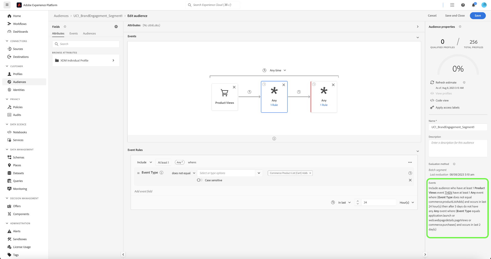

# 顧客をインテリジェントに再び関与させて再来訪させる

インテリジェントな再エンゲージメントにより、カスタマイズされたクロスチャネルドリップキャンペーンを設定して、顧客に特定のアクションを実行するよう促すことができます。 このナッジキャンペーンは、意図的な E メール、SMS、有料広告の提供を含む、限られた時間の操作を目的としています。 顧客が適切なアクションを実行すると、すぐに微調整キャンペーンが終了します。

## 前提条件と計画 {#prerequisites-and-planning}

このユースケースを実装する手順を完了したら、次のReal-Time CDP機能と UI 要素（使用順に一覧表示）を利用します。 これらの領域に必要な属性ベースのアクセス制御権限を持っていることを確認するか、必要な権限をシステム管理者に与えてもらってください。

* [ADOBE REAL-TIME CUSTOMER DATA PLATFORM(REAL-TIME CDP)](https://experienceleague.adobe.com/docs/platform-learn/tutorials/rtcdp/understanding-the-real-time-customer-data-platform.html)  — 複数のデータソースをまたいでデータを集計し、キャンペーンに燃料を供給します。 次に、このデータを使用して、キャンペーンオーディエンスを作成し、E メールや Web プロモーションタイルで使用するパーソナライズされたデータ要素（名前やアカウント関連の情報など）を表示します。 また、CDP は、(Adobe Targetを介して ) 電子メールと Web にまたがってオーディエンスをアクティブ化するためにも使用されます。
   * [スキーマ](/help/xdm/home.md)
   * [プロファイル](/help/profile/home.md)
   * [データセット](/help/catalog/datasets/overview.md)
   * [オーディエンス](/help/segmentation/home.md)
   * [Adobe Journey Optimizer](https://experienceleague.adobe.com/docs/journey-optimizer/using/orchestrate-journeys/journey.html?lang=ja)
   * [宛先](/help/destinations/home.md)
   * [イベントまたはオーディエンスのトリガー](https://experienceleague.adobe.com/docs/journey-optimizer/using/offer-decisioning/collect-event-data/data-collection.html)
   * [オーディエンス/イベント](https://experienceleague.adobe.com/docs/journey-optimizer/using/audiences-profiles-identities/audiences/about-audiences.html)
   * [ジャーニーアクション](https://experienceleague.adobe.com/docs/journey-optimizer/using/orchestrate-journeys/journey.html?lang=ja)

### ユースケースの達成方法：おおまかな概要 {#achieve-the-use-case-high-level}

現在、3 つの異なる再エンゲージメントジャーニーが開発されています。

>[!BEGINTABS]

>[!TAB 再エンゲージメントジャーニー]

再エンゲージメントのジャーニーは、Web サイトとアプリの両方で製品の閲覧を中止したことをターゲットにします。 このジャーニーは、製品が表示されたが、購入されなかった、または買い物かごに追加されなかった場合にトリガーされます。 過去 24 時間以内にリストが追加されなかった場合、ブランドエンゲージメントは 3 日後にトリガーされます。

1. データは、Edge Network（推奨される方法）を使用して、Web SDK、Mobile SDK、Edge Network API の取り込みに集計されます。
2. As a **顧客**&#x200B;を使用する場合、に対してマークされたデータセットを作成します [!UICONTROL プロファイル].
3. As a **顧客**&#x200B;では、プロファイルをReal-Time CDPに読み込み、ガバナンスポリシーを構築して、責任を持って使用するようにします。
4. As a **顧客**&#x200B;を使用する場合、プロファイルのリストから焦点を絞ったオーディエンスを作成し、 **ユーザー** は過去 3 日間にブランドエンゲージメントをおこないました。
5. As a **顧客**&#x200B;を使用する場合、Adobe Journey Optimizerで再エンゲージメントのジャーニーを作成します。
6. 必要に応じて、 **データパートナー** 対象の有料メディアの宛先に対するオーディエンスのアクティブ化。
7. Adobe Journey Optimizerは同意をチェックし、設定された様々なアクションを送信します。

>[!TAB 放棄された買い物かごのジャーニー]

廃止された買い物かごジャーニーは、買い物かごに入れられたが、Web サイトとアプリの両方でまだ購入されていない製品をターゲットに設定します。 さらに、有料メディアキャンペーンは、この方法を使用して開始および停止されます。

1. データは、Edge Network（推奨される方法）を使用して、Web SDK、Mobile SDK、Edge Network API の取り込みに集計されます。
2. As a **顧客**&#x200B;を使用する場合、に対してマークされたデータセットを作成します [!UICONTROL プロファイル].
3. As a **顧客**&#x200B;では、プロファイルをReal-Time CDPに読み込み、ガバナンスポリシーを構築して、責任を持って使用するようにします。
4. As a **顧客**&#x200B;を使用する場合、プロファイルのリストから焦点を絞ったオーディエンスを作成し、 **ユーザー** は買い物かごに品目を配置しましたが、まだ購入を完了していません。 The **[!UICONTROL 買い物かごに追加]** イベントは、30 分間待機し、購入を確認するタイマーを開始します。 購入が行われていない場合、 **ユーザー** が **[!UICONTROL 買い物かごを放棄]** オーディエンス。
5. As a **顧客**&#x200B;を使用する場合、Adobe Journey Optimizerに放棄された買い物かごのジャーニーを作成します
6. 必要に応じて、 **データパートナー** 対象の有料メディアの宛先に対するオーディエンスのアクティブ化。
7. Adobe Journey Optimizerは同意をチェックし、設定された様々なアクションを送信します。

>[!TAB 注文確認ジャーニー]

注文確認ジャーニーは、Web サイトやモバイルアプリを通じておこなわれた製品の購入に重点を置いています。

1. データは、Edge Network（推奨される方法）を使用して、Web SDK、Mobile SDK、Edge Network API の取り込みに集計されます。
2. As a **顧客**&#x200B;を使用する場合、に対してマークされたデータセットを作成します [!UICONTROL プロファイル].
3. As a **顧客**&#x200B;では、プロファイルをReal-Time CDPに読み込み、ガバナンスポリシーを構築して、責任を持って使用するようにします。
4. As a **顧客**&#x200B;を使用する場合、プロファイルのリストから焦点を絞ったオーディエンスを作成し、 **ユーザー** が購入されました。
5. As a **顧客**&#x200B;を使用する場合、確認ジャーニーをAdobe Journey Optimizerで作成します。
6. Adobe Journey Optimizerは、優先チャネルを使用して注文確認メッセージを送信します。

>[!ENDTABS]

## ユースケースの達成方法：手順 {#step-by-step-instructions}

上記の概要に記載されている各手順を完了するには、以下の節をお読みください。詳細情報と詳細な手順へのリンクが用意されています。

### 使用する UI 機能と要素 {#ui-functionality-and-elements}

ユースケースを実装する手順が完了したら、このドキュメントの最初に示すReal-Time CDPの機能と UI 要素を利用します。 これらの領域に必要な属性ベースのアクセス制御権限を持っていることを確認するか、必要な権限をシステム管理者に与えてもらってください。

### スキーマデザインの作成とフィールドグループの指定

Experience Data Model(XDM) のリソースは、 [!UICONTROL スキーマ] Adobe Experience Platformのワークスペース Adobeが提供するコアリソースを表示および調査し、組織のカスタムリソースおよびスキーマを作成できます。

<!--
To create a schema, complete the steps below:

1. Navigate to **[!UICONTROL Data Management]** > **[!UICONTROL Schemas]** and select **[!UICONTROL Create schema]**.
2. Select **[!UICONTROL XDM Individual Profile]/[!UICONTROL XDM ExperienceEvent]**.
3. Navigate to **[!UICONTROL Field groups]** and select **[!UICONTROL Add]**.
4. Use the search box to find and select the field group, then select **[!UICONTROL Add field groups]**.
5. Give your schema a name and optionally a description.
6. Select **[!UICONTROL Save]**.

 
-->

スキーマの作成について詳しくは、 [スキーマの作成に関するチュートリアル](/help/xdm/tutorials/create-schema-ui.md)

再エンゲージメントジャーニーに使用されるスキーマデザインは 4 つあります。 各スキーマでは、特定のフィールドと、強く推奨されるいくつかのフィールドを設定する必要があります。

#### 顧客属性スキーマ

顧客属性スキーマは、 [!UICONTROL XDM 個人プロファイル] クラス。次のフィールドグループが含まれます。

+++個人の連絡先の詳細（フィールドグループ）

[個人の連絡先の詳細](/help/xdm/field-groups/profile/personal-contact-details.md) は、個人の連絡先情報を記述する XDM Individual Profile クラスの標準スキーマフィールドグループです。

| フィールド | 要件 | 説明 |
| --- | --- | --- |
| mobilePhone.number | 必須 | SMS に使用される人の携帯電話番号。 |
| personalEmail.address | 必須 | 人物の電子メールアドレス。 |

+++

+++人口統計の詳細（フィールドグループ）

[人口統計の詳細](/help/xdm/field-groups/profile/demographic-details.md) は、XDM Individual Profile クラスの標準スキーマフィールドグループです。 フィールドグループは、個人に関する情報を表すルートレベルの個人オブジェクトを提供します。このオブジェクトのサブフィールドは、個人に関する情報を表します。

| フィールド | 要件 |
| --- | --- |
| person.name.firstName | 推奨 |
| person.name.lastName | 推奨 |

+++

+++外部ソースシステム監査の詳細（フィールドグループ）

[外部ソースシステム監査属性](/help/xdm/data-types/external-source-system-audit-attributes.md) は、外部ソースシステムに関する監査の詳細を取り込む、標準の Experience Data Model(XDM) データ型です。

+++

+++同意および環境設定フィールドグループ（フィールドグループ）

[同意および環境設定](/help/xdm/field-groups//profile/consents.md) フィールドグループは、同意および環境設定情報を取り込むための単一のオブジェクトタイプフィールド（同意）を提供します。

| フィールド | 要件 |
| --- | --- |
| consents.marketing.email.val | 必須 |
| consents.marketing.preferred | 必須 |
| consents.marketing.push.val | 必須 |
| consents.marketing.sms.val | 必須 |
| consents.personalize.content.val | 必須 |
| consents.share.val | 必須 |

+++

+++プロファイルテストの詳細（フィールドグループ）

このフィールドグループは、ベストプラクティスに使用されます。

+++

<!--
 
-->

#### 顧客のデジタルトランザクションスキーマ

顧客のデジタルトランザクションスキーマは、 [!UICONTROL XDM ExperienceEvent] クラス。次のフィールドグループが含まれます。

+++Adobe Experience Platform Web SDK ExperienceEvent（フィールドグループ）

| フィールド | 要件 |
| --- | --- |
| device.model | 推奨 |
| environment.browserDetails.userAgent | 推奨 |

+++

+++Web の詳細（フィールドグループ）

Web 詳細は、XDM ExperienceEvent クラスの標準スキーマフィールドグループで、インタラクション、ページの詳細、リファラーなどの Web 詳細イベントに関する情報を記述するために使用されます。

| フィールド | 要件 | 説明 |
| --- | --- | --- |
| web.webInteraction.linkClicks.id | 推奨 | インタラクションに対応する Web リンクまたは URL の ID。 |
| web.webInteraction.linkClicks.value | 推奨 | インタラクションに対応する Web リンクまたは URL のクリック数。 |
| web.webInteraction.name | 推奨 | Web ページの名前。 |
| web.webInteraction.URL | 推奨 | Web ページの URL です。 |
| web.webPageDetails.name | 推奨 | Web インタラクションが発生した Web ページの名前。 |
| web.webPageDetails.URL | 推奨 | Web インタラクションが発生した Web ページの URL。 |
| web.webReferrer.URL | 推奨 | Web インタラクションのリファラーを表します。これは、現在の Web インタラクションが記録される直前に訪問者が来た URL です。 |

+++

+++コンシューマーエクスペリエンスイベント（フィールドグループ）

| フィールド | 要件 |
| --- | --- |
| commerce.cart.cartID | 推奨 |
| commerce.cart.cartSource | 推奨 |
| commerce.cartAbandons.id | 推奨 |
| commerce.cartAbandons.value | 推奨 |
| commerce.order.orderType | 推奨 |
| commerce.order.payments.paymentAmount | 推奨 |
| commerce.order.payments.paymentType | 推奨 |
| commerce.order.payments.transactionID | 推奨 |
| commerce.order.priceTotal | 推奨 |
| commerce.order.purchaseID | 推奨 |
| commerce.productListAdds.id | 推奨 |
| commerce.productListAdds.value | 推奨 |
| commerce.productListOpens.id | 推奨 |
| commerce.productListOpens.value | 推奨 |
| commerce.productListRemoval.id | 推奨 |
| commerce.productListRemoval.value | 推奨 |
| commerce.productListViews.id | 推奨 |
| commerce.productListViews.value | 推奨 |
| commerce.productViews.id | 推奨 |
| commerce.productViews.value | 推奨 |
| commerce.purchases.id | 推奨 |
| commerce.purchases.value | 推奨 |
| marketing.campaignGroup | 推奨 |
| marketing.campaignName | 推奨 |
| marketing.trackingCode | 推奨 |
| productListItems.name | 推奨 |
| productListItems.priceTotal | 推奨 |
| productListItems.product | 推奨 |
| productListItems.quantity | 推奨 |

+++

+++エンドユーザー ID の詳細（フィールドグループ）

| フィールド | 要件 | 説明 |
| --- | --- | --- |
| endUserIDs._experience.emailid.authenticatedState | 必須 | エンドユーザーの電子メールアドレス ID 認証状態。 |
| endUserIDs._experience.emailid.id | 必須 | エンドユーザーの電子メールアドレス ID。 |
| endUserIDs._experience.emailid.namespace.code | 必須 | エンドユーザーの電子メールアドレス ID 名前空間コード。 |
| endUserIDs._experience.mcid.authenticatedState | 必須 | Adobe Marketing Cloud ID(MCID) 認証済み状態。 MCID は、Experience CloudID(ECID) と呼ばれます。 |
| endUserIDs._experience.mcid.id | 必須 | Adobe Marketing Cloud ID(MCID)。 MCID は、Experience CloudID(ECID) と呼ばれます。 |
| endUserIDs._experience.mcid.namespace.code | 必須 | Adobe Marketing Cloud ID(MCID) 名前空間コード。 |

+++

+++クラス値（フィールドグループ）

| フィールド | 要件 |
| --- | --- |
| eventType | 必須 |
| タイムスタンプ | 必須 |

+++

+++外部ソースシステム監査の詳細（フィールドグループ）

External Source System Audit Attributes は、外部ソースシステムに関する監査の詳細を取り込む、標準の Experience Data Model(XDM) データ型です。

+++

<!--
 
-->

#### 顧客オフライントランザクションスキーマ

顧客オフライントランザクションスキーマは、 [!UICONTROL XDM ExperienceEvent] クラス。次のフィールドグループが含まれます。

+++コマースの詳細（フィールドグループ）

| フィールド | 要件 | 説明 |
| --- | --- | --- |
| commerce.cart.cartID | 必須 | 買い物かごの ID。 |
| commerce.order.orderType | 必須 | 製品の注文タイプを表すオブジェクト。 |
| commerce.order.payments.paymentAmount | 必須 | 製品注文の支払い額を表すオブジェクトです。 |
| commerce.order.payments.paymentType | 必須 | 製品注文の支払いタイプを表すオブジェクトです。 |
| commerce.order.payments.transactionID | 必須 | オブジェクト製品注文トランザクション ID。 |
| commerce.order.purchaseID | 必須 | オブジェクトの商品注文の購入 ID。 |
| productListItems.name | 必須 | 顧客が選択した商品を表す項目名のリスト。 |
| productListItems.priceTotal | 必須 | 顧客が選択した製品を表す項目のリストの合計価格。 |
| productListItems.product | 必須 | 選択した製品。 |
| productListItems.quantity | 必須 | 顧客が選択した製品を表す項目のリストの数。 |

+++

+++個人の連絡先の詳細（フィールドグループ）

| フィールド | 要件 | 説明 |
| --- | --- | --- |
| mobilePhone.number | 必須 | SMS に使用される人の携帯電話番号。 |
| personalEmail.address | 必須 | 人物の電子メールアドレス。 |

+++

+++クラス値（フィールドグループ）

| フィールド | 要件 |
| --- | --- |
| eventType | 必須 |
| タイムスタンプ | 必須 |

+++

+++外部ソースシステム監査の詳細（フィールドグループ）

External Source System Audit Attributes は、外部ソースシステムに関する監査の詳細を取り込む、標準の Experience Data Model(XDM) データ型です。

+++

<!--
 
-->

#### AdobeWeb コネクタのスキーマ

AdobeWeb コネクタスキーマは、 [!UICONTROL XDM ExperienceEvent] クラス。次のフィールドグループが含まれます。

+++Adobe Analytics ExperienceEvent テンプレート（フィールドグループ）

| フィールド | 要件 | 説明 |
| --- | --- | --- |
| web.webInteraction.linkClicks.id | 推奨 | インタラクションに対応する Web リンクまたは URL の ID。 |
| web.webInteraction.linkClicks.value | 推奨 | インタラクションに対応する Web リンクまたは URL のクリック数。 |
| web.webInteraction.name | 推奨 | Web ページの名前。 |
| web.webInteraction.URL | 推奨 | Web ページの URL です。 |
| web.webPageDetails.name | 推奨 | Web インタラクションが発生した Web ページの名前。 |
| web.webPageDetails.URL | 推奨 | Web インタラクションが発生した Web ページの URL。 |
| web.webReferrer.URL | 推奨 | Web インタラクションのリファラーを表します。これは、現在の Web インタラクションが記録される直前に訪問者が来た URL です。 |
| commerce.cart.cartID | 推奨 | |
| commerce.cart.cartSource | 推奨 | |
| commerce.cartAbandons.id | 推奨 | |
| commerce.cartAbandons.value | 推奨 | |
| commerce.order.orderType | 推奨 | |
| commerce.order.payments.paymentAmount | 推奨 | |
| commerce.order.payments.paymentType | 推奨 | |
| commerce.order.payments.transactionID | 推奨 | |
| commerce.order.priceTotal | 推奨 | |
| commerce.order.purchaseID | 推奨 | |
| commerce.productListAdds.id | 推奨 | |
| commerce.productListAdds.value | 推奨 | |
| commerce.productListOpens.id | 推奨 | |
| commerce.productListOpens.value | 推奨 | |
| commerce.productListRemoval.id | 推奨 | |
| commerce.productListRemoval.value | 推奨 | |
| commerce.productListViews.id | 推奨 | |
| commerce.productListViews.value | 推奨 | |
| commerce.productViews.id | 推奨 | |
| commerce.productViews.value | 推奨 | |
| commerce.purchases.id | 推奨 | |
| commerce.purchases.value | 推奨 | |
| marketing.campaignGroup | 推奨 | |
| marketing.campaignName | 推奨 | |
| marketing.trackingCode | 推奨 | |
| productListItems.name | 推奨 | |
| productListItems.priceTotal | 推奨 | |
| productListItems.product | 推奨 | |
| productListItems.quantity | 推奨 | |
| endUserIDs._experience.emailid.authenticatedState | 必須 | エンドユーザーの電子メールアドレス ID 認証状態。 |
| endUserIDs._experience.emailid.id | 必須 | エンドユーザーの電子メールアドレス ID。 |
| endUserIDs._experience.emailid.namespace.code | 必須 | エンドユーザーの電子メールアドレス ID 名前空間コード。 |
| endUserIDs._experience.mcid.authenticatedState | 必須 | Adobe Marketing Cloud ID(MCID) 認証済み状態。 MCID は、Experience CloudID(ECID) と呼ばれます。 |
| endUserIDs._experience.mcid.id | 必須 | Adobe Marketing Cloud ID(MCID)。 MCID は、Experience CloudID(ECID) と呼ばれます。 |
| endUserIDs._experience.mcid.namespace.code | 必須 | Adobe Marketing Cloud ID(MCID) 名前空間コード。 |

+++

+++クラス値（フィールドグループ）

| フィールド | 要件 |
| --- | --- |
| eventType | 必須 |
| タイムスタンプ | 必須 |

+++

+++外部ソースシステム監査の詳細（フィールドグループ）

External Source System Audit Attributes は、外部ソースシステムに関する監査の詳細を取り込む、標準の Experience Data Model(XDM) データ型です。

+++

<!--
 
-->

### スキーマからのデータセットの作成

データセットは、データのグループ ( 多くの場合、フィールド（行）とスキーマ（列）を含むテーブル ) のストレージと管理の構造です。 インテリジェントな再エンゲージメントジャーニーのすべてのスキーマには、1 つのデータセットが含まれます。

スキーマからデータセットを作成する方法について詳しくは、 [データセット UI ガイド](/help/catalog/datasets/user-guide.md).
<!-- 
To create a dataset from a schema, complete the steps below:

1. Navigate to **[!UICONTROL Data Management]** > **[!UICONTROL Datasets]** and select **[!UICONTROL Create dataset]**.
2. Select **[!UICONTROL Create dataset from schema]**.
3. Select the relevant re-engagement schema you created.
4. Give your dataset a name and optionally a description.
5. Select **[!UICONTROL Finish]**.

-->

>[!NOTE]
>
>スキーマを作成する手順と同様に、データセットをリアルタイム顧客プロファイルに含める必要があります。 リアルタイム顧客プロファイルでデータセットを使用する方法について詳しくは、 [スキーマの作成に関するチュートリアル](/help/xdm/tutorials/create-schema-ui.md#profile).

<!-- 

-->

### プライバシー、同意、データガバナンス

#### 同意ポリシー

>[!IMPORTANT]
>
>顧客がブランドからの通信を購読解除する機能を提供することは、法的要件であり、この選択を確実に受け入れるためにも必要です。 該当する法律について詳しくは、[Experience Platformドキュメント](https://experienceleague.adobe.com/docs/experience-platform/privacy/regulations/overview.html)を参照してください。

再エンゲージメントパスを作成する場合は、次の同意ポリシーを考慮して使用する必要があります。

* consents.marketing.email.val = &quot;Y&quot;の場合、電子メールを送信できます
* consents.marketing.sms.val = &quot;Y&quot;の場合、SMS を送信可能
* consents.marketing.push.val = &quot;Y&quot;の場合、プッシュ可能
* consents.share.val = &quot;Y&quot;の場合、アドバタイズ可能
* お客様の実装によって定義される必要性

#### DULE ラベルと実施

個人の電子メールアドレスは、デバイスではなく特定の個人を識別したり、特定の個人と連絡を取り合うために使用される、直接識別可能なデータとして使用されます。

* personalEmail.address = I1

#### マーケティングポリシー

再エンゲージメントジャーニーに追加のマーケティングポリシーは必要ありませんが、必要に応じて、以下を考慮する必要があります。

* 機密データの制限
* オンサイト広告の制限
* メールのターゲティングを制限
* クロスサイトターゲティングの制限
* 直接識別可能なデータと匿名データの組み合わせを制限

### オーディエンスの作成

<!--
To create an audience, complete the steps below:

1. Navigate to **[!UICONTROL Customer]** > **[!UICONTROL Audiences]** and select **[!UICONTROL Create audience]**.
2. Select **[!UICONTROL Build rule]** and select **[!UICONTROL Create]**.
3. Navigate to **[!UICONTROL Field]** and select **[!UICONTROL Events]** tab.
4. Navigate or use the search box to find the event type, then drag this to the builder. Finally add event rules by dragging event types.
5. Give your schema a name and optionally a description.
6. Select **[!UICONTROL Save]**.

-->

#### ブランドの再エンゲージメントジャーニー用のオーディエンスの作成

再エンゲージメントジャーニーは、オーディエンスを使用して、プロファイルストアのプロファイルのサブセットで共有される特定の属性や行動を定義し、マーケティング可能な人々のグループを顧客ベースから区別します。 オーディエンスは、Adobe Experience Platform上で 2 つの異なる方法で作成できます。オーディエンスとして直接構成するか、Platform 派生のセグメント定義を通じて作成します。

オーディエンスを直接作成する方法について詳しくは、 [Audience Composition UI ガイド](/help/segmentation/ui/audience-composition.md).

Platform 派生セグメント定義を使用してオーディエンスを構築する方法について詳しくは、 [Audience Builder UI ガイド](/help/segmentation/ui/segment-builder.md).

>[!BEGINTABS]

>[!TAB 再エンゲージメントジャーニー]

次のイベントは、ユーザーが製品をオンラインで表示し、次の 24 時間に買い物かごに追加せず、その後 3 日間はブランドエンゲージメントがおこなわれなかった再エンゲージメントジャーニーに使用されます。

EventType = ProductViews イベントを 1 つ以上持つオーディエンスを含める。(EventType が commerce.productListAdds と等しくなく、過去 24 時間で発生し、3 日後に発生するイベントが 1 つ以上、（EventType = application.launch または webpagedetails.pageViews または commerce.purchases）は過去 2 日間に発生します。

<!--
 
-->

>[!TAB 放棄された買い物かごのジャーニー]

次のイベントは、製品を買い物かごに追加したが、過去 24 時間に購入を完了しなかった、または買い物かごをクリアしなかったプロファイルに使用されます。

EventType = commerce.productListAdds を含めます（30 分～ 1440 分前）。
exclude EventType = commerce.purchases 30 分前に今すぐまたは EventType = commerce.productListRemovals AND Cart ID が Product List Adds1 Cart ID（インクルージョンイベント）と等しくなりました。

<!--
 
-->

>[!ENDTABS]

### Adobe Journey Optimizerでのジャーニーの設定

>[!NOTE]
>
>Adobe Journey Optimizerは、このページの上部にある図に表示されるすべてを網羅しているわけではありません。 すべての有料メディア広告は、で作成されます。 [!UICONTROL 宛先].

Adobe Journey Optimizerは、顧客とのつながり、コンテキストに応じた、パーソナライズされたエクスペリエンスを提供するのに役立ちます。 カスタマージャーニーとは、顧客がブランドとやり取りするプロセス全体を指します。 各使用例には様々なジャーニーを含めることができ、それぞれに特定の情報が必要です。 以下に、各ジャーニー分岐に必要な正確なデータを示します。

>[!BEGINTABS]

>[!TAB 再エンゲージメントジャーニー]

<!--
 
-->

+++イベント

* 製品表示
   * スキーマ：顧客のデジタルトランザクション
   * フィールド:
      * EventType
   * 条件:
      * EventType = commerce.productViews
      * フィールド:
         * Commerce.productViews.id
         * Commerce.productViews.value
         * eventType
         * identityMap.authenticatedState
         * identityMap.id
         * identityMap.primary
         * productListItems.SKU
         * productListItems.currencyCode
         * productListItems.name
         * productListItems.priceTotal
         * productListItems.product
         * productListItems.productImageUrl
         * productListItems.quantity
         * タイムスタンプ
         * endUserIDs._experience.emailid.authenticatedState
         * endUserIDs._experience.emailid.id
         * endUserIDs._experience.emailid.namespace.code
         * _id

* 買い物かごに追加
   * スキーマ：顧客のデジタルトランザクション
   * フィールド:
      * イベントタイプ
   * 条件:
      * イベントタイプ= commerce.productListAdds
      * フィールド:
         * Commerce.productListAdds.id
         * Commerce.productListAdds.value
         * eventType
         * identityMap.authenticatedState
         * identityMap.id
         * identityMap.primary
         * productListItems.SKU
         * productListItems.currencyCode
         * productListItems.name
         * productListItems.priceTotal
         * productListItems.product
         * productListItems.productImageUrl
         * productListItems.quantity
         * タイムスタンプ
         * commerce.cart.cartID
         * endUserIDs._experience.emailid.authenticatedState
         * endUserIDs._experience.emailid.id
         * endUserIDs._experience.emailid.namespace.code
         * _id

* ブランドエンゲージメント
   * スキーマ：顧客のデジタルトランザクション
   * フィールド:
      * EventType
   * 条件:
      * application.launch、commerce.purchases、web.webpagedetails.pageViews の EventType
      * フィールド:
         * eventType
         * identityMap.authenticatedState
         * identityMap.id
         * identityMap.primary
         * productListItems.SKU
         * productListItems.currencyCode
         * productListItems.name
         * productListItems.priceTotal
         * productListItems.product
         * productListItems.productImageUrl
         * productListItems.quantity
         * タイムスタンプ
         * web.webpagedetails.URL
         * web.webpagedetails.isHomePage
         * web.webpagedetails.name
         * endUserIDs._experience.emailid.authenticatedState
         * endUserIDs._experience.emailid.id
         * endUserIDs._experience.emailid.namespace.code
         * _id
         * Commerce.purchases.id
         * Commerce.purchases.value
         * shipping.address.city
         * shipping.address.countryCode
         * shipping.address.postalCode
         * shipping.address.state
         * shipping.address.street1
         * shipping.address.street2
         * shipping.shipDate
         * shipping.trackingNumber
         * shipping.trackingURL

+++

+++キージャーニーロジック

* ジャーニー入口ロジック
   * 製品表示イベント

* 条件
   * 製品が最後に表示されてから、少なくとも 1 つのオンラインまたはオフラインの購入イベントを確認します。
      * スキーマ：顧客のデジタルトランザクション
      * eventType = commerce.purchases
      * timestamp > timestamp of product last viewed

   * 製品が最後に閲覧されてから少なくとも 1 回のオフライン購入を確認してください：
      * スキーマ：顧客オフライントランザクション v.1
      * eventType = commerce.purchases
      * timestamp > timestamp of product last viewed

   * 条件 — ターゲットチャネルの選択
      * メール
         * consents.marketing.email.val = y
      * プッシュ
         * consents.marketing.push.val=y
      * SMS
         * consents.marketing.sms.val = y

   * チャネルのパーソナライズ
      * 製品表示に基づいてパーソナライズされたチャネルコンテンツ。

+++

>[!TAB 放棄された買い物かごのジャーニー]

<!--
 
-->

+++イベント

* 買い物かごに追加
   * スキーマ：顧客のデジタルトランザクション
   * フィールド:
      * イベントタイプ
   * 条件:
      * イベントタイプ= commerce.productListAdds
      * フィールド:
         * Commerce.productListAdds.id
         * Commerce.productListAdds.value
         * eventType
         * identityMap.authenticatedState
         * identityMap.id
         * identityMap.primary
         * productListItems.SKU
         * productListItems.currencyCode
         * productListItems.name
         * productListItems.priceTotal
         * productListItems.product
         * productListItems.productImageUrl
         * productListItems.quantity
         * タイムスタンプ
         * commerce.cart.cartID
         * endUserIDs._experience.emailid.authenticatedState
         * endUserIDs._experience.emailid.id
         * endUserIDs._experience.emailid.namespace.code
         * _id

* オンライン購入
   * スキーマ：顧客のデジタルトランザクション
   * フィールド:
      * イベントタイプ
   * 条件:
      * イベントタイプ= commerce.purchases
      * フィールド:
         * Commerce.purchases.id
         * Commerce.purchases.value
         * eventType
         * identityMap.authenticatedState
         * identityMap.id
         * identityMap.primary
         * productListItems.SKU
         * productListItems.currencyCode
         * productListItems.name
         * productListItems.priceTotal
         * productListItems.product
         * productListItems.productImageUrl
         * productListItems.quantity
         * タイムスタンプ
         * endUserIDs._experience.emailid.authenticatedState
         * endUserIDs._experience.emailid.id
         * endUserIDs._experience.emailid.namespace.code
         * _id

* ブランドエンゲージメント
   * スキーマ：顧客のデジタルトランザクション
   * フィールド:
      * EventType
   * 条件:
      * application.launch、commerce.purchases、web.webpagedetails.pageViews の EventType
      * フィールド:
         * eventType
         * identityMap.authenticatedState
         * identityMap.id
         * identityMap.primary
         * productListItems.SKU
         * productListItems.currencyCode
         * productListItems.name
         * productListItems.priceTotal
         * productListItems.product
         * productListItems.productImageUrl
         * productListItems.quantity
         * タイムスタンプ
         * web.webpagedetails.URL
         * web.webpagedetails.isHomePage
         * web.webpagedetails.name
         * endUserIDs._experience.emailid.authenticatedState
         * endUserIDs._experience.emailid.id
         * endUserIDs._experience.emailid.namespace.code
         * _id
         * Commerce.purchases.id
         * Commerce.purchases.value
         * shipping.address.city
         * shipping.address.countryCode
         * shipping.address.postalCode
         * shipping.address.state
         * shipping.address.street1
         * shipping.address.street2
         * shipping.shipDate
         * shipping.trackingNumber
         * shipping.trackingURL

+++

+++キージャーニーロジック

* ジャーニー入口ロジック
   * AddToCart イベント

* 認証済みの AuthenticatedState

* 条件：買い物かごが最後に破棄された後のオフライン購入：
   * スキーマ：顧客オフライントランザクション v.1
   * eventType = commerce.purchases
   * timestamp > timestamp of cart was last abandoned

* 条件：買い物かごが最後に破棄されてからクリアされた買い物かご：
   * スキーマ：顧客デジタルトランザクション v.1
   * eventType = commerce.cartCleared
   * cartID （買い物かごの ID）
   * timestamp > timestamp of cart was last abandoned

* ターゲットチャネルを選択（広い範囲に到達するには 1 つまたは複数のチャネルを選択）
   * メール
      * consents.marketing.email.val = y
   * プッシュ
      * consents.marketing.push.val = y
   * SMS
      * consents.marketing.sms.val = y
   * チャネルのパーソナライズ
      * 買い物かごの詳細情報を表示し、複数の製品を表形式で表示できます。

+++

>[!TAB 注文確認ジャーニー]

<!--
 
-->

+++イベント

* オンライン購入
   * スキーマ：顧客のデジタルトランザクション
   * フィールド:
      * EventType
   * 条件:
      * イベントタイプ= commerce.purchases
      * フィールド:
         * Commerce.purchases.id
         * Commerce.purchases.value
         * eventType
         * identityMap.authenticatedState
         * identityMap.id
         * identityMap.primary
         * productListItems.SKU
         * productListItems.currencyCode
         * productListItems.name
         * productListItems.priceTotal
         * productListItems.product
         * productListItems.productImageUrl
         * productListItems.quantity
         * タイムスタンプ
         * endUserIDs._experience.emailid.authenticatedState
         * endUserIDs._experience.emailid.id
         * endUserIDs._experience.emailid.namespace.code
         * _id

+++

+++キージャーニーロジック

* ジャーニー入口ロジック
   * 注文イベント

* 条件
   * 「ターゲットチャネル」を選択します（広い範囲に到達するには 1 つまたは複数のチャネルを選択します）。
      * 注文の確認は本質的に役立つと考えられるので、通常、同意の確認は不要です。
      * メール
      * プッシュ
      * SMS

   * チャネルコンテンツのパーソナライズ
      * 注文の詳細情報を表示し、表形式を使用して製品のリストを表示できます。

+++

>[!ENDTABS]

でのジャーニー作成の詳細 [Adobe Journey Optimizer]を読む [ジャーニーの概要ガイド](https://experienceleague.adobe.com/docs/journey-optimizer/using/orchestrate-journeys/journey.html?lang=ja).

### 宛先での有料メディア広告の設定

宛先フレームワークは、有料メディア広告に使用されます。 同意が得られると、設定された様々な宛先に送信されます。 例えば、ダイレクトメール、E メールなどです。

#### 宛先に必要なデータ

ストリーミングセグメントの書き出し先 (Facebook、Google Customer Match、Google DV360 など ) は、顧客データからの様々な ID をサポートします。

* `personalEmail.address`
* `ECID`
* `mobilePhone.number`

「買い物かごセグメントを放棄」はストリーミングなので、この使用例では宛先フレームワークで使用できます。

* ストリーム/トリガー済み
   * [広告](/help/destinations/catalog/advertising/overview.md)/[Paid Media &amp; Social](/help/destinations/catalog/social/overview.md)
   * [Mobile](/help/destinations/catalog/mobile-engagement/overview.md)
   * [ストリーミング先](/help/destinations/catalog/streaming/http-destination.md)
   * [カスタムDestination SDK](/help/destinations/destination-sdk/overview.md)

* 3 時間ごとのファイル/スケジュール
   * [電子メールマーケティング](/help/destinations/catalog/email-marketing/overview.md)
