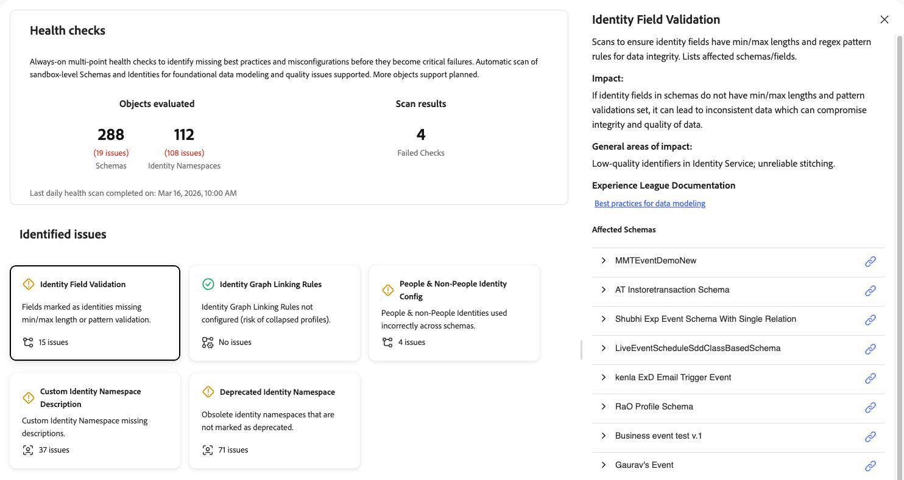

# ヘルスチェック

ヘルスチェックは、サンドボックスで使用されるスキーマと ID をスキャンし、[!UICONTROL AI Assistant] の調査とトラブルシューティングに使用できる問題の概要を提供します。 今後は、より多くのオブジェクトをスキャンしてより包括的なレポートを作成できるようになります。

スキーマと ID の設定が不十分だと、プロファイルの誤った作成、セグメントの選定の失敗、アクティベーションの不正確さなど、ダウンストリームの重大な問題が引き起こされます。 これらの問題は検出が困難で、診断には多くの場合、専門的な専門知識が必要です。 ヘルスチェックにより、事後対応型のトラブルシューティングからプロアクティブな予防的メンテナンスへのアプローチが移行します。

ヘルスチェックを使用すると、次のことができます。

* **設定の問題を早期に検出**：パーソナライゼーションやアクティベーションなどの非効率性につながる、ベストプラクティス、設定ミス、パターンの欠落を特定します。
* **ガイド付きの修正を受け取る**：各問題の概要と対処方法に関する明確なガイダンスを取得します。
* **継続的な監視**：現時点では、ヘルスチェックが毎日自動スキャンを実行するので、重大なエラーになる前に問題を特定できます。 今後のリリースでスケジュールが変更される可能性があります。

## 前提条件 {#prerequisites}

ヘルスチェックにアクセスするには、**[!UICONTROL View Health Checks]** アクセス制御権限 [&#x200B; が必要 &#x200B;](/help/access-control/home.md#permissions) す。 システム管理者に問い合わせて、適切な権限があることを確認します。

## ヘルスチェックへのアクセス {#access-health-checks}

[!UICONTROL Experience Platform] UI からヘルスチェックにアクセスするには：

1. 左側のナビゲーションから「**[!UICONTROL Run and Operate]**」を選択します。
1. **[!UICONTROL Health Checks]** を選択します。

ヘルスチェックダッシュボードには、最新のスキャン結果の概要が表示されます。

## ダッシュボードについて {#understanding-dashboard}

ヘルスチェックダッシュボードには、実装の状態を評価するのに役立つ 3 つの領域の情報が用意されています。

### 評価されたオブジェクト {#objects-evaluated}

**[!UICONTROL Objects evaluated]** のセクションには、スキャンされたスキーマと ID 名前空間の合計数と、各カテゴリで見つかった問題数が表示されます。 これにより、サンドボックス内の設定問題の範囲と重大度をすばやく確認できます。

### スキャン結果 {#scan-results}

「**[!UICONTROL Scan results]**」セクションには、失敗したチェックの数が表示されます。 失敗したチェックは、1 つ以上のヘルスチェックで、注意が必要な設定の問題が検出されたことを示します。 **前回の日別ヘルススキャンの完了日** タイムスタンプは、最新のスキャンがいつ実行されたかを示します。

### 特定された問題 {#identified-issues}

**[!UICONTROL Identified issues]** セクションには、各ヘルスチェックのカードが表示されます。 各カードには以下が表示されます。

* ヘルスチェック名と問題の簡単な説明。
* 見つかった問題の数、または問題が存在しないことを示す確認。
* チェックに合格したか、注意を払う必要があるかを示すステータスインジケーター。

任意のカードを選択して、そのヘルスチェックの詳細を調べます。

## 使用可能なヘルスチェック {#available-health-checks}

ヘルスチェックでは、現在、スキーマと ID 設定の 5 つの基本的な領域を評価します。 これらのチェックは、プラットフォーム全体で最も影響の大きいデータモデリングの問題を対象としています。

### ID フィールドの検証 {#identity-field-validation}

ID フィールドに、データの整合性のための最小長および最大長の制約と正規表現パターンのルールが存在するかどうかをスキャンします。

| 詳細 | 説明 |
| --- | --- |
| **問題** | ID としてマークされたフィールドに、最小/最大の長さまたはパターン検証がありません。 |
| **影響** | 検証を行わない場合、ガベージ値に [!UICONTROL Identity Service] と入力される可能性があります。 「0」、「Guest」などの値や、大文字と小文字の不一致（例えば、「xyz123」と「XYZ123」）があると、セグメント化とアクティベーションの際に組み合わされるプロファイルの整合性が損なわれます。 |
| **是正** | ID としてマークされたカスタムフィールドに、長さとパターンの最小制約または最大制約を設定します。 正規表現を使用して、数字のみ、大文字と小文字、特定の文字の組み合わせなどのルールを適用します。 |

**[!UICONTROL Identity Field Validation]** カードを選択すると、右側に詳細パネルが開きます。 このパネルには、次の項目が表示されます。

* **[!UICONTROL Description]**:ID フィールドに最小/最大長さとデータ整合性の正規表現パターンルールがあることを確認するためにスキャンを行います。 影響を受けるスキーマとフィールドをリストします。
* **[!UICONTROL Impact]**：スキーマの ID フィールドに最小/最大長とパターン検証が設定されていない場合、データの一貫性が失われ、データの整合性と品質が損なわれる可能性があります。
* **[!UICONTROL General areas of impact]**:[!UICONTROL Identity Service] の低品質の識別子、信頼性の低いステッチ。
* **[!UICONTROL Experience League Documentation]**：データモデリングのベストプラクティスへのリンク。
* **[!UICONTROL Affected Schemas]**：影響を受けるスキーマのリスト。詳細を表示するエクスパンダと、スキーマを開くためのリンクが付いています。

詳しくは、スキーマのベストプラクティスドキュメントの [&#x200B; データ整合性に関するヒント &#x200B;](/help/xdm/schema/best-practices.md#data-integrity-tips) を参照してください。

### ID グラフのリンクルール {#identity-graph-linking-rules}

ID グラフのリンクルールがサンドボックス用に設定され、プロファイルが折りたたまれるのを防ぐことを確認します。

| 詳細 | 説明 |
| --- | --- |
| **問題** | このサンドボックスには、ID グラフリンクルールが設定されていません。 |
| **影響** | ルールをリンクしない場合、複数の異なるプロファイルを単一のプロファイルに結合（グラフの折りたたみ）できます。 共有デバイスや一意でない ID からの特定のデータによって、不要な結合がトリガーされる可能性があり、パーソナライゼーションが不正確になる場合があります。 |
| **是正** | **[!UICONTROL Identities]** メニューに移動して「**[!UICONTROL Settings]**」を選択し、グラフごとに一意の ID を 1 つ以上選択します。 これにより、ID グラフリンクルールが有効になり、プロファイルの折りたたみが防止されます。 |

**[!UICONTROL Identity Graph Linking Rules]** カードを選択すると、右側に詳細パネルが開きます。 このパネルには、次の項目が表示されます。

* **[!UICONTROL Description]**：プロファイルが折りたたまれないように、適切なリンクルールが設定されていることを確認します。 現在のルールのステータスと、グラフごとの一意の ID が表示されます。
* **[!UICONTROL Impact]**:ID グラフリンクルールが設定されていない場合、特定のデータが複数の異なるプロファイルを 1 つのプロファイルに結合しようとする可能性があります。 不要な結合を防ぐには、ID グラフリンクルールを通じて提供される設定を使用します。
* **[!UICONTROL General areas of impact]**：折りたたまれたプロファイルまたは結合されたプロファイル。
* **[!UICONTROL Experience League Documentation]**：詳しくは、ID グラフリンクルールの概要へのリンクを参照してください。
* **[!UICONTROL Configure linking rules]**：チェックが失敗すると、ボタンが表示され、パネルから直接リンクルールを設定できます。

詳しくは、[ID グラフリンクルールの概要 &#x200B;](/help/identity-service/identity-graph-linking-rules/overview.md) および [&#x200B; 実装ガイド &#x200B;](/help/identity-service/identity-graph-linking-rules/implementation-guide.md) を参照してください。

### 人物および人物以外の ID 設定 {#people-non-people-identity}

スキーマクラス全体で人物および人物以外の ID タイプが正しく使用されていることを検証します。

| 詳細 | 説明 |
| --- | --- |
| **問題** | 人物以外の識別子は個人プロファイルまたはエクスペリエンスイベントクラスのスキーマで使用され、人物識別子はルックアップスキーマで使用されます。 |
| **影響** | プロファイルスキーマの人物以外の識別子は ID グラフに含まれないので、不完全な ID 解決につながります。 ルックアップスキーマの人物識別子によりプロファイル数が水増しされ、データがルックアップユースケースに不適格になります。 どちらの場合も、将来の製品の機能強化により、実装が中断される可能性があります。 |
| **是正** | フラグが設定されたスキーマを確認し、ID タイプの割り当てを修正します。 可能な場合は、個々のプロファイルスキーマから非個人識別子を削除します。 データセットで既に使用されているスキーマについては、[&#x200B; スキーマ進化ルール &#x200B;](/help/xdm/schema/composition.md#evolution) を参照してください。 |

**[!UICONTROL People & Non-People Identity Config]** カードを選択すると、右側に詳細パネルが開きます。 このパネルには、次の項目が表示されます。

* **[!UICONTROL Description]**：スキーマクラス間で ID タイプが正しく使用されていることを検証します。 間違って設定されたスキーマをリスト表示し、間違った割り当てを強調表示します。
* **[!UICONTROL Impact]**：人物以外のエンティティに人物 ID が指定されている場合、プロファイル数が増加し、このデータはルックアップとして不適格になります。 人物エンティティに人物以外の ID が指定されている場合、そのデータはストリーミングやエッジのセグメント化には使用できません。
* **[!UICONTROL General areas of impact]**：不完全な ID グラフ、水増しされたプロファイル数、ルックアップの誤用。
* **[!UICONTROL Affected Schemas]**：イシューを含むスキーマのリスト。 スキーマ行を展開して、各設定ミスのパス、ID 名、スキーマタイプを確認します。 リンクアイコンを使用して、スキーマを開きます。

詳しくは、[ID タイプのドキュメント &#x200B;](/help/identity-service/features/namespaces.md#identity-type) および [&#x200B; スキーマのベストプラクティス &#x200B;](/help/xdm/schema/best-practices.md) を参照してください。

### カスタム ID 名前空間の説明 {#namespace-missing-description}

スキャンを実行して、カスタム ID 名前空間のメタデータと説明が完全であることを確認します。

| 詳細 | 説明 |
| --- | --- |
| **問題** | カスタム ID 名前空間に説明フィールドがない。 |
| **影響** | 説明が欠落していると、使用中やデバッグ中に混乱が生じる可能性があります。 |
| **是正** | 説明フィールドに入力して、各カスタム名前空間をドキュメント化します。 検証条件（最小/最大の長さ、パターン）と、これらの ID を作成する外部ソースシステムを識別するライフサイクル情報を含めます。 |

**[!UICONTROL Custom Identity Namespace Description]** カードを選択すると、右側に詳細パネルが開きます。 このパネルには、次の項目が表示されます。

* **[!UICONTROL Description]**：名前空間のメタデータと説明が完了しているかどうかをスキャンします。 空の説明フィールドを持つ名前空間と所有者を表示します。
* **[!UICONTROL Impact]**：カスタム ID 名前空間に説明を設定すると、各名前空間の目的のコンテキストが提供され、明確になります。 これにより、チームメンバーや関係者が、混乱することなく各名前空間の機能をすばやく理解できます。
* **[!UICONTROL General areas of impact]**：デバッグまたは使用の混乱。検証方法が不明。
* **[!UICONTROL Experience League Documentation]**：詳しくは、カスタム名前空間を作成するためのリンクを参照してください。
* **[!UICONTROL Affected namespaces]**：説明がないカスタム ID 名前空間のリスト。 各名前空間の横にあるリンクアイコンを使用すると、名前空間を表示または編集できます。

詳しくは、[&#x200B; カスタム名前空間の作成 &#x200B;](/help/identity-service/features/namespaces.md#create-namespaces) のドキュメントを参照してください。

### 非推奨の ID 名前空間 {#deprecated-namespace}

クリーンアップの対象としてマークする必要がある、古くなった、または使用されていない ID 名前空間を検出します。

| 詳細 | 説明 |
| --- | --- |
| **問題** | 古い ID 名前空間は、非推奨（廃止予定）としてマークされません。 |
| **影響** | 未使用または古い名前空間は、現在使用されている内容に関する混乱を生じ、ID フィールドのラベル設定ミスのリスクを高めます。 |
| **是正** | 未使用の名前空間の名前を「使用しない」プレフィックスを含めて変更します（例えば、「使用しない – [ 元の名前 ]」）。 Adobe Experience Platformでは、現在、名前空間の削除をサポートしていないので、名前を変更することをお勧めします。 |

**[!UICONTROL Deprecated Identity Namespace]** カードを選択すると、右側に詳細パネルが開きます。 このパネルには、次の項目が表示されます。

* **[!UICONTROL Description]**：古い、または未使用の ID 名前空間をクリーンアップ用に検出します。 未使用の名前空間と、最後に使用されたタイムスタンプまたはスキーマ参照をリストします。
* **[!UICONTROL Impact]**：どのスキーマでも使用されていない ID 名前空間は、「非推奨」または「使用しない」タグを名前に追加して、削除するようにマークする必要があります。 ID 名前空間の削除は、現在、サポートされていません。
* **[!UICONTROL General areas of impact]**：混乱とラベル誤りリスク。
* **[!UICONTROL Experience League Documentation]**：詳細なドキュメントについては、古い ID 名前空間へのリンクを参照してください。
* **[!UICONTROL Affected namespaces]**：古くなった、または未使用の ID 名前空間のリスト。 各名前空間の横にあるリンクアイコンを使用すると、名前空間を表示または管理できます。

詳しくは、[&#x200B; 古い名前空間に関するExperience Cloud ナレッジベースの記事を参照してください &#x200B;](https://experienceleague.adobe.com/en/docs/experience-cloud-kcs/kbarticles/ka-18155){target="_blank"}。

## 次の手順 {#next-steps}

ヘルスチェックの結果を確認した後、次のリソースを参照して理解を深めます。

* 信頼性の高いデータモデルを設計するための [&#x200B; スキーマのベストプラクティス &#x200B;](/help/xdm/schema/best-practices.md) について説明します。
* プロファイルの折りたたみを防ぐための [ID グラフリンクルール &#x200B;](/help/identity-service/identity-graph-linking-rules/overview.md) について説明します。
* 名前空間管理のベストプラクティスについては、[ID 名前空間ドキュメント &#x200B;](/help/identity-service/features/namespaces.md) を確認してください。
* バッチ操作を表示する [&#x200B; ールなど &#x200B;](/help/run-and-operate/overview.md) 他の [[!UICONTROL Job Schedules]](/help/run-and-operate/job-schedules.md) 実行および操作ツールを調べます。
