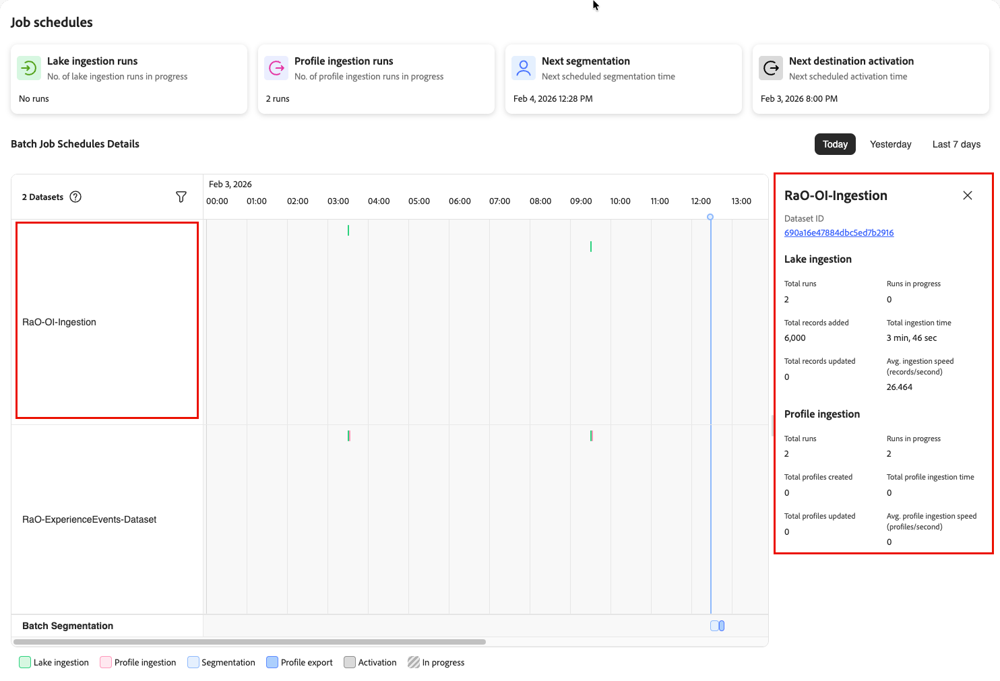

# ジョブスケジュールの詳細の表示

>[!AVAILABILITY]
>
>[!UICONTROL Job schedules] は現在、限定リリースとして、次のReal-Time CDP ジョブでのみ利用できます。
>
> * バッチデータレイクの取り込み
> * バッチプロファイル取り込み
> * バッチ送信
> * バッチ宛先のアクティベーション。

ジョブ失敗のトラブルシューティングやパフォーマンスの問題の調査を行う場合、特定のデータセットとそのジョブ実行に関する詳細情報が必要になります。 [&#x200B; ジョブスケジュール &#x200B;](job-schedules.md) インターフェイスを使用すると、タイムラインビューから個々のデータセットやジョブにドリルダウンして、実行履歴、タイミング、ステータスを把握できます。

この詳細ビューを使用して、次の操作を行います。

* 特定のジョブが失敗した理由や予想よりも時間がかかった理由を調査する
* データセットの実行履歴の経時的な確認
* バッチジョブのタイミングと期間パターンの理解
* パイプラインの問題を引き起こしている特定のバッチを識別します
* Adobe サポートによるトラブルシューティングに必要な情報の収集

## 前提条件 {#prerequisites}

ジョブの詳細を表示する前に、次の操作を行う必要があります。

* [!UICONTROL Job Schedules] および **[!UICONTROL View Job Schedules]** **[!UICONTROL View Profile Management]** アクセス制御権限 [&#x200B; を持つ &#x200B;](/help/access-control/home.md#permissions) にアクセスできる。
* [&#x200B; ジョブスケジュールインターフェイス &#x200B;](job-schedules.md#understanding-interface) およびタイムライン表示について理解している。
* 様々な [&#x200B; ジョブタイプ &#x200B;](job-schedules.md#job-schedules-details) （レイクの取り込み、プロファイルの取り込み、セグメント化、アクティベーション）を理解する。

## 詳細階層について {#details-hierarchy}

ジョブスケジュールには 3 つの詳細レベルがあり、幅広いパターンから特定のイシューに移行できます。

| 表示レベル | 表示される内容 | 使用するタイミング |
|------------|---------------|----------------|
| **タイムライン表示** | 選択した期間にわたるすべてのデータセットとそのスケジュールされたジョブ | パターンの識別、スポッティング [&#x200B; アンチパターン &#x200B;](job-schedules-anti-patterns.md)、パイプライン全体の概要の取得 |
| **データセットの詳細** | 単一のデータセットの集計指標と実行履歴 | 1 つのデータセットの全体的なパフォーマンスの追跡、データ量の把握、ジョブ頻度の確認 |
| **ジョブ実行の詳細** | 個々のジョブ実行の特定の実行情報 | 特定のジョブが失敗した理由の調査、正確なタイミングの確認、処理されたレコードの検証 |

**ナビゲーションフロー**：タイムラインビューから開始して、問題を特定→ データセットを選択して詳細を確認→詳細を調査する特定のジョブ実行を選択

### タイムラインビューについて {#timeline-visualization}

タイムライン表示では、水平レイアウトと垂直レイアウトを使用して、ジョブスケジュールと重要な処理時間を把握できます。

* **横軸（時間進行）**：データセットとそのジョブ実行は、タイムライン上で左から右に表示され、選択した期間（今日、昨日または過去 7 日間）のジョブがいつ実行されたかを示します。 色の付いたバーはそれぞれ、ジョブ実行を表し、開始時刻と終了時刻に応じて水平方向に配置されます。

* **垂直軸（予定開始時刻）**：重要な予定開始時刻は、すべてのデータセットにまたがる垂直線として表示され、アップストリームジョブとダウンストリーム処理のタイミングの関係を簡単に確認できます。
   * **青い縦線**：セグメント化の開始がスケジュールされているタイミングを表します
   * **黒い縦線**：宛先のアクティベーションが開始されるスケジュールを表します

このレイアウトを使用すると、データパイプラインジョブとダウンストリーム処理のタイミングの関係をすばやく特定できます。 セグメント化とアクティブ化が開始する前にデータの準備が整っていることを確認して、これらの垂直マーカーの左側でアップストリームジョブ（データレイクやプロファイル取り込みなど）を完了するのが理想的です。 これらのマーカーを超えて拡張されるジョブは、データが完全に準備される前にダウンストリームプロセスが開始される可能性がある、タイミングの潜在的な問題を示します。

### どのビューを使用すればよいですか？ {#which-view}

| 私は… | このビューを使用 |
|--------------|---------------|
| すべてのプロファイル対応データセットとそのスケジュールを一度に表示 | [&#x200B; タイムライン表示 &#x200B;](job-schedules.md) |
| スケジュールの競合またはアンチパターンの特定 | [&#x200B; タイムライン表示 &#x200B;](job-schedules.md) |
| 1 つのデータセットの全体的なパフォーマンスの追跡 | [データセットの詳細](#view-dataset-details) |
| データセットが処理した合計レコード数を確認 | [データセットの詳細](#view-dataset-details) |
| 1 つのデータセットに関するジョブのパフォーマンスの推移を比較します | [データセットの詳細](#view-dataset-details) |
| 特定のジョブが失敗した理由の調査 | [&#x200B; ジョブ実行の詳細 &#x200B;](#view-job-details) |
| 特定のジョブ実行の正確なタイミングの確認 | [&#x200B; ジョブ実行の詳細 &#x200B;](#view-job-details) |
| 1 回の実行で処理されたレコードの検証 | [&#x200B; ジョブ実行の詳細 &#x200B;](#view-job-details) |
| 詳細なエラーメッセージへのアクセス | [&#x200B; ジョブ実行の詳細 &#x200B;](#view-job-details) → データフロー実行 ID を選択 |

## データセットの詳細を表示 {#view-dataset-details}

特定のデータセットの詳細を表示するには：

1. **[!UICONTROL Job Schedules]** タイムラインビューで、調査するデータセットを見つけます。
2. 左の列からデータセット名を選択します。

データセットの詳細ビューが右側のパネルに開き、このデータセットに関連付けられているすべてのジョブに関する情報が表示されます。

データセットの詳細パネルには、データセット名、ID およびジョブ固有の指標がジョブタイプ別に整理されて表示されます。 パネルの上部に、データセット ID がクリック可能なリンクとして表示されます。 この ID を選択すると、データセットの完全な詳細ページに移動します。

各データセットの詳細パネルには、次の指標が含まれます。

### レイクの取り込み指標 {#lake-ingestion-metrics}

データレイクの取り込みジョブを含んだデータセットの場合、パネルには次の指標が表示されます。

| 指標 | 説明 | にを使用する |
|--------|-------------|---------|
| **[!UICONTROL Total runs]** | このデータセットで完了したデータレイク取り込みジョブの合計数 | アクティビティトラッキング |
| **[!UICONTROL Runs in progress]** | 現在実行されているレイク取得ジョブの数 | ボトルネックの検出 |
| **[!UICONTROL Total records added]** | すべてのジョブ実行でデータレイクに追加された新しいレコードの累積数 | ボリュームの監視 |
| **[!UICONTROL Total ingestion time]** | すべてのデータレイク取り込みジョブの合計時間 | 処理時間の評価 |
| **[!UICONTROL Total records updated]** | 取り込み中に更新された既存のレコードの累積数 | パターン分析の更新 |
| **[!UICONTROL Avg. ingestion speed (records/second)]** | データレイク取得ジョブの平均スループット率 | パフォーマンスの比較 |

### プロファイル取り込み指標 {#profile-ingestion-metrics}

プロファイル取り込みジョブを使用したデータセットの場合、パネルには次の指標が表示されます。

| 指標 | 説明 | にを使用する |
|--------|-------------|---------|
| **[!UICONTROL Total runs]** | このデータセットで完了したプロファイル取り込みジョブの合計数 | アクティビティトラッキング |
| **[!UICONTROL Runs in progress]** | 現在実行されているプロファイル取り込みジョブの数 | 遅延検出 |
| **[!UICONTROL Total profiles created]** | すべてのジョブ実行にわたるこのデータセットから作成された、新しいプロファイルの累積数 | プロファイルの増加率の監視 |
| **[!UICONTROL Total profile ingestion time]** | すべてのプロファイル取り込みジョブの合計期間 | タイミング問題の特定 |
| **[!UICONTROL Total profiles updated]** | このデータセットのデータで更新された既存のプロファイルの累積数 | 頻度トラッキングを更新 |
| **[!UICONTROL Avg. profile ingestion speed (profiles/second)]** | プロファイル取り込みジョブの平均スループット率 | パフォーマンス監視 |

>[!NOTE]
>
> これらの指標は、このデータセットに対するすべてのジョブ実行にわたる累積合計を表示します。 特定の実行の詳細を表示するには、タイムラインから直接ジョブを選択します。

## タイムライン内のデータセットのフィルタリング {#filter-datasets}

スケジュールされたジョブを含むデータセットが多数ある場合、すべてを一度に表示するのではなく、特定のデータセットに焦点を当てる必要がある場合があります。 データセットフィルターを使用すると、タイムラインビューに表示するデータセットを選択できます。

タイムラインに表示されるデータセットをフィルタリングするには：

1. タイムラインビューの左上にあるデータセットカウンターを探します（例えば、「2 つのデータセット」）。
2. データセットカウンターの横にあるフィルターアイコンを選択します。
3. データセット選択パネルが開き、スケジュールされたジョブを含む、使用可能なすべてのプロファイル対応データセットが表示されます。
4. データセットを選択または選択解除して、タイムラインビューで表示または非表示にします。
5. タイムラインがすぐに更新され、選択したデータセットのみが表示されます。

フィルタリングを使用して、次の操作を行います。

* **特定のデータソースに焦点を当てる**：特定のデータパイプラインのトラブルシューティングを行う場合は、をフィルタリングして、関連するデータセットのみを表示します。
* **見やすさを軽減**：多くのデータセットがある場合、フィルタリングを使用すると、データのサブセットのパターンをより明確に確認できます。
* **関連するデータセットを比較**：スケジュール関係を把握するのに関連するデータセットのみを選択します。
* **アンチパターンの調査**：潜在的な [&#x200B; 設定の問題 &#x200B;](job-schedules-anti-patterns.md) を特定したら、影響を受けるデータセットをフィルタリングして、より詳細に調べます。

フィルターはセッション中も保持されるので、データセットの選択を維持しながら、期間（今日、昨日、過去 7 日間）間を移動できます。

## 個々のジョブ実行の詳細の表示 {#view-job-details}

特定のジョブ実行を調査する必要がある場合は、タイムラインからジョブ実行を選択して、その特定の実行の詳細な実行情報を確認します。

### ジョブ実行の詳細へのアクセス {#access-job-details}

特定のジョブ実行の詳細を表示するには：

1. [!UICONTROL Job Schedules] タイムライン表示で、調査する特定のジョブ実行を見つけます。
2. タイムライン（ジョブを表す色付きのバー）でジョブインジケーターを選択します。

**[!UICONTROL Dataflow run details]** パネルが開き、その特定のジョブ実行に関する情報が表示されます。

### データフロー実行の詳細 {#dataflow-run-details}

データフロー実行の詳細パネルには、特定のジョブ実行に関する情報がジョブタイプ別に表示されます。 取り込みジョブの場合は、レイクの取り込みステージとプロファイルの取り込みステージの両方の詳細が表示されます。

#### レイクの取り込みジョブの詳細 {#lake-ingestion-job-details}

| フィールド | 説明 |
|-------|-------------|
| **[!UICONTROL Dataflow run ID]** | この特定のレイク取り込みジョブ実行の一意の ID。 ID を選択して、データフロー監視の完全な詳細を表示します。 |
| **[!UICONTROL Run status]** | ジョブの結果（成功、失敗、処理中、待機中）。 緑色のインジケーターは、正常に完了したことを示します。 |
| **[!UICONTROL Started at]** | レイクの取り込みジョブが実行を開始した日時。 |
| **[!UICONTROL Completed at]** | レイクの取り込みジョブが実行を終了した日時。 |
| **[!UICONTROL Records added]** | このジョブの実行中にデータレイクに追加された新しいレコードの数。 |
| **[!UICONTROL Records updated]** | このジョブの実行中にデータレイクで更新された既存レコードの数。 |

#### プロファイル取得ジョブの詳細 {#profile-ingestion-job-details}

| フィールド | 説明 |
|-------|-------------|
| **[!UICONTROL Dataflow run ID]** | この特定のプロファイル取り込みジョブを実行するための一意の ID。 ID を選択して、データフロー監視の完全な詳細を表示します。 |
| **[!UICONTROL Run status]** | ジョブの結果（成功、失敗、処理中、待機中）。 緑色のインジケーターは、正常に完了したことを示します。 |
| **[!UICONTROL Started at]** | プロファイル取り込みジョブの実行が開始された日時。 |
| **[!UICONTROL Completed at]** | プロファイル取り込みジョブの実行が終了した日時。 |
| **[!UICONTROL Records added]** | このジョブの実行中に作成された新しいプロファイルの数。 |
| **[!UICONTROL Records updated]** | このジョブの実行中に更新された既存のプロファイルの数。 |

### ジョブ実行フローについて {#job-execution-flow}

特定のジョブの実行を表示すると、レイクの取り込みとプロファイルの取り込みの関係を確認できます。

* **レイクの取り込みを最初に実行**：データがデータレイクに読み込まれ、検証されます。
* **プロファイルの取り込みに従う**：レイクの取り込みが完了すると、適格なレコードがプロファイルストアに処理されます。
* **タイミングが重要**：レイクの取り込みが完了する時刻とプロファイルの取り込みが開始する時刻の時間差に注意してください。 ギャップは、セグメント化などのダウンストリームプロセスに影響を与える可能性があります。

**ジョブ実行の詳細を次に使用します**。

* 特定のジョブが正常に完了したことを確認します
* ジョブ実行の実際の期間（完了時間から開始時間を引いた値）を計算します
* 特定の実行で処理されたレコード数を理解します
* 異なるジョブ実行間でのパフォーマンスの比較
* エラーのトラブルシューティングに関する詳細なデータフロー監視へのアクセス
* レイクとプロファイルの取り込みステージ間のタイミングの問題を特定します

## ジョブの詳細を使用したトラブルシューティング {#troubleshooting}

ジョブの詳細を使用して問題を調査し、次の手順を決定します。

**失敗したジョブ**：データフロー実行 ID を選択して、監視ダッシュボードにエラーの詳細を表示します。 [&#x200B; データセットの詳細 &#x200B;](#view-dataset-details) で繰り返し発生するパターンを確認し、[&#x200B; タイムライン &#x200B;](job-schedules.md) でリソースの競合を確認して、設定で [&#x200B; アンチパターン &#x200B;](job-schedules-anti-patterns.md) を特定します。

**処理に時間のかかるジョブ**:[&#x200B; データセット指標 &#x200B;](#view-dataset-details) の履歴平均と期間を比較します。 一般的な原因としては、[&#x200B; スケジュールの重複 &#x200B;](job-schedules-anti-patterns.md#schedule-overlap-pattern)、[&#x200B; 大量のバッチスタッキング &#x200B;](job-schedules-anti-patterns.md#scheduled-density)、データ量の増加などがあります。

**レコードの不一致**：レイクの取り込みレコードをジョブ実行の詳細のプロファイル取り込みレコードと比較します。 通常、プロファイルの取り込みでは、ID 要件とデータ品質ルールが原因で、表示されるレコード数が少なくなります。

データフローステータスについて詳しくは、[&#x200B; データレイクの取り込みを監視 &#x200B;](../dataflows/ui/monitor-sources.md)、[&#x200B; プロファイルのデータフローを監視 &#x200B;](../dataflows/ui/monitor-profiles.md)、[&#x200B; オーディエンスのデータフローを監視 &#x200B;](../dataflows/ui/monitor-audiences.md)、[&#x200B; 宛先のデータフローを監視 &#x200B;](../dataflows/ui/monitor-destinations.md) を参照してください。

## 次の手順 {#next-steps}

ジョブの詳細の表示方法を学習したら、次の手順を実行します。

* [&#x200B; ジョブスケジュールの概要 &#x200B;](job-schedules.md) を確認して、タイムラインのビューとインターフェイスを理解します。
* 一般的な設定の問題を防ぐための [&#x200B; アンチパターン &#x200B;](job-schedules-anti-patterns.md) について説明します。
* [&#x200B; バッチ取り込み &#x200B;](../ingestion/batch-ingestion/overview.md) について理解し、データ読み込みスケジュールを最適化します。
* エンドツーエンドのパイプライン表示について [&#x200B; 宛先データフローの監視 &#x200B;](../dataflows/ui/monitor-destinations.md) を探索します。
