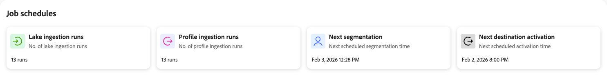

# ジョブのスケジュールの確認

>[!IMPORTANT]
>
>[!UICONTROL Job schedules]は現在、次のReal-Time CDP ジョブでのみ使用できます。
>
> * バッチデータレイクの取得
> * プロファイルのバッチインジェスト
> * バッチセグメント化
> * バッチ宛先のアクティベーション

[!UICONTROL Job Schedules]は、取り込みから宛先のアクティベーションまで、データパイプライン全体でスケジュールされたすべてのバッチ処理ジョブの統合ビューを提供します。 実行ステータスを検査し、スケジュールの競合を特定し、設定の問題が業務運営に影響を与える前に診断します。

ジョブスケジュールを使用して、エラーの調査、ジョブタイミングの最適化、データレイクの取り込み、プロファイル処理、セグメンテーション、宛先アクティベーション間の依存関係の把握を行います。 一般的な設定の問題の解決に関するガイダンスについては、[ ジョブ スケジュールのアンチパターンの特定](job-schedules-anti-patterns.md)に関するドキュメントを参照してください。

## 前提条件 {#prerequisites}

[!UICONTROL Job Schedules]にアクセスするには、**[!UICONTROL View Job Schedules]**&#x200B;および&#x200B;**[!UICONTROL View Profile Management]** [ アクセス制御権限](/help/access-control/home.md#permissions)が必要です。

適切な権限を持っていることを確認するには、システム管理者にお問い合わせください。

## はじめに {#getting-started}

[!UICONTROL Job Schedules]を使用する前に、次のExperience Platformの概念を理解しておく必要があります。

* **[バッチ取り込み](../ingestion/batch-ingestion/overview.md)**：スケジュールされた間隔でデータレイクおよびプロファイルストアにデータを読み込む方法。
* **[セグメント化](../segmentation/home.md)**: プロファイルデータとセグメント定義に基づいてオーディエンスを評価および更新する方法。
* **[リアルタイム顧客プロファイル](../profile/home.md)**：プロファイルデータがどのように統合され、セグメント化とアクティブ化に利用できるようになります。
* **[宛先](../destinations/home.md)**：データが下流システムおよびマーケティングプラットフォームに対してどこでどのようにアクティブ化されるか。

これらのコンポーネントを理解することで、ジョブの実行パターンを解釈し、問題が発生したときに診断するのに役立ちます。

## ジョブスケジュールインターフェイスについて {#understanding-interface}

[!UICONTROL Job Schedules]にアクセスするには：

1. Experience Platform UIで、左側のナビゲーションから「**[!UICONTROL Run and Operate]**」を選択します。
2. **[!UICONTROL Job Schedules]** を選択します。

[!UICONTROL Job Schedules] ページには、スケジュールされたすべてのバッチ処理ジョブの概要が表示されます。

### 概要カード {#summary-cards}

ページ上部には、バッチ処理ジョブに関する迅速なインサイトを提供する概要カードが表示されます。

* **レイク取り込み実行**：実行されたデータレイク取り込みジョブの数。
* **プロファイル取り込みが実行されました**：実行されたプロファイル取り込みジョブの数。
* **次のセグメント化**：次にスケジュールされたセグメント化ジョブが実行されるタイミング。
* **次の宛先アクティベーション**：次にスケジュールされた宛先アクティベーションジョブが実行されるタイミング。

これらのカードは、データパイプライン全体のアクティビティと今後のスケジュールを把握するのに役立ちます。 **レイク取り込み実行**&#x200B;および&#x200B;**プロファイル取り込み実行**&#x200B;の値は、選択した時間間隔（今日、昨日、または過去7日間）に基づいて変更されます。次の実行カード（**次のセグメント化**&#x200B;および&#x200B;**次の宛先のアクティブ化**）は、時間セレクターの影響を受けません。

### 期間セレクター {#time-period}

期間セレクターを使用して、スケジュールされたジョブを確認する距離を選択します。

* **今日**：今日にスケジュールされたジョブを表示します（既定のビュー）。
* **昨日**：昨日実行されたジョブを表示します。
* **過去7日間**：過去1週間のジョブを表示します。

### バッチジョブスケジュールの詳細 {#job-schedules-details}

メインビューには、バッチジョブが1日を通して実行されるようにスケジュールされているタイミングが表示されます。 実行できる操作は、次のとおりです。

* **データセットまたはエンティティ別にジョブを表示**：左側の列には、データセットまたは処理ジョブ（取り込みデータセットやセグメント化ジョブなど）の名前が表示されます。
* **ジョブのタイミング**&#x200B;を参照：タイムラインには、各ジョブの実行スケジュールが表示され、スケジュールされた時間を示す視覚的なインジケーターが表示されます。
* **フィルタージョブ**: フィルターアイコンを使用して、レポートに含めるデータセットを絞り込みます。
* **職種について**：下部の色分けされた凡例を使用すると、様々な職種を特定できます。
   * **レイク取り込み** （緑）: データレイクへのデータ取り込み
   * **プロファイル取り込み** （ピンク）: プロファイルストアへのデータ取り込み
   * **セグメント化** （水色）: オーディエンス評価ジョブ
   * **プロファイル書き出し** （青）: プロファイルデータの書き出し
   * **アクティベーション** （濃いグレー）：宛先アクティベーション ジョブ
   * **処理中** （ストライプ）：現在実行中またはキューに入っているジョブ

このタイムラインビューにより、スケジュールの競合の特定、ジョブ間の依存関係の把握、バッチ処理スケジュールの最適化が可能になります。

## 設定の問題の特定 {#identifying-issues}

ジョブスケジュールを確認する際に、設定の問題を示すパターンに気付く可能性があります。 一般的な問題は次のとおりです。

* ジョブが一緒に閉じすぎるため、リソースの競合が発生します
* 同じ時間ウィンドウ内で実行されているバッチが多すぎます
* 過剰な日次バッチジョブを持つ個々のデータセット
* セグメント化の実行直前にスケジュールされた取り込みジョブ

こうしたパターンは、ジョブの失敗、不完全なデータ処理、システムパフォーマンスの低下につながる可能性があります。 これらの問題を特定して解決する方法については、[ ジョブ スケジュールのアンチパターンの特定](job-schedules-anti-patterns.md)に関するドキュメントを参照してください。

特定のデータセットやジョブの実行を調査する必要がある場合は、詳細ビューにドリルダウンして、実行履歴、エラーメッセージ、パフォーマンス指標、依存関係を確認できます。 この詳細データの表示について詳しくは、[ ジョブの詳細の表示](job-schedules-details.md)に関するドキュメントを参照してください。

## 次の手順 {#next-steps}

ジョブスケジュールについて学んだら、次の関連トピックを調べてみてください。

* [ ジョブの詳細を表示](job-schedules-details.md)：個々のデータセットとジョブ実行をドリルダウンして詳細な調査を行う方法について説明します。
* [ ジョブ スケジュールのアンチパターンの特定](job-schedules-anti-patterns.md): パイプラインのパフォーマンスに影響を与える一般的な設定の問題を特定して解決する方法を説明します。
* [ バッチ取り込み](../ingestion/batch-ingestion/overview.md): バッチ処理を使用してExperience Platformにデータを取り込む方法を説明します。
* [ セグメント化](../segmentation/home.md): スケジュールされた間隔でオーディエンスがどのように評価および更新されるかを理解します。
* [宛先のデータフローを監視](../dataflows/ui/monitor-destinations.md)：宛先のアクティベーションデータフローを監視する方法を説明します。
* [ オーディエンスの書き出しをスケジュール ](../destinations/ui/activate-batch-profile-destinations.md)：スケジュールされたバッチ宛先のアクティベーションを設定する方法を説明します。
