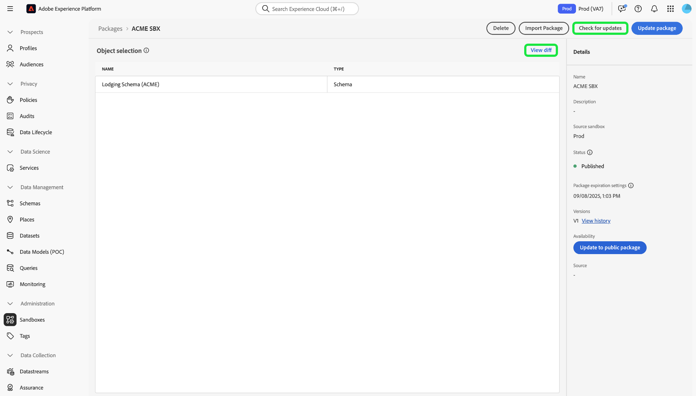
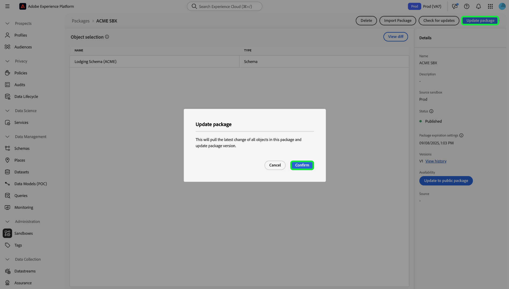

# サンドボックスツール

>[!NOTE]
>
>サンドボックス ツールは、開発サイクルの効率と構成の精度を向上させるために、 [!DNL Real-Time Customer Data Platform] と [!DNL Journey Optimizer] の両方をサポートする基本的な機能です。   サンドボックスツール機能を使用するには、次の 2 つの役割ベースのアクセス制御権限が必要です： - `manage-sandbox` または `view-sandbox` - `manage-package`

サンドボックス間の設定精度を向上させ、サンドボックスツール機能を使用して、サンドボックス間でサンドボックス設定をシームレスに書き出し、読み込みます。 サンドボックスツールを使用すると、実装プロセスの価値創出までの時間を短縮し、複数のサンドボックスをまたいで正常な設定を移行できます。

サンドボックスツール機能を使用して、様々なオブジェクトを選択し、それらをパッケージに書き出すことができます。 パッケージは、1 つのオブジェクトまたは複数のオブジェクトで構成できます。<!--or an entire sandbox.--> パッケージに含まれるオブジェクトは、同じサンドボックスからのオブジェクトである必要があります。

## サンドボックスツールでサポートされるオブジェクト {#supported-objects}

サンドボックス ツール機能を使用すると、 [!DNL Adobe Real-Time Customer Data Platform] オブジェクトと [!DNL Adobe Journey Optimizer] オブジェクトをパッケージにエクスポートできます。

### リアルタイムの顧客データPlatformオブジェクト {#real-time-cdp-objects}

>[!BEGINSHADEBOX]

### 複数エンティティオーディエンスインポートの変更

[B2B アーキテクチャのアップグレードにより](../../rtcdp/b2b-architecture-upgrade.md)、B2B属性とエクスペリエンスイベントを含むパッケージがアップグレード前に公開された場合、複数エンティティオーディエンスをインポートできなくなります。これらのオーディエンスはインポートに失敗し、新しいアーキテクチャに自動的に変換されません。

この制限を回避するには、更新されたオーディエンスを含む新しいパッケージを作成し、サンドボックスツールを使用してそれぞれのターゲットサンドボックスにインポートする必要があります。

>[!ENDSHADEBOX]

次の表に [!DNL Adobe Real-Time Customer Data Platform] サンドボックス ツールで現在サポートされているオブジェクトを示します。

| Platform | オブジェクト | 詳細 |
| --- | --- | --- |
| 顧客データPlatform | ソース | <ul><li>ソースアカウント資格情報は、セキュリティ上の理由から、ターゲットサンドボックスでレプリケートされず、手動で更新する必要があります。</li><li>デフォルトでは、ソースデータフローはドラフトステータスでコピーされます。</li></ul> **メモ：** 現在、サンドボックスツールは、バッチベースのソースデータフローのみをサポートしています。 ストリーミングベースのソースデータフローはサポートされていません。 |
| 顧客データプラットフォーム | オーディエンス | <ul><li>**[!UICONTROL Customer Audience]** タイプの **[!UICONTROL Segmentation service]** のみがサポートされます。</li><li>同意およびガバナンス用の既存のラベルは、同じインポートジョブでコピーされます。</li><li> システムは、結合ポリシーの依存関係を確認する際に、同じ XDM クラスを持つターゲットサンドボックスのデフォルトの結合ポリシーを自動的に選択します。</li><li>オーディエンスの読み込み時に同じ名前の既存のオブジェクトが検出された場合、オブジェクトの拡散を避けるために、サンドボックスツールは常に既存のオブジェクトを再利用します。</li></ul> |
| 顧客データプラットフォーム | ID | <ul><li>ターゲットサンドボックスでを作成する場合、Adobeの標準 ID 名前空間の重複が自動的に排除されます。</li><li>オーディエンスは、オーディエンスルールのすべての属性が結合スキーマで有効になっている場合にのみコピーできます。 最初に、必要なスキーマを移動し、統合プロファイルを有効にする必要があります。</li></ul> |
| 顧客データプラットフォーム | スキーマ/フィールドグループ/データタイプ | <ul><li>同意およびガバナンス用の既存のラベルは、同じインポートジョブでコピーされます。</li><li>「統合プロファイル」オプションを有効にせずに、スキーマを柔軟にインポートできます。 スキーマ関係のエッジケースはパッケージには含まれていません。</li><li>スキーマ/フィールドグループの読み込み時に同じ名前の既存のオブジェクトが検出された場合、オブジェクトの拡散を避けるために、サンドボックスツールは常に既存のオブジェクトを再利用します。</li></ul> |
| 顧客データプラットフォーム | データセット | データセットは、統合プロファイル設定がデフォルトで無効の状態でコピーされます。 |
| 顧客データプラットフォーム | 同意およびガバナンスポリシー | ユーザーが作成したカスタムポリシーをパッケージに追加し、サンドボックス間で移動します。 |

次のオブジェクトが読み込まれますが、ステータスがドラフトまたは無効です。

| 機能 | オブジェクト | ステータス |
| --- | --- | --- |
| インポートステータス | Sourceのデータフロー | ドラフト |
| インポートステータス | ジャーニー | ドラフト |
| 統合プロファイル | データセット | 統合プロファイルが無効 |
| ポリシー | データガバナンスポリシー | 無効 |

### Adobe Systems Journey Optimizer オブジェクト {#abobe-journey-optimizer-objects}

次の表に [!DNL Adobe Journey Optimizer] サンドボックス ツールで現在サポートされているオブジェクトと制限事項を示します。

| Platform | オブジェクト | サポートされる依存オブジェクト | 詳細 |
| --- | --- | --- | --- |
| [!DNL Adobe Journey Optimizer] | オーディエンス | | オーディエンスは、ジャーニーオブジェクトの依存オブジェクトとしてコピーできます。 新しいオーディエンスを作成するか、ターゲット サンドボックスで既存の再利用を選択できます。 |
| [!DNL Adobe Journey Optimizer] | スキーマ | | ジャーニーで使用されるスキーマは、依存オブジェクトとしてコピーできます。 新しいスキーマを作成するか、ターゲット サンドボックスで既存の再利用を選択できます。 |
| [!DNL Adobe Journey Optimizer] | 結合ポリシー | | ジャーニーで使用される結合ポリシーは、依存オブジェクトとしてコピーできます。 ターゲット サンドボックスでは、新しい差し込みポリシーを作成&#x200B;**&#x200B;**&#x200B;できません。既存の差し込みのみを使用できます。 |
| [!DNL Adobe Journey Optimizer] | ジャーニー | ジャーニーで使用される次のオブジェクトは、依存オブジェクトとしてコピーされます。 読み込みワークフロー時に、それぞれについて **[!UICONTROL Create new]** または **[!UICONTROL Use existing]** を選択できます。 <ul><li>オーディエンス</li><li>キャンバスの詳細</li><li>コンテンツテンプレート</li><li>カスタムアクション</li><li>データソース</li><li>イベント</li><li>フィールドグループ</li><li>フラグメント</li><li>スキーマ</li></ul> | 読み込みプロセスで **[!UICONTROL Use existing]** を選択してジャーニーを別のサンドボックスにコピーする場合、選択する既存のカスタムアクション **必須** は、ソースカスタムアクションと完全に一致する必要があります。 一致しない場合、新しいジャーニーは解決不可能なエラーを生成します。  システムは、ジャーニーで使用されるイベントとイベントの詳細をコピーし、ターゲットサンドボックスに新しいバージョンを作成します。 |
| [!DNL Adobe Journey Optimizer] | アクション | | ジャーニーで使用されるメールおよびプッシュメッセージは、依存オブジェクトとしてコピーできます。 ジャーニーフィールドで使用されるチャネルアクションアクティビティ（メッセージ内のパーソナライゼーションに使用される）が完全かどうかはチェックされません。 コンテンツブロックはコピーされません。   ジャーニーで使用される「プロファイルを更新」アクションをコピーできます。 カスタムアクションは、パッケージに個別に追加できます。 ジャーニーで使用されるアクションの詳細もコピーされます。 ターゲットサンドボックスに新しいバージョンが常に作成されます。 |
| [!DNL Adobe Journey Optimizer] | カスタムアクション |  | カスタムアクションは、パッケージに個別に追加できます。 カスタムアクションをジャーニーに割り当てると、そのカスタムアクションを編集できなくなります。 カスタムアクションを更新するには、次の手順を実行します。 <ul><li>ジャーニーの移行前にカスタムアクションを移動</li><li>移行投稿カスタムアクションの設定(リクエストヘッダー、クエリパラメーター、認証など)を更新する</li><li>最初の手順で追加したカスタムアクションを使用して、ジャーニーオブジェクトを移行します</li></ul> |
| [!DNL Adobe Journey Optimizer] | コンテンツテンプレート | | 内容テンプレートは、ジャーニーオブジェクトの従属オブジェクトとしてコピーできます。 スタンドアロンテンプレートを使用すると、Journey Optimizer キャンペーンおよびジャーニー全体でカスタム内容を簡単に再利用できます。 |
| [!DNL Adobe Journey Optimizer] | フラグメント | ネストされたフラグメントすべてを選択。 | フラグメントは、ジャーニーオブジェクトの依存オブジェクトとしてコピーできます。 フラグメントは、Journey Optimizer キャンペーンおよびジャーニー全体で 1 つ以上の E メールで参照できる再利用可能なコンポーネントです。 |
| [!DNL Adobe Journey Optimizer] | キャンペーン | キャンペーンで使用される以下のオブジェクトは、従属オブジェクトとしてコピーされます。 <ul><li>キャンペーン</li><li>オーディエンス</li><li>スキーマ</li><li>コンテンツテンプレート</li><li>フラグメント</li><li>メッセージ / コンテンツ</li><li>チャネル設定</li><li>統合決定オブジェクト</li><li>実験の設定/バリアント</li></ul> | <ul><li>キャンペーンは、プロファイル、オーディエンス、スキーマ、インラインメッセージおよび依存オブジェクトに関連するすべての項目と共にコピーできます。 データ使用ラベルや言語設定など、一部の項目はコピーされません。 コピーできないオブジェクトの完全なリストについては、[&#x200B; 別のサンドボックスへのオブジェクトの書き出し &#x200B;](https://experienceleague.adobe.com/ja/docs/journey-optimizer/using/configuration/copy-objects-to-sandbox) ガイドを参照してください。</li><li>同じ設定が存在する場合、システムはターゲットサンドボックスで既存のチャネル設定オブジェクトを自動的に検出して再利用します。 一致する設定が見つからない場合、チャネル設定は読み込み時にスキップされ、ユーザーはこのジャーニーのターゲットサンドボックスのチャネル設定を手動で更新する必要があります。</li><li>ユーザーは、ターゲットサンドボックス内の既存の実験とオーディエンスを、選択したキャンペーンの依存オブジェクトとして再利用できます。</li></ul> |
| [!DNL Adobe Journey Optimizer] | 決定 | Decisioning オブジェクトをコピーする前に、以下のオブジェクトがコピー先サンドボックスに存在する必要があります。 <ul><li>プロフィール属性Decisioning オブジェクト全体で使用される</li><li>カスタムオファー属性のフィールドグループ</li><li>ルール、ランキングまたはキャップをまたいだコンテキスト属性に使用されるデータストリームのスキーマ。</li></ul> | <ul><li>AI モデルを使用するランキング式のコピーは、現在サポートされていません。</li><li>決定項目（オファー項目）は、自動的には含まれません。 確実に転送されるようにするには、「パッケージに追加 **オプションを使用して手動で追加し** す。</li><li>選択戦略を使用するポリシーでは、関連する決定項目をコピープロセス中に手動で追加する必要があります。 手動またはフォールバックの決定項目を使用するポリシーでは、これらの項目が直接依存関係として自動的に含まれます。</li><li>決定アイテムは、他の関連オブジェクトの前に最初にコピーする必要があります。</li></ul> |

プロフィール属性Decisioning オブジェクト全体で使用されます。
カスタムオファー属性のフィールドグループ
ルール、ランキング、またはキャッピングにわたるコンテキスト属性に使用されるデータストリームのスキーマ。

サーフェス(プリセットなど)はコピーされません。 システムは、メッセージの種類とサーフェス名に基づいて、宛先サンドボックスで可能な限り最も近い一致を自動的に選択します。 ターゲット サンドボックスにサーフェスが見つからない場合、サーフェスのコピーは失敗し、メッセージではセットアップに使用できるサーフェスが必要であるため、メッセージのコピーが失敗します。 この場合、コピーが機能するには、メッセージの右チャネル用に少なくとも 1 つのサーフェスを作成する必要があります。

特例文字 ID タイプは、ジャーニーをエクスポートするときに依存オブジェクトとしてサポートされません。

## パッケージへのオブジェクトの書き出し {#export-objects}

>[!NOTE]
>
>エクスポート操作すべてを選択監査ログに記録されます。

>[!CONTEXTUALHELP]
>id="platform_sandbox_tooling_remove_object"
>title="オブジェクトを削除"
>abstract="パッケージからオブジェクトを削除するには、削除する行を選択し、選択時に使用可能になる削除オプションを使用します。公開済みパッケージからオブジェクトを削除することはできません。"

>[!CONTEXTUALHELP]
>id="platform_sandbox_package_expiry"
>title="パッケージの有効期限設定"
>abstract="パッケージは、ドラフトステータスで非アクティブな状態が続くと、有効期限が切れるように設定されます。デフォルトの日付は今日から 90 日に設定されています。この日付は、パッケージが公開されるまで変更され続けます。翌日ドラフトステータスのパッケージにアクセスすると、手動で設定しない限り、日付は 1 日後に移動します。"

>[!CONTEXTUALHELP]
>id="platform_sandbox_tooling_package_status"
>title="パッケージステータス"
>abstract="デフォルトでは、ステータスはドラフトに設定されています。パッケージが公開されると、ステータスが「公開済み」に変わります。パッケージが公開された後は、変更することはできません。"

>[!NOTE]
>
>オブジェクトにアクセスする権限がある場合にのみ、パッケージを読み込むことができます。

この例では、スキーマを書き出してパッケージに追加するプロセスを説明します。 データセットやジャーニーなど、他のオブジェクトも同じ手順で書き出すことができます。

### 新しいパッケージにオブジェクトを追加 {#add-object-to-new-package}

左側のナビゲーションから「**[!UICONTROL Schemas]**」を選択し、「**[!UICONTROL Browse]**」タブを選択すると、使用可能なスキーマが一覧表示されます。 次に、選択したスキーマの横にある省略記号（`...`）を選択すると、ドロップダウンにコントロールが表示されます。 ドロップダウンから「**[!UICONTROL Add to package]**」を選択します。

![&#x200B; ス [!UICONTROL Add to package] ーマコントロールをハイライト表示したドロップダウンメニューを表示するスキーマのリスト。](../images/ui/sandbox-tooling/add-to-package.png)

**[!UICONTROL Add to package]** ダイアログで、「**[!UICONTROL Create new package]**」オプションを選択します。 パッケージの [!UICONTROL Name] とオプションの [!UICONTROL Description] を指定し、「**[!UICONTROL Add]**」を選択します。

![&#x200B; 選択した [!UICONTROL Add to package] がハイライト表示される [!UICONTROL Create new package] ダイアログ [!UICONTROL Add] す。](../images/ui/sandbox-tooling/create-new-package.png)

**[!UICONTROL Schemas]** 環境に戻ります。 次の手順に従って、作成したパッケージにオブジェクトを追加できるようになりました。

### 既存のパッケージにオブジェクトを追加して公開 {#add-object-to-existing-package}

使用可能なスキーマのリスト表示には、左側のナビゲーションから [ **[!UICONTROL Schemas]** ] を選択し、 **[!UICONTROL Browse]** タブを選択します。 次へ、選択したスキーマの横にある省略記号(`...`)を選択して、ドロップダウンメニューにコントロールオプションを表示します。 ドロップダウンから **[!UICONTROL Add to package]** を選択します。

![[!UICONTROL Add to package]コントロールを強調表示するドロップダウンメニューを表示するスキーマリスト。](../images/ui/sandbox-tooling/add-to-package.png)

**[!UICONTROL Add to package]**&#x200B;ダイアログが表示されます。[ **[!UICONTROL Existing package]** ] オプションを選択し、 **[!UICONTROL Package name]** ドロップダウンを選択して、必要なパッケージを選択します。 最後に、[ **[!UICONTROL Add]** ] を選択して選択内容を確認します。

![[!UICONTROL Add to package] ダイアログが表示され、ドロップダウンから選択したパッケージが表示されます。](../images/ui/sandbox-tooling/add-to-existing-package.png)

パッケージに追加されたオブジェクトのリストが表示されます。 パッケージを公開するしてサンドボックスにインポートできるようにするには、[ **[!UICONTROL Publish]**] を選択します。

![パッケージ内のオブジェクトリストで、「 [!UICONTROL Publish] 」オプションをハイライト表示します。](../images/ui/sandbox-tooling/publish-package.png)

パッケージの公開を確定する **[!UICONTROL Publish]** を選択します。

![パッケージの確認ダイアログPublish、 [!UICONTROL Publish] オプションを強調表示します。](../images/ui/sandbox-tooling/publish-package-confirmation.png)

>[!NOTE]
>
>公開すると、パッケージのコンテンツを変更できなくなります。 互換性の問題を回避するには、必要なアセットがすべて選択されていることを確認します。 変更が必要な場合は、新規パッケージを作成する必要があります。

**[!UICONTROL Packages]** 環境の「[!UICONTROL Sandboxes]」タブに戻ると、新しく公開されたパッケージを確認できます。

## ターゲットサンドボックスへのパッケージの読み込み {#import-package-to-target-sandbox}

>[!NOTE]
>
>すべてを選択インポート操作は監査ログに記録されます。

パッケージをターゲットサンドボックスに読み込むには、「サンドボックス **[!UICONTROL Browse]**」タブに移動し、サンドボックス名の横にあるプラス（+） オプションを選択します。

![&#x200B; 読み込みパッケージの選択が強調表示された「サンドボックスの **[!UICONTROL Browse]**」タブ &#x200B;](../images/ui/sandbox-tooling/browse-sandboxes.png)

ドロップダウンメニューを使用して、ターゲットサンドボックスに読み込む **[!UICONTROL Package name]** を選択します。 **[!UICONTROL Job name]** を追加します。これは、今後の監視に使用されます。 デフォルトでは、パッケージのスキーマが読み込まれると、統合プロファイルは無効になります。 **プロファイルのスキーマを有効にする** を切り替えて有効にし、**[!UICONTROL Next]** を選択します。

![[!UICONTROL Package name] ドロップダウン選択を表示する読み込みの詳細ページ &#x200B;](../images/ui/sandbox-tooling/import-package-to-sandbox.png)

[!UICONTROL Package object and dependencies] ページ は、このパッケージに含まれるすべてのアセットリストを提供します。選択した親オブジェクトのインポートに必要な依存オブジェクトが自動的に検出されます。 不足している属性は、ページの上部に表示されます。 **[!UICONTROL View details]**&#x200B;を選択すると、より詳細な分類が表示されます。

![[!UICONTROL Package object and dependencies]ページに不足している属性が表示されます。](../images/ui/sandbox-tooling/missing-attributes.png)

>[!NOTE]
>
>依存オブジェクトは ターゲット サンドボックス内の既存のオブジェクトに置き換えることができるため、新しいバージョンを作成するのではなく、既存のオブジェクトを再利用できます。 たとえば、スキーマを含むパッケージをインポートする場合、ターゲット サンドボックス内の既存のカスタムフィールドグループと ID 名前空間を再利用できます。 または、ジャーニーを含むパッケージを読み込む際に、ターゲットサンドボックス内の既存のセグメントを再利用できます。
>
>サンドボックスツールは、現在、既存のオブジェクトの更新または上書きをサポートしていません。 新しいオブジェクトを作成するか、変更せずに既存のオブジェクトを使用し続けることができます。 同じ名前の既存のオブジェクトが検出された場合、オブジェクトの拡散を避けるために [!UICONTROL Create new] オプションを選択した場合でも、サンドボックスツールは常に既存のオブジェクトを再利用します。

既存のオブジェクトを使用するには、依存オブジェクトの横にある鉛筆アイコンを選択します。

![[!UICONTROL Package object and dependencies] ページには、パッケージに含まれるアセットのリストが表示されます。](../images/ui/sandbox-tooling/package-objects-and-dependencies.png)

新規作成または既存のものを使用するためのオプションが表示されます。 **[!UICONTROL Use existing]** を選択します。

![[!UICONTROL Package object and dependencies]ページ依存オブジェクトのオプション[!UICONTROL Create new]と[!UICONTROL Use existing]が表示されます。](../images/ui/sandbox-tooling/use-existing-object.png)

**[!UICONTROL Field group]**&#x200B;ダイアログには、オブジェクトで使用可能な項目グループのリストが表示されます。必要なフィールド グループを選択し、[ **[!UICONTROL Save]**] を選択します。

![[!UICONTROL Field group]ダイアログに表示されるフィールドリストで、選択した[!UICONTROL Save]が強調表示されます。](../images/ui/sandbox-tooling/field-group-list.png)

[!UICONTROL Package object and dependencies]ページに戻ります。ここから、[ **[!UICONTROL Finish]** ] を選択してパッケージのインポートを完了します。

![[!UICONTROL Package object and dependencies]ページには、パッケージに含まれているアセットのリストが表示され、[!UICONTROL Finish]が強調表示されます。](../images/ui/sandbox-tooling/finish-object-dependencies.png)

## サンドボックス全体の書き出しおよびインポート

>[!NOTE]
>
>現在、サンドボックス全体を書き出しまたは読み込む場合、Real-time Customer Data Platform オブジェクトのみがサポートされています。 ジャーニーなどのAdobe Journey Optimizer オブジェクトは現時点ではサポートされていません。

サポートされているすべてのオブジェクトタイプを完全なサンドボックスパッケージに書き出し、様々なサンドボックスからこのパッケージを読み込んでオブジェクト設定をレプリケートできます。 例えば、この機能を使用すると、次のことが可能です。

- サンドボックスをリセットする必要がある場合は、サンドボックスを再読み込みして、オブジェクトのすべての設定を再現します
- パッケージを他のサンドボックスに読み込み、ブループリントサンドボックスとして使用して、開発プロセスを高速化します。

### サンドボックス全体の書き出し {#export-entire-sandbox}

サンドボックス全体を書き出すには、「[!UICONTROL Sandboxes] **[!UICONTROL Packages]**」タブに移動し、「**[!UICONTROL Create package]**」を選択します。

![[!UICONTROL Sandboxes] をハイライト表示した「**[!UICONTROL Packages]** [!UICONTROL Create package]」タブ &#x200B;](../images/ui/sandbox-tooling/create-sandbox-package.png)

**[!UICONTROL Entire sandbox]** ダイアログで、[!UICONTROL Type of package] の [!UICONTROL Create package] を選択します。 新しいパッケージの [!UICONTROL Package name] を指定し、ドロップダウンから **[!UICONTROL Sandbox]** を選択します。 最後に、「**[!UICONTROL Create]**」を選択してエントリを確認します。

![&#x200B; 入力済みフィールドが表示され、[!UICONTROL Create package] がハイライト表示された [!UICONTROL Create] ダイアログ &#x200B;](../images/ui/sandbox-tooling/create-package-dialog.png)

パッケージが正常に作成されたら、「**[!UICONTROL Publish]**」を選択してパッケージを公開します。

**[!UICONTROL Packages]** 環境の「[!UICONTROL Sandboxes]」タブに戻ると、新しく公開されたパッケージを確認できます。

### サンドボックスパッケージ全体を読み込みます {#import-entire-sandbox-package}

>[!NOTE]
>
>すべてのオブジェクトが、新しいオブジェクトとしてターゲットサンドボックスに読み込まれます。 完全なサンドボックスパッケージを空のサンドボックスに読み込むことをお勧めします。

パッケージをターゲットサンドボックスに読み込むには、「[!UICONTROL Sandboxes] **[!UICONTROL Browse]**」タブに移動し、サンドボックス名の横にあるプラス（+） オプションを選択します。

![&#x200B; 読み込みパッケージの選択が強調表示された「サンドボックスの **[!UICONTROL Browse]**」タブ &#x200B;](../images/ui/sandbox-tooling/browse-entire-package-sandboxes.png)

ドロップダウンメニューを使用し、「**[!UICONTROL Package name]**」ドロップダウンを使用して「完全なサンドボックス」を選択します。 今後の監視に使用する **[!UICONTROL Job name]** とオプションの **[!UICONTROL Job description]** を追加し、「**[!UICONTROL Next]**」を選択します。

![インポートの詳細ページ、 [!UICONTROL Package name] ドロップダウンの選択項目が表示されます](../images/ui/sandbox-tooling/import-full-sandbox-package.png)

>[!NOTE]
>
>パッケージに含まれるすべてのオブジェクトに対する完全なアクセス許可が必要です。 アクセス許可がない場合、インポート操作は失敗し、エラー メッセージが表示されます。

[!UICONTROL Package object and dependencies]ページが表示され、インポートされたオブジェクトと除外されたオブジェクトの数と依存関係を確認できます。ここから、[ **[!UICONTROL Import]** ] を選択してパッケージのインポートを完了します。

![[!UICONTROL Package object and dependencies]ページには、サポートされていないオブジェクトタイプのインラインメッセージが表示され、[!UICONTROL Import]強調表示されます。](../images/ui/sandbox-tooling/finish-dependencies-entire-sandbox.png)

インポートが完了するまでしばらく待ちます。 完了までの時間は、パッケージ内のオブジェクトの数によって異なります。 読み込みジョブは [!UICONTROL Sandboxes] **[!UICONTROL Jobs]** タブから監視できます。

## インポートの詳細の監視 {#view-import-details}

インポートした詳細表示には、 [!UICONTROL Sandboxes] **[!UICONTROL Jobs]** タブに移動し、リストからパッケージを選択します。 または、検索バーを使用してパッケージを検索します。

![サンドボックス [!UICONTROL Jobs] タブインポートパッケージの選択項目が強調表示されます。](../images/ui/sandbox-tooling/imports-tab.png)

<!--### View imported objects {#view-imported-objects}

On the **[!UICONTROL Jobs]** tab in the [!UICONTROL Sandboxes] environment, select **[!UICONTROL View imported objects]** from the right details pane.

Select **[!UICONTROL View imported objects]** from the right details pane on the **[!UICONTROL Jobs]** tab in the [!UICONTROL Sandboxes] environment.

![The sandboxes [!UICONTROL Imports] tab highlights the [!UICONTROL View imported objects] selection in the right pane.](../images/ui/sandbox-tooling/view-imported-objects.png)

Use the arrows to expand objects to view the full list of fields that have been imported into the package.

![The sandboxes [!UICONTROL Imported objects] showing a list of objects imported into the package.](../images/ui/sandbox-tooling/expand-imported-objects.png)-->

サンドボックス環境の「**[!UICONTROL View import summary]**」タブで、右側の詳細パネルから「**[!UICONTROL Jobs]**」を選択します。

![&#x200B; 「サンドボックスの [!UICONTROL Imports]」タブでは、右側のパネルで [!UICONTROL View import details] の選択がハイライト表示されます。](../images/ui/sandbox-tooling/view-import-details.png)

**[!UICONTROL Import summary]** ダイアログには、読み込みの分類が進行状況とともにパーセンテージで表示されます。

>[!NOTE]
>
>特定のインベントリページに移動すると、オブジェクトのリストを表示できます。

![&#x200B; 読み込みの詳細な分類を示す [!UICONTROL Import details] ダイアログ &#x200B;](../images/ui/sandbox-tooling/import-details.png)

読み込みが完了すると、Experience Platform UI に通知が届きます。 これらの通知には、アラート アイコンからアクセスできます。 ジョブが失敗した場合は、ここからトラブルシューティングに移動できます。

## サンドボックスツールを使用して、サンドボックス間で反復的なオブジェクト設定の更新を転送する {#move-configs}

サンドボックスツールを使用して、異なるサンドボックス間でオブジェクト設定を転送できます。 以前は、オブジェクト（スキーマ、フィールドグループ、データタイプなど）の設定の更新を他のサンドボックスに転送するために、手動で再作成または再読み込みする必要がありました。 この機能を使用すると、サンドボックスツールを使用して、異なるサンドボックス間で設定の更新をシームレスに転送することで、ワークフローを高速化し、潜在的なエラーを減らすことができます。

>[!TIP]
>
> 異なるサンドボックス間でオブジェクト設定を転送する前に、次の前提条件を満たしていることを確認してください。
>
>- サンドボックス ツールにアクセスするための適切なアクセス許可。
>- ソースサンドボックスで新しく作成または更新されたオブジェクト (スキーマ など)。

>[!BEGINSHADEBOX]

### 更新操作でサポートされているオブジェクトタイプ

更新でサポートされているオブジェクトの種類は次のとおりです。

- スキーマ
- フィールドグループ
- データタイプ

| サポートされるアップデート | サポートされていない更新 |
| --- | --- |
| <ul><li>新しいフィールド/フィールドグループをリソースに追加します。</li><li>必須フィールドをオプションにします。</li><li>新しい必須フィールドの導入。</li><li>新しい関係フィールドの導入</li><li>新しい ID フィールドの導入</li><li>リソースの表示名と説明を変更する。</li></ul> | <ul><li>以前定義したフィールドを削除しています。</li><li>リアルタイム顧客プロファイルに対してスキーマが有効な場合の既存フィールドの再定義。</li><li>以前サポートされていたフィールド値を削除または制限しています。</li><li>既存のフィールドをスキーマツリーの別の場所に移動する – これにより、ターゲットサンドボックスに新しいフィールドが作成されますが、以前のフィールドは削除されません。</li><li>プロファイルに参加するスキーマを有効または無効にする – この操作は差分比較でスキップされます。</li><li>アクセス制御ラベル</li></ul> |

>[!ENDSHADEBOX]

次の手順に従って、サンドボックスツールを使用して、異なるサンドボックス間でオブジェクト設定を転送する方法を学習します。

### 以前インポートしたオブジェクト

既にパッケージ化されて他のサンドボックスに読み込まれた後、設定の更新が必要なソースサンドボックス内の既存のオブジェクトがユースケースに含まれている場合は、次の手順に従います。

まず、ソースサンドボックスのオブジェクトを更新します。 例えば、**[!UICONTROL Schemas]** ワークスペースに移動し、スキーマを選択して、新しいフィールドグループを追加します。

スキーマを更新したら、**[!UICONTROL Sandboxes]** に移動し、**[!UICONTROL Packages]** を選択して、既存のパッケージを見つけます。

パッケージインターフェイスを使用して、変更を検証します。 「**[!UICONTROL Check for updates]**」を選択すると、パッケージ内のアーティファクトに対する変更が表示されます。 次に、「**[!UICONTROL View diff]**」を選択して、アーティファクトに対して実行されたすべての変更の詳細な概要を受け取ります。

[!UICONTROL View diff] インターフェイスが表示されます。 ソースアーティファクトとターゲットアーティファクト、およびそれらに適用される変更については、この料金を参照してください。

この手順では、[!UICONTROL Summarize with AI] を選択して、すべての変更の概要を段階的に確認することもできます。

準備ができたら、「**[!UICONTROL Update package]**」を選択し、表示されるポップアップウィンドウで「**[!UICONTROL Confirm]**」を選択します。 ジョブが完了したら、ページを更新し、「**[!UICONTROL View history]**」を選択してパッケージのバージョンを確認できます。

変更をインポートするには、 [!UICONTROL Packages] ディレクトリに戻り、パッケージの横にある省略記号 (`...`) を選択して、[ **[!UICONTROL Import package]**] を選択します。 Experience Platformは [!UICONTROL Update existing objects]を自動選択します。 変更を確認し、[ **[!UICONTROL Finish]**] を選択します。

>[!NOTE]
>
>すべてを選択依存オブジェクトは、このワークフローの一部として ターゲット サンドボックスで自動的に更新されます。

インポートプロセスをさらに検証するには、ターゲット サンドボックスに移動し、そのサンドボックス内から更新されたオブジェクトを手動で表示します。

### サンドボックスに手動で作成されたオブジェクト ターゲット

ユースケースで、個別のサンドボックスに手動で作成されたオブジェクトに設定変更を適用する場合は、次の手順に従います。

まず、更新したオブジェクトで新しいパッケージを作成し、公開するします。

次へ、更新するオブジェクトを含む ターゲット サンドボックスにパッケージをインポートします。 読み込みプロセス中に、[ **[!UICONTROL Update existing objects]** ] を選択し、オブジェクト ナビゲーターを使用して、更新を適用するターゲットオブジェクトを手動で選択します。

>[!NOTE]
>
>- 依存オブジェクト用に別のサンドボックス内のターゲットマッピングを選択するのはオプションです。 何も選択されていない場合は、新しく作成されます。
>- ID 名前空間の場合、既存の ID をターゲットサンドボックスで再利用する必要がある場合、システムは新しい ID を作成する必要があるかどうかを自動検出します。

更新するターゲット・オブジェクトを特定したら、「**[!UICONTROL Finish]**」を選択します。

## ビデオチュートリアル

次のビデオは、サンドボックス ツールの理解をサポートすることを目的としており、新しいパッケージの作成、パッケージ公開する、およびパッケージのインポート方法の概要を説明しています。

>[!VIDEO](https://video.tv.adobe.com/v/3446084/?captions=jpn&learn=on)

## 次の手順

このドキュメントでは、Experience Platform UI 内でサンドボックスツール機能を使用する方法について説明しました。 サンドボックスについて詳しくは、『 [&#x200B; サンドボックスユーザーガイド &#x200B;](../ui/user-guide.md) 』を参照してください。

サンドボックス API を使用して様々な操作を実行する手順については、[サンドボックス開発者ガイド](../api/getting-started.md)を参照してください。Experience Platformのサンドボックスの概要については、[&#x200B; 概要ドキュメント &#x200B;](../home.md) を参照してください。
