# サンドボックスツール

>[!NOTE]
>
>サンドボックスツールは、[!DNL Real-Time Customer Data Platform]と[!DNL Journey Optimizer]の両方をサポートし、開発サイクルの効率と設定精度を向上させる基本的な機能です。   サンドボックスツール機能を使用するには、次の2つの役割ベースのアクセス制御権限が必要です： - `manage-sandbox`または`view-sandbox` - `manage-package`

サンドボックスツール機能を使用して、サンドボックスをまたいで設定の精度を向上させ、サンドボックス間でサンドボックス設定をシームレスに書き出しおよび読み込むことができます。 サンドボックスツールを利用して、実装プロセスの価値実現までの時間を短縮し、設定をサンドボックスをまたいで適切に移動できます。

サンドボックスツール機能を使用して、様々なオブジェクトを選択し、パッケージに書き出すことができます。 パッケージは、1 つのオブジェクトまたは複数のオブジェクトで構成できます。<!--or an entire sandbox.--> パッケージに含まれているオブジェクトはすべて、同じサンドボックスから取得する必要があります。

## サンドボックスツールでサポートされるオブジェクト {#supported-objects}

サンドボックスツール機能を使用すると、[!DNL Adobe Real-Time Customer Data Platform]および[!DNL Adobe Journey Optimizer] オブジェクトをパッケージに書き出すことができます。

### Real-Time Customer Data Platform オブジェクト {#real-time-cdp-objects}

>[!BEGINSHADEBOX]

### マルチエンティティオーディエンスのインポートの変更

[B2B アーキテクチャのアップグレード ](../../rtcdp/b2b-architecture-upgrade.md)を使用すると、これらのオーディエンスを含むパッケージがアップグレード前に公開された場合、B2B属性とエクスペリエンスイベントを含むマルチエンティティオーディエンスを読み込むことができなくなります。 これらのオーディエンスは読み込みに失敗し、新しいアーキテクチャに自動的に変換できません。

この制限を回避するには、更新されたオーディエンスを含む新しいパッケージを作成し、サンドボックスツールを使用してそれぞれのターゲットサンドボックスに読み込む必要があります。

>[!ENDSHADEBOX]

次の表に、サンドボックスツールで現在サポートされている[!DNL Adobe Real-Time Customer Data Platform] オブジェクトを示します。

| Platform | オブジェクト | 詳細 |
| --- | --- | --- |
| 顧客データプラットフォーム | ソース | <ul><li>セキュリティ上の理由から、ソースアカウントの資格情報はターゲットサンドボックスにレプリケートされないので、手動で更新する必要があります。</li><li>ソースデータフローは、デフォルトではドラフトステータスでコピーされます。</li></ul> **メモ：**&#x200B;現在、サンドボックスツールはバッチベースのソースデータフローのみをサポートしています。 ストリーミングベースのソースデータフローはサポートされていません。 |
| 顧客データプラットフォーム | オーディエンス | <ul><li>**[!UICONTROL Customer Audience]** タイプ **[!UICONTROL Segmentation service]**&#x200B;のみがサポートされています。</li><li>同意とガバナンスの既存のラベルは、同じインポートジョブにコピーされます。</li><li> 結合ポリシーの依存関係を確認する際に、同じXDM クラスのターゲットサンドボックスでデフォルトの結合ポリシーが自動的に選択されます。</li><li>オーディエンスの読み込み時に同じ名前の既存のオブジェクトが検出された場合、サンドボックスツールは常に既存のオブジェクトを再利用して、オブジェクトの拡散を回避します。</li></ul> |
| 顧客データプラットフォーム | ID | <ul><li>ターゲットサンドボックスでの作成時に、Adobe標準ID名前空間が自動的に重複排除されます。</li><li>オーディエンスは、結合スキーマでオーディエンスルールのすべての属性が有効になっている場合にのみコピーできます。 最初に、統合プロファイルに必要なスキーマを移動して有効にする必要があります。</li></ul> |
| 顧客データプラットフォーム | スキーマ/フィールドグループ/データタイプ | <ul><li>同意とガバナンスの既存のラベルは、同じインポートジョブにコピーされます。</li><li>統合プロファイル オプションを有効にせずにスキーマを柔軟に読み込むことができます。 スキーマ関係のエッジケースは、パッケージに含まれていません。</li><li>スキーマまたはフィールドグループの読み込み時に同じ名前の既存のオブジェクトが検出された場合、サンドボックスツールは常に既存のオブジェクトを再利用して、オブジェクトの拡散を回避します。</li></ul> |
| 顧客データプラットフォーム | データセット | データセットは、デフォルトでは無効になっている統合プロファイル設定でコピーされます。 |
| 顧客データプラットフォーム | 同意ポリシーとガバナンスポリシー | ユーザーが作成したカスタムポリシーをパッケージに追加し、サンドボックス間で移動します。 |

次のオブジェクトは読み込まれますが、ドラフトまたは無効ステータスです。

| 機能 | オブジェクト | ステータス |
| --- | --- | --- |
| ステータスの読み込み | Source dataflow | ドラフト |
| ステータスの読み込み | ジャーニー | ドラフト |
| 統合プロファイル | データセット | 統合プロファイルが無効 |
| ポリシー | データガバナンスポリシー | 無効 |

### Adobe Journey Optimizer オブジェクト {#abobe-journey-optimizer-objects}

次の表は、サンドボックスツールと制限で現在サポートされている[!DNL Adobe Journey Optimizer] オブジェクトを示しています。 ベストプラクティスの一覧については、[Journey Optimizerの一般的なベストプラクティス ](https://experienceleague.adobe.com/en/docs/journey-optimizer/using/connect-systems/sandbox/copy-objects-to-sandbox?#global) ガイドを参照してください。

| Platform | オブジェクト | サポートされている依存オブジェクト | 詳細 |
| --- | --- | --- | --- |
| [!DNL Adobe Journey Optimizer] | オーディエンス | | オーディエンスは、ジャーニーオブジェクトの依存オブジェクトとしてコピーできます。 新しいオーディエンスを作成するか、ターゲットサンドボックスで既存のオーディエンスを再利用するかを選択できます。 |
| [!DNL Adobe Journey Optimizer] | スキーマ | | ジャーニーで使用されるスキーマは、依存オブジェクトとしてコピーできます。 新しいスキーマを作成するか、ターゲットサンドボックスで既存のスキーマを再利用するかを選択できます。 |
| [!DNL Adobe Journey Optimizer] | 結合ポリシー | | ジャーニーで使用される結合ポリシーは、依存オブジェクトとしてコピーできます。 ターゲットサンドボックスでは、新しい結合ポリシーを&#x200B;**作成できません**。既存の結合ポリシーのみを使用できます。 |
| [!DNL Adobe Journey Optimizer] | ジャーニー | ジャーニーで使用される次のオブジェクトは、依存オブジェクトとしてコピーされます。 読み込みワークフローでは、各項目について&#x200B;**[!UICONTROL Create new]**&#x200B;または&#x200B;**[!UICONTROL Use existing]**&#x200B;のいずれかを選択できます。 <ul><li>オーディエンス</li><li>キャンバスの詳細</li><li>コンテンツテンプレート</li><li>カスタムアクション</li><li>データソース</li><li>イベント</li><li>フィールドグループ</li><li>フラグメント</li><li>スキーマ</li></ul> | インポートプロセス中に&#x200B;**[!UICONTROL Use existing]**&#x200B;を選択してジャーニーを別のサンドボックスにコピーする場合、**を選択する既存のカスタムアクションは、ソースのカスタムアクションと完全に一致している必要があります**。 一致しない場合、新しいジャーニーは解決不可能なエラーを生成します。  システムは、ジャーニーで使用されるイベントとイベントの詳細をコピーし、ターゲットサンドボックスに新しいバージョンを作成します。 |
| [!DNL Adobe Journey Optimizer] | アクション | | ジャーニーで使用される電子メールとプッシュメッセージは、依存オブジェクトとしてコピーできます。 メッセージのパーソナライゼーションに使用されるジャーニーフィールドで使用されるチャネルアクションアクティビティは、完全性がチェックされません。 コンテンツブロックはコピーされません。   ジャーニーで使用されているプロファイルの更新アクションをコピーできます。 カスタムアクションは、パッケージに個別に追加できます。 ジャーニーで使用されるアクションの詳細もコピーされます。 常に新しいバージョンがターゲットサンドボックスに作成されます。 |
| [!DNL Adobe Journey Optimizer] | カスタムアクション |  | カスタムアクションは、パッケージに個別に追加できます。 カスタムアクションをジャーニーに割り当てると、そのアクションは編集できなくなります。 カスタムアクションを更新するには、次の操作を行う必要があります。 <ul><li>ジャーニーを移行する前にカスタムアクションを移動する</li><li>移行後のカスタムアクションの設定（リクエストヘッダー、クエリパラメーター、認証など）を更新します</li><li>最初の手順で追加したカスタムアクションでジャーニーオブジェクトを移行する</li></ul> |
| [!DNL Adobe Journey Optimizer] | コンテンツテンプレート | | コンテンツテンプレートは、ジャーニーオブジェクトの依存オブジェクトとしてコピーできます。 スタンドアロンテンプレートを使用すると、Journey Optimizerのキャンペーンやジャーニーをまたいで、カスタムコンテンツを簡単に再利用できます。 |
| [!DNL Adobe Journey Optimizer] | フラグメント | ネストされたフラグメントはすべて。 | フラグメントは、ジャーニーオブジェクトの依存オブジェクトとしてコピーできます。 フラグメントは、Journey Optimizerのキャンペーンとジャーニーをまたいで、1つ以上のメールで参照できる再利用可能なコンポーネントです。 |
| [!DNL Adobe Journey Optimizer] | キャンペーン | キャンペーンで使用される次のオブジェクトは、依存オブジェクトとしてコピーされます。 <ul><li>キャンペーン</li><li>オーディエンス</li><li>スキーマ</li><li>コンテンツテンプレート</li><li>フラグメント</li><li>メッセージ/コンテンツ</li><li>チャネル設定</li><li>統合された決定オブジェクト</li><li>実験の設定/バリアント</li></ul> | <ul><li>キャンペーンは、プロファイル、オーディエンス、スキーマ、インラインメッセージ、依存オブジェクトに関連するすべてのアイテムとともにコピーできます。 データ使用ラベルや言語設定など、一部の項目はコピーされません。 コピーできないオブジェクトの完全なリストについては、[別のサンドボックスへのオブジェクトの書き出し](https://experienceleague.adobe.com/en/docs/journey-optimizer/using/configuration/copy-objects-to-sandbox) ガイドを参照してください。</li><li>同じ設定が存在する場合、システムはターゲットサンドボックス内の既存のチャネル設定オブジェクトを自動的に検出して再利用します。 一致する設定が見つからない場合、読み込み中にチャネル設定はスキップされ、ユーザーはこのジャーニーのターゲットサンドボックスのチャネル設定を手動で更新する必要があります。</li><li>ユーザーは、ターゲットサンドボックス内の既存の実験とオーディエンスを、選択したキャンペーンの依存オブジェクトとして再利用できます。</li></ul> |
| [!DNL Adobe Journey Optimizer] | 決定 | Decisioning オブジェクトをコピーする前に、宛先サンドボックスに次のオブジェクトが存在する必要があります。 <ul><li>Decisioning オブジェクト間で使用されるプロファイル属性</li><li>カスタムオファー属性のフィールドグループ</li><li>ルール、ランキングまたはキャップをまたいだコンテキスト属性に使用されるデータストリームのスキーマ。</li></ul> | <ul><li>AI モデルを使用するランキング式のコピーは、現在サポートされていません。</li><li>決定項目（オファー項目）は自動的に含まれません。 転送されていることを確認するには、**パッケージに追加** オプションを使用して手動で追加します。</li><li>選択戦略を使用するポリシーでは、関連する決定項目をコピープロセス中に手動で追加する必要があります。 手動またはフォールバックの決定項目を使用するポリシーでは、これらの項目が直接依存関係として自動的に含まれます。</li><li>決定項目は、他の関連オブジェクトよりも先にコピーする必要があります。</li><li>サポートされているオブジェクトの完全なリストについては、[別のサンドボックスへのオブジェクトの書き出し](https://experienceleague.adobe.com/en/docs/journey-optimizer/using/configuration/copy-objects-to-sandbox) ガイドを参照してください。</li></ul> |

## パッケージへのオブジェクトの書き出し {#export-objects}

>[!NOTE]
>
>すべての書き出しアクションは、監査ログに記録されます。

>[!CONTEXTUALHELP]
>id="platform_sandbox_tooling_remove_object"
>title="オブジェクトを削除"
>abstract="パッケージからオブジェクトを削除するには、削除する行を選択し、選択時に使用可能になる削除オプションを使用します。公開済みパッケージからオブジェクトを削除することはできません。"

>[!CONTEXTUALHELP]
>id="platform_sandbox_package_expiry"
>title="パッケージの有効期限設定"
>abstract="パッケージは、ドラフトステータスで非アクティブな状態が続くと、有効期限が切れるように設定されます。デフォルトの日付は今日から 90 日に設定されています。この日付は、パッケージが公開されるまで変更され続けます。翌日ドラフトステータスのパッケージにアクセスすると、手動で設定しない限り、日付は 1 日後に移動します。"

>[!CONTEXTUALHELP]
>id="platform_sandbox_tooling_package_status"
>title="パッケージステータス"
>abstract="デフォルトでは、ステータスはドラフトに設定されています。パッケージが公開されると、ステータスが「公開済み」に変わります。パッケージが公開された後は、変更することはできません。"

>[!NOTE]
>
>パッケージを読み込むことができるのは、オブジェクトにアクセスする権限がある場合のみです。

この例では、スキーマをエクスポートしてパッケージに追加するプロセスについて説明します。 同じプロセスを使用して、データセットやジャーニーなどの他のオブジェクトを書き出すことができます。

### 新しいパッケージにオブジェクトを追加 {#add-object-to-new-package}

左側のナビゲーションから「**[!UICONTROL Schemas]**」を選択し、使用可能なスキーマのリストを表示する「**[!UICONTROL Browse]**」タブを選択します。 次に、選択したスキーマの横にある省略記号（`...`）を選択すると、ドロップダウンにコントロールが表示されます。 ドロップダウンから「**[!UICONTROL Add to package]**」を選択します。

![ コントロールを強調表示するドロップダウンメニューを表示する[!UICONTROL Add to package] スキーマのリスト。](../images/ui/sandbox-tooling/add-to-package.png)

**[!UICONTROL Add to package]** ダイアログから、**[!UICONTROL Create new package]** オプションを選択します。 パッケージの[!UICONTROL Name]とオプションの[!UICONTROL Description]を指定し、**[!UICONTROL Add]**&#x200B;を選択します。

![[!UICONTROL Add to package]が選択され、[!UICONTROL Create new package]が強調表示された[!UICONTROL Add] ダイアログ。](../images/ui/sandbox-tooling/create-new-package.png)

**[!UICONTROL Schemas]**&#x200B;環境に戻されました。 次の手順に従って、作成したパッケージにオブジェクトを追加できるようになりました。

### 既存のパッケージにオブジェクトを追加して公開する {#add-object-to-existing-package}

使用可能なスキーマのリストを表示するには、左側のナビゲーションから「**[!UICONTROL Schemas]**」を選択し、「**[!UICONTROL Browse]**」タブを選択します。 次に、選択したスキーマの横にある省略記号（`...`）を選択して、ドロップダウンメニューにコントロールオプションを表示します。 ドロップダウンから「**[!UICONTROL Add to package]**」を選択します。

![ コントロールを強調表示するドロップダウンメニューを表示する[!UICONTROL Add to package] スキーマのリスト。](../images/ui/sandbox-tooling/add-to-package.png)

**[!UICONTROL Add to package]** ダイアログが表示されます。 「**[!UICONTROL Existing package]**」オプションを選択し、「**[!UICONTROL Package name]**」ドロップダウンを選択して、必要なパッケージを選択します。 最後に、**[!UICONTROL Add]**&#x200B;を選択して選択を確定します。

![[!UICONTROL Add to package] ダイアログ。ドロップダウンから選択したパッケージが表示されます。](../images/ui/sandbox-tooling/add-to-existing-package.png)

パッケージに追加されたオブジェクトのリストが表示されます。 パッケージを公開し、サンドボックスに読み込めるようにするには、**[!UICONTROL Publish]**&#x200B;を選択します。

![ パッケージ内のオブジェクトのリスト。[!UICONTROL Publish] オプションを強調表示します。](../images/ui/sandbox-tooling/publish-package.png)

**[!UICONTROL Publish]**&#x200B;を選択して、パッケージの公開を確認します。

![ パッケージの確認ダイアログを公開し、[!UICONTROL Publish] オプションを強調表示します。](../images/ui/sandbox-tooling/publish-package-confirmation.png)

>[!NOTE]
>
>公開すると、パッケージの内容は変更できません。 互換性の問題を回避するには、必要なアセットがすべて選択されていることを確認します。 変更が必要な場合は、新しいパッケージを作成する必要があります。

**[!UICONTROL Packages]**&#x200B;環境の[!UICONTROL Sandboxes] タブに戻り、新しい公開パッケージを確認できます。

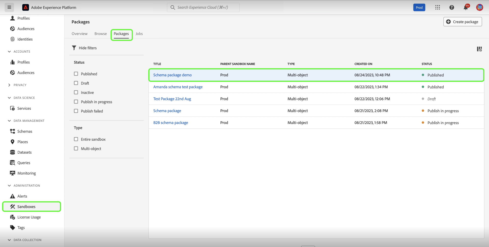

## ターゲットサンドボックスへのパッケージのインポート {#import-package-to-target-sandbox}

>[!NOTE]
>
>すべてのインポートアクションは、監査ログに記録されます。

パッケージをターゲットサンドボックスに読み込むには、「サンドボックス **[!UICONTROL Browse]**」タブに移動し、サンドボックス名の横にある「+」 オプションを選択します。

![ インポートパッケージの選択を強調表示するサンドボックス **[!UICONTROL Browse]** タブ。](../images/ui/sandbox-tooling/browse-sandboxes.png)

ドロップダウンメニューを使用して、ターゲットサンドボックスに読み込む&#x200B;**[!UICONTROL Package name]**&#x200B;を選択します。 今後の監視に使用する&#x200B;**[!UICONTROL Job name]**&#x200B;を追加します。 デフォルトでは、パッケージのスキーマを読み込むと、統合プロファイルは無効になります。 「**プロファイルのスキーマを有効にする**」を切り替えてこれを有効にし、「**[!UICONTROL Next]**」を選択します。

![ インポートの詳細ページに[!UICONTROL Package name] ドロップダウン選択が表示されています](../images/ui/sandbox-tooling/import-package-to-sandbox.png)

[!UICONTROL Package object and dependencies] ページには、このパッケージに含まれるすべてのアセットのリストが表示されます。 選択した親オブジェクトを正常に読み込むために必要な依存オブジェクトが自動的に検出されます。 欠けている属性は、ページの上部に表示されます。 詳細な内訳については、**[!UICONTROL View details]**&#x200B;を選択してください。

![[!UICONTROL Package object and dependencies] ページに属性がありません。](../images/ui/sandbox-tooling/missing-attributes.png)

>[!NOTE]
>
>依存オブジェクトは、ターゲットサンドボックス内の既存のオブジェクトに置き換えることができます。これにより、新しいバージョンを作成するのではなく、既存のオブジェクトを再利用できます。 例えば、スキーマを含むパッケージを読み込む場合、ターゲットサンドボックス内の既存のカスタムフィールドグループとID名前空間を再利用できます。 または、ジャーニーを含むパッケージを読み込む場合は、ターゲットサンドボックス内の既存のセグメントを再利用できます。
>
>サンドボックスツールは現在、既存のオブジェクトの更新や上書きをサポートしていません。 新しいオブジェクトを作成するか、変更せずに既存のオブジェクトを引き続き使用するかを選択できます。 同じ名前の既存のオブジェクトが検出された場合、オブジェクトの拡散を避けるために[!UICONTROL Create new] オプションを選択した場合でも、サンドボックスツールは常に既存のオブジェクトを再利用します。

既存のオブジェクトを使用するには、依存オブジェクトの横にある鉛筆アイコンを選択します。

![[!UICONTROL Package object and dependencies] ページには、パッケージに含まれるアセットのリストが表示されます。](../images/ui/sandbox-tooling/package-objects-and-dependencies.png)

新規作成または既存の使用のオプションが表示されます。 **[!UICONTROL Use existing]** を選択します。

![依存オブジェクトオプション [!UICONTROL Package object and dependencies]と[!UICONTROL Create new]を表示する[!UICONTROL Use existing] ページ。](../images/ui/sandbox-tooling/use-existing-object.png)

**[!UICONTROL Field group]** ダイアログに、オブジェクトで使用可能なフィールドグループのリストが表示されます。 必要なフィールドグループを選択し、**[!UICONTROL Save]**&#x200B;を選択します。

![[!UICONTROL Field group] ダイアログに表示されるフィールドのリストで、[!UICONTROL Save]の選択を強調表示します。](../images/ui/sandbox-tooling/field-group-list.png)

[!UICONTROL Package object and dependencies] ページに戻りました。 ここから、**[!UICONTROL Finish]**&#x200B;を選択して、パッケージの読み込みを完了します。

![[!UICONTROL Package object and dependencies] ページには、パッケージに含まれるアセットのリストが表示され、[!UICONTROL Finish]が強調表示されます。](../images/ui/sandbox-tooling/finish-object-dependencies.png)

## サンドボックス全体の書き出しと読み込み

>[!NOTE]
>
>現在、サンドボックス全体の書き出しまたは読み込みでは、Real-time Customer Data Platform オブジェクトのみがサポートされています。 ジャーニーなどのAdobe Journey Optimizer オブジェクトは、現時点ではサポートされていません。

サポートされているすべてのオブジェクトタイプを完全なサンドボックスパッケージに書き出してから、パッケージをさまざまなサンドボックスに読み込んで、オブジェクト設定をレプリケートできます。 例えば、この機能を使用すると、次のことが可能になります。

- サンドボックスをリセットする必要がある場合は、サンドボックスを再インポートしてオブジェクトのすべての設定を再現します
- パッケージを他のサンドボックスにインポートし、ブループリントサンドボックスとして利用して、開発プロセスを加速します。

### サンドボックス全体の書き出し {#export-entire-sandbox}

サンドボックス全体を書き出すには、[!UICONTROL Sandboxes] **[!UICONTROL Packages]** タブに移動し、**[!UICONTROL Create package]**&#x200B;を選択します。

![[!UICONTROL Sandboxes]を強調表示する&#x200B;**[!UICONTROL Packages]** [!UICONTROL Create package] タブ。](../images/ui/sandbox-tooling/create-sandbox-package.png)

**[!UICONTROL Entire sandbox]** ダイアログで[!UICONTROL Type of package]の[!UICONTROL Create package]を選択します。 新しいパッケージの[!UICONTROL Package name]を指定し、ドロップダウンから&#x200B;**[!UICONTROL Sandbox]**&#x200B;を選択します。 最後に、**[!UICONTROL Create]**&#x200B;を選択してエントリを確認します。

![完了したフィールドと[!UICONTROL Create package]を強調表示する[!UICONTROL Create] ダイアログ。](../images/ui/sandbox-tooling/create-package-dialog.png)

パッケージが正常に作成されました。**[!UICONTROL Publish]**&#x200B;を選択してパッケージを公開します。

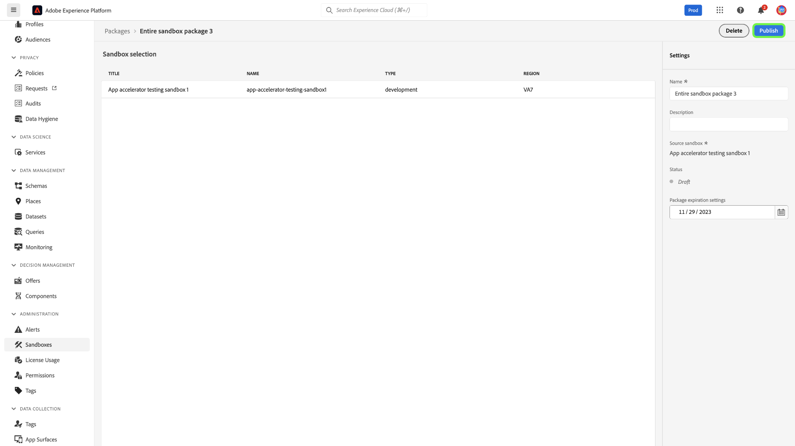

**[!UICONTROL Packages]**&#x200B;環境の[!UICONTROL Sandboxes] タブに戻り、新しい公開パッケージを確認できます。

### サンドボックスパッケージ全体をインポートする {#import-entire-sandbox-package}

>[!NOTE]
>
>すべてのオブジェクトは、新しいオブジェクトとしてターゲットサンドボックスに読み込まれます。 完全なサンドボックスパッケージを空のサンドボックスにインポートすることをお勧めします。

パッケージをターゲットサンドボックスに読み込むには、[!UICONTROL Sandboxes] **[!UICONTROL Browse]** タブに移動し、サンドボックス名の横にある「+」オプションを選択します。

![ インポートパッケージの選択を強調表示するサンドボックス **[!UICONTROL Browse]** タブ。](../images/ui/sandbox-tooling/browse-entire-package-sandboxes.png)

ドロップダウンメニューを使用して、**[!UICONTROL Package name]** ドロップダウンを使用して完全なサンドボックスを選択します。 今後の監視に使用される&#x200B;**[!UICONTROL Job name]**&#x200B;とオプションの&#x200B;**[!UICONTROL Job description]**&#x200B;を追加し、**[!UICONTROL Next]**&#x200B;を選択します。

![ インポートの詳細ページに[!UICONTROL Package name] ドロップダウン選択が表示されています](../images/ui/sandbox-tooling/import-full-sandbox-package.png)

>[!NOTE]
>
>パッケージに含まれるすべてのオブジェクトに対する完全な権限が必要です。 権限がない場合、読み込み操作は失敗し、エラーメッセージが表示されます。

読み込まれたオブジェクトと除外されたオブジェクトの数と依存関係を確認できる[!UICONTROL Package object and dependencies] ページに移動します。 ここから、**[!UICONTROL Import]**&#x200B;を選択して、パッケージの読み込みを完了します。

![ 「[!UICONTROL Package object and dependencies]」ページには、サポートされていないオブジェクトタイプのインラインメッセージが表示され、[!UICONTROL Import]が強調表示されます。](../images/ui/sandbox-tooling/finish-dependencies-entire-sandbox.png)

読み込みが完了するまでしばらく時間がかかります。 完了までの時間は、パッケージ内のオブジェクトの数によって異なります。 [!UICONTROL Sandboxes] **[!UICONTROL Jobs]** タブからインポートジョブを監視できます。

### サンドボックスへのオブジェクトのエクスプレスコピー {#express-copy}

>[!IMPORTANT]
>
>Express コピー機能は現在ベータ版で、一部のお客様のみご利用いただけます。 Express copy （Beta）は現在、スキーマとソースデータフローのみをサポートしています。

オブジェクトの在庫ページからエクスプレスコピーにアクセスできます。 例えば、使用可能なスキーマのリストを表示するには、左側のナビゲーションから「**[!UICONTROL Schemas]**」を選択し、「**[!UICONTROL Browse]**」タブを選択します。 次に、選択したスキーマの横にある省略記号（`...`）を選択して、ドロップダウンメニューにコントロールオプションを表示します。 ドロップダウンから「**[!UICONTROL Add to package]**」を選択します。

![ コントロールを強調表示するドロップダウンメニューを表示する[!UICONTROL Add to package] スキーマのリスト。](../images/ui/sandbox-tooling/add-to-package-express.png)

**[!UICONTROL Add to package]** ダイアログが表示されます。 「**[!UICONTROL Express copy]**」オプションを選択し、ドロップダウンから「**[!UICONTROL Target sandbox]**」を選択します。 最後に、**[!UICONTROL Add]**&#x200B;を選択して選択を確定します。

![[!UICONTROL Add to package] ダイアログ。ドロップダウンから選択したパッケージが表示されます。](../images/ui/sandbox-tooling/express-copy.png)

>[!NOTE]
>
> Express Copyは、選択したオブジェクトを必要な依存関係とともに自動的にパッケージ化し、それらをターゲットサンドボックスにデプロイします。 ターゲットサンドボックスに依存オブジェクトが既に存在する場合は、そのオブジェクトが再利用されます。そうでない場合は、新しいオブジェクトが作成されます。

Express コピー要求のステータスを確認するには、左側のナビゲーションから「**[!UICONTROL Sandboxes]**」を選択し、「**[!UICONTROL Jobs]**」タブを選択します。 すべてのジョブと現在の処理ステータスのリストが表示されます。

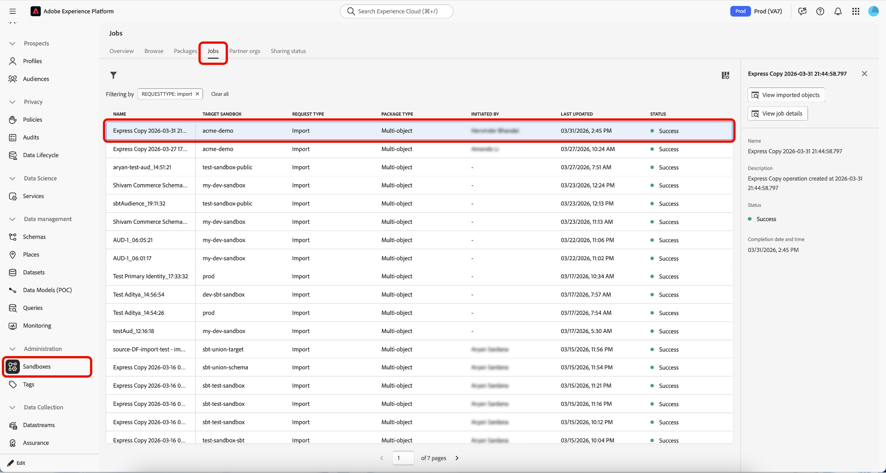

## インポートの詳細を監視 {#view-import-details}

インポートした詳細を表示するには、[!UICONTROL Sandboxes] **[!UICONTROL Jobs]** タブに移動し、リストからパッケージを選択します。 または、検索バーを使用してパッケージを検索します。

![ サンドボックス [!UICONTROL Jobs] タブは、インポートパッケージの選択を強調表示します。](../images/ui/sandbox-tooling/imports-tab.png)

<!--
### View imported objects {#view-imported-objects}

On the **[!UICONTROL Jobs]** tab in the [!UICONTROL Sandboxes] environment, select **[!UICONTROL View imported objects]** from the right details pane.

Select **[!UICONTROL View imported objects]** from the right details pane on the **[!UICONTROL Jobs]** tab in the [!UICONTROL Sandboxes] environment.

![The sandboxes [!UICONTROL Imports] tab highlights the [!UICONTROL View imported objects] selection in the right pane.](../images/ui/sandbox-tooling/view-imported-objects.png)

Use the arrows to expand objects to view the full list of fields that have been imported into the package.

![The sandboxes [!UICONTROL Imported objects] showing a list of objects imported into the package.](../images/ui/sandbox-tooling/expand-imported-objects.png)
-->

サンドボックス環境の「**[!UICONTROL View import summary]**」タブの右側の詳細ペインで「**[!UICONTROL Jobs]**」を選択します。

![ サンドボックス [!UICONTROL Imports] タブでは、右側のペインで[!UICONTROL View import details]の選択範囲がハイライト表示されます。](../images/ui/sandbox-tooling/view-import-details.png)

**[!UICONTROL Import summary]** ダイアログには、インポートの内訳が表示され、進行状況がパーセントで表示されます。

>[!NOTE]
>
>特定の在庫ページに移動すると、オブジェクトのリストを表示できます。

![ インポートの詳細な内訳を示す[!UICONTROL Import details] ダイアログ。](../images/ui/sandbox-tooling/import-details.png)

読み込みが完了すると、Experience Platform UIに通知が届きます。 これらの通知には、アラートアイコンからアクセスできます。 ジョブが失敗した場合は、ここからトラブルシューティングに移動できます。

## サンドボックスツールを使用して、サンドボックス間で反復的にオブジェクト設定を更新します {#move-configs}

サンドボックスツールを使用して、異なるサンドボックス間でオブジェクト設定を転送できます。 以前は、他のサンドボックスに転送するために、オブジェクト（スキーマ、フィールドグループ、データタイプなど）の設定更新を手動で再作成または再インポートする必要がありました。 この機能を利用すれば、サンドボックスツールを使用してワークフローを高速化し、設定更新をさまざまなサンドボックスにシームレスに転送して、潜在的なエラーを軽減できます。

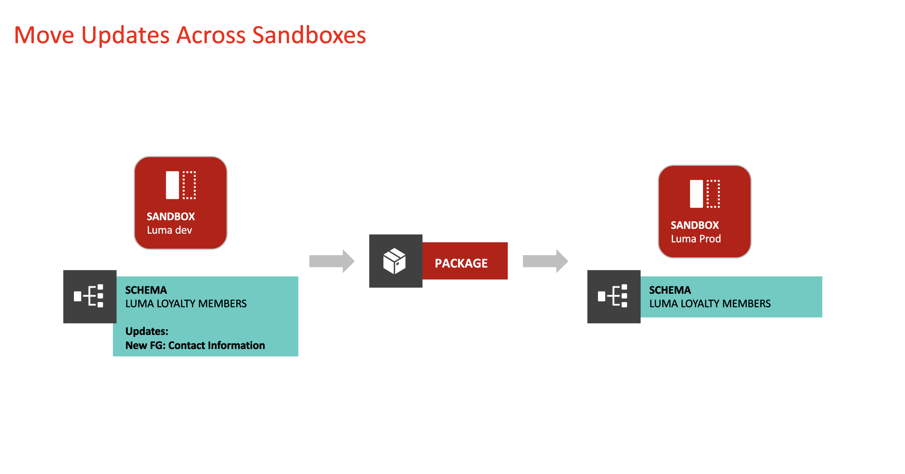

>[!TIP]
>
> 異なるサンドボックス間でオブジェクト設定を転送する前に、次の前提条件を満たしていることを確認してください。
>
>- サンドボックスツールにアクセスするための適切な権限。
>- ソースサンドボックスで新しく作成または更新されたオブジェクト（スキーマなど）。

>[!BEGINSHADEBOX]

### 更新操作でサポートされるオブジェクトタイプ

更新でサポートされるオブジェクトタイプは次のとおりです。

- スキーマ
- フィールドグループ
- データタイプ

| サポートされている更新 | サポートされていない更新 |
| --- | --- |
| <ul><li>リソースに新しいフィールド/フィールドグループを追加します。</li><li>必須フィールドをオプションにする。</li><li>新しい必須フィールドの導入。</li><li>新しい関係フィールドの導入。</li><li>新しいID フィールドの導入。</li><li>リソースの表示名と説明を変更します。</li></ul> | <ul><li>定義済みのフィールドの削除。</li><li>リアルタイム顧客プロファイルでスキーマが有効になっている場合の既存フィールドの再定義。</li><li>以前サポートされていたフィールド値の削除または制限。</li><li>既存のフィールドをスキーマツリー内の別の場所に移動する – これにより、ターゲットサンドボックスに新しいフィールドが作成されますが、前のフィールドは削除されません。</li><li>プロファイルに参加するスキーマを有効または無効にする – この操作は差分比較でスキップされます。</li><li>アクセス制御ラベル：</li></ul> |

>[!ENDSHADEBOX]

サンドボックスツールを使用して、様々なサンドボックス間でオブジェクト設定を転送する方法について説明します。

### 以前に読み込んだオブジェクト

既にパッケージ化され、他のサンドボックスに読み込まれた後、ソースサンドボックス内の既存のオブジェクトで構成の更新が必要な場合は、次の手順に従います。

まず、ソースサンドボックス内のオブジェクトを更新します。 例えば、**[!UICONTROL Schemas]** ワークスペースに移動し、スキーマを選択して、新しいフィールドグループを追加します。

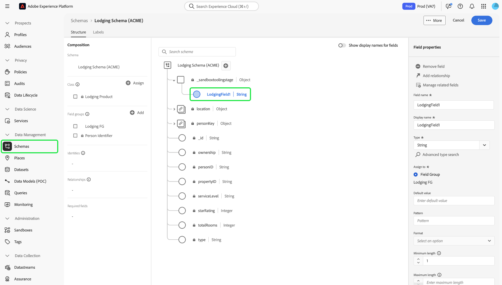

スキーマを更新したら、**[!UICONTROL Sandboxes]**&#x200B;に移動し、**[!UICONTROL Packages]**&#x200B;を選択して、既存のパッケージを探します。

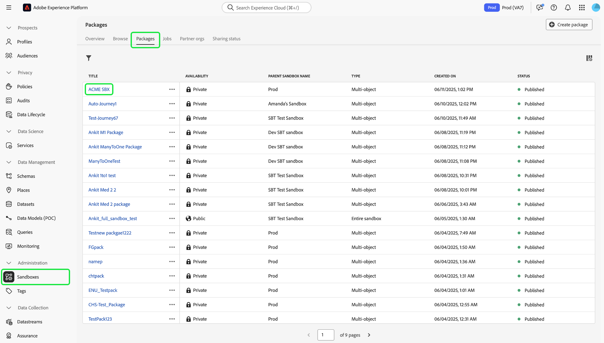

パッケージインターフェイスを使用して、変更を確認します。 **[!UICONTROL Check for updates]**&#x200B;を選択して、パッケージ内のアーティファクトに対する変更を表示します。 次に、**[!UICONTROL View diff]**&#x200B;を選択して、アーティファクトに対して実行されたすべての変更の詳細な概要を受け取ります。

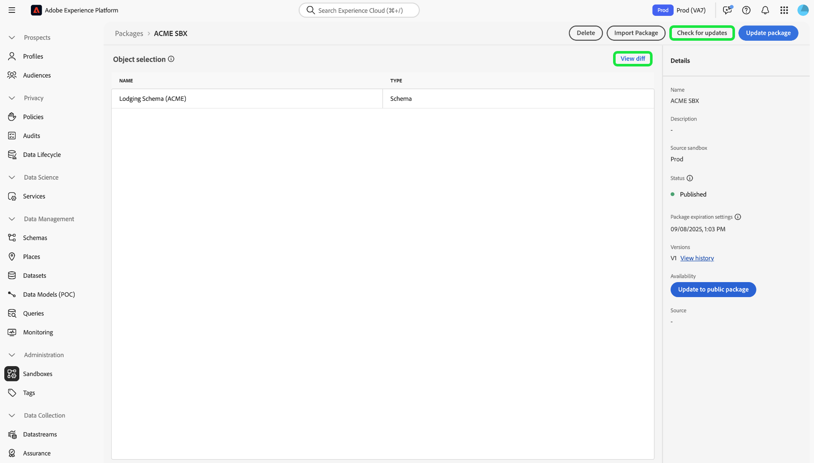

[!UICONTROL View diff] インターフェイスが表示されます。 ソースとターゲットのアーティファクト、およびそれらに適用される変更について詳しくは、このツールを参照してください。

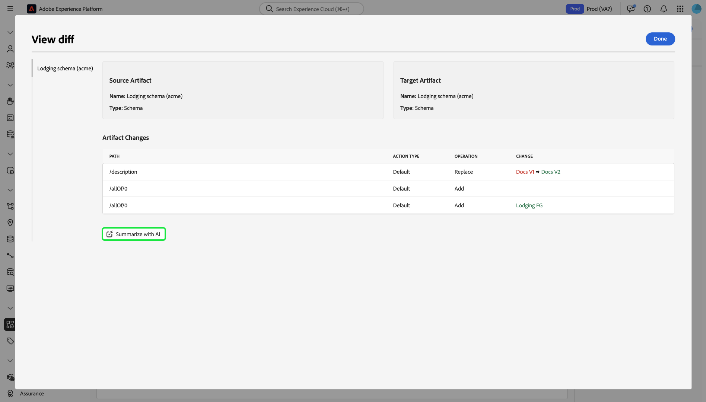

この手順では、すべての変更のステップバイステップの概要として[!UICONTROL Summarize with AI]を選択することもできます。

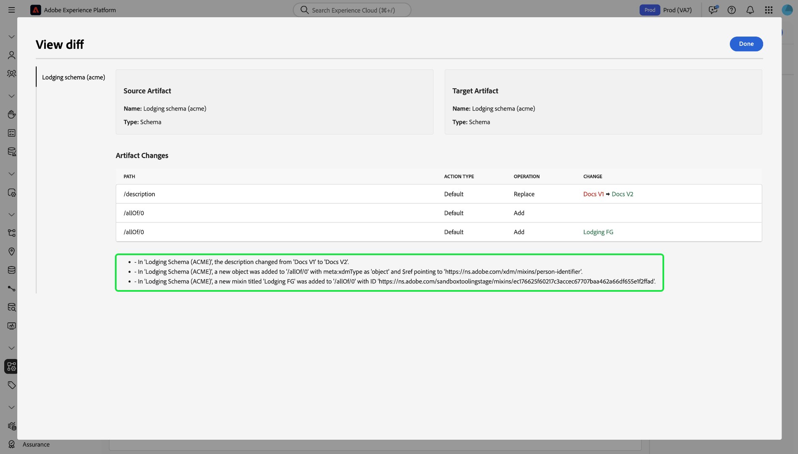

準備ができたら、**[!UICONTROL Update package]**&#x200B;を選択し、表示されるポップアップウィンドウで&#x200B;**[!UICONTROL Confirm]**&#x200B;を選択します。 ジョブが完了したら、ページを更新し、**[!UICONTROL View history]**&#x200B;を選択してパッケージのバージョンを確認できます。

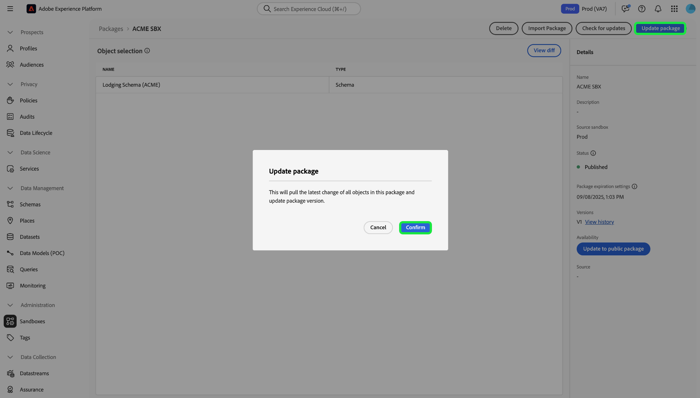

変更を読み込むには、[!UICONTROL Packages] ディレクトリに戻り、パッケージの横にある省略記号（`...`）を選択し、**[!UICONTROL Import package]**&#x200B;を選択します。 Experience Platformは[!UICONTROL Update existing objects]を自動選択します。 変更を確認し、**[!UICONTROL Finish]**&#x200B;を選択します。

>[!NOTE]
>
>このワークフローの一部として、すべての依存オブジェクトがターゲットサンドボックスで自動的に更新されます。

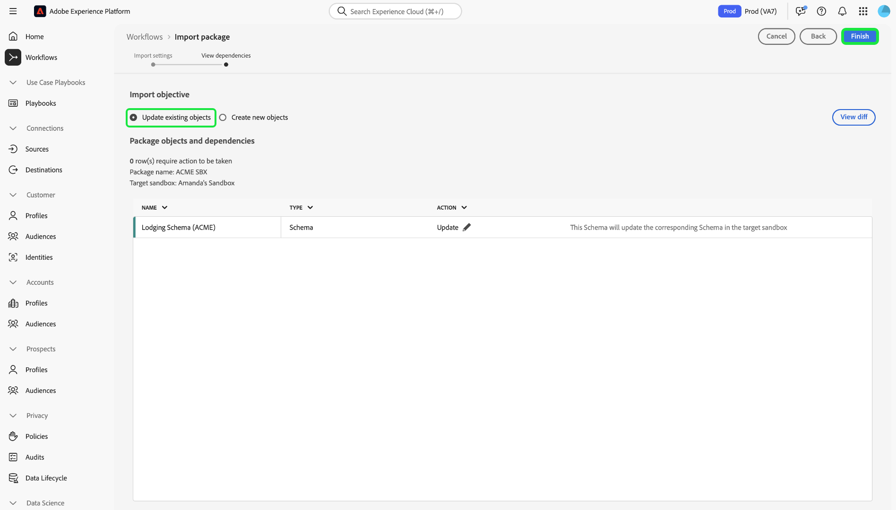

インポートプロセスをさらに検証するには、ターゲットサンドボックスに移動し、そのサンドボックス内から更新されたオブジェクトを手動で表示します。

### ターゲットサンドボックスで手動で作成されたオブジェクト

個別のサンドボックスで手動で作成されたオブジェクトに設定変更を適用するユースケースで使用する場合は、次の手順に従います。

まず、更新したオブジェクトで新しいパッケージを作成して公開します。

次に、更新するオブジェクトを含むターゲットサンドボックスにパッケージを読み込みます。 読み込み処理中に、**[!UICONTROL Update existing objects]**&#x200B;を選択し、オブジェクトナビゲーターを使用して、更新を適用するターゲットオブジェクトを手動で選択します。

>[!NOTE]
>
>- 依存オブジェクトに対して別のサンドボックスでターゲットマッピングを選択することはオプションです。 何も選択しない場合は、新しいオブジェクトが作成されます。
>- ID名前空間の場合、既存のIDをターゲットサンドボックスで再利用する必要がある場合に、新しいIDを作成する必要があるかどうかを自動的に検出します。

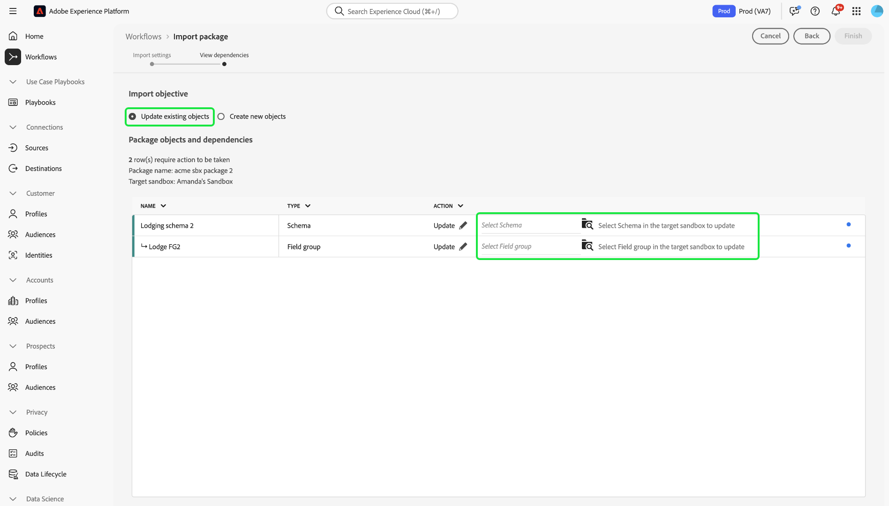

更新するターゲットオブジェクトを特定したら、**[!UICONTROL Finish]**&#x200B;を選択します。

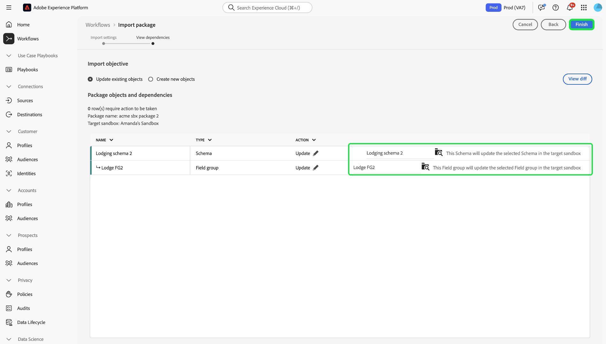

## ビデオチュートリアル

次のビデオは、サンドボックスツールの理解を支援することを目的としており、新しいパッケージの作成、パッケージの公開、パッケージのインポートの方法の概要を示しています。

>[!VIDEO](https://video.tv.adobe.com/v/3424763/?learn=on)

## 次の手順

このドキュメントでは、Experience Platform UI内でサンドボックスツール機能を使用する方法を説明しました。 サンドボックスについて詳しくは、[ サンドボックスユーザーガイド ](../ui/user-guide.md)を参照してください。

サンドボックス API を使用して様々な操作を実行する手順については、[サンドボックス開発者ガイド](../api/getting-started.md)を参照してください。Experience Platformのサンドボックスの概要については、[概要ドキュメント ](../home.md)を参照してください。
