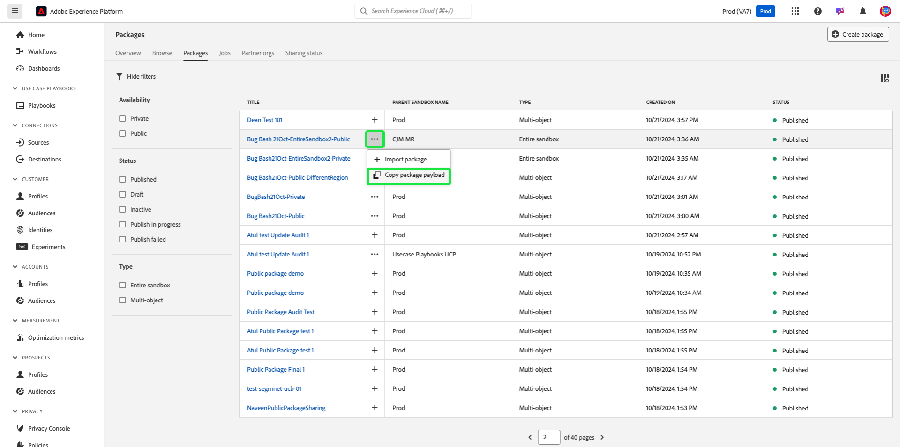
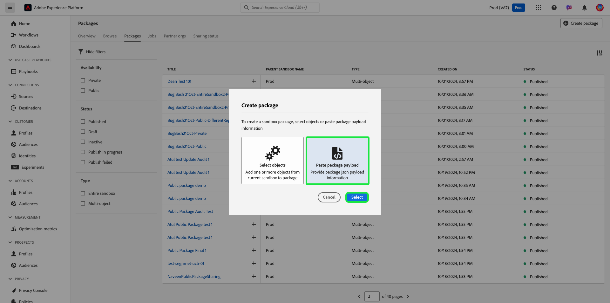

# サンドボックスツールを使用して組織間でパッケージを共有する

サンドボックスツール機能を使用して、サンドボックス全体の設定精度を向上させ、異なる組織のサンドボックス間でサンドボックス設定をシームレスにエクスポートおよびインポートします。 このドキュメントでは、Adobe Experience Platform のサンドボックス ツールを使用して、異なる組織間でパッケージを共有する方法について説明します。 共有パッケージには次の 2 種類があります。

- **プライベートパッケージ**

[ プライベートパッケージ ](#private-packages) は、ソース組織から共有リクエストを承認した組織とのみ共有できます。

- **パブリックパッケージ**

[ パブリックパッケージ ](#public-packages) は、追加の承認なしでインポートできます。 これらのパッケージは、パートナーの web サイト、ブログ、プラットフォームで共有できます。 パッケージペイロードを使用すると、これらのチャネルからターゲット組織にパッケージをコピーして貼り付けることができます。

## プライベートパッケージ {#private-packages}

>[!NOTE]
>
>共有リクエストを開始して承認し、組織間でパッケージを共有するには、**パッケージ共有** の役割ベースのアクセス制御権限が必要です。

サンドボックスツール機能を使用して、パートナーシップの作成、パートナーシックリクエストの統計の追跡、既存のパートナーシップの管理、パートナー組織とのパッケージの共有を行います。

### 組織パートナーシックリクエストの作成

組織のパートナーシックリクエストを作成するには、「**[!UICONTROL サンドボックス]****[!UICONTROL パートナー組織]**」タブに移動します。 次に、「**[!UICONTROL パートナー組織を管理]**」を選択します。

![サンドボックスがUI、[パートナー組織のタブ] および [パートナー組織の管理] が強調表示されます。](../images/ui/sandbox-tooling/private-manage-partner-orgs.png)

[!UICONTROL パッケージパートナー管理]ダイアログで、**[!UICONTROL 組織 ID を入力]**&#x200B;に組織 ID を入力し、Enter キー (Windows) または Return キー (Mac) を押します。組織 ID は、以下の **[!UICONTROL 選択した組織 ID]** セクションに表示されます。 ID を追加したら、「 **[!UICONTROL 確認]**」を選択します。

>[!TIP]
>
>コンマ区切りリストを使用するか、各組織 ID を入力してから enter キーを押すことにより、一度に複数の組織 ID を入力できます。

共有リクエストがパートナー組織に正常に送信され、「[!UICONTROL  サンドボックス ]**[!UICONTROL パートナー組織]**」タブが表示され、「**[!UICONTROL 送信リクエスト]**」が表示されます。

### パートナーシックリクエストを承認 {#authorize-request}

組織のパートナーシックリクエストを承認するには、「[!UICONTROL  サンドボックス ]**[!UICONTROL パートナー組織]**」タブに移動します。 次へ **[!UICONTROL 受信リクエスト]**&#x200B;を選択します。

![Sandbox UIパートナー組織の [タブ] と [受信] リクエストが強調表示されています。](../images/ui/sandbox-tooling/private-authorise-partner-org.png)

ステージ現時点でのリクエストの現在の **[!UICONTROL ステータス]** は **保留** です。 リクエストを承認するには、選択したリクエストの横にある省略記号（`...`）を選択し、ドロップダウンから **[!UICONTROL 承認]** を選択します。

**[!UICONTROL パートナー組織リクエストを確認]** ダイアログに、組織パートナーシップリクエストの詳細が表示されます。 承認の [!UICONTROL  理由 ] を入力し、「**[!UICONTROL 承認]**」を選択します。

「[!UICONTROL  受信リクエスト ]」ページが開き、リクエストのステータスが「承認済み **[!UICONTROL に更新されました]**。

このワークフロー/プロセスを使用して、組織とソース組織の間でパッケージを共有します。

### パートナー組織へのパッケージの共有 {#share-package}

>[!NOTE]
>
>共有できるのは、**公開済み** ステータスのパッケージのみです。

承認済みのパートナー組織にパッケージを共有するには、「[!UICONTROL  サンドボックス ]**[!UICONTROL パッケージ]**」タブに移動します。 次に、パッケージの横にある省略記号（`...`）をクリックし、ドロップダウンメニューから **[!UICONTROL パッケージを共有]** を選択します。

![[パッケージを共有]が強調表示されたドロップダウンメニューを表示するパッケージリスト。](../images/ui/sandbox-tooling/private-share-package.png)

[ **[!UICONTROL パッケージの共有]** ダイアログで、[ **[!UICONTROL 共有設定]** ] ドロップダウンから共有するパッケージを選択し、[ **[!UICONTROL 確認]**] を選択します。

>[!TIP]
>
>複数の組織を選択できます。 選択した組織は、[!UICONTROL  共有設定 ] ドロップダウンの下に表示されます。

## 公開パッケージ {#public-packages}

サンドボックスツール機能を使用して、追加の承認を必要とせず、パッケージのペイロードの使用によって簡単に読み込まれる、共有可能なパブリックパッケージを作成します。

### パッケージの公開を更新する {#update-package}

パッケージの可用性の種類を更新するには、[ [!UICONTROL サンドボックス] **[!UICONTROL パッケージ]** タブに移動します。 次へ、パッケージの横にある省略記号 (`...`) を選択し、ドロップダウン メニューから **[!UICONTROL パブリック パッケージに更新]** を選択します。

[ **[!UICONTROL 変更パッケージの公開]** ] ダイアログで、パッケージ名が正しいことを確認し、[ **[!UICONTROL 確認]**] を選択します。

>[!IMPORTANT]
>
> パッケージを公開すると、プライベートに戻すことはできません。

### パッケージペイロードを使用したパッケージの共有

公開パッケージを共有するには、パッケージの横にある省略記号（`...`）を選択し、「**[!UICONTROL パッケージペイロードをコピー]**」を選択します。

**[!UICONTROL パッケージペイロードをコピー]** ダイアログに、パッケージ名とペイロードが表示されます。 [ **[!UICONTROL コピーパッケージ ペイロード]** ] を選択して、パッケージに関連付けられているペイロードをコピーします。

### パッケージペイロードを使用して新しいパッケージを作成します

パッケージペイロードを使用してパッケージを作成するには、「[!UICONTROL  サンドボックス ]**[!UICONTROL パッケージ]** タブに移動します。 次に、「**[!UICONTROL パッケージを作成]**」を選択します。

**[!UICONTROL パッケージを作成]** ダイアログで、**[!UICONTROL パッケージペイロードを貼り付け]** するオプションを選択してから **[!UICONTROL 選択]** を選択します。

コピーしたパッケージのペイロードをテキストフィールドにペースト、 **[!UICONTROL 作成]**&#x200B;を選択します。

共有リクエストの現在のステータス表示には、 **[!UICONTROL 共有ステータス]**&#x200B;に移動します。 リクエストの現在のステータスは、[ **[!UICONTROL 共有ステータス]** 列に表示されます。

## 次の手順 {#next-steps}

このドキュメントでは、サンドボックスツール機能を使用して、様々な組織でパッケージを共有する方法について説明しました。 詳しくは、[ サンドボックスツールガイド ](../ui/sandbox-tooling.md) を参照してください。

Sandbox API を使用して様々な操作を実行する方法については、『 [ サンドボックス開発者ガイド ](../api/getting-started.md) 』を参照してください。 Experience Platformのサンドボックスの概要については、[ 概要ドキュメント ](../home.md) を参照してください。
