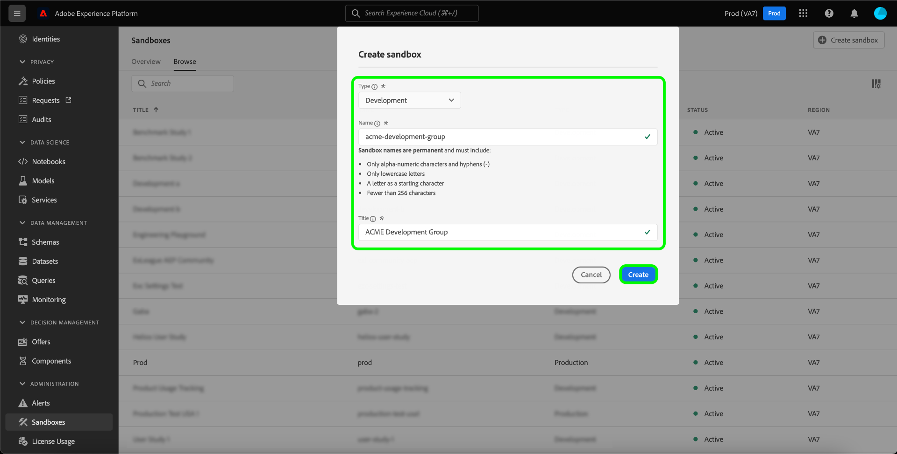
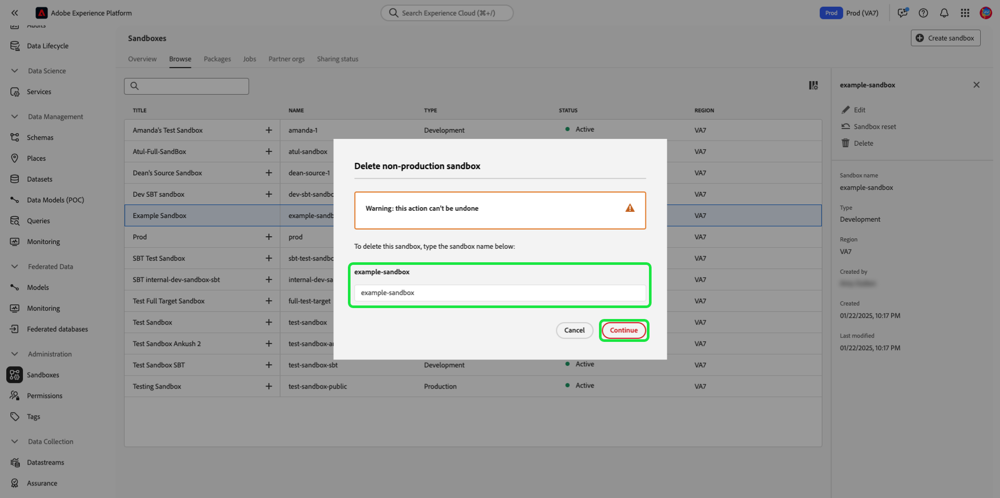

# サンドボックス UI ガイド

このドキュメントでは、Adobe Experience Platform ユーザーインターフェイスのサンドボックスに関連する様々な操作を実行する手順について説明します。

## サンドボックスの表示

Platform UI で、左側のナビゲーションの「**[!UICONTROL サンドボックス]**」を選択し、「**[!UICONTROL 参照]**」を選択して[!UICONTROL サンドボックス]ダッシュボードを開きます。 ダッシュボードには、組織で使用可能なすべてのサンドボックスが一覧表示されます。それぞれのタイプ（実稼動または開発）も含まれます。

## サンドボックス間の切り替え

サンドボックスインジケーターは、Platform UI の上部ヘッダーにあり、現在使用しているサンドボックスのタイトル、その地域およびそのタイプを表示します。

サンドボックスを切り替えるには、サンドボックスインジケーターを選択し、ドロップダウンリストから目的のサンドボックスを選択します。

サンドボックスを選択すると、画面が更新され、選択したサンドボックスに対して更新が行われます。

## 新しいサンドボックスの作成 {#create}

>[!CONTEXTUALHELP]
>id="platform_sandboxes_sandboxname"
>title="サンドボックス名"
>abstract="サンドボックス名は、このサンドボックスの一意の ID の作成にバックエンドで使用されるテキストです。"

>[!CONTEXTUALHELP]
>id="platform_sandboxes_sandboxtitle"
>title="サンドボックスのタイトル"
>abstract="サンドボックスのタイトルは、Experience Platform UI 全体でのメニューおよびドロップダウンのサンドボックスを表す表示名です。"

>[!NOTE]
>
>新しいサンドボックスが作成されたら、新しいサンドボックスの使用を開始する前に、まず [Adobe Admin Console](https://adminconsole.adobe.com/) でその新しいサンドボックスを製品プロファイルに追加する必要があります。製品プロファイルにサンドボックスをプロビジョニングする方法について詳しくは、[製品プロファイルの権限の管理](../../access-control/ui/permissions.md)に関するドキュメントを参照してください。

次のビデオでは、Experience Platform でのサンドボックスの使用方法の概要を簡単に説明しています。

>[!VIDEO](https://video.tv.adobe.com/v/29838/?quality=12&learn=on)

新しいサンドボックスを作成するには、画面の右上隅にある「**[!UICONTROL サンドボックスを作成]**」を選択します。

**[!UICONTROL サンドボックスを作成]**&#x200B;ダイアログボックスが表示されます。 開発用サンドボックスを作成している場合は、ドロップダウンパネルの「**[!UICONTROL 開発]**」を選択します。 新しい実稼動サンドボックスを作成するには、「**[!UICONTROL 実稼動]**」を選択します。

タイプを選択した後、サンドボックスに名前とタイトルを指定します。 タイトルは、人間が読み取り可能で、かつ簡単に識別できる説明的なタイトルにする必要があります。サンドボックスの名前は、API 呼び出しで使用する、すべて小文字の識別子なので、一意かつ簡潔なものにする必要があります。サンドボックス名は、文字で始まり、最大 256 文字で、英数字とハイフン (-) のみで構成する必要があります。

完了したら、「**[!UICONTROL 作成]**」をクリックします。

サンドボックスの作成が完了したら、ページを更新すると、**[!UICONTROL サンドボックス]**&#x200B;ダッシュボードに新しいサンドボックスがステータスは「[!UICONTROL 作成中]」になります。新しいサンドボックスのプロビジョニングには約 30 秒かかり、その後、ステータスが「[!UICONTROL アクティブ]」に変わります。

## サンドボックスのリセット

>[!WARNING]
>
>次に、デフォルトの実稼動サンドボックスまたはユーザー作成の実稼動サンドボックスをリセットできない可能性のある例外のリストを示します。
>* サンドボックスでホストされている ID グラフが[クロスデバイス分析（CDA）](https://experienceleague.adobe.com/docs/analytics/components/cda/overview.html?lang=ja)機能向けに Adobe Analytics でも使用されている場合、デフォルトの実稼働サンドボックスをリセットすることはできません。
>* サンドボックスでホストされている ID グラフが [People Based Destinations（PBD）](https://experienceleague.adobe.com/docs/audience-manager/user-guide/features/destinations/people-based/people-based-destinations-overview.html?lang=ja)の Adobe Audience Manager でも使用されている場合、デフォルトの実稼動サンドボックスをリセットすることはできません。
>* CDA 機能と PBD 機能の両方のデータが含まれている場合、デフォルトの実稼動サンドボックスをリセットすることはできません。
>* Adobe Audience Manager または Audience Core Service での双方向のセグメント共有に使用される、ユーザー作成の実稼動用サンドボックスは、警告メッセージの後でリセットできます。
>* サンドボックスのリセットを開始する前に、関連するオーディエンスデータが正しくクリーンアップされるように、構成を手動で削除する必要があります。

### オーディエンス構成を削除

オーディエンスの構成は、現在、サンドボックスのリセット機能と統合されていないので、サンドボックスのリセットを実行する前にオーディエンスを手動で削除する必要があります。

選択 **[!UICONTROL オーディエンス]** 左のナビゲーションから、「 」を選択します。 **[!UICONTROL 構成]**.

![The [!UICONTROL 構成] 」タブをクリックします。 [!UICONTROL オーディエンス] ワークスペース。](../images/ui/audiences.png)

次に、省略記号 (`...`) をクリックし、「 **[!UICONTROL 削除]**.

![オーディエンスメニューで [!UICONTROL 削除] オプション。](../images/ui/delete-composition.png)

削除が成功したことを示す確認メッセージが表示され、 **[!UICONTROL 構成]** タブをクリックします。

すべてのコンポジションで上記の手順を繰り返します。 これにより、オーディエンスインベントリからすべてのオーディエンスが削除されます。 すべてのオーディエンスが削除されたら、引き続きサンドボックスのリセットをおこなうことができます。

### サンドボックスのリセット

実稼動または開発のサンドボックスをリセットすると、サンドボックスの名前と関連付けられた権限は保持されたまま、そのサンドボックスに関連付けられているすべてのスキーマ（リソース、データセットなど）が削除されます。この「クリーンな」サンドボックスは、引き続き、アクセス権を持つユーザーと同じ名前で使用できます。

リセットするサンドボックスをサンドボックスのリストから選択します。 表示される右側のナビゲーションパネルで、「**[!UICONTROL サンドボックスのリセット]**」を選択します。 

選択内容を確認するダイアログボックスが表示されます。「**[!UICONTROL 続行]**」を選択して次に進みます。

最終確認ウィンドウで、ダイアログボックスにサンドボックスの名前を入力し、「**[!UICONTROL リセット]**」を選択します。 

## サンドボックスの削除

>[!WARNING]
>
>デフォルトの実稼動サンドボックスは削除できません。ただし、[!DNL Audience Manager] との双方向のセグメント共有に使用される、ユーザーが作成した実稼動用サンドボックス または [!DNL Audience Core Service] は、警告メッセージの後に削除できます。

実稼動用もしくは開発用サンドボックスを削除すると、権限を含め、そのサンドボックスに関連付けられているすべてのリソースが完全に削除されます。

サンドボックスのリストから削除するサンドボックスを選択します。表示される右側のナビゲーションパネルで、「**[!UICONTROL 削除]**」を選択します。

選択内容を確認するダイアログボックスが表示されます。「**[!UICONTROL 続行]**」を選択して次に進みます。

最終確認ウィンドウで、ダイアログボックスにサンドボックスの名前を入力し、「**[!UICONTROL 続行]**」を選択します。

## 次の手順

このドキュメントでは、Experience Platform UI 内でサンドボックスを管理する方法について説明しました。サンドボックス API を使用したサンドボックスの管理方法について詳しくは、『[サンドボックス開発者ガイド](../api/getting-started.md)』を参照してください。
