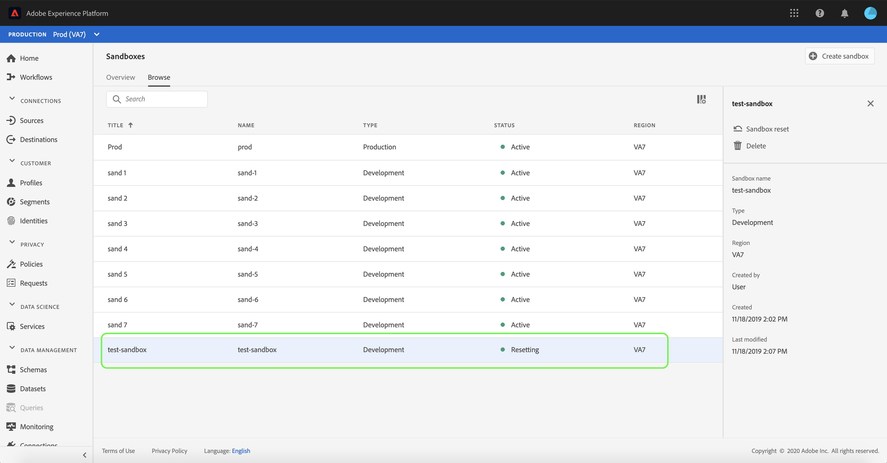

# Sandbox UIガイド

このドキュメントでは、Adobe Experience Platform ユーザーインターフェイスのサンドボックスに関連する様々な操作を実行する手順について説明します。

## サンドボックスの表示

Experience PlatformUIで、左側のナビゲーションにある「サンドボックス」**[!UICONTROL 「サンドボックス」]**&#x200B;を選択して、**[!UICONTROL サンドボックス]**&#x200B;ダッシュボードを開きます。 ダッシュボードには、組織で使用可能なすべてのサンドボックスがリストされます。これには、サンドボックスのタイプ（実稼動または開発）や状態（アクティブ、作成、削除、失敗）が含まれます。

## サンドボックス間の切り替え

画面の左上にある&#x200B;**サンドボックス切り替えボタン**&#x200B;コントロールには、現在アクティブなサンドボックスが表示されます。

サンドボックスを切り替えるには、サンドボックス切り替えボタンを選択し、ドロップダウンリストから目的のサンドボックスを選択します。

サンドボックスを選択すると、画面は、選択したサンドボックスで更新され、サンドボックス切り替えコントロールが搭載されるようになります。

## サンドボックス用の検索

サンドボックス切り替えメニューの検索機能を使用して、利用可能なサンドボックスのリスト間を移動できます。 組織が使用できるすべてのサンドボックスをフィルタリングするためにアクセスするサンドボックスの名前を入力します。

## 新しいサンドボックスの作成

Experience Platformでのサンドボックスの使用方法の概要を簡単に確認するには、次のビデオを使用します。

>[!VIDEO](https://video.tv.adobe.com/v/29838/?quality=12&learn=on)

UIで新しいサンドボックスを作成するには、画面の右上にある「Sandboxを作成」**[!UICONTROL ボタンを選択します。]**

**[!UICONTROL サンドボックスを作成]**&#x200B;ダイアログが表示され、サンドボックスの表示タイトルと名前を指定するよう求められます。**表示タイトル**&#x200B;は、人間が読み取り可能なもので、簡単に識別できる説明的なタイトルにする必要があります。サンドボックス&#x200B;**[!UICONTROL Name]**&#x200B;は、API呼び出しで使用する完全小文字の識別子です。したがって、一意で簡潔にする必要があります。 サンドボックス&#x200B;**[!UICONTROL 名前]**&#x200B;は、英数字とハイフン&#x200B;**(-)**&#x200B;で構成する必要があります。サンドボックスは文字で始まり、最大256文字です。

終了したら、「**[!UICONTROL 作成]**」を選択します。

>[!NOTE]
>
> あなたが作成できるのは非実稼動のサンドボックスタイプのみ制限されているので、**[!UICONTROL タイプ]**&#x200B;オプションは「非実稼動」でロックされ、操作できません。

サンドボックスの作成が完了したら、ページを更新し、新しいサンドボックスが&#x200B;**[!UICONTROL サンドボックス]**&#x200B;ダッシュボードに表示され、ステータスが&quot;[!UICONTROL 作成]&quot;になります。 新しいサンドボックスのプロビジョニングには約15分かかります。その後、そのステータスが「[!UICONTROL アクティブ]」に変わります。

## サンドボックスのリセット

>[!NOTE]
>
> この機能は、実稼動以外のサンドボックスでのみ使用できます。実稼動用サンドボックスはリセットできません。

実稼動以外のサンドボックスをリセットすると、サンドボックスの名前と関連付けられた権限は保持されたまま、そのサンドボックスに関連付けられているすべてのスキーマ（リソース、データセットなど）が削除されます。この「クリーンな」サンドボックスは、引き続き、アクセス権を持つユーザーと同じ名前で使用できます。

UIでサンドボックスをリセットするには、左側のナビゲーションで&#x200B;**[!UICONTROL サンドボックス]**&#x200B;を選択し、リセットするサンドボックスを選択します。 画面の右側に表示されるダイアログで、「**[!UICONTROL Reset Sandbox]**」を選択します。

選択内容を確認するダイアログが表示されます。「**[!UICONTROL リセット]**」を選択して続行します。

確認メッセージが表示され、サンドボックスの状態が「**[!UICONTROL Resetting]」**&#x200B;に変わります。 システムによってプロビジョニングされると、状態は&#x200B;**&quot;[!UICONTROL アクティブ]&quot;**&#x200B;または&#x200B;**&quot;[!UICONTROL 失敗]&quot;**&#x200B;に更新されます。

## サンドボックスの削除

>[!NOTE]
>
> この機能は、実稼動以外のサンドボックスでのみ使用できます。実稼動用サンドボックスは削除できません。

非実稼動用サンドボックスを削除すると、権限を含め、そのサンドボックスに関連付けられているすべてのリソースが完全に削除されます。

UIのサンドボックスを削除するには、左側のナビゲーションで&#x200B;**[!UICONTROL サンドボックス]**&#x200B;を選択し、削除するサンドボックスを選択します。 画面の右側に表示されるダイアログで、「**[!UICONTROL Delete Sandbox]**」を選択します。

選択内容を確認するダイアログが表示されます。続行するには、「**[!UICONTROL 削除]**」を選択します。

確認メッセージが表示され、**[!UICONTROL サンドボックス]**&#x200B;ワークスペースからサンドボックスが削除されます。

## 次の手順

このドキュメントでは、Experience Platform UI 内でサンドボックスを管理する方法について説明しました。サンドボックス API を使用したサンドボックスの管理方法について詳しくは、『[サンドボックス開発者ガイド](../api/getting-started.md)』を参照してください。