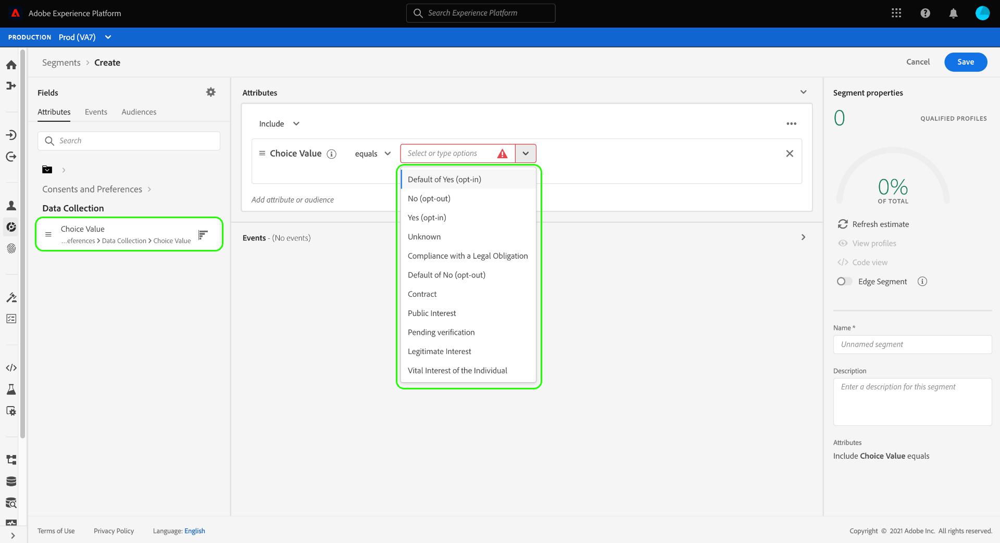

# セグメントでの同意の遵守

>[!NOTE]
>
>このガイドでは、内で同意を尊重する方法を説明します **セグメント定義**.

法的プライバシー規制 ( [!DNL California Consumer Privacy Act] (CCPA) は、消費者に対し、自分の個人データを収集したり、サードパーティと共有したりすることをオプトアウトする権利を提供します。 Adobe Experience Platformは、リアルタイム顧客プロファイルデータで顧客の同意設定を取り込むための標準の Experience Data Model(XDM) コンポーネントを提供します。

顧客が個人データの共有に関する同意を撤回または拒否した場合、組織はマーケティング活動のオーディエンスを生成する際に、その優先順位に従うことが重要です。 このドキュメントでは、顧客ユーザーインターフェイスを使用して、セグメント定義にExperience Platformの同意値を統合する方法について説明します。

## Destination SDK の

顧客の同意値を遵守するには、 [!DNL Adobe Experience Platform] 関連するサービス。 このチュートリアルを開始する前に、次のサービスに関する詳細を必ず理解しておく必要があります。

* [[!DNL Experience Data Model (XDM)]](../xdm/home.md)： Platform が顧客体験データを整理するための標準的なフレームワーク。
* [[!DNL Real-Time Customer Profile]](../profile/home.md):複数のソースからの集計データに基づいて、統合された顧客プロファイルをリアルタイムで提供します。
* [[!DNL Adobe Experience Platform Segmentation Service]](./home.md):次の場所からオーディエンスを構築できます。 [!DNL Real-Time Customer Profile] データ。

## 同意スキーマフィールド

顧客の同意および環境設定を尊重するために、 [!UICONTROL XDM 個人プロファイル] 和集合スキーマには、標準フィールドグループを含める必要があります **[!UICONTROL 同意および環境設定]**.

フィールドグループで提供される各属性の構造と使用例について詳しくは、 [同意および環境設定リファレンスガイド](../xdm/field-groups/profile/consents.md). スキーマにフィールドグループを追加する手順については、 [XDM UI ガイド](../xdm/ui/resources/schemas.md#add-field-groups).

フィールドグループを [プロファイル対応スキーマ](../xdm/ui/resources/schemas.md#profile) また、そのフィールドを使用して、エクスペリエンスアプリケーションから同意データを取り込み、収集した同意属性をセグメントルールで使用できます。

## セグメント化での同意の処理

オプトアウトプロファイルがセグメント定義に含まれないようにするには、新しいセグメント定義を作成する際に、特別なフィールドを既存のセグメント定義に追加し、含める必要があります。

以下の手順は、2 種類のオプトアウトフラグ用に適切なフィールドを追加する方法を示しています。

1. [!UICONTROL データ収集]
1. [!UICONTROL データを共有]

>[!NOTE]
>
>このガイドでは、上記 2 つのオプトアウトフラグに焦点を当てていますが、セグメント定義を設定して、追加の同意シグナルを組み込むこともできます。 この [同意および環境設定リファレンスガイド](../xdm/field-groups/profile/consents.md) では、これらの各オプションと、その意図された使用例について詳しく説明しています。

UI でセグメント定義を作成する際、 **[!UICONTROL 属性]**&#x200B;に移動します。 **[!UICONTROL XDM 個人プロファイル]**&#x200B;を選択し、「 **[!UICONTROL 同意および環境設定]**. ここから、 **[!UICONTROL データ収集]** および **[!UICONTROL データを共有]**.

まず、 **[!UICONTROL データ収集]** カテゴリに移動し、 **[!UICONTROL 選択値]** をセグメントビルダーに追加します。 セグメント定義に属性を追加する際に、 [同意値](../xdm/field-groups/profile/consents.md#choice-values) を含めるか除外する必要があります。

1 つのアプローチは、データの収集をオプトアウトした顧客を除外することです。 これをおこなうには、演算子をに設定します。 **[!UICONTROL 次と等しくない]**&#x200B;をクリックし、次の値を選択します。

* **[!UICONTROL いいえ（オプトアウト）]**
* **[!UICONTROL デフォルトの「いいえ」（オプトアウト）]**
* **[!UICONTROL 不明]** （別途不明な場合に同意が留保されると想定される場合）

の下 **[!UICONTROL 属性]** 左側のレールで、 **[!UICONTROL 同意および環境設定]** 「 」セクションで、「 **[!UICONTROL データを共有]**. 対応する **[!UICONTROL 選択値]** を選択し、 [!UICONTROL データ収集] 選択値。 必ず **[!UICONTROL または]** 2 つの属性の間に関係が確立されます。

両方の **[!UICONTROL データ収集]** および **[!UICONTROL データを共有]** セグメント定義に追加された同意値を使用すると、データの使用をオプトアウトした顧客は、結果として生成されるオーディエンスから除外されます。 ここから、を選択する前にセグメント定義のカスタマイズを続行できます。 **[!UICONTROL 保存]** をクリックしてプロセスを終了します。

## 次の手順

このチュートリアルに従うと、Experience Platformでセグメント定義を作成する際に、顧客の同意と環境設定を尊重する方法をより深く理解できます。

Platform での同意の管理について詳しくは、次のドキュメントを参照してください。

* [Adobe標準を使用した同意処理](../landing/governance-privacy-security/consent/adobe/overview.md)
* [IAB TCF 2.0 標準を使用した同意処理](../landing/governance-privacy-security/consent/iab/overview.md)