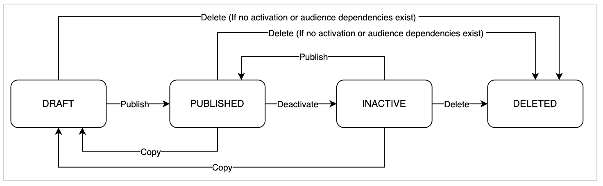

# よくある質問

Adobe Experience Platform [!DNL Segmentation Service] には、[!DNL Real-Time Customer Profile] データからのセグメント定義や他のソースを通じてオーディエンスを作成できる、ユーザーインターフェイスと RESTful API が用意されています。これらのオーディエンスは、Experience Platform上で一元的に設定および管理され、どのAdobe ソリューションからでも簡単にアクセスできます。 以下は、オーディエンスとセグメント化に関するよくある質問のリストです。

## オーディエンスポータル

次の節では、Audience Portal に関する質問を一覧表示します。

### 私はオーディエンスポータルとオーディエンス構成にアクセスできますか？

オーディエンスポータルとオーディエンス構成を利用できるのは、Real-Time CDP の Prime および Ultimate のすべてのお客様（B2C、B2B および B2P エディション）と、Journey Optimizer の Select、Prime、Ultimate Starter および Ultimate のお客様です。

現時点では、プロファイルベースのオーディエンスのみがサポートされています。アカウントベースのオーディエンスのサポートは、今後のリリースで追加される予定です。

### 外部で生成された事前定義済みのオーディエンスは、オーディエンスポータルでサポートされますか？

はい、外部で生成された事前定義済みオーディエンスも、オーディエンスポータルでサポートされます。現時点では、外部で生成されたオーディエンスを CSV ファイルを介して読み込むことができます。今後、バッチまたはストリーミングベースのソースコネクタを使用してオーディエンスを追加できるようになります。

### 外部で生成されたオーディエンスをアップロードするには、どのような権限が必要ですか？

外部で生成されたオーディエンスをアップロードするには、「セグメントの表示」、「セグメントの管理」および「オーディエンスの読み込み」権限が必要です。 外部で生成されたオーディエンスをアップロードするために、特定の役割ベースの制御は必要ありません。

### 外部で生成されたオーディエンスをアップロードするとどうなりますか？

外部で生成されたオーディエンスをアップロードすると、データセットが作成され、データセットインベントリ内に表示されます。 データセットの名前は、アップロードした外部で生成されたオーディエンスの名前と **同じ** になります。

### 外部で生成されたオーディエンスにはどのようなものがありますか？また、このデータがExperience Platformに読み込まれるとどうなりますか？

外部オーディエンスの読み込みワークフローで、CSV ファイルのどの列が **プライマリ ID** に対応するかを指定する必要があります。 プライマリ ID の例としては、メールアドレス、ECID、組織固有のカスタム ID 名前空間などがあります。

このプライマリ ID 列に関連付けられたデータは、プロファイルに添付される **唯一** データです。 プライマリ ID 列のデータに一致する既存のプロファイルがない場合は、新しいプロファイルが作成されます。 ただし、このプロファイルは基本的に孤立したプロファイルです。これは、このプロファイルに属性やエクスペリエンスイベントが関連付けられている **なし** からです。

外部で生成されたオーディエンス内の他のすべてのデータは、**ペイロード属性** と見なされます。 これらの属性は **のみ** アクティブ化中にパーソナライゼーションおよびエンリッチメントに使用でき、プロファイルには **添付されません**。 ただし、これらの属性はデータレイクに保存されます。

外部で生成されたオーディエンスは、セグメントビルダーを使用してオーディエンスを作成する際に参照できますが、個々のプロファイル属性 **使用できません**。

### 外部で生成されたオーディエンスデータをExperience Platformの既存のプロファイルと紐付けできますか？

はい。プライマリ ID が一致する場合、外部で生成されたオーディエンスはExperience Platformの既存のプロファイルと結合されます。このデータを紐付けするには最大 24 時間かかる場合があります。 プロファイルデータが存在しない場合は、データの取り込み時に新しいプロファイルが作成されます。

### Audience Portal にインポートした外部で生成されたオーディエンスに対して、顧客同意環境設定はどのように適用されますか。{#consent}

顧客データは複数のチャネルから取得されるので、ID ステッチと結合ポリシーを使用して、このデータを単一のリアルタイム顧客プロファイルに統合できます。顧客の同意環境設定に関する情報は、プロファイルレベルで保存および評価されます。

ダウンストリーム宛先では、アクティブ化の前に、各プロファイルで同意情報を確認します。 各プロファイルの同意情報は、特定の宛先の同意要件と比較されます。プロファイルが要件を満たさない場合、そのプロファイルは宛先に送信されません。

外部オーディエンスが Audience Portal に取り込まれると、メールや ECID などのプライマリ ID を使用して、既存のプロファイルに結合されます。 その結果、既存の同意ポリシーは、アクティベーション中も引き続き有効になります。

ペイロード変数はプロファイルストアではなくデータレイクに保存される **ため** 外部で生成されたオーディエンスとの同意情報を含める **しない** ことに注意してください。 代わりに、プロファイルデータが読み込まれるAdobe Experience Platform取り込みチャネルを使用 **必須** します。

### 外部で生成されたオーディエンスを使用して、他のオーディエンスを構築することはできますか？

はい、外部で生成されたオーディエンスは、オーディエンスインベントリ内に表示され、[セグメントビルダー](./ui/segment-builder.md)でオーディエンスを作成するときに使用できます。

### 外部で生成されたオーディエンスは、どのくらいの頻度で評価されますか？

外部で生成されたオーディエンスは **のみ** 読み込み時に評価されます。 これらのインポートオーディエンスに関連付けられた属性は永続化されず、プロファイルストアの一部 **はないの**、外部で生成されたオーディエンスが更新されるのは、既存のオーディエンスが手動で更新された場合のみです。

### 外部でアップロードされた属性をセグメント化の一部として使用することはできますか？

いいえ、できません。プロファイル属性は長時間持続する属性であることを目的としていますが、外部で生成されアップロードされたオーディエンスデータには、外部で生成されたオーディエンスに関連付けられたコンテキストデータのみが含まれます。

外部で生成されたオーディエンスのコンテキストデータ（エンリッチメント属性）は、ライフサイクルがアップロードされたオーディエンスに関連付けられているので、長期間持続することは&#x200B;**ありません**。その結果、一時的な性質のため、これらのエンリッチメント属性はセグメント化で使用&#x200B;**できません**。

ただし、オーディエンスをバッチまたはファイルベースの宛先にマッピングする場合、外部で生成されたこれらのエンリッチメント属性を使用して、オーディエンスを強化し、さらに下流のアクティベーションを行うことができます。

この機能について詳しくは、[バッチプロファイルの書き出し先に対するオーディエンスデータのアクティブ化](../destinations/ui/activate-batch-profile-destinations.md#mapping)に関するガイドを参照してください。

### 外部で生成されたオーディエンスに固有の結合ポリシーはありますか？

外部で生成されたオーディエンスをアップロードすると、組織固有のデフォルトの結合ポリシーが自動的に適用されます。 ただし、オーディエンスの読み込みワークフローの実行中に、外部で生成されたオーディエンスに適用される結合ポリシーを変更できます。

### 外部で生成されたオーディエンスをアクティブ化する場所を教えてください。

外部で生成されたオーディエンスは、任意の宛先にマッピングでき、Adobe Journey Optimizer キャンペーンやジャーニーで使用できます。

### 外部で生成されたオーディエンスを削除できますか？

できます。外部で生成されたオーディエンスは、オーディエンスポータル内で削除できます。

### 外部で生成されたオーディエンスを誤ってアップロードした場合はどうすればよいですか？

外部で生成されたオーディエンスを誤ってアップロードしてデータを削除した場合は、1 行のみでデータを含まない CSV ファイルをアップロードすることで、オーディエンスに関連付けられているプロファイルを消去できます。

### 外部で生成されたオーディエンスが持続する期間はどのくらいですか？

外部で生成されたオーディエンスの現在のデータ有効期限は **30 日** です。 このデータ有効期限は、組織内に保存される過剰なデータの量を減らすために選択されました。

データの有効期限が過ぎても、関連するデータセットはデータセットインベントリ内に引き続き表示されますが、オーディエンスをアクティブ化 **ることはできません** し、プロファイル数はゼロと表示されます。

### 外部で生成されたオーディエンスをインポートできる最大数はありますか？

インポートできる、外部で生成されたオーディエンスの数に制限はありません。 ただし、読み込まれたオーディエンス **行う** は、全体のオーディエンス制限に対してカウントされることに注意してください。

### オーディエンスポータルとオーディエンス構成は、Real-Time CDP のパートナーデータのリリースとどのように連携しますか？

オーディエンスポータルとオーディエンス構成は、次の 2 つの方法でパートナーデータと連携します。

1. 見込み客プロファイルのクラスとワークフローを使用してパートナー提供の見込み客リストを取り込む場合、見込み客はプロファイルサービスの顧客プロファイルとの結合とは&#x200B;**別に**&#x200B;保持されます。その結果、これは、見込み客リストがオーディエンスポータルまたはオーディエンス構成のいずれにも表示&#x200B;**されず**、使用されないことを意味します。
2. パートナー提供の属性を活用して&#x200B;**既存**&#x200B;の自社プロファイルを充実させている場合、それらのパートナーデータで充実したオーディエンスは、オーディエンスポータルとオーディエンス構成の両方に表示され、使用できるように&#x200B;**なります**。

### オーディエンスで追加属性を使用するにはどうすればよいですか？

オーディエンスでは、追加できる追加属性には、ペイロード（コンテキスト **属性とエンリッチメント属性の** 2）の異なるタイプがあります。

ペイロード属性は、外部で生成されたオーディエンスの CSV アップロードの一環として取り込まれる属性です。 これらの属性はリアルタイム顧客プロファイルに取り込まれる **はなく** ダウンストリーム宛先の一部として使用できます。

エンリッチメント属性は、データセットから取得され、オーディエンス構成でオーディエンスと結合される属性です。 これらの属性は、現在、Adobe Journey Optimizer キャンペーンでのみ使用できます。 Adobe Journey Optimizer ジャーニーのサポートは近日中に提供され、将来のリリースを待っているダウンストリームの宛先もサポートされます。

| 有効化チャネル | CSV カスタムアップロードからのオーディエンス | オーディエンスコンポジションからのオーディエンス |
| --- | --- | --- |
| Real-Time CDP宛先 | ペイロード属性とオーディエンスの両方をアクティブ化できます。 | オーディエンスのみをアクティブ化できます。 エンリッチメント属性 **アクティブ化でき** せん。 |
| Adobe Journey Optimizer キャンペーン | オーディエンスもペイロード属性もアクティブ化できません。 | オーディエンス属性とエンリッチメント属性の両方をアクティブ化できます。 |

## ライフサイクル状態 {#lifecycle-states}

次の節では、Audience Portal 内のライフサイクルステータスおよびライフサイクルステータス管理に関する質問を一覧表示します。

### ライフサイクル状態の違いは何ですか？

次のグラフでは、様々なライフサイクルステータス、それらが表すもの、そのステータスのオーディエンスを使用できる場所、セグメント化ガードレールへの影響について説明します。

| 都道府県 | 定義 | オーディエンスポータルに表示しますか？ | 宛先に表示しますか？ | セグメント化の制限に影響しますか？ | ファイルベースのオーディエンスへの影響 | オーディエンスの評価への影響 | 他のオーディエンス内で使用できますか？ | 編集可能 |
| --- | --- | --- | --- | --- | --- | --- | --- | -- |
| ドラフト | **ドラフト** 状態のオーディエンスとは、まだ開発中で、他のサービスで使用する準備ができていないオーディエンスです。 | はい。ただし、非表示にすることができます。 | × | ○ | 絞り込みプロセス中にインポートまたは更新できます。 | 正確な公開数を取得するために評価されます。 | はい。ただし、使用はお勧めしません。 | ○ |
| 公開日 | **公開済み** 状態のオーディエンスは、すべてのダウンストリームサービスで使用する準備が整ったオーディエンスです。 | ○ | ○ | ○ | インポートまたは更新できます。 | バッチ、ストリーミングまたはエッジのセグメント化を使用して評価されます。 | ○ | ○ |
| Inactive | **非アクティブ** 状態のオーディエンスとは、現在使用されていないオーディエンスです。 Experience Platform内には引き続き存在しますが、ドラフトまたは公開済みとしてマークされるまで使用できま **ん**。 | いいえ。ただし、表示できます。 | × | × | 更新はありません。 | Experience Platformによる評価または更新は行われなくなりました。 | × | ○ |
| Deleted | **削除済み** 状態のオーディエンスは、削除されたオーディエンスです。 データが実際に削除されるまでに、数分かかる場合があります。 | × | × | × | 基になるデータが削除されます。 | 削除が完了した後、データの評価や実行は行われません。 | × | × |

### オーディエンスの編集対象の状態を教えてください。

オーディエンスは、次のライフサイクル状態で編集できます。

- **ドラフト**：オーディエンスがドラフト状態で編集された場合、明示的に公開されない限り、ドラフト状態のままになります。
- **公開済み**：公開済みの状態でオーディエンスを編集した場合、そのオーディエンスは公開されたままとなり、オーディエンスは自動的に更新されます。
- **非アクティブ**：オーディエンスが非アクティブ状態で編集された場合、非アクティブのままになります。 つまり、評価や更新は行われません。 オーディエンスを更新する必要がある場合は、オーディエンスを公開します。

オーディエンスを削除した後は、編集 **できません**。

### オーディエンスを移動できるライフサイクル状態は何ですか？

考えられるライフサイクルとは、オーディエンスの現在の状態によって、そのオーディエンスを移動できることを示します。

オーディエンスがドラフト状態の場合、オーディエンスに扶養家族がいない場合は公開または削除できます。

オーディエンスが公開済み状態の場合、オーディエンスをディアクティベートするか、オーディエンスに扶養家族がない場合は削除できます。

オーディエンスが非アクティブ状態の場合、再公開するか、オーディエンスに扶養家族がいない場合は削除できます。

### 特定のライフサイクル状態におけるオーディエンスの注意事項はありますか？

公開済み状態のオーディエンスは、オーディエンスに扶養家族が **ない** 場合にのみ、別の状態に移動できます。 つまり、オーディエンスがダウンストリームサービスで使用されている場合は、非アクティブ化や削除はできません。

バッチセグメント化を使用して評価されたオーディエンスが再公開された場合、オーディエンスが非アクティブから公開済みに変わると、オーディエンスは毎日のバッチジョブの **後** 更新されます。 プロファイルとデータは、最初の再公開時には、オーディエンスが非アクティブになった場合と **同じ** になります。

### オーディエンスをドラフト状態にするにはどうすればよいですか？

オーディエンスをドラフト状態にする方法は、オーディエンスの接触チャネルによって異なります。

セグメントビルダーを使用して作成したオーディエンスの場合、セグメントビルダーで「[!UICONTROL &#x200B; ドラフトとして保存 &#x200B;]」を選択すると、オーディエンスをドラフト状態に設定できます。

オーディエンスコンポジションで作成されたオーディエンスの場合、オーディエンスは、公開されるまで自動的にドラフトとして保存されます。

外部で作成されたオーディエンスの場合、オーディエンスは自動的に公開されます。

オーディエンスが公開済みの状態になると、元のオーディエンスをドラフトの状態に戻すことはで **ません**。 ただし、オーディエンスをコピーした場合、新しくコピーされたオーディエンスはドラフト状態になります。

### オーディエンスを公開済みの状態にするにはどうすればよいですか？

セグメントビルダーまたはオーディエンスコンポジションを使用して作成されたオーディエンスの場合、それぞれの UI で「[!UICONTROL &#x200B; 公開 &#x200B;]」を選択すると、オーディエンスを公開済みの状態に設定できます。

外部で作成されたオーディエンスは、自動的に公開済みに設定されます。

### オーディエンスを非アクティブ状態にするにはどうすればよいですか？

オーディエンスポータルでクイックアクションメニューを開き、「[!UICONTROL &#x200B; 非アクティブ化 &#x200B;]」を選択することで、公開済みのオーディエンスを非アクティブ状態にすることができます。

### オーディエンスを再公開するにはどうすればよいですか？

>[!NOTE]
>
>「再公開」状態は、オーディエンス動作の公開済み状態と同じです。

非アクティブ状態のオーディエンスを選択し、オーディエンスポータルでクイックアクションメニューを開いて「[!UICONTROL &#x200B; 公開 &#x200B;]」を選択することで、オーディエンスを再公開できます。

### オーディエンスを削除済み状態にするにはどうすればよいですか？

>[!IMPORTANT]
>
>ダウンストリームアクティベーションで使用されて **ない** オーディエンスのみを削除できます。 また、別のオーディエンスで参照されているオーディエンスを削除することはできません。 オーディエンスを削除できない場合は、ダウンストリームのサービスや別のオーディエンスの構成要素として使用 **ない** ことを確認してください。

オーディエンスを削除状態にすることができます。これを行うには、オーディエンスポータルでクイックアクションメニューを開いて「[!UICONTROL &#x200B; 削除 &#x200B;]」を選択します。

### ライフサイクル状態の遷移に関する注意事項はありますか？

はい。Adobe Journey Optimizerなどのダウンストリームのサービスでオーディエンスを使用する場合や、アカウントベースのオーディエンスなどの非顧客ベースのオーディエンスを使用する場合には、注意が必要な点がいくつかあります。

このステータスは現在は自動でチェックされないので、現時点では、オーディエンスがAdobe Journey Optimizerのダウンストリームで使用されているかどうかを手動で確認する **必要があります**。

さらに、このステータスは現在は自動的にチェックされないので、オーディエンスがアカウントベースのオーディエンスのコンポーネントとして使用されているかどうかを手動で **確認する必要があります**。

### オーディエンスをコピーするとどうなりますか？ {#copy}

オーディエンスをコピーすると、新しいオーディエンスはドラフト状態になり、元のオーディエンスに適用されたのと同じフォルダー、タグ、ラベルが保持されます。

### オーディエンスを子オーディエンスとして使用すると、ライフサイクル状態のトランジションに影響しますか？

>[!NOTE]
>
>親オーディエンスは、別のオーディエンスをオーディエンスの依存関係として **使用** するオーディエンスです。
>
>子オーディエンスは、オーディエンスの依存関係 **として使用** されるオーディエンスです。

はい、オーディエンスを子オーディエンスとして使用すると、子オーディエンスと親オーディエンスが実行できるライフサイクル状態のトランジションに影響します。

子オーディエンスを公開済み状態に移動するには、その親オーディエンス **必須** がすべて公開済み状態である必要があります。 親オーディエンスは、子オーディエンスを公開する前に公開するか、ユーザーが確認した場合は、子オーディエンスの公開時に自動的に公開できます。

親オーディエンスを非アクティブまたは削除済み状態に移動するには、そのすべての子オーディエンス **必須** を非アクティブ化または削除します。

### ライフサイクルの状態が異なるオーディエンスを参照できますか？

できます。オーディエンスが現在「ドラフト」状態の場合、ドラフト状態または公開済み状態のオーディエンスを参照できます。 ただし、このオーディエンスを公開するには、他の親オーディエンスを公開する **必須** です。

## オーディエンスインベントリ

次の節では、オーディエンスポータル内のオーディエンスインベントリに関する質問を一覧表示します。

### オーディエンスインベントリ機能を使用するために、追加の権限が必要ですか。

いいえ、そのとおりです。 オーディエンスの編集権限がある限り、オーディエンスポータル内でフォルダーとタグの作成、更新、管理を行うことができます。 権限の管理について詳しくは、[ 権限の管理ガイド ](../access-control/ui/permissions.md) を参照してください。

### 作成できるフォルダー数に制限はありますか？

いいえ、作成できるフォルダーの数に制限はありません。 フォルダーについて詳しくは、セグメント化サービス UI の概要の [ オーディエンスインベントリの節 ](./ui/audience-portal.md#folders) を参照してください。

### オーディエンスに追加できるタグの数に制限はありますか？

いいえ。オーディエンスに追加できるタグの数に制限はありません。 タグについて詳しくは、セグメント化サービス UI の概要の [ オーディエンスのインベントリの節 ](./ui/audience-portal.md#tags) を参照してください。

### 作成できるタグの数に制限はありますか？

いいえ、作成できるタグの数に制限はありません。 ただし、最大 **100** 個のカテゴリを作成して、タグに適用できます。 タグ管理の詳細については、[ タグ管理ガイド ](../administrative-tags/ui/managing-tags.md) を参照してください。

### 親フォルダーで名前またはタグでオーディエンスを検索する際に、関連する子フォルダーも検索できますか？

いいえ、この動作はサポートされていません。 ただし、オーディエンスインベントリビューを変更して **すべてのオーディエンス** を表示した後、すべてのフォルダーを検索することができます。 オーディエンスインベントリでの検索の使用について詳しくは、セグメント化サービス UI の概要の [ 検索の節 ](./ui/audience-portal.md#search) を参照してください。

### 作成時にオーディエンスをフォルダーに自動的に割り当てることはできますか？

現時点では、できません。ただし、この機能は今後利用可能になる可能性があります。

### 1 つのフォルダーに複数のオーディエンスを同時に移動することはできますか？

現時点では、できません。ただし、この機能は今後利用可能になる可能性があります。

## オーディエンス構成

次の節では、オーディエンスの構成に関する質問を一覧表示します。

### セグメントビルダーを使用する代わりに、オーディエンス構成を使用する必要があるのはいつですか？

オーディエンス構成とセグメントビルダーは、どちらもExperience Platformでオーディエンスを構築する上で重要な役割を果たします。

セグメントビルダーは、オーディエンス **作成** （ゼロからオーディエンスを作成する場合）に適しており、オーディエンス構成は、オーディエンス **キュレーションおよびパーソナライゼーション** （既存オーディエンスに基づいて新しいオーディエンスを作成する場合）に適しています。

この 2 つのサービスの違いを次の表に示します。

| セグメントビルダー | オーディエンス構成 |
| --------------- | -------------------- |
| <ul><li>単一ステージオーディエンスの生成</li><li>プロファイル、時系列およびマルチエンティティデータからオーディエンスの基本ブロックを作成します</li><li>**1** オーディエンスの作成に使用</li></ul> | <ul><li>設定ベースの操作を使用したマルチステージオーディエンスの生成</li><li>セグメントビルダーで作成されたオーディエンスを使用し、ランキングプロファイル属性やサブオーディエンスへの分割などのデータエンリッチメントオプションを適用します</li><li>**複数** のオーディエンスを一度に作成するために使用</li></ul> |

セグメントビルダーについて詳しくは、『 [ セグメントビルダーガイド ](./ui/segment-builder.md) を参照してください。 オーディエンス構成について詳しくは、[ オーディエンス構成ガイド ](./ui/audience-composition.md) を参照してください。

### 外部で生成されたオーディエンスをオーディエンス構成で使用できますか？

現時点では、できません。ただし、この機能は今後利用可能になる予定です。

### オーディエンス構成からすべての下流の宛先とチャネルに、オーディエンスを送信できますか？

現時点では、できません。現在、Adobe Journey Optimizer キャンペーンおよびReal-Time CDPの宛先で、オーディエンスコンポジションのオーディエンスを使用できます。 Adobe Journey Optimizer のジャーニーは、将来のリリースでサポートされる予定です。

### 構成の数にガードレールはありますか？

現時点では、サンドボックスごとに公開できる構成は **10** 個のみです。このガードレールは、今後のリリースで増やす予定です。

### オーディエンス構成のワークフローガードレールとは何ですか？

配置する構成コンポーネントは、次のように固定した構造に従います。

1. 開始アクティビティを選択するときは、**常に**&#x200B;[!UICONTROL オーディエンス]ブロックから開始します。持つことができる[!UICONTROL オーディエンス]ブロックは、最大で **1 つ**&#x200B;です。
2. オプションで、[!UICONTROL オーディエンス]ブロックに続けて、[!UICONTROL 除外]ブロックを追加できます。
3. 必要に応じて、[!UICONTROL Exclude] ブロックの後に [!UICONTROL Enrich] ブロックを追加できます。 コンポジションごとに **one** [!UICONTROL &#x200B; エンリッチメント &#x200B;] ブロックのみを使用できます。
4. オプションで、[!UICONTROL ランク]または[!UICONTROL 分割]ブロックを追加できます。使用できるのは、構成ごとにこれらのブロックの 1 つ&#x200B;**だけ**&#x200B;です。
5. **常に**&#x200B;[!UICONTROL 保存]ブロックで終了して、オーディエンスを保存します。

また、これらのブロックを使用する場合は、次の制限が適用されます。

- ブロックを分割
   - このブロックは、**String** データタイプのみをサポートします。 分割ブロックでは、日付またはブール型のデータ型はサポートされていま **ん**。
   - また、このブロックではエンリッチメント属性はサポート **れていません**。
- ブロックを除外
   - このブロックは、日付またはブール型のデータ型をサポートしていま **ん**。
- ランクブロック
   - このブロックは、エンリッチメント属性をサポート **していません**。

オーディエンス構成の使用について詳しくは、「[オーディエンス構成 UI ガイド](./ui/audience-composition.md)」を参照してください。

### オーディエンスコンポジションを使用して作成されたオーディエンスを保存および評価するのはいつですか？

オーディエンスは、オーディエンスコンポジションで作成する際に、自動的に保存されます。 この自動保存が初めて発生するのは、オーディエンスの作成時間です。

オーディエンスコンポジションが作成されると、Real-Time CDP宛先やAdobe Journey Optimizer チャネルなどのダウンストリームサービスで使用するために評価およびアクティブ化されるまでに、最大 48 時間かかる場合があります。

### 作成したオーディエンスを使用できるのはいつですか？

オーディエンス構成で作成されたオーディエンスは **直ちに** Audience Portal に表示されます。 ただし、Adobe Journey Optimizerなどのダウンストリームサービスで使用するには、評価後 24 時間以上待つ必要があります。

### 評価ジョブは「監視」セクション内で表示されますか。

現時点では、評価ジョブは監視 UI 内に表示 **れません**。

### 別のコンポジションでオーディエンス構成を使用することはできますか？

いいえ、オーディエンス構成を使用して作成されたオーディエンスを、別のオーディエンス構成の入力として使用することは&#x200B;**できません**。

### オーディエンス構成での分割はどのように機能しますか？

オーディエンスを分割すると、オーディエンスをさらに小さなグループにサブセット化できます。

属性別に分割する場合、グループ間には相互の排他性があります。 つまり、レコードが複数の分割パスの基準を満たす場合、左から&#x200B;**最初**&#x200B;のパスが割り当てられ、他のパスには&#x200B;**割り当てられません**。

割合で分割する場合、分割は **ランダムに** 行されます。 つまり、プロファイルは各パスにランダムに割り当てられます。

ブロックの分割について詳しくは、[オーディエンス構成 UI ガイド](./ui/audience-composition.md#split)を参照してください。

### オーディエンス構成のワークフローではすべてのセグメントタイプを使用できますか？

はい、オーディエンス構成ワークフローでは、すべてのセグメントタイプ（[バッチのセグメント化、ストリーミングのセグメント化、エッジのセグメント化](./home.md#evaluate-segments)）をサポートしています。ただし、現在、構成は 1 日に 1 回だけ実行されるので、ストリーミングまたはエッジで評価されたオーディエンスが含まれている場合でも、実行結果は構成実行時のオーディエンスのメンバーシップに基づいたものになります。

## オーディエンスのメンバーシップ

次の節では、オーディエンスメンバーシップに関する質問を一覧表示します。

### プロファイルのオーディエンスのメンバーシップを確認するにはどうすればよいですか？

プロファイルのオーディエンスのメンバーシップを確認するには、調べたいプロファイルの詳細ページにアクセスします。「**[!UICONTROL 属性]**」を選択し、続いて「**[!UICONTROL JSON の表示]**」を選択すると、`segmentMembership` オブジェクトにオーディエンスの ID が含まれていることを確認できます。

### オーディエンスメンバーシップは、理想的なメンバーシップと実際のメンバーシップの間でずれますか。

はい。オーディエンスがストリーミングセグメント化を使用して評価される場合 **および** そのオーディエンスがバッチセグメント化を使用して評価されたオーディエンスに基づく場合、オーディエンスメンバーシップは理想的なメンバーシップと実際のメンバーシップの間でずれが生じる可能性があります。

例えば、オーディエンス A がオーディエンス B に基づいており、オーディエンス B がバッチセグメント化を使用して評価される場合、オーディエンス B は 24 時間ごとにのみ更新されるので、オーディエンス A はオーディエンス B の更新と再同期するまで、実際のデータからさらに乖離します。

## バッチセグメント化 {#batch-segmentation}

次の節では、バッチセグメント化に関する質問を一覧表示します。

### バッチセグメント化でプロファイルメンバーシップはどのように解決されますか？

バッチセグメント化を使用して評価されたオーディエンスは毎日解決され、オーディエンスメンバーシップの結果がプロファイルの `segmentMembership` 属性に記録されます。 プロファイルの検索では、検索時に新しいバージョンのプロファイルが生成されますが、バッチセグメント化結果は更新 **されません**。

その結果、2 つのプロファイルの結合など、プロファイルに変更が加えられると、その変更は検索時にプロファイルに表示 **れますが** セグメント評価ジョブが再び実行されるまで **属性に反映** されません `segmentMembership`。

例えば、相互に排他的な 2 つのオーディエンスを作成したとします。オーディエンス A はワシントンに住んでいる人向けで、オーディエンス B はワシントンに住んでいない **いない** 人向けです。 ワシントンに住んでいる人用のプロファイル 1 と、オレゴンに住んでいる人用のプロファイル 2 の 2 つのプロファイルがあります。

バッチセグメント化評価ジョブが実行されると、プロファイル 1 はオーディエンス A に移動し、プロファイル 2 はオーディエンス B に移動します。その後、翌日のバッチセグメント化評価ジョブが実行される前に、2 つのプロファイルを調整するイベントがExperience Platformに入ります。 その結果、プロファイル 1 と 2 を含む単一の結合プロファイルが作成されます。

次のバッチセグメント評価ジョブが実行されるまで、新しい結合プロファイルは、プロファイル 1 とプロファイル 2 の両方にオーディエンスメンバーシップを持ちます **プロファイル 1 とプロファイル 2 の両方**。 その結果、これらのオーディエンスには矛盾する定義があるにもかかわらず、オーディエンス A とオーディエンス B の **両方** のメンバーになります。 エンドユーザーの場合、これは、プロファイルが接続される前と **まったく同じ状況** です。関係するのは常に 1 人だけであり、Experience Platformには 2 つのプロファイルを接続するのに十分な情報がありませ **ので**。

プロファイル参照を使用して新しく作成されたプロファイルを取得し、そのオーディエンスメンバーシップを確認すると、両方のオーディエンスに矛盾する定義があるにもかかわらず、これが **オーディエンス A とオーディエンス B** のメンバーであることを示します。 毎日のバッチセグメント化評価ジョブを実行すると、オーディエンスメンバーシップが更新され、この更新されたプロファイルデータの状態が反映されます。

より多くのリアルタイムオーディエンス解像度が必要な場合は、ストリーミングまたはエッジのセグメント化を使用します。

### ストリーミングデータがバッチセグメント化ワークフローで使用できるようになるまで、どれくらいかかりますか。

バッチセグメント化ワークフローでストリーミングデータを使用できるようになるまで、最大 3 時間かかる場合があります。

例えば、バッチセグメント化ジョブが午後 9 時に実行される場合、取り込まれたストリーミングのデータが午後 6 時まで **含まれ** ことが保証されます。 午後 6 時以降 **5 月** 以前に取り込まれた、ストリーミング取り込みデータが含まれます。

## エッジセグメント化 {#edge-segmentation}

次の節では、エッジのセグメント化に関連する質問を一覧表示します。

### Edge Network 上でセグメント定義が使用可能になるまで、どれくらいかかりますか？

Edge Network 上でセグメント定義が使用可能になるまで、最大 1 時間かかります。

## ストリーミングセグメント化 {#streaming-segmentation}

次の節では、ストリーミングセグメント化に関する質問を一覧表示します。

### ストリーミングセグメント化の「選定解除」もリアルタイムで発生しますか。

ほとんどのインスタンスでは、ストリーミングセグメント化の選定解除はリアルタイムで発生します。ただし、セグメントのセグメントを使用するストリーミングセグメントでは、リアルタイムで選定解除は発生&#x200B;**せず**、24 時間後に発生します。

### ストリーミングセグメント化はどのデータで機能しますか。

ストリーミングセグメント化は、ストリーミングソースを使用して取り込まれたすべてのデータに対して機能します。 バッチベースのソースを使用して取り込まれたデータは、ストリーミングセグメント化の対象となっている場合でも、毎晩評価されます。 タイムスタンプが 24 時間より古いシステムにストリーミングされたイベントは、後続のバッチジョブで処理されます。

### セグメントはどのようにバッチまたはストリーミングセグメント化として定義されますか。

セグメント定義は、クエリタイプとイベント履歴期間の組み合わせに基づいて、バッチ、ストリーミング、エッジのセグメント化として定義されます。ストリーミングセグメント定義として評価されるセグメントのリストは、[ストリーミングセグメント化クエリタイプの節](#query-types)で確認できます。

セグメント定義に `inSegment` 式と直接単一イベントチェーンの&#x200B;**両方**&#x200B;を含む場合、ストリーミングセグメント化の対象にはなりません。このセグメント定義をストリーミングセグメント化の対象として選定する場合は、直接単一イベントチェーンを独自のセグメントにする必要があります。

### 「セグメント定義の詳細」セクション内で、「過去 X 日間」の数がゼロのままなのに、「合計選定」セグメントの数が増加し続けるのはなぜですか。

合計選定セグメント数は、毎日のセグメント化ジョブから取得されます。このジョブには、バッチおよびストリーミングセグメントの両方に適合するオーディエンスが含まれます。この値は、バッチおよびストリーミングセグメントの両方で表示されます。

「過去 X 日間」の下にある数値は、ストリーミングセグメント化の対象となるオーディエンスの数&#x200B;**のみ**&#x200B;を表し、データをシステムにストリーミングしそのストリーミング定義に照合してカウントする場合に&#x200B;**のみ**&#x200B;増加します。この値は、ストリーミングセグメント&#x200B;**のみ**&#x200B;を対象にした表示です。そのため、この値はバッチセグメントに対しては 0 と表示されても&#x200B;**問題ありません**。

つまり、「過去 X 日間」の下にある数値がゼロで、線グラフにもゼロと表示されている場合は、そのセグメントに適格となるプロファイルをシステムにストリーミングして&#x200B;**いません**。

### セグメント定義が使用可能になるまで、どれくらいかかりますか。

セグメント定義が使用可能になるまでに最大 1 時間かかります。

### ストリーミングされるデータに制限はありますか？

エッジまたはストリーミングのセグメント化を使用する場合は、各プロファイルのイベントの間隔が空いていることを確認します。 1 秒間にストリーミングされるイベントが多すぎると、Experience Platformはこれらのイベントをボット生成データとして扱い、破棄されます。 ベストプラクティスとして、データが適切に使用されるようにするには、イベントデータの間に **少なくとも** 5 秒は必要です。
