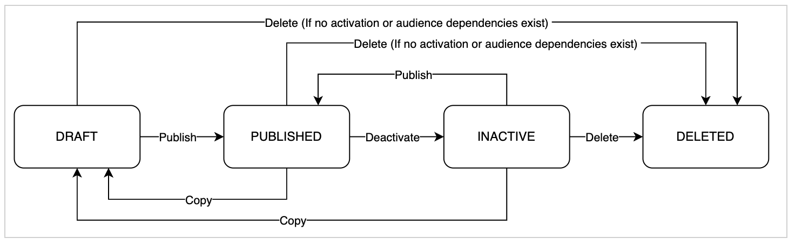

# よくある質問

Adobe Experience Platform [!DNL Segmentation Service] には、[!DNL Real-Time Customer Profile] データからのセグメント定義や他のソースを通じてオーディエンスを作成できる、ユーザーインターフェイスと RESTful API が用意されています。これらのオーディエンスは、Experience Platformで一元的に設定および管理され、あらゆるAdobeソリューションから容易にアクセスできます。 以下は、オーディエンスとセグメント化に関するよくある質問のリストです。

## オーディエンスポータル

次の節では、オーディエンスポータルに関する質問を示します。

### 私はオーディエンスポータルとオーディエンス構成にアクセスできますか？

オーディエンスポータルとオーディエンス構成を利用できるのは、Real-Time CDP の Prime および Ultimate のすべてのお客様（B2C、B2B および B2P エディション）と、Journey Optimizer の Select、Prime、Ultimate Starter および Ultimate のお客様です。

現時点では、プロファイルベースのオーディエンスのみがサポートされています。アカウントベースのオーディエンスのサポートは、今後のリリースで追加される予定です。

### 外部で生成された事前定義済みのオーディエンスは、オーディエンスポータルでサポートされますか？

はい、外部で生成された事前定義済みオーディエンスも、オーディエンスポータルでサポートされます。現時点では、外部で生成されたオーディエンスを CSV ファイルを介して読み込むことができます。今後、バッチまたはストリーミングベースのソースコネクタを使用してオーディエンスを追加できるようになります。

### 外部で生成されたオーディエンスをアップロードするには、どのような権限が必要ですか？

外部で生成されたオーディエンスをアップロードするには、「セグメントの表示」、「セグメントの管理」および「オーディエンスの読み込み」の権限が必要です。 社外で生成されたオーディエンスをアップロードするために、特定のロールベースの管理は必要ありません。

### 外部生成されたオーディエンスをアップロードするとどうなりますか？

外部で生成されたオーディエンスをアップロードすると、データセットが作成され、データセットインベントリ内に表示されます。 データセットの名前は、アップロードした外部で生成されたオーディエンスの名前と&#x200B;**same**&#x200B;になります。

### 外部生成されたオーディエンスは何で構成され、Experience Platformに読み込まれると、このデータはどうなりますか？

外部オーディエンスの読み込みワークフローで、CSV ファイルのどの列が&#x200B;**プライマリ ID**&#x200B;に対応するかを指定する必要があります。 プライマリ IDの例には、電子メールアドレス、ECID、組織固有のカスタム ID名前空間などがあります。

このプライマリ ID列に関連付けられているデータは、プロファイルに添付されている&#x200B;**only** データです。 プライマリ ID列のデータに一致する既存のプロファイルがない場合は、新しいプロファイルが作成されます。 ただし、このプロファイルには&#x200B;**no**&#x200B;属性またはエクスペリエンスイベントが関連付けられているため、このプロファイルは基本的に孤立したプロファイルです。

外部で生成されたオーディエンス内の他のすべてのデータは、**ペイロード属性**&#x200B;と見なされます。 これらの属性は、**アクティブ化中にパーソナライゼーションとエンリッチメントに使用できるのは**&#x200B;のみです。プロファイルにアタッチされるのは&#x200B;**ではなく**&#x200B;です。 ただし、これらの属性はデータレイクに保存されます。

セグメントビルダーを使用してオーディエンスを作成する際に、外部で生成されたオーディエンスを参照できますが、個々のプロファイル属性&#x200B;**を使用することはできません**。

### 外部で生成されたオーディエンスデータを、Experience Platformの既存のプロファイルと照合できますか？

はい。外部生成されたオーディエンスは、プライマリ IDが一致する場合、Experience Platformの既存のプロファイルと結合されます。このデータを照合するには、最大で24時間かかる場合があります。 プロファイルデータが存在しない場合は、データの取り込み時に新しいプロファイルが作成されます。

### オーディエンスポータルに読み込まれた外部生成オーディエンスに対して、顧客の同意の設定はどのように適用されますか？{#consent}

顧客データは複数のチャネルから取得されるので、ID ステッチと結合ポリシーを使用して、このデータを単一のリアルタイム顧客プロファイルに統合できます。顧客の同意環境設定に関する情報は、プロファイルレベルで保存および評価されます。

ダウンストリームの配信先では、アクティベーション前に各プロファイルで同意情報を確認します。 各プロファイルの同意情報は、特定の宛先の同意要件と比較されます。プロファイルが要件を満たさない場合、そのプロファイルは宛先に送信されません。

外部オーディエンスがオーディエンスポータルに取り込まれると、電子メールやECIDなどのプライマリ IDを使用して、既存のプロファイルと結合されます。 その結果、既存の同意ポリシーは、アクティベーション中も引き続き有効になります。

ペイロード変数は&#x200B;**not**&#x200B;がプロファイルストアに保存され、データレイクに保存されているため、**not**&#x200B;は外部で生成されたオーディエンスに同意情報を含める必要があります。 代わりに、**プロファイルデータが読み込まれるAdobe Experience Platform取り込みチャネルを**&#x200B;使用する必要があります。

### 外部で生成されたオーディエンスを使用して、他のオーディエンスを構築することはできますか？

はい、外部で生成されたオーディエンスは、オーディエンスインベントリ内に表示され、[セグメントビルダー](./ui/segment-builder.md)でオーディエンスを作成するときに使用できます。

### 外部生成されたオーディエンスはどのくらいの頻度で評価されますか？

外部で生成されたオーディエンスは、読み込み時に&#x200B;**のみ**&#x200B;評価されます。 これらのインポートオーディエンスに関連付けられた属性は耐久性がなく、**not** プロファイルストアの一部であるため、外部で生成されたオーディエンスが更新されるのは、既存のオーディエンスが手動で更新された場合だけです。

### 外部でアップロードされた属性をセグメント化の一部として使用することはできますか？

いいえ、できません。プロファイル属性は長時間持続する属性であることを目的としていますが、外部で生成されアップロードされたオーディエンスデータには、外部で生成されたオーディエンスに関連付けられたコンテキストデータのみが含まれます。

外部で生成されたオーディエンスのコンテキストデータ（エンリッチメント属性）は、ライフサイクルがアップロードされたオーディエンスに関連付けられているので、長期間持続することは&#x200B;**ありません**。その結果、一時的な性質のため、これらのエンリッチメント属性はセグメント化で使用&#x200B;**できません**。

ただし、オーディエンスをバッチまたはファイルベースの宛先にマッピングする場合、外部で生成されたこれらのエンリッチメント属性を使用して、オーディエンスを強化し、さらに下流のアクティベーションを行うことができます。

この機能について詳しくは、[バッチプロファイルの書き出し先に対するオーディエンスデータのアクティブ化](../destinations/ui/activate-batch-profile-destinations.md#mapping)に関するガイドを参照してください。

### 外部生成されたオーディエンスに対して、特定の結合ポリシーはありますか？

組織固有のデフォルトの結合ポリシーは、外部で生成されたオーディエンスをアップロードするときに自動的に適用されます。 ただし、オーディエンスの読み込みワークフロー中に外部で生成されたオーディエンスに適用される結合ポリシーを変更できます。

### 外部で生成されたオーディエンスはどこでアクティブ化できますか？

外部で生成されたオーディエンスは、任意の宛先にマッピングでき、Adobe Journey Optimizerのキャンペーンやジャーニーで使用できます。

### 外部で生成されたオーディエンスを削除できますか？

はい。 外部で生成されたオーディエンスは、オーディエンスポータル内で削除できます。

### 外部で生成されたオーディエンスを誤ってアップロードした場合はどうすればよいですか？

外部で生成されたオーディエンスを誤ってアップロードし、データを削除する場合は、1行のデータを含まないCSV ファイルをアップロードすることで、オーディエンスに関連付けられているプロファイルをクリアできます。

### 外部生成されたオーディエンスは、どのくらいの期間保持されますか？

外部で生成されたオーディエンスの現在のデータ有効期限は&#x200B;**30日**&#x200B;です。 このデータ有効期限は、組織内に保存される過剰なデータ量を減らすために選択されました。

データの有効期限が経過しても、関連するデータセットはデータセットインベントリ内に表示されますが、**not**&#x200B;はオーディエンスをアクティブにすることができ、プロファイル数は0として表示されます。

### 読み込むことができる外部生成オーディエンスの最大数はありますか？

読み込める外部で生成されたオーディエンスの数に制限はありません。 ただし、読み込まれたオーディエンス **do**&#x200B;は、オーディエンス全体の制限に対してカウントされます。

### オーディエンスポータルとオーディエンス構成は、Real-Time CDP のパートナーデータのリリースとどのように連携しますか？

オーディエンスポータルとオーディエンス構成は、次の 2 つの方法でパートナーデータと連携します。

1. 見込み客プロファイルのクラスとワークフローを使用してパートナー提供の見込み客リストを取り込む場合、見込み客はプロファイルサービスの顧客プロファイルとの結合とは&#x200B;**別に**&#x200B;保持されます。その結果、これは、見込み客リストがオーディエンスポータルまたはオーディエンス構成のいずれにも表示&#x200B;**されず**、使用されないことを意味します。
2. パートナー提供の属性を活用して&#x200B;**既存**&#x200B;の自社プロファイルを充実させている場合、それらのパートナーデータで充実したオーディエンスは、オーディエンスポータルとオーディエンス構成の両方に表示され、使用できるように&#x200B;**なります**。

### オーディエンスに追加の属性を使用するにはどうすればよいですか？

オーディエンスには、**2**&#x200B;種類の追加属性（ペイロード（コンテキスト）属性とエンリッチメント属性）が追加できます。

ペイロード属性は、外部で生成されたオーディエンスのCSV アップロードの一部として取り込まれる属性です。 これらの属性は&#x200B;**not**&#x200B;でリアルタイム顧客プロファイルに取り込まれますが、ダウンストリームの宛先の一部として使用できます。

エンリッチメント属性は、データセットから取得された属性で、オーディエンス構成でオーディエンスと結合されます。 これらの属性は、現在、Adobe Journey Optimizer キャンペーンでのみ使用できます。 Adobe Journey Optimizer ジャーニーのサポートは近日提供開始予定で、今後のリリースが保留中のダウンストリームの宛先のサポートも提供されます。

| アクティベーションチャネル | CSV カスタムアップロードからのオーディエンス | オーディエンス構成からのオーディエンス |
| --- | --- | --- |
| Real-Time CDPの宛先 | ペイロード属性とオーディエンスの両方をアクティブ化できます。 | アクティブ化できるのはオーディエンスのみです。 エンリッチメント属性&#x200B;**をアクティブ化できません**。 |
| Adobe Journey Optimizer Campaigns | オーディエンス属性とペイロード属性はアクティブ化できません。 | オーディエンス属性とエンリッチメント属性の両方をアクティブ化できます。 |

## ライフサイクルの状態 {#lifecycle-states}

次の節では、オーディエンスポータル内のライフサイクルの状態とライフサイクルの状態管理に関する質問を示します。

### それぞれのライフサイクルの状態は何を表していますか？

次のグラフは、ライフサイクルステータスの種類、そのステータスを持つオーディエンスの使用場所、セグメンテーションガードレールへの影響を示しています。

| 都道府県 | 定義 | オーディエンスポータルで表示できますか？ | 配信先に表示される場合 | セグメンテーションの制限に影響しますか？ | ファイルベースのオーディエンスへの影響 | オーディエンス評価への影響 | 他のオーディエンスでも利用できますか？ | 編集可能 |
| --- | --- | --- | --- | --- | --- | --- | --- | -- |
| ドラフト | **ドラフト**&#x200B;状態のオーディエンスは、まだ開発中で、まだ他のサービスで使用する準備ができていないオーディエンスです。 | はい、非表示にできます。 | × | ○ | 改良プロセス中にインポートまたは更新できます。 | 正確な公開数を取得するために評価されます。 | はい、使用することはお勧めしません。 | ○ |
| 公開日 | **公開済み**&#x200B;状態のオーディエンスは、すべてのダウンストリームサービスで使用できるオーディエンスです。 | ○ | ○ | ○ | インポートまたは更新できます。 | バッチ、ストリーミング、エッジセグメント化を使用して評価。 | ○ | ○ |
| 非アクティブ | **非アクティブ**&#x200B;状態のオーディエンスは、現在使用されていないオーディエンスです。 Experience Platform内にはまだ存在しますが、ドラフトまたは公開とマークされるまで&#x200B;**使用できません**。 | いいえ、表示できます。 | × | × | 更新されません。 | Experience Platformによる評価または更新は行われなくなりました。 | × | ○ |
| Deleted | **削除済み**&#x200B;状態のオーディエンスは、削除されたオーディエンスです。 データの実際の削除は、実行に最大で数分かかる場合があります。 | × | × | × | 基礎となるデータが削除されます。 | 削除が完了した後、データの評価や実行は行われません。 | × | × |

### どの州でオーディエンスを編集できますか？

オーディエンスは、次のライフサイクル状態で編集できます。

- **ドラフト**: オーディエンスがドラフト状態で編集された場合、明示的に公開されない限り、オーディエンスはドラフト状態のままになります。
- **公開済み**: オーディエンスが公開済み状態で編集された場合、そのオーディエンスは公開されたままとなり、オーディエンスは自動的に更新されます。
- **非アクティブ**: オーディエンスが非アクティブ状態で編集された場合、非アクティブのままになります。 つまり、評価や更新はされません。 オーディエンスを更新する必要がある場合は、オーディエンスを公開する必要があります。

オーディエンスが削除されると、**編集できません**。

### オーディエンスを移動できるライフサイクルのステートは何ですか？

考えられるライフサイクルは、オーディエンスを移動できるかどうかは、オーディエンスの現在の状態によって異なります。

オーディエンスがドラフト状態の場合、オーディエンスに依存関係がない場合は、そのオーディエンスを公開または削除できます。

オーディエンスが公開済み状態の場合、オーディエンスに依存関係がない場合は、オーディエンスを非アクティブ化するか削除できます。

オーディエンスが非アクティブ状態の場合は、オーディエンスに依存関係がない場合は、再公開または削除できます。

### 特定のライフサイクル状態のオーディエンスに対する注意事項はありますか？

公開済み状態のオーディエンスは、オーディエンスに&#x200B;**not**&#x200B;の依存関係がある場合にのみ、別の状態に移動できます。 つまり、オーディエンスがダウンストリームサービスで使用されている場合、そのオーディエンスをディアクティベートまたは削除することはできません。

バッチセグメント化を使用して評価されたオーディエンスが再公開された場合（オーディエンスが非アクティブから公開された場合）、オーディエンスは毎日のバッチジョブの&#x200B;**後**&#x200B;に更新されます。 最初に再公開されると、プロファイルとデータは、オーディエンスが非アクティブになった時点と同じ&#x200B;**同じ**&#x200B;になります。

### オーディエンスをドラフト状態に置くにはどうすればよいですか？

オーディエンスをドラフト状態にする方法は、オーディエンスの生成元によって異なります。

セグメントビルダーを使用して作成されたオーディエンスの場合、セグメントビルダーで「[!UICONTROL Save as draft]」を選択して、オーディエンスをドラフト状態に設定できます。

オーディエンス構成で作成されたオーディエンスは、公開されるまでドラフトとして自動的に保存されます。

外部で作成されたオーディエンスの場合、オーディエンスは自動的に公開されます。

オーディエンスが公開済み状態になると、元のオーディエンスを&#x200B;**ドラフト状態に戻すことはできません**。 ただし、オーディエンスをコピーすると、新しくコピーされたオーディエンスはドラフト状態になります。

### オーディエンスを公開済み状態にするにはどうすればよいですか？

セグメントビルダーまたはオーディエンスコンポジションを使用して作成されたオーディエンスの場合、それぞれのUIで「[!UICONTROL Publish]」を選択して、オーディエンスを公開状態に設定できます。

外部で作成されたオーディエンスは、自動的に「公開」に設定されます。

### オーディエンスを非アクティブ状態にするにはどうすればよいですか？

オーディエンスポータルのクイックアクションメニューを開いて「[!UICONTROL Deactivate]」を選択すると、公開されたオーディエンスを非アクティブ状態にすることができます。

### オーディエンスを再公開するにはどうすればよいですか？

>[!NOTE]
>
>「再公開」ステートは、オーディエンスの動作に対する公開済みステートと同じです。

オーディエンスを再公開するには、非アクティブ状態のオーディエンスを選択し、オーディエンスポータルのクイックアクションメニューを開いて[!UICONTROL Publish]を選択します。

### オーディエンスを削除済み状態にするにはどうすればよいですか？

>[!IMPORTANT]
>
>削除できるのは、ダウンストリームのアクティベーションで使用されている&#x200B;**not**&#x200B;のオーディエンスのみです。 さらに、別のオーディエンスで参照されているオーディエンスを削除することはできません。 オーディエンスを削除できない場合は、ダウンストリームサービスまたは別のオーディエンスのビルディングブロックとして&#x200B;**使用していないことを確認してください。**

オーディエンスポータルのクイックアクションメニューを開いて[!UICONTROL Delete]を選択すると、オーディエンスを削除状態にすることができます。

### ライフサイクル状態の移行に関する注意事項はありますか？

はい。Adobe Journey Optimizerなどのダウンストリームサービスでオーディエンスを使用する場合や、アカウントベースのオーディエンスなどの非カスタマーベースのオーディエンスを使用する場合は、注意すべき点がいくつかあります。

現時点では、このステータスは現在自動チェックされていないため、**はAdobe Journey Optimizerでダウンストリームでオーディエンスが使用されているかどうかを手動で確認する必要があります**。

さらに、**は、このステータスも現在自動的にチェックされていないため、オーディエンスがアカウントベースのオーディエンスのコンポーネントとして使用されているかどうかを手動で確認する必要があります**。

### オーディエンスをコピーするとどうなりますか？ {#copy}

オーディエンスをコピーすると、新しいオーディエンスはドラフト状態になり、元のオーディエンスに適用されたのと同じフォルダー、タグ、ラベルが保持されます。

### オーディエンスを子オーディエンスとして使用すると、ライフサイクル状態の移行に影響しますか？

>[!NOTE]
>
>親オーディエンスとは、**別のオーディエンス**&#x200B;をオーディエンスの依存関係として使用するオーディエンスです。
>
>子オーディエンスは、**オーディエンスの依存関係として**&#x200B;使用されるオーディエンスです。

はい、オーディエンスを子オーディエンスとして使用すると、子オーディエンスと親オーディエンスが行うことができるライフサイクル状態の移行に影響します。

子オーディエンスを公開済み状態に移動するには、親オーディエンス **がすべて公開済み状態である必要があります。**&#x200B;親オーディエンスは、子オーディエンスを公開する前に公開するか、ユーザーが確認した場合、子オーディエンスが公開されたときに自動的に公開できます。

親オーディエンスを非アクティブ状態または削除状態に移動するには、その子オーディエンス **のすべてを非アクティブ化または削除する必要があります。**

### ライフサイクルの異なる状態にあるオーディエンスを参照できますか？

はい。オーディエンスが現在ドラフト状態にある場合は、ドラフト状態または公開状態のオーディエンスを参照できます。 ただし、このオーディエンスを公開するには、**他の親オーディエンスを公開する必要があります**。

## オーディエンス在庫

次の節では、オーディエンスポータル内のオーディエンスインベントリに関する質問を示します。

### オーディエンスインベントリ機能を使用するために追加の権限が必要ですか？

いいえ、その通りです。 オーディエンスの編集権限があれば、オーディエンスポータル内でフォルダーとタグを作成、更新、管理できます。 権限の管理について詳しくは、[権限の管理ガイド ](../access-control/ui/permissions.md)を参照してください。

### 作成できるフォルダーの数に制限はありますか？

作成できるフォルダーの数に制限はありません。 フォルダーについて詳しくは、セグメント化サービス UIの概要の[ オーディエンスインベントリの節](./ui/audience-portal.md#folders)を参照してください。

### オーディエンスに追加できるタグの数に制限はありますか？

いいえ。オーディエンスに追加できるタグの数に制限はありません。 タグについて詳しくは、セグメント化サービス UIの概要の[ オーディエンスインベントリの節](./ui/audience-portal.md#tags)を参照してください。

### 作成できるタグの数に制限はありますか？

作成できるタグの数に制限はありません。 ただし、タグに適用するカテゴリは、最大&#x200B;**100**&#x200B;個まで作成できます。 タグ管理について詳しくは、[ タグ管理ガイド ](../administrative-tags/ui/managing-tags.md)を参照してください。

### 親フォルダー内の名前またはタグでオーディエンスを検索する場合、関連する子フォルダーも検索できますか？

いいえ、この動作はサポートされていません。 ただし、オーディエンスインベントリ表示を変更して&#x200B;**すべてのオーディエンス**&#x200B;を確認し、すべてのフォルダーを検索できます。 オーディエンスインベントリでの検索の使用について詳しくは、セグメント化サービス UIの概要の[検索セクション ](./ui/audience-portal.md#search)を参照してください。

### 作成時にオーディエンスをフォルダーに自動的に割り当てることはできますか？

現時点では、できません。しかし、この機能は将来的に利用可能になるかもしれません。

### 複数のオーディエンスを同時にフォルダーに移動できますか？

現時点では、できません。しかし、この機能は将来的に利用可能になるかもしれません。

## オーディエンス構成

次の節では、オーディエンス構成に関する質問を示します。

### セグメントビルダーではなく、オーディエンス構成を使用する必要があるのはいつですか？

オーディエンス構成とセグメントビルダーは、Experience Platformでオーディエンスを構築する上で重要な役割を果たします。

セグメントビルダーは、オーディエンス **作成** （オーディエンスをゼロから構築する場合）に適していますが、オーディエンス構成は、オーディエンス **のキュレーションとパーソナライゼーション** （既存のオーディエンスに基づいて新しいオーディエンスを作成する場合）に適しています。

次の表に、2つのサービスの違いを示します。

| セグメントビルダー | オーディエンス構成 |
| --------------- | -------------------- |
| <ul><li>単一段階のオーディエンス生成</li><li>プロファイル、時系列、およびマルチエンティティ データからオーディエンスの基本的なブロックを作成します</li><li>**one** オーディエンスの作成に使用</li></ul> | <ul><li>セットベースの演算を使用した多段階のオーディエンス生成</li><li>セグメントビルダーで作成されたオーディエンスを使用し、プロファイル属性のランキングやサブオーディエンスへの分割などのデータエンリッチメントオプションを適用します</li><li>一度に&#x200B;**複数** オーディエンスを作成するために使用</li></ul> |

セグメントビルダーについて詳しくは、[ セグメントビルダーガイド ](./ui/segment-builder.md)を参照してください。 オーディエンス構成について詳しくは、[ オーディエンス構成ガイド ](./ui/audience-composition.md)を参照してください。

### 外部で生成されたオーディエンスをオーディエンス構成で使用できますか？

現時点では、できません。ただし、この機能は今後利用可能になる予定です。

### オーディエンス構成からすべての下流の宛先とチャネルに、オーディエンスを送信できますか？

はい。Adobe Journey Optimizer Campaigns、Real-Time CDPの宛先、およびAdobe Journey Optimizer ジャーニーでオーディエンス構成のオーディエンスを使用できます。

### 構成の数にガードレールはありますか？

>[!IMPORTANT]
>
>このガードレールは、オーディエンス構成で作成されたコンポジションにのみ適用され、連合オーディエンス構成で作成されたコンポジションには&#x200B;**not**&#x200B;が適用されます。

現時点では、サンドボックスごとに公開できる構成は **10** 個のみです。このガードレールは、今後のリリースで増やす予定です。

### オーディエンス構成のワークフローガードレールとは何ですか？

配置する構成コンポーネントは、次のように固定した構造に従います。

1. 開始アクティビティを選択するには、**常に**&#x200B;が[!UICONTROL Audience] ブロックで開始されます。 最大で&#x200B;**one** [!UICONTROL Audience] ブロックを指定できます。
2. オプションで、[!UICONTROL Exclude] ブロックに続く[!UICONTROL Audience] ブロックを追加できます。
3. オプションで、[!UICONTROL Enrich] ブロックに続く[!UICONTROL Exclude] ブロックを追加できます。 コンポジションごとに&#x200B;**one** [!UICONTROL Enrich] ブロックのみを使用できます。
4. オプションで[!UICONTROL Rank]または[!UICONTROL Split] ブロックを追加できます。 使用できるのは、構成ごとにこれらのブロックの 1 つ&#x200B;**だけ**&#x200B;です。
5. オーディエンスを保存するには、**always**&#x200B;が[!UICONTROL Save] ブロックで終わります。

さらに、これらのブロックを使用する場合は、次の制限が適用されます。

- ブロックを分割
   - このブロックは&#x200B;**文字列**&#x200B;個のデータ型のみをサポートしています。 分割ブロックでは、**not**&#x200B;は日付またはブール値のデータ型をサポートしていません。
   - さらに、このブロックは&#x200B;**not**&#x200B;でエンリッチメント属性をサポートしていません。
- ブロックを除外
   - このブロックは、日付またはブール型のデータ型を&#x200B;**not**&#x200B;でサポートしています。
- ランクブロック
   - このブロックでは、**not**&#x200B;はエンリッチメント属性をサポートしていません。

オーディエンス構成の使用について詳しくは、「[オーディエンス構成 UI ガイド](./ui/audience-composition.md)」を参照してください。

### オーディエンス構成を使用して作成されたオーディエンスは、いつ保存され、評価されますか？

オーディエンスは、オーディエンス構成で作成する際に自動的に保存されます。 この自動保存が行われるのは、オーディエンスの作成時間が初めてです。

オーディエンス構成を作成した後、Real-Time CDPの宛先やAdobe Journey Optimizer チャネルなどの下流サービスで使用するために評価およびアクティブ化するのに最大48時間かかります。

### 作成したオーディエンスはいつ使用できますか？

オーディエンス構成で作成されたオーディエンスは、**すぐに** オーディエンスポータルに表示されます。 ただし、Adobe Journey Optimizerなどのダウンストリームサービスで使用するには、少なくとも24時間待つ必要があります。

### 評価ジョブは監視セクション内に表示されますか？

現時点では、評価ジョブは監視UI内に&#x200B;**not**&#x200B;表示されています。

### 別のコンポジションでオーディエンス構成を使用することはできますか？

いいえ、オーディエンス構成を使用して作成されたオーディエンスを、別のオーディエンス構成の入力として使用することは&#x200B;**できません**。

### オーディエンス構成での分割はどのように機能しますか？

オーディエンスの分割により、オーディエンスをより小さなグループにサブセット化できます。

属性で分割する場合、グループ間には相互の排他性があります。 つまり、レコードが複数の分割パスの基準を満たす場合、左から&#x200B;**最初**&#x200B;のパスが割り当てられ、他のパスには&#x200B;**割り当てられません**。

パーセンテージで分割する場合、分割は&#x200B;**ランダムに**&#x200B;完了します。 つまり、プロファイルは各パスにランダムに割り当てられます。

ブロックの分割について詳しくは、[オーディエンス構成 UI ガイド](./ui/audience-composition.md#split)を参照してください。

### オーディエンス構成のワークフローではすべてのセグメントタイプを使用できますか？

はい、オーディエンス構成ワークフローでは、すべてのセグメントタイプ（[バッチのセグメント化、ストリーミングのセグメント化、エッジのセグメント化](./home.md#evaluate-segments)）をサポートしています。ただし、現在、構成は 1 日に 1 回だけ実行されるので、ストリーミングまたはエッジで評価されたオーディエンスが含まれている場合でも、実行結果は構成実行時のオーディエンスのメンバーシップに基づいたものになります。

## オーディエンスのメンバーシップ

次の節では、オーディエンスメンバーシップに関する質問を示します。

### プロファイルのオーディエンスのメンバーシップを確認するにはどうすればよいですか？

プロファイルのオーディエンスのメンバーシップを確認するには、調べたいプロファイルの詳細ページにアクセスします。「**[!UICONTROL Attributes]**」、「**[!UICONTROL View JSON]**」の順に選択すると、`segmentMembership` オブジェクトにオーディエンスのIDが含まれていることを確認できます。

### オーディエンスメンバーシップは、理想的なメンバーシップと実際のメンバーシップの間をドリフトできますか？

はい。ストリーミングセグメンテーション **と**&#x200B;を使用してオーディエンスを評価する場合、オーディエンスメンバーシップは、バッチセグメンテーションを使用して評価されたオーディエンスに基づいて、理想的なメンバーシップと実際のメンバーシップの間をドリフトできます。

例えば、オーディエンス Aがオーディエンス Bに基づいており、オーディエンス Bがバッチセグメンテーションを使用して評価される場合、オーディエンス Bは24時間ごとに更新されるだけなので、オーディエンス Aはオーディエンス Bの更新と再同期するまで、実際のデータから離れます。

## バッチセグメント化 {#batch-segmentation}

次の節では、バッチセグメント化に関する質問を示します。

### バッチセグメンテーションはプロファイルメンバーシップをどのように解決しますか？

バッチセグメント化を使用して評価されたオーディエンスは毎日解決され、オーディエンスメンバーシップの結果はプロファイルの`segmentMembership`属性に記録されます。 プロファイル検索では、検索時にプロファイルの新しいバージョンが生成されますが、バッチセグメント化結果は&#x200B;**not**&#x200B;更新されません。

その結果、2つのプロファイルを結合するなど、プロファイルに変更が加えられると、これらの変更&#x200B;**は検索時にプロファイルに表示されますが、** not **はセグメント評価ジョブが再度実行されるまで**&#x200B;属性に反映されます。`segmentMembership`

例えば、相互に排他的な2つのオーディエンスを作成したとします。オーディエンス Aはワシントンに住んでいる人のためであり、オーディエンス Bは&#x200B;**not**&#x200B;をワシントンに住んでいる人のためです。 2つのプロファイルがあります。つまり、ワシントンに住んでいる人のプロファイル 1と、オレゴンに住んでいる人のプロファイル 2です。

バッチセグメント化評価ジョブが実行されると、プロファイル 1はオーディエンス Aに送信され、プロファイル 2はオーディエンス Bに送信されます。その後、翌日のバッチセグメント化評価ジョブが実行される前に、2つのプロファイルを紐付けるイベントがExperience Platformに入力されます。 その結果、プロファイル 1とプロファイル 2を含む単一の結合プロファイルが作成されます。

次のバッチセグメント評価ジョブが実行されるまで、新しい結合プロファイルには、**プロファイル 1とプロファイル 2の両方でオーディエンスメンバーシップが付与されます。**&#x200B;その結果、これらのオーディエンスの定義が矛盾しているにもかかわらず、**両方**&#x200B;のオーディエンス Aとオーディエンス Bのメンバーになります。 エンドユーザーの場合、これは、プロファイルが接続される前と同じ&#x200B;**まったく同じ状況**&#x200B;です。常に1人の担当者が関与しており、Experience Platformは&#x200B;**not**&#x200B;が2つのプロファイルを接続するのに十分な情報を持っているだけでした。

プロファイル ルックアップを使用して新しく作成したプロファイルを取得し、そのオーディエンスメンバーシップを調べると、これらのオーディエンスの両方に矛盾する定義があるにもかかわらず、**両方**&#x200B;のオーディエンス Aとオーディエンス Bのメンバーであることが示されます。 毎日のバッチセグメント化の評価ジョブが実行されると、オーディエンスメンバーシップが更新され、この更新されたプロファイルデータの状態が反映されます。

リアルタイムのオーディエンス解決が必要な場合は、ストリーミングまたはエッジセグメンテーションを利用しましょう。

### ストリーミングデータがバッチセグメンテーションワークフローで利用可能になるまでにどのくらいの時間がかかりますか？

ストリーミングデータをバッチセグメンテーションワークフローで利用できるようになるまでに、最大3時間かかる場合があります。

例えば、バッチセグメント化ジョブが午後9時に実行される場合、取り込んだデータのストリーミングが午後&#x200B;**最大** 6時まで含まれることが保証されます。 取り込んだデータのストリーミングは、午後6時以降に取り込まれましたが、午後9時前に取り込まれました。**5月**

## エッジセグメント化 {#edge-segmentation}

次の節では、エッジのセグメント化に関する質問を示します。

### Edge Network 上でセグメント定義が使用可能になるまで、どれくらいかかりますか？

Edge Network 上でセグメント定義が使用可能になるまで、最大 1 時間かかります。

## ストリーミングセグメント化 {#streaming-segmentation}

次の節では、ストリーミングセグメンテーションに関する質問を示します。

### ストリーミングセグメント化の「選定解除」もリアルタイムで発生しますか。

ストリーミングセグメンテーションの失格は、オーディエンスの構成によって異なります。 イベントベースのオーディエンスの場合、ルックバックウィンドウの有効期限が切れると、リアルタイムで失格が発生します。 プロファイル属性を使用するプロファイルベースのオーディエンスまたはオーディエンスの場合、プロファイル属性値がストリーミングソースを介して変更されたり、毎日のバッチ評価ジョブ中に変更されたりすると、失格が発生します。

### ストリーミングセグメント化はどのデータで機能しますか。

ストリーミングセグメント化は、ストリーミングソースを使用して取り込まれたすべてのデータに対して機能します。 バッチベースのソースを使用して取り込まれたデータは、ストリーミングセグメンテーションに適格であっても、毎晩評価されます。 タイムスタンプが 24 時間より古いシステムにストリーミングされたイベントは、後続のバッチジョブで処理されます。

### セグメントはどのようにバッチまたはストリーミングセグメント化として定義されますか。

セグメント定義は、クエリタイプとイベント履歴期間の組み合わせに基づいて、バッチ、ストリーミング、エッジのセグメント化として定義されます。ストリーミングセグメント定義として評価されるセグメントのリストは、[ストリーミングセグメント化クエリタイプの節](#query-types)で確認できます。

### 「セグメント定義の詳細」セクション内で、「過去 X 日間」の数がゼロのままなのに、「合計選定」セグメントの数が増加し続けるのはなぜですか。

合計選定セグメント数は、毎日のセグメント化ジョブから取得されます。このジョブには、バッチおよびストリーミングセグメントの両方に適合するオーディエンスが含まれます。この値は、バッチおよびストリーミングセグメントの両方で表示されます。

「過去 X 日間」の下にある数値は、ストリーミングセグメント化の対象となるオーディエンスの数&#x200B;**のみ**&#x200B;を表し、データをシステムにストリーミングしそのストリーミング定義に照合してカウントする場合に&#x200B;**のみ**&#x200B;増加します。この値は、ストリーミングセグメント&#x200B;**のみ**&#x200B;を対象にした表示です。そのため、この値はバッチセグメントに対しては 0 と表示されても&#x200B;**問題ありません**。

つまり、「過去 X 日間」の下にある数値がゼロで、線グラフにもゼロと表示されている場合は、そのセグメントに適格となるプロファイルをシステムにストリーミングして&#x200B;**いません**。

### セグメント定義が使用可能になるまで、どれくらいかかりますか。

セグメント定義が使用可能になるまでに最大 1 時間かかります。

### ストリーミングされるデータに制限はありますか？

エッジセグメント化またはストリーミングセグメント化を使用する場合は、各プロファイルのイベントの間隔が空いていることを確認します。 同じ秒間にストリーミングされるイベントが多すぎる場合、Experience Platformはこれらのイベントをボット生成データとして扱い、破棄します。 ベストプラクティスとして、データが適切に使用されるように、イベントデータの間に&#x200B;**少なくとも** 5秒必要です。
