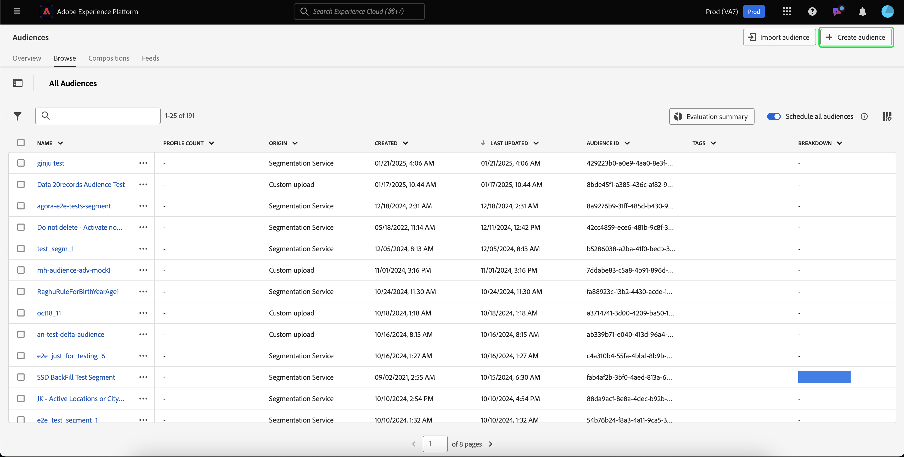

# バッチセグメントガイド

バッチセグメント化は、プロファイルデータを一度に移動して、対応するオーディエンスを作成できるセグメント化評価方法です。

バッチセグメント化を使用すると、詳細で豊富なオーディエンスを作成し、セグメント化ジョブを実行して、このデータをダウンストリームサービスに伝播するタイミングを決定できます。

## 適格なクエリタイプ {#query-types}

すべてのクエリは、バッチセグメント化の対象となります。

## オーディエンスを作成 {#create-audience}

Segmentation Service API または UI の Audience Portal を使用して、バッチセグメント化を使用して評価されるオーディエンスを作成できます。

>[!BEGINTABS]

>[!TAB Segmentation Service API]

**API 形式**

```http
POST /segment/definitions
```

**リクエスト**

+++ バッチセグメント化が有効なセグメント定義を作成するリクエストの例

```shell
curl -X POST https://platform.adobe.io/data/core/ups/segment/definitions
 -H 'Authorization: Bearer {ACCESS_TOKEN}' \
 -H 'Content-Type: application/json' \
 -H 'x-gw-ims-org-id: {ORG_ID}' \
 -H 'x-api-key: {API_KEY}' \
 -H 'x-sandbox-name: {SANDBOX_NAME}'
 -d '{
        "name": "People in the USA",
        "description: "An audience that looks for people who live in the USA",
        "expression": {
            "type": "PQL",
            "format": "pql/text",
            "value": "homeAddress.country = \"US\""
        },
        "evaluationInfo": {
            "batch": {
                "enabled": true
            },
            "continuous": {
                "enabled": false
            },
            "synchronous": {
                "enabled": false
            }
        },
        "schema": {
            "name": "_xdm.context.profile"
        }
     }'
```

+++

**応答**

リクエストが成功した場合は、新しく作成したセグメント定義の詳細と HTTP ステータス 200 が返されます。

+++セグメント定義を作成する際の応答のサンプル

```json
{
    "id": "4afe34ae-8c98-4513-8a1d-67ccaa54bc05",
    "schema": {
        "name": "_xdm.context.profile"
    },
    "profileInstanceId": "ups",
    "imsOrgId": "{ORG_ID}",
    "sandbox": {
        "sandboxId": "28e74200-e3de-11e9-8f5d-7f27416c5f0d",
        "sandboxName": "prod",
        "type": "production",
        "default": true
    },
    "name": "People in the USA",
    "description": "An audience that looks for people who live in the USA",
    "expression": {
        "type": "PQL",
        "format": "pql/text",
        "value": "homeAddress.country = \"US\""
    },
    "evaluationInfo": {
        "batch": {
            "enabled": true
        },
        "continuous": {
            "enabled": false
        },
        "synchronous": {
            "enabled": false
        }
    },
    "dataGovernancePolicy": {
        "excludeOptOut": true
    },
    "creationTime": 0,
    "updateEpoch": 1579292094,
    "updateTime": 1579292094000
}
```

+++

このエンドポイントの使用について詳しくは、[ セグメント定義エンドポイントガイド ](../api/segment-definitions.md) を参照してください。

>[!TAB  オーディエンスポータル ]

オーディエンスポータルで、「**[!UICONTROL オーディエンスを作成]**」を選択します。



ポップオーバーが表示されます。 **[!UICONTROL ルールを作成]** を選択して、セグメントビルダーに入ります。


セグメント定義を作成したら、**[!UICONTROL 評価方法]** として **[!UICONTROL バッチ]** を選択します。


セグメント定義の作成について詳しくは、[セグメントビルダーガイド](../ui/segment-builder.md)を参照してください。

>[!ENDTABS]

## オーディエンスの取得 {#retrieve-audiences}

Segmentation Service API または UI の Audience Portal を使用して、バッチセグメント化を使用して評価されるすべてのオーディエンスを取得できます。

>[!BEGINTABS]

>[!TAB Segmentation Service API]

`/segment/definitions` エンドポイントに対してGET リクエストを行い、組織内でバッチセグメント化を使用して評価されるすべてのセグメント定義のリストを取得します。

**API 形式**

バッチセグメント化を使用して評価されたセグメント定義を取得するには、リクエストパスにクエリパラメーター `evaluationInfo.batch.enabled=true` を含める必要があります。

```http
GET /segment/definitions?evaluationInfo.batch.enabled=true
```

**リクエスト**

+++ すべてのバッチ対応セグメント定義を一覧表示するサンプルリクエスト

```shell
curl -X GET \
  'https://platform.adobe.io/data/core/ups/segment/definitions?evaluationInfo.batch.enabled=true' \
  -H 'Authorization: Bearer {ACCESS_TOKEN}' \
  -H 'Content-Type: application/json' \
  -H 'x-api-key: {API_KEY}' \
  -H 'x-gw-ims-org-id: {ORG_ID}' \
  -H 'x-sandbox-name: {SANDBOX_NAME}'
```

+++

**応答**

応答が成功すると、HTTP ステータス 200 が、バッチセグメント化を使用して評価される、組織内のセグメント定義の配列と共に返されます。

+++組織内のすべてのバッチセグメント化で評価されたセグメント定義のリストを含むサンプル応答

```json
{
    "segments": [
        {
            "id": "15063cb-2da8-4851-a2e2-bf59ddd2f004",
            "schema": {
                "name": "_xdm.context.profile"
            },
            "ttlInDays": 30,
            "imsOrgId": "{ORG_ID}",
            "sandbox": {
                "sandboxId": "",
                "sandboxName": "",
                "type": "production",
                "default": true
            },
            "name": " People who are NOT on their homepage ",
            "expression": {
                "type": "PQL",
                "format": "pql/text",
                "value": "select var1 from xEvent where var1._experience.analytics.endUser.firstWeb.webPageDetails.isHomePage = false"
            },
            "evaluationInfo": {
                "batch": {
                    "enabled": true
                },
                "continuous": {
                    "enabled": false
                },
                "synchronous": {
                    "enabled": false
                }
            },
            "creationTime": 1572029711000,
            "updateEpoch": 1572029712000,
            "updateTime": 1572029712000
        },
        {
            "id": "f15063cb-2da8-4851-a2e2-bf59ddd2f004",
            "schema": {
                "name": "_xdm.context.profile"
            },
            "ttlInDays": 30,
            "imsOrgId": "{ORG_ID}",
            "sandbox": {
                "sandboxId": "",
                "sandboxName": "",
                "type": "production",
                "default": true
            },
            "name": "Homepage_continuous",
            "description": "People who are on their homepage - continuous",
            "expression": {
                "type": "PQL",
                "format": "pql/text",
                "value": "select var1 from xEvent where var1._experience.analytics.endUser.firstWeb.webPageDetails.isHomePage = true"
            },
            "evaluationInfo": {
                "batch": {
                    "enabled": true
                },
                "continuous": {
                    "enabled": true
                },
                "synchronous": {
                    "enabled": false
                }
            },
            "creationTime": 1572021085000,
            "updateEpoch": 1572021086000,
            "updateTime": 1572021086000
        }
    ],
    "page": {
        "totalCount": 2,
        "totalPages": 1,
        "sortField": "creationTime",
        "sort": "desc",
        "pageSize": 2,
        "limit": 100
    },
    "link": {}
}
```

返されるセグメント定義について詳しくは、[セグメント定義エンドポイントガイド](../api/segment-definitions.md)を参照してください。

+++

>[!TAB  オーディエンスポータル ]

Audience Portal のフィルターを使用すると、組織内でバッチセグメント化が有効になっているすべてのオーディエンスを取得できます。  アイコンを選択して、フィルターのリストを表示します。


使用可能なフィルター内で、**[!UICONTROL 頻度を更新]** に移動し、「[!UICONTROL &#x200B; バッチ &#x200B;]」を選択します。 このフィルターを使用すると、バッチセグメント化を使用して評価される、組織内のすべてのオーディエンスが表示されます。


Experience Platformでのオーディエンスの表示について詳しくは、[ オーディエンスポータルガイド ](../ui/audience-portal.md) を参照してください。

>[!ENDTABS]

## 次の手順

このガイドでは、Adobe Experience Platformでバッチセグメント化を使用して評価できるセグメント定義の作成方法について説明します。

Experience Platform ユーザーインターフェイスの使用方法について詳しくは、[ セグメント化ユーザーガイド ](../ui/overview.md) を参照してください。

バッチセグメント化に関するよくある質問については、[FAQ のバッチセグメント化に関する節 ](../faq.md#batch-segmentation) を参照してください。
